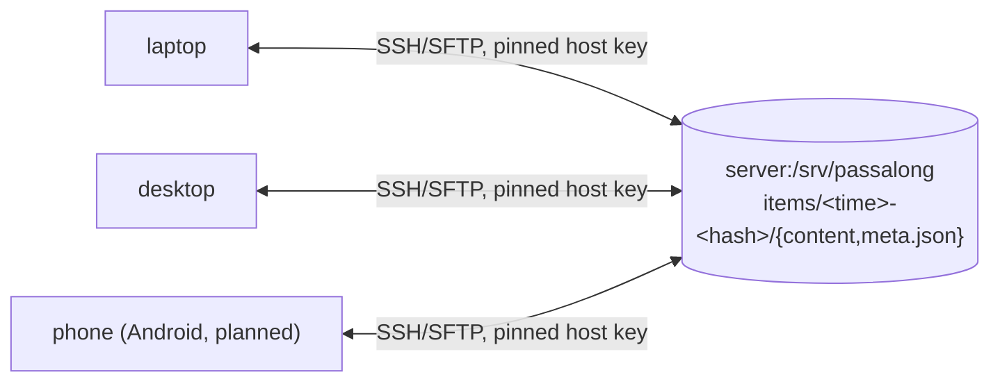

# passalong

A lightweight, cross-platform clipboard and file sharing tool for macOS,
Linux, and Windows, with Android planned.

One machine you already own runs a plain SSH server with a storage
directory. Every other device pushes clipboard text and files there, lists
what is stored, and pulls items back. There is no cloud service, no account,
and no custom server daemon.

> **Status:** released versions and their notes are on the
> [releases page](https://github.com/joelee/passalong/releases), and
> [CHANGELOG.md](https://github.com/joelee/passalong/blob/main/CHANGELOG.md) lists what changed in each. Windows is
> supported since v0.2.1; a GUI and Android are planned.

## How it works



- The server needs nothing but `sshd` and a directory.
- Clipboard text, clipboard images, and files travel the same way. With
  pull mode on, `serve` also applies what other devices send.
- Each client pins the server's SSH host public key, so there is no
  trust-on-first-use.
- Items are identified by a time-sortable id (`<time>-<content hash>`), so
  the newest items list first and identical content is stored only once.
- Downloads are checked against the item's SHA-256 before anything is
  written.
- With an SSH server, `serve` keeps a local copy of the item list up to
  date, so `list` and `choose` show it without waiting for the server.
- A store can be encrypted: each device holds the store's key, and the
  server, or the service behind a synced folder, sees only sealed items
  (see [Encryption](#encryption)).
- Storage sits behind a trait. Besides SSH there is a `local` backend for a
  mounted share, and others such as S3 can be added.

## Installation

### Homebrew (macOS)

Homebrew 7 and later load formulae only from taps you trust, so trust and
tap [joelee/oss](https://github.com/joelee/homebrew-oss) once, then
install:

```sh
brew trust joelee/oss
brew tap joelee/oss
brew install passalong
```

The formula builds the release published on crates.io; `brew upgrade
passalong` installs later ones.

### Cargo (macOS, Linux, and Windows)

With Rust 1.98 or later, for example from [rustup](https://rustup.rs):

```sh
cargo install --locked passalong
```

This builds the release from [crates.io](https://crates.io/crates/passalong)
and puts `passalong` in `~/.cargo/bin` (`%USERPROFILE%\.cargo\bin` on
Windows). On Windows the build needs the Microsoft C++ build tools, which
rustup offers to install. SSH keys of type RSA need an optional feature (see
[RSA keys](https://github.com/joelee/passalong/blob/main/docs/developer-guide.md#rsa-keys)):

```sh
cargo install --locked passalong --features rsa
```

### Release binaries

Each [GitHub release](https://github.com/joelee/passalong/releases) has a
`.tar.gz` archive for Linux x86_64 and for macOS arm64, and from v0.2.1 a
`.zip` for Windows x86_64, each with a `.sha256` file. Check the archive
with `sha256sum -c` (or `shasum -a 256 -c` on macOS), unpack it, and put
the `passalong` binary on your `PATH`.

On Windows, in PowerShell, compare the hash with the `.sha256` file, then
unpack:

```powershell
$zip = "passalong-0.2.1-x86_64-pc-windows-msvc.zip"
(Get-FileHash $zip -Algorithm SHA256).Hash.ToLower()
Get-Content "$zip.sha256"
Expand-Archive $zip -DestinationPath "$env:LOCALAPPDATA\Programs"
```

Then add the folder holding `passalong.exe` to your user `PATH`.

### Windows and PowerShell

The documented shell on Windows is PowerShell. Commands that take a file or
write one work in any shell. Piping binary data into or out of passalong,
such as `passalong cat <ID> > photo.png`, needs PowerShell 7.4 or later:
Windows PowerShell 5.1 re-encodes what passes through a pipe or `>`, which
corrupts it. There, use `passalong load <ID> photo.png` instead.

### From a clone

```sh
cargo install --locked --path crates/passalong-cli
```

See [Building from source](#building-from-source) for the toolchain.
Whichever way you install, `passalong --version` confirms it.

## Quick start

1. Prepare the server once, as described in [Server setup](#server-setup).
2. Install the client, as described in [Installation](#installation).
3. Run `passalong init`. It asks for the server's address and your key,
   shows the server's host-key fingerprint for you to confirm, writes
   `~/.config/passalong/config.toml`, and tests the connection. For a
   [passalong-server](https://github.com/joelee/passalong-server), answer
   `https`: `init` asks for its URL and the API key its operator gave you,
   and shows the certificate's pin for you to compare with the server's
   `passalong-server tls fingerprint`.
4. Use it:

   ```sh
   passalong clipboard               # send what you copied
   passalong list                    # see what is stored, newest first
   passalong load 2cf2               # put that text back on the clipboard
   passalong file report.pdf         # send a file
   passalong load 8f3a ~/Downloads   # fetch a file into a directory
   ```

5. Keep `passalong serve` running, so everything you copy and every file
   you drop into `~/PassAlong` is sent automatically. `passalong
   service-install` installs it as a systemd user service (Linux) or a
   launchd agent (macOS) that starts at login; `passalong serve --daemon`
   starts it in the background until you log out.

## Commands

| Command | What it does |
|---|---|
| `passalong clipboard` | Send the current clipboard text (`--stdin` reads standard input instead) |
| `passalong file <path>` | Send a file |
| `passalong list` | List stored items, newest first (`--json` for scripts, `--nocache` to skip the list cache) |
| `passalong load <id> [dest]` | Copy an item to `dest`; without `dest`, text goes to the clipboard and files to `~/Downloads` |
| `passalong cat <id>` | Print an item to standard output |
| `passalong get <id>` | Print an item's metadata (`--json` for scripts) |
| `passalong choose` | Pick an item from a full-screen list, then load, print, show, or delete it |
| `passalong serve` | Keep running, sending every new clipboard text and every file dropped into the drop folder (`--daemon`, `--status`, `--stop`) |
| `passalong delete <id>...` | Delete items |
| `passalong prune` | Delete items older than `--older-than`, keeping the newest `--keep` (`--plain` for the unencrypted items a fresh start left) |
| `passalong encrypt` | Encrypt the store or change its words (`--join` to give this device the key, `--rotate` to replace the key, `--recover` after an interruption) |
| `passalong init` | Write a config file for an SSH server and pin its host key |
| `passalong service-install` | Start `serve` at login as a systemd user service or launchd agent |
| `passalong service-remove` | Stop and remove that service |
| `passalong check` | Check the config, and that the server can be reached, read, and written |

An id can be shortened to its first 4 or more distinctive characters. See
[docs/usage.md](https://github.com/joelee/passalong/blob/main/docs/usage.md) for every option and exit code.

## Encryption

Encryption is optional and happens on each device, so the server, or the
cloud service behind a synced `local` folder, stores only sealed items.

1. On one device, `passalong encrypt` shows six words and has you type them
   back. If items are already stored, it migrates them, re-encrypting each
   one, or starts fresh and leaves them unencrypted in `plain/` until
   `passalong prune --plain` removes them.
2. On every other device, `passalong encrypt --join` asks for the words
   once. `passalong init` does the same when it finds an encrypted store.
3. Running `passalong encrypt` again changes the words without
   re-encrypting anything. `passalong encrypt --rotate` replaces the key
   itself, and every other device must join again: do this after losing a
   device.

Every device needs passalong 0.2.0 or later; older versions stop working
with an encrypted store instead of writing into it. Keep the words safe: if
they and every device's key file are lost, the items cannot be recovered.
The server still sees when items were created, how many there are, and
roughly how large they are. The words come from the EFF large word list,
used under [CC BY 4.0](https://creativecommons.org/licenses/by/4.0/); see
[NOTICE](https://github.com/joelee/passalong/blob/main/NOTICE).

## Server setup

A [passalong-server](https://github.com/joelee/passalong-server) needs no
set-up on the client beyond `passalong init`: its operator gives each
device an API key, and see
[Using a passalong-server](https://github.com/joelee/passalong/blob/main/docs/usage.md#using-a-passalong-server).

Any machine with an OpenSSH server can be the server. To run one in
Docker with the storage on the host, follow
[docs/docker-ssh-server-setup.md](https://github.com/joelee/passalong/blob/main/docs/docker-ssh-server-setup.md).
Otherwise, do this once:

1. Create a user and a storage directory for passalong:

   ```sh
   sudo useradd --create-home passalong
   sudo install -d -o passalong -m 700 /srv/passalong
   ```

2. Append each client's public key, for example `~/.ssh/id_ed25519.pub`, to
   `~passalong/.ssh/authorized_keys` on the server.

3. On each client, fetch the server's host key:

   ```sh
   ssh-keyscan -t ed25519 192.168.1.10
   ```

   Copy the `ssh-ed25519 AAAA...` part into `server.ssh.host_key`. The whole
   line as printed works too. passalong refuses to connect if the server
   ever presents a different key. `passalong init` can fetch the key for
   you; compare the fingerprint it shows with the server's own
   `ssh-keygen -lf /etc/ssh/ssh_host_ed25519_key.pub`.

4. In `~/.config/passalong/config.toml`, set `host`, `user`, `host_key`,
   `identity_file`, and `remote_path`. If the key has a passphrase, put it in
   `PASSALONG_SSH_KEY_PASSPHRASE` in a `.env` file, never in the config.

## Container

The image has no clipboard, but `file`, `list`, `load <id> <dest>`, and
`serve` with a mounted drop folder work. Run it as your own user so it can
read your SSH key:

```sh
just docker-build
docker run --rm --user "$(id -u):$(id -g)" -e HOME=/home/passalong \
  -v ~/.config/passalong:/home/passalong/.config/passalong:ro \
  -v ~/.ssh:/home/passalong/.ssh:ro \
  passalong:dev list
```

## Building from source

Requires Rust 1.98.1 (pinned in `rust-toolchain.toml`; `rustup` installs it
automatically) and [`just`](https://github.com/casey/just).

```sh
just setup        # one-time: coverage and audit tooling
just build        # debug build of the whole workspace
just run --help   # run the CLI from source
```

## Development

Development is test-driven, and every change must pass `just check`:
format, clippy, a link check, tests, line coverage of at least 80 %, and a
locked build.
See [docs/developer-guide.md](https://github.com/joelee/passalong/blob/main/docs/developer-guide.md).

| Document | Contents |
|---|---|
| [docs/usage.md](https://github.com/joelee/passalong/blob/main/docs/usage.md) | Command reference |
| [docs/configuration.md](https://github.com/joelee/passalong/blob/main/docs/configuration.md) | Every configuration key and environment variable |
| [docs/architecture.md](https://github.com/joelee/passalong/blob/main/docs/architecture.md) | Crates, storage layout, `serve`, security model |
| [docs/developer-guide.md](https://github.com/joelee/passalong/blob/main/docs/developer-guide.md) | Toolchain, `just` recipes, testing |
| [docs/backlog.md](https://github.com/joelee/passalong/blob/main/docs/backlog.md) | Planned future work |
| [CHANGELOG.md](https://github.com/joelee/passalong/blob/main/CHANGELOG.md) | Release notes |
| [CONTRIBUTING.md](https://github.com/joelee/passalong/blob/main/CONTRIBUTING.md) | How to propose a change |
| [SECURITY.md](https://github.com/joelee/passalong/blob/main/SECURITY.md) | Reporting vulnerabilities privately |

## License

Licensed under the [Apache License, Version 2.0](https://github.com/joelee/passalong/blob/main/LICENSE).
