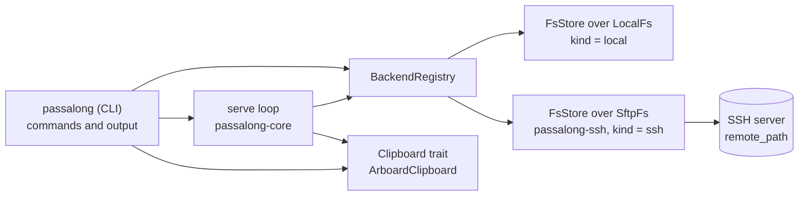

# Architecture

## Crates

| Crate | Kind | Responsibility |
|---|---|---|
| `passalong-core` | library | Configuration, item model, storage traits, clipboard trait, `serve` loop, telemetry. No CLI or terminal dependencies. |
| `passalong-ssh` | library | SSH/SFTP storage backend (`russh`), host-key pinning. |
| `passalong` (in `crates/passalong-cli/`) | binary `passalong` | Argument parsing, command handlers, output formatting, and the `choose` terminal UI (ratatui). |

Future GUI and Android front-ends depend on `passalong-core` and
`passalong-ssh` only. `passalong-core` keeps the desktop clipboard behind its
`desktop` feature, so it also builds with `--no-default-features`.



## Command flow

Every invocation goes through the same start-up:

1. Load `./.env` if it exists, without overriding the environment.
2. Parse the command line; usage errors exit with code 2.
3. Find and validate `config.toml` (see [configuration](configuration.md)).
   `init`, which writes that file, `service-install` and `service-remove`,
   which need none, `check`, which reports a config problem as its first
   result, and the hidden clipboard holder described below run before this
   step.
4. Choose the log level and start logging to standard error. With
   `--quiet`, standard output is discarded for every command but `cat`, and
   the level is `error` unless one is set explicitly.
5. Open a correlation span, so every log line of this run shares one `op`
   id.
6. Build the backend registry (`local`, `ssh`) and run the command.

| Command | What it does after start-up |
|---|---|
| `clipboard` | Reads the clipboard or standard input, then `Store::put` |
| `file` | Streams the file into `Store::put` |
| `list` | `Store::list`, then renders a table or JSON |
| `load` | `Store::resolve`, `Store::get`, verifies SHA-256, then writes a file or the clipboard |
| `cat` | `Store::resolve`, `Store::get`, streams the content to standard output while verifying SHA-256 |
| `get` | `Store::resolve`, then `Store::get_meta`; prints fields or JSON |
| `choose` | `Store::list`, then a full-screen list (ratatui over crossterm); `g` shows `Store::get_meta` in a dialog, `d` runs `Store::delete` and lists again, and `r` lists again; Enter and `c` run the code of `load` or `cat` after the terminal is restored; log records are held while the list is open and written when it closes |
| `serve` | Runs the loop below until stopped; `--daemon`, `--status`, and `--stop` manage a background copy |
| `delete` | Resolves every id first, then `Store::delete` for each |
| `prune` | `Store::list`, selects items older than `--older-than` beyond the newest `--keep`, confirms, deletes, then `Store::clean_staging`; with `--plain`, the same on the plaintext store in `plain/`, after removing the encryption leftovers (the plaintext `tmp/` and unused journals) |
| `init` | Fetches the server host key without authenticating, asks you to confirm its fingerprint, writes the config file, then opens the store's filesystem as a connection test and inspects its encryption: offers to encrypt an empty store and joins an encrypted one |
| `encrypt` | Opens the store's filesystem and inspects it: encrypts a plaintext store (set-up, fresh start, or migration), or changes an encrypted store's words; `--join`, `--rotate`, and `--recover` as in [usage](usage.md) |
| `check` | Loads the config, opens the backend's filesystem, inspects its encryption against this device's key, opens the store, `Store::list_ids`, then `Store::probe_write`, printing one line per step, then reads `serve`'s pid lock |
| `service-install` | Writes a systemd user unit or launchd agent for `serve` and loads it with `systemctl --user` or `launchctl` |
| `service-remove` | Stops the service and removes its unit |

Each one-shot command opens its own connection; `serve` keeps one and
reopens it when needed.

## Item schema (version 1)

### Identifiers

Every item has an id of the form `<ts>-<key>`, for example
`6aa52107-2cf24dba5fb0`:

| Part | Meaning |
|---|---|
| `ts` | Creation time in whole seconds since the Unix epoch, 8 lowercase hex digits. Valid until 2106-02-07. |
| `key` | The content key: the first 12 lowercase hex digits of the content's SHA-256. |

Because both parts have a fixed width, plain string order is chronological:
sorting item directory names in reverse lists the newest items first,
without reading any metadata. The content key identifies identical content
regardless of when it was sent, so stores can skip re-uploads and `serve`
does not re-send text that `load` just placed on the clipboard. Users can
type a unique prefix of the content key, such as `2cf2`, instead of the
whole id.

The timestamp comes from the sending device's clock. Devices with skewed
clocks can therefore list slightly out of true send order; this affects
ordering only, never correctness or deduplication.

An id is parsed only by `ItemId::parse`, which accepts nothing but hex
digits and one `-`. That makes every id safe to use as a path component on
the server.

### `meta.json`

Each item directory holds its content and a `meta.json`:

```json
{
  "schema": 1,
  "id": "6aa52107-2cf24dba5fb0",
  "kind": "file",
  "name": "a.txt",
  "mime": "text/plain",
  "size": 5,
  "sha256": "2cf24dba5fb0a30e26e83b2ac5b9e29e1b161e5c1fa7425e73043362938b9824",
  "created_at": "2026-09-12T09:53:11Z",
  "device": "box",
  "preview": null,
  "origin": "clipboard"
}
```

| Field | Meaning |
|---|---|
| `schema` | Schema version, `1` |
| `id` | The item id |
| `kind` | `text` or `file` |
| `name` | Original file name for files, `null` for text |
| `mime` | `text/plain; charset=utf-8` for text; guessed from the file extension otherwise, falling back to `application/octet-stream` |
| `size` | Content length in bytes |
| `sha256` | Full SHA-256 of the content, used to verify downloads |
| `created_at` | Creation time, equal to the id's timestamp |
| `device` | `client.device_name` of the sender |
| `preview` | For text, the first 80 characters with whitespace collapsed; `null` for files |
| `origin` | Optional. `clipboard` for a clipboard image, stored as a PNG file named `clipboard-YYYYMMDD-HHMMSS.png`; absent otherwise. Clients older than v0.1.2 ignore it and see an ordinary PNG file |

Readers ignore fields they do not know, so items written by newer clients
stay readable. A change that older readers cannot handle must increase
`schema`.

## Storage layout

The `local` and `ssh` backends share one layout, implemented once by
`FsStore` on top of the small `RemoteFs` filesystem trait:

```text
<root>/
├── items/
│   └── <id>/
│       ├── content      the item's bytes (UTF-8 for text)
│       └── meta.json    its metadata (see Item schema)
└── tmp/
    └── <random>/        staging for uploads in progress
```

### Encrypted stores

An encrypted store keeps a different layout, which clients before v0.2.0
cannot write into:

```text
<root>/
├── encryption/header.json   the wrapped data key (a folder: renames never replace files)
├── items                    a file saying the store is encrypted, where old clients expect a folder
├── v2/items/<id>/{content,meta.json}
├── v2/tmp/                  staging for uploads and deletions
├── plain/items/             after a fresh start: the earlier items, unencrypted
└── .rewrite/                only during a migration or rotation: lock and journal
```

**Keys.** A store has one random 256-bit data key. The header holds it
sealed with AES-256-GCM under a key that Argon2id (64 MiB, t=3, p=4, a
random 16-byte salt) derives from six words drawn from the EFF large word
list, about 77.5 bits. Each device keeps the unwrapped key in
`client.key_file` (mode 0600, refused when others can read it or when it
sits in a git work tree that does not ignore it). HKDF-SHA256 derives from
the data key: the key id; the HMAC key of the *keyed content key*, the first
6 bytes of `HMAC-SHA256(id key, SHA-256 of the content)`, which replaces the
plain content key in ids so the storage cannot confirm guesses about short
clipboard text; the metadata key; and, with a random 32-byte salt per item,
each item's content key. The `crypto` module holds these primitives.

**Items.** `meta.json` is `{"schema":2,"id","nonce","sealed"}`: the
`ItemMeta` and the content salt, sealed with the id as associated data.
`content` is `PAC1`, the salt, then records of at most 64 KiB, each sealed
with a nonce made of the record number and a final-record flag, so a
reader rejects truncated, reordered, repeated, or extended content, and
content from another item fails on its salt. Deduplication and id prefixes
work as before on the keyed ids. A recent item that does not open yet is
reported as not complete, for stores in synced folders.

**Opening.** Every file-like backend registers a filesystem opener, and
`encryption::open_store` decides from the store's root and the device's key:

| Store | This device | Result |
|---|---|---|
| `.rewrite/` present | any | refused: being re-encrypted |
| a header, and `items` not a folder | key with the store's id | sealed store |
| a header, and `items` not a folder | no key, or another key | refused: `encrypt --join` |
| part of an encrypted layout: `encryption/` without a header, a header beside an `items/` folder, or a stop file without a header | any | refused: `encrypt --recover` |
| none of it | no key | plaintext store |
| none of it | a key | refused: the store is not encrypted |

A synced folder can deliver an encrypted layout in pieces, so any piece
without the rest counts as broken, never as plaintext. A plaintext store,
once open, checks before every `put`, `delete`, and `list_ids` that no
lock and no part of an encrypted layout appeared since, so it never adds
plaintext to a store another device is encrypting.

Encrypting also removes the plaintext staging `tmp/` once the stop file is
in place: uploads and deletions cut short there may hold plaintext, and no
client can publish from it any more. For stores passalong 0.2.0 encrypted,
`check` and `list` report what remains there, `prune --plain` removes it,
and a sealed store's `clean_staging` removes entries past the staging age.

**Sends while the key changes.** A sealed store reads the header's key id
before every `put`, `delete`, and `list_ids`, and again once `put` has
published its item; the header's size and time are not trusted, since two
keys under the same settings give headers of the same size, and SFTP gives
times in whole seconds. A rotation takes the lock before it moves the items
aside and removes it only after the new header is in place, so a send that
raced it finds the lock or the new key at that last check. It then takes
its item back, unless the rotation already took it along, and fails; `serve`
keeps the file and sends it again once this device has joined with the new
words, and the copy already moved along makes that second send a no-op.

A sealed store opened this way re-checks, before `put`, `delete`, and
`list_ids`, that no re-encryption started and that the header still names
its key, so a device with a rotated-out key stops writing.

**Changing encryption.** Set-up writes the stop file before the header;
changing the words re-wraps the data key and swaps the header folder,
rewriting no item. Migration and rotation share one journalled engine:
take `.rewrite/` exclusively, write the plan and the new header there, move
the source items into `.rewrite/source/` in one rename, seal each item into
`v2/items/` under an id computed from its recorded SHA-256 (so a resumed run
skips what is already there), read every copy back and compare its SHA-256,
swap the header, and remove the source and then the lock. `encrypt
--recover` finishes the run or undoes it as long as the new header is not
yet in place. Pull mode starts afresh when the store's key changes, and the
list cache's identity names the key.

Storing an item works like this:

1. Stream the content into `tmp/<random>/content`, hashing it on the way.
2. If an item with the same content key already exists, delete the staging
   directory and return the existing item. Nothing new is stored.
3. Otherwise write `meta.json` next to the content.
4. Rename `tmp/<random>` to `items/<id>` in one step. The rename never
   replaces an existing directory.
5. Remove the staging directory if anything failed.

An item directory therefore appears only when it is complete, and an
interrupted upload leaves nothing under `items/`.

`Store::list_after(id)` lists only the items newer than `id`, newest
first, reading `meta.json` for those items alone. Ids start with their
creation time, so comparing ids is enough. `Store::list_ids` returns the
ids alone, from one directory listing, which is how pull mode polls a large
store cheaply. `Store::get_meta(id)` reads one item's `meta.json`
without opening its content; the choice prompt for an ambiguous id uses it
for the candidates it shows, at most 9, instead of listing the store.
`Store::probe_write` writes a 128-byte file (`PROBE_BYTES`) in
`tmp/probe-<random>/` and
removes that directory, which is how `passalong check` tests write access
without storing an item. A backend without a probe reports
`WriteProbe::NotSupported`, the trait's default.

Deleting an item renames `items/<id>` to `tmp/deleted-<id>-<random>` and
then removes it, so the item disappears from every listing in one step.
If the removal fails, only a staging leftover remains. Staging directories
older than a threshold, left by interrupted uploads or deletions, are
removed by `clean_staging`, which `prune` runs.

Listing sorts the item directory names in reverse, which is newest first
because ids are time-sortable, then reads each `meta.json`. Directories that
are not ids, lack `meta.json`, or hold metadata that is unreadable or
describes a different id are skipped; corrupt ones are logged as warnings.

Users identify an item by typing at least 4 characters. Input without a `-`
matches the start of the content key, so `2cf2` finds
`6aa52107-2cf24dba5fb0`; input with a `-` matches the start of the full id.
Case and surrounding spaces are ignored. More than one match is an error
that lists the candidates.

## `serve`

`serve` runs these cooperating tasks:

- **Clipboard watcher.** Reads the clipboard every poll interval and queues
  text whose SHA-256 differs from the last text seen. Blank text is ignored.
  When the clipboard holds no text, or only the link or
  `` tag a browser adds when copying an image, and
  `serve.clipboard_images` is on, it
  reads the image instead and queues it when its pixels differ from the last
  image seen; the uploader stores it as a PNG clipboard image. Clipboard
  access runs on a blocking thread, off the async runtime.
- **Drop watcher.** Scans the drop folder whenever the operating system
  reports a change, and at least every 5 seconds in case events are missed.
  Only events that may change files count: creating, writing, renaming, or
  removing them. Opening and reading do not, because every scan opens the
  folder and would otherwise trigger the next scan.
  A file is queued once two scans at least `file_stable_wait_ms` apart show
  the same size and modification time.
- **Pull loop** (only with `serve.pull = true`). At start-up, before
  `serve` reports ready, it records the ids of every stored item with
  `Store::list_ids`, one directory listing. Every pull interval it lists the
  ids again, forgets those no longer stored, reads `meta.json` only for ids
  it has not seen, ignores this device's own items, and handles the rest
  oldest id first: files are downloaded, verified, into
  `client.download_dir` when it exists, and the newest text or clipboard
  image is handed to the clipboard task. Like `load`, each download is written and verified in its own part file
  and only then linked into place under a free name, so it appears only when
  complete and two downloads never share a name. The clipboard task writes pulled content and marks
  it as seen, so it is not sent back. Each item is marked as handled once
  done, so a store error retries only what is left, and an item from a
  device whose clock runs behind is still applied.
- **Uploader.** Sends queued jobs one at a time. Before uploading text it
  checks whether that content key is already stored, which is how text that
  `load` just put on the clipboard is not sent back. After a file is sent,
  it moves to `sent/` or is deleted.
- **List cache refresh** (only with the ssh backend and
  `serve.list_cache = true`). Once `serve` is ready, it opens a store
  connection of its own and brings `list-cache.json` in the state folder up
  to date at once and then every `serve.list_cache_check_secs`: one
  `Store::list_ids`, then `Store::get_meta` for new ids only, dropping ids
  no longer stored. A saved cache of the same store is refreshed rather than
  read again. Each result is written, readable by its owner only, through a
  temporary file and a rename. After an error the file keeps its last good
  contents, the error is logged once, and the store is reopened at the next
  check. `serve`'s own sends appear at its next refresh.

A failed upload is retried after 1, 2, 4 … seconds, capped at 60, and the
store is reopened before each retry so a dropped SSH connection recovers.
Local problems, such as a file that cannot be read, skip the job instead;
the drop watcher offers a skipped file again once its size or modification
time changes.
Shutdown on Ctrl-C or SIGTERM stops the watchers and abandons any upload in
progress; the atomic publish means an abandoned upload never appears under
`items/`.

## Background `serve`

`serve` holds an exclusive lock on a pid file for as long as it runs, so a
second `serve` on the same machine is refused whether it runs in the
foreground, as a daemon, or under a service manager. File locations are in
[configuration](configuration.md#serve-files).

`serve --daemon` starts a detached copy of the same binary in its own
process group, with standard error appended to the log file. The copy writes
its pid to the pid file, opens the store, and then appends a `ready` line;
the parent waits up to 5 seconds for that line and otherwise prints the end
of the log. `serve --status` reads the pid file and exits 3 when nothing is
running. `serve --stop` sends SIGTERM and waits for the pid file to be
released.

Windows differs in three ways:

- **Detaching:** std's `Command` lets a child inherit every inheritable
  handle, so a copy started directly would keep the caller's output pipe
  open, and a script reading `serve --daemon`'s output would wait until
  `serve` stops. PowerShell's `Start-Process` starts the copy through the
  shell instead: it passes on no handles, and the copy gets a hidden
  console. The copy opens the log file itself and logs its final error
  there. PowerShell's start-up counts against the wait, which is 15 seconds
  on Windows. A copy that exits during start-up is noticed through
  `tasklist`.
- **Reading the pid:** Windows locks are mandatory, so nothing else can
  read the locked pid file. The lock holder also writes its pid and `ready`
  line to `serve.state`, which `--status` reads instead.
- **Stopping:** there is no SIGTERM. `--stop` creates `serve.stop`, which
  `serve` checks for every second and removes before shutting down; a stale
  one is removed at start-up.

`service-install` there writes the per-user Run key, or with `--scheduler`
registers a log-on task. It never installs a Windows service, because
services run in session 0, which has no clipboard.

`service-install` renders a systemd user unit or a launchd agent from the
templates in `crates/passalong-cli/src/service.rs`, running the same binary's
`serve` from the home directory, and loads it with `systemctl --user` or
`launchctl`. It does not start a service while the pid lock shows a running
`serve`. `docs/service/` holds the same units with placeholder paths, and a
test keeps them identical to the templates. `service-remove` stops the
service and removes the unit.

## Clipboard on Linux

On X11 and Wayland the clipboard belongs to a running process, so text set
by a short-lived command vanishes when it exits. On Linux, `load` therefore
starts a detached helper, the same binary with a hidden command, which takes
ownership of the text and exits once another program replaces the
clipboard. `load` first checks that a clipboard is available at all, so on
a machine without one it fails instead of starting a helper that cannot
work. macOS keeps clipboard contents itself and needs no helper.

## Release pipeline

Pushing a tag `vX.Y.Z` runs `.github/workflows/release.yml`:

1. `scripts/check-release-tag.sh` rejects a tag that does not match the
   workspace version, and `cargo publish --dry-run` packages and builds all
   three crates.
2. Release binaries are built for Linux x86_64 and macOS arm64 and packed
   as `.tar.gz` files with SHA-256 checksums.
3. After a maintainer approves the `release` environment, the crates are
   published to crates.io in dependency order.
4. The GitHub release is created from `docs/release/vX.Y.Z.md` and the
   archives are attached.

The jobs that package crates remove `target/package` before the cache
action saves the build, because its cleanup fails on the unpacked crates.

CI audits dependencies with `cargo deny` (`deny.toml`) on every push and
runs the desktop clipboard tests under a virtual X server.

## Security model

- **Server identity.** The server's host key is pinned in the
  configuration. Any other key is refused with both fingerprints in the
  error. There is no trust-on-first-use and no `known_hosts` fallback.
- **Client identity.** Public-key authentication only. The optional key
  passphrase comes from the environment or `./.env` and is redacted from
  debug output.
- **Paths from the server.** Item ids are parsed strictly (hex digits and
  one `-`), so they are safe path components. File names from the server
  are reduced to their last component before `load` writes them.
- **Integrity.** `load` verifies the SHA-256 and size of the content before
  renaming it into place.
- **Logs.** Only an allow-list of fields is written. Clipboard text, file
  contents, and secrets are never logged.
- **Encryption at rest** (optional). With an encrypted store, the storage
  holds only sealed content and metadata, including names, previews, and
  device names, and ids carry keyed content keys. It still sees creation
  times (in ids), the number of items, their approximate sizes, which items
  share content, and when they are read. A weak point is the six words:
  anyone with the header can try words offline, which Argon2id and the
  generated words make impractical. The words and the devices' key files
  are the only way to the items; losing all of them loses the store.
- **Local copies.** The list cache and anything a command prints hold
  decrypted metadata on the device, readable by its user only.
- **Not covered.** A plaintext store's operator can read every item, and
  changing the words does not lock out a device that already holds the key;
  `encrypt --rotate` does.

## Adding a backend

`server.kind` selects the backend through a `BackendRegistry`: a map from
kind name to an opener function, `fn(&Config) -> BackendFuture`.
`passalong-core` registers `local`, `passalong-ssh` provides `register` to
add `ssh`, and the CLI builds the registry at start-up. The core never
depends on a backend crate.

There are two ways to add a backend:

1. **File-like storage**, such as WebDAV or SMB: implement the seven-method
   `RemoteFs` trait and wrap it in `FsStore`. The layout, atomic publish,
   deduplication, listing, and id resolution come for free.
2. **Anything else**, such as an HTTP API or an S3 bucket: implement `Store`
   directly.

Then add a `[server.<kind>]` section to the configuration module in
`passalong-core` (unknown keys are rejected, so new sections must be
declared there), write an opener, and register it where the CLI builds its
registry.
