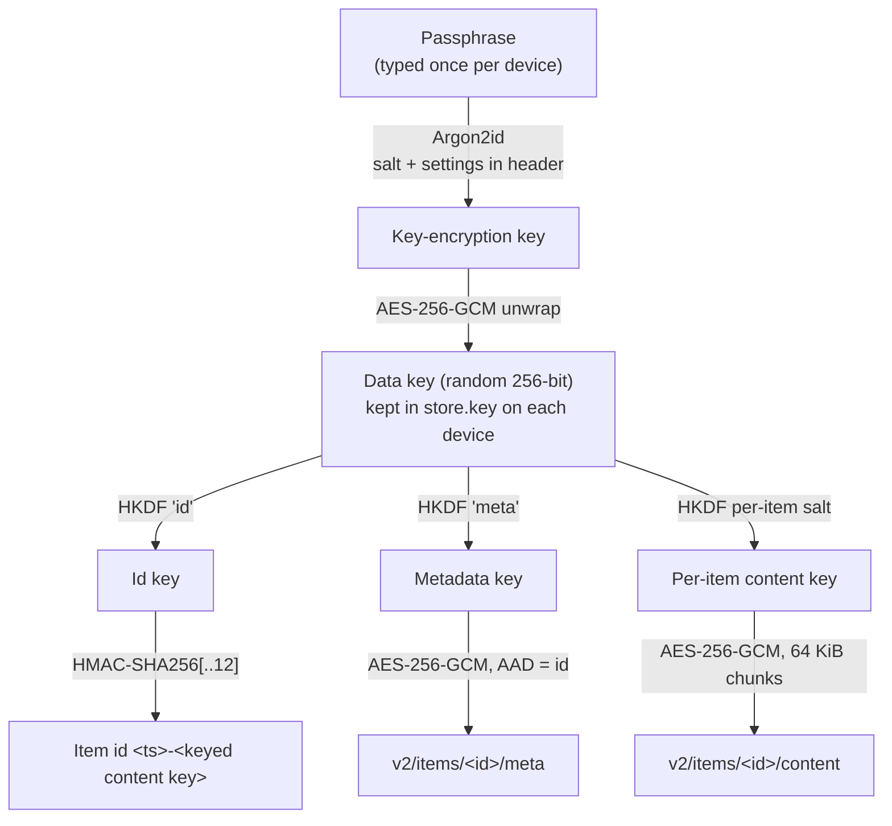

# Idea 00001 r02: Encryption At Rest

> [!abstract] Recommendation: `proceed-to-experiment`
> Optional client-side encryption of everything a store holds is coherent and
> fits the existing `FsStore` design, so both the `ssh` and `local` backends
> get it. The user's decisions (encrypt all metadata including the device
> name, key wrapping instead of re-encryption on key change, old clients may
> break, include the local backend) remove the riskiest part of the r01
> brief. Two Major findings remain: the content key in every id leaks short
> clipboard text, and the store's encryption state must bind every client,
> including keyless and pre-0.1.7 ones. The concept below resolves the first
> by design; a short spike, which can be STEP-01 of the v0.1.7 plan, must
> prove the second before the rest is built.

## 1. Seed Idea

### Original proposition

From the r01 brief: optional encryption of what the server stores, with a
secret key held by every client and a configurable key file location;
AES-256; file names and metadata such as kind, content hash, and device
encrypted, with only what operation needs (such as the id) left readable;
`passalong init` able to set up encryption, still refusing to run over an
existing config; a `passalong encrypt` command that sets up encryption or
changes the key with hidden, twice-confirmed prompts, a warning that needs
`y`, a lock file, a working directory, verification, and
`encrypt --recover`; `encrypt --change-key` so other clients take the new
key; and a key file with correct permissions that is never committed.

### Motivation and timing

`docs/architecture.md` (Security model) states that "the server operator can
read every item". Clipboard contents include passwords, one-time codes, and
private text. With the local backend on Dropbox, Google Drive, or OneDrive,
the "operator" is a cloud provider. The backlog schedules encryption for
v0.1.7, after v0.1.6 made the list cache and Homebrew install available.

## 2. Context and Intent

| Field | Detail |
|---|---|
| Intended outcome | Nothing a store holds reveals item content, names, types, previews, or sending devices to whoever controls the storage. |
| Target users or beneficiaries | Users of an SSH server they do not fully trust, and users who point the `local` backend at a cloud-synced folder. |
| Current stage | Brief (r01) plus user decisions; this revision proposes the concept. |
| Known constraints | v0.1.x is a CLI for Linux and macOS; `Store` and `FsStore` are shared by both backends; list must stay fast (4 ms from the cache in v0.1.6); no secrets in the repository. |
| Non-negotiables | AES-256; optional (plaintext stores keep working); hidden passphrase prompts; recoverable set-up; key file 0600 and never committed. |
| Related project context | Ids are `<ts>-<content key>`; `find_by_content_key` deduplicates by scanning directory names; pull mode tracks seen ids; the list cache stores decrypted metadata per client. |

## 3. Problem or Opportunity

Every item's `meta.json` and `content` are plaintext on the storage side
(`docs/architecture.md`, Item schema and Storage layout). The id embeds the
first 12 hex digits of the plaintext SHA-256 (`crates/passalong-core/src/model.rs`,
`ContentKey::from_sha256`). Anyone who can read the storage can read
everything and can confirm guesses about content from the id alone.

## 4. Proposed Feature or Concept

### User-visible outcome

A user can encrypt a new or existing store once, from any device, then add
each other device by typing the passphrase once. Afterwards every command
works as before, at about the same speed. The storage holds only ciphertext,
ids, and one small encryption header.

### Principal use cases

- Set up a new encrypted store with `passalong init`.
- Join an existing encrypted store from another device (`init`, or
  `encrypt --join` for a device that already has a config).
- Encrypt an existing plaintext store in place with `passalong encrypt`.
- Change the passphrase with `passalong encrypt`; no item is rewritten and
  other devices keep working.
- Recover from an interrupted migration with `passalong encrypt --recover`.

### Important edge cases

- A device without the key, or on v0.1.6 or earlier, meets an encrypted
  store.
- `init` or `encrypt` is run against a store that is already encrypted.
- The migration is interrupted by a crash or a dropped connection.
- A cloud-sync client syncs a partial item, or makes a conflicted copy of
  the encryption header.
- The user forgets the passphrase while the device key files survive, or
  loses every key file.
- A device with the data key is lost or stolen.

## 5. Desired Outcomes and Success Measures

| Outcome | Measure | Baseline | Target | Evidence needed |
|---|---|---:|---:|---|
| Storage reveals no content or metadata | Plaintext fields readable from an encrypted store | All | Only id timestamp, item count, ciphertext sizes | Test that scans an encrypted store for known plaintext, name, device name, and SHA-256 |
| Short clipboard text is not guessable from ids | Candidates confirmable from the id for a 6-digit code | 10^6 in < 1 s | None without the key | Keyed content key test |
| Old and keyless clients cannot leak | Plaintext items written into an encrypted store | Possible | 0 | Spike: v0.1.6 binary and keyless v0.1.7 against an encrypted store |
| Speed is kept | `list` from cache; `list --nocache` for 100 items | 4 ms; 140 ms | Unchanged; within 10 % | Timings as in the v0.1.6 release notes |
| Passphrase change is cheap | Items rewritten on a passphrase change | n/a | 0 | Test |
| Migration is safe | Items lost after a kill at any step, then `--recover` | n/a | 0 | Fault-injection test |

## 6. Scope and Non-goals

### In scope

- Encryption in `FsStore`, so the `ssh` and `local` backends both get it.
- Encrypted metadata: everything except the schema version and the id,
  including the device name, file name, kind, MIME type, size, SHA-256,
  preview, and origin.
- Keyed content keys in ids.
- A wrapped data key in a store header, a client key file, and the commands
  `init` (set up or join), `encrypt` (enable or change passphrase),
  `encrypt --join`, and `encrypt --recover`.
- A one-off migration of an existing plaintext store.
- Documentation of what remains visible.

### Out of scope

- Hiding creation times, item counts, or sizes (padding).
- Revoking a lost device (data key rotation); see
  IDEA-00001-R02-MED-06 and the open questions.
- Hardware keys, OS keychains, and multiple recipients per store.
- Windows, GUI, Android, and S3 (v0.2+), though the design must not block
  them.
- Decrypting back to a plaintext store.

## 7. Users and Stakeholders

| Stakeholder | Need or incentive | Impact | Involvement needed |
|---|---|---|---|
| Maintainer (user) | Safe, maintainable feature for v0.1.7 | High | Decisions below; review of the spike |
| SSH-server users | Privacy from the server operator | High | Upgrade every device to v0.1.7 |
| Cloud-folder users | Privacy from the cloud provider | High | Same; tolerate sync delays |
| Storage operator or cloud provider | Adversary in this threat model | n/a | None |
| Users of v0.1.6 or earlier | Continue working until they upgrade | Breaks against encrypted stores (accepted) | Release notes |
| Future GUI and Android clients | Reuse the core | Medium | Key import flow later |

## 8. Assumption Ledger

| ID | Statement | Classification | Impact if wrong | Evidence status | Confidence | Cheapest test |
|---|---|---|---|---|---|---|
| A1 | Users accept that changing the passphrase does not lock out a device that already holds the data key | Desirability | False sense of revocation | User chose key wrapping; not yet discussed | Medium | State it in `encrypt` output and docs |
| A2 | Argon2id at 64 MiB, t=3, p=4 runs in under 1 s on target machines | Feasibility | Slow join and passphrase change | Unmeasured | Medium | Time it in the spike |
| A3 | A regular file named `items` makes every v0.1.6 command that touches items fail without writing plaintext | Feasibility | Old clients leak | `put` calls `create_dir_all("items")`; list reads the directory | Medium | Spike with the v0.1.6 binary |
| A4 | Directory rename is atomic on SFTP and local disks | Feasibility | Partial items visible | Already relied on by `put` and `delete` | High | Existing tests |
| A5 | Cloud-sync clients deliver an item's files eventually but not atomically | Feasibility | Items appear corrupt for a while | General knowledge, unverified per provider | Low | Manual test on one provider |
| A6 | AES-GCM throughput is not the bottleneck compared with SSH | Viability | Slower transfers | AES hardware support is common on x86_64 and arm64 | High | Benchmark in the spike |
| A7 | Users keep typing short content key prefixes such as `2cf2` | Desirability | Keyed keys must stay hex and 12 digits | Current behaviour | High | None needed |

## 9. Research and Fact Check

| Claim | Finding | Status | Evidence | Checked on |
|---|---|---|---|---|
| Ids expose 12 hex digits of the plaintext SHA-256 | True | Verified | `model.rs` `ContentKey::from_sha256`; `docs/architecture.md` Identifiers | 2026-09-15 |
| Deduplication and prefix lookup use only directory names | True: `find_by_content_key` filters `item_ids()` by `content_key()` and then reads matching metadata | Verified | `fs_store.rs:277` | 2026-09-15 |
| A v0.1.6 client recreates a missing `items/` directory | True: `put` calls `create_dir_all` on `items` and `tmp` | Verified | `fs_store.rs:193` | 2026-09-15 |
| A v0.1.6 client has no schema check when reading metadata | True: `read_meta` parses and checks only the id; unparsable metadata is skipped as corrupt | Verified | `fs_store.rs:81` | 2026-09-15 |
| Pull mode re-applies every item whose id it has not seen | True: `seen` starts from `list_ids` and new ids are handled | Verified | `serve/pull.rs` | 2026-09-15 |
| `init` already refuses to overwrite a config without `--force` | True | Verified | `commands/init.rs:88` | 2026-09-15 |
| `aes-gcm`, `argon2`, `hkdf`, and `zeroize` are already in `Cargo.lock` | True, through `russh` and `ssh-key`; `ring` is a direct dependency | Verified | `cargo tree -i` | 2026-09-15 |
| GCM limits: plaintext ≤ 2^39−256 bits per message; ≤ 2^32 invocations per key with random IVs | True | Verified | NIST SP 800-38D §5.2.1.1 and §8.3 | 2026-09-15 |
| RFC 9106 recommends Argon2id t=1, p=4, 2 GiB, or t=3, p=4, 64 MiB when memory is constrained, with 128-bit salts | True | Verified | RFC 9106 §4 | 2026-09-15 |
| Cloud-sync clients create conflicted copies and sync partial directories | Plausible from general knowledge | Unverified | None | — |

### Evidence limitations

Cloud-sync behaviour (conflict naming, file-versus-directory conflicts,
ordering of files in one directory) has not been tested for Dropbox, Google
Drive, or OneDrive. Argon2 timing on the user's machines is unmeasured. The
v0.1.6 failure mode against the proposed layout is inferred from code, not
run.

## 10. Challenge Review

### Strongest version of the idea

A single random data key per store, wrapped by a passphrase-derived key and
stored on the server, gives end-to-end encryption with one-time set-up per
device, instant passphrase changes, and no change to how commands feel.
Because all backends go through `FsStore`, one implementation protects SSH
servers and cloud folders alike, and S3 later.

### Formal findings

#### IDEA-00001-R02-MAJ-01: The id's content key leaks short clipboard content

> [!warning] Major
> - **Confidence:** High
> - **Category:** Security
> - **Evidence:** Every id ends with the first 12 hex digits of the plaintext SHA-256 (`model.rs`, `ContentKey::from_sha256`). Encrypting `meta.json` leaves ids readable, as the brief intends.
> - **Failure scenario:** A user copies a 6-digit one-time code. The storage operator hashes all 10^6 candidates and matches the id in well under a second; short passwords and common phrases fall to a dictionary.
> - **Impact:** The feature's main promise is broken for exactly the most sensitive clipboard content.
> - **Mitigation or test:** In encrypted stores the content key is `HMAC-SHA256(id key, content)[..12]`, with the id key derived from the data key. Deduplication, `find_by_content_key`, and typed prefixes work unchanged; the storage learns only which items are identical. The plaintext SHA-256 moves into the encrypted metadata for download verification. Test that no stored name contains any prefix of the plaintext SHA-256.
> - **References:** `crates/passalong-core/src/model.rs`; `docs/architecture.md` Identifiers.

#### IDEA-00001-R02-MAJ-02: Keyless and old clients can write plaintext into an encrypted store

> [!warning] Major
> - **Confidence:** High
> - **Category:** Security
> - **Evidence:** Encryption state in the r01 brief lives in each client's config and key file. A v0.1.6 `put` recreates `items/` if it is missing (`fs_store.rs:193`) and never checks a schema version (`fs_store.rs:81`).
> - **Failure scenario:** A laptop still on v0.1.6, or a new device whose config has no key file, sends a password from the clipboard. It is stored in plaintext next to encrypted items, and nothing warns anyone.
> - **Impact:** Silent disclosure, which the user believes cannot happen.
> - **Mitigation or test:** Make the storage authoritative: a store header `<root>/encryption.json` marks an encrypted store, and v0.1.7 clients refuse every read and write without a matching key. Encrypted items live under `<root>/v2/`, and `<root>/items` becomes a regular file whose text says the store is encrypted and needs v0.1.7, so v0.1.6 `put` and `list` fail. The user accepted breaking old clients. The spike must prove with the real v0.1.6 binary that `clipboard`, `file`, `list`, `serve`, and `check` write nothing under `items` and fail visibly.
> - **References:** `crates/passalong-core/src/store/fs_store.rs`.

#### IDEA-00001-R02-MED-01: The streaming AEAD construction is easy to get subtly wrong

> [!warning] Medium
> - **Confidence:** High
> - **Category:** Security
> - **Evidence:** Uploads are streamed (`Store::put` takes a `BoxRead`). One GCM message is limited to 2^39−256 bits and a key with random 96-bit IVs to 2^32 invocations (NIST SP 800-38D §5.2.1.1, §8.3). The id depends on a hash of the whole content, so it is not known while the first chunks are encrypted.
> - **Failure scenario:** A one-shot GCM call buffers whole files in memory; a home-made chunk format without a final-chunk flag lets the storage truncate a file undetected; content and metadata that are not bound together let the storage swap one item's content for another's.
> - **Impact:** Memory exhaustion, or undetected tampering.
> - **Mitigation or test:** Use a STREAM-style construction: a per-item random 32-byte salt, a per-item subkey `HKDF-SHA256(data key, salt)`, 64 KiB chunks, and a nonce made of a chunk counter and a last-chunk flag. With a fresh key per item, deterministic nonces never repeat and the 2^32 random-IV limit does not apply. The encrypted metadata, sealed with the id as associated data, records the content salt, the plaintext size, and the plaintext SHA-256, which is checked after decryption as today. Tests: truncation, chunk reordering, chunk duplication, content swapped between items, metadata moved to another id, flipped bits in every field.
> - **References:** NIST SP 800-38D.

#### IDEA-00001-R02-MED-02: Encrypting an existing store rewrites every item and changes every id

> [!warning] Medium
> - **Confidence:** High
> - **Category:** Operations
> - **Evidence:** Key wrapping removes re-encryption from passphrase changes, but a plaintext store still has to be rewritten once. Keyed content keys give every item a new id. Pull mode applies every id it has not seen (`serve/pull.rs`); the list cache is keyed by store identity only.
> - **Failure scenario:** Mid-migration, the connection drops; or, after it, every other device's `serve` in pull mode downloads every file again and replaces its clipboard with the newest text; or a list cache from before the migration is shown as current.
> - **Impact:** Duplicate downloads, a clobbered clipboard, stale lists, or items stranded in the working directory.
> - **Mitigation or test:** Keep the brief's working-directory design but make it journalled and resumable: take the server lock, rename `items/` to `.migrating/plain/` in one step, write the `items` stop file, re-encrypt each item into `v2/` recording progress, verify each by decrypting and comparing SHA-256, then remove `.migrating/` and the lock. `--recover` either finishes from the journal or restores `.migrating/plain/` and removes `v2/`. Pull mode resets its seen set without applying anything when the store header's key id first appears or changes. The list cache records the key id in its identity. Offer to start fresh (leave old items to `prune`) for stores too large to migrate.
> - **References:** `crates/passalong-core/src/serve/pull.rs`; `crates/passalong-cli/src/list_cache.rs`.

#### IDEA-00001-R02-MED-03: Cloud-synced folders offer no cross-device atomicity

> [!warning] Medium
> - **Confidence:** Medium
> - **Category:** Reliability
> - **Evidence:** The user wants the local backend to work on Dropbox, Google Drive, and OneDrive. `FsStore` relies on atomic directory rename and exclusive creation, which hold on one disk but not across devices that sync the folder.
> - **Failure scenario:** Device B sees `meta` before `content` finishes syncing and reports the item as corrupt; two devices change the passphrase while offline and the sync client keeps `encryption (conflicted copy).json`; a v0.1.6 device recreates `items/` as a directory while the sync client delivers the `items` stop file.
> - **Impact:** Spurious errors, or a store header that some devices cannot unwrap.
> - **Mitigation or test:** Write the store header only at set-up and on passphrase change, through a temporary file and a rename, and warn when a sibling that looks like a conflicted copy exists. Treat an authentication failure on an item created in the last few minutes as "not yet synced" rather than corrupt. Document that passphrase changes and migrations need every device online and idle. Test manually on one provider in the spike.
> - **References:** `docs/architecture.md` Storage layout.

#### IDEA-00001-R02-MED-04: A weak passphrase can be guessed offline from the store header

> [!warning] Medium
> - **Confidence:** High
> - **Category:** Security
> - **Evidence:** The wrapped key, salt, and KDF settings sit on the storage so that any device can join. Any ciphertext would serve as a guess check anyway.
> - **Failure scenario:** The operator runs a dictionary attack against the wrapped key and a short, human-chosen passphrase falls.
> - **Impact:** Every item is readable.
> - **Mitigation or test:** Argon2id with RFC 9106's memory-constrained option (t=3, p=4, 64 MiB, 128-bit salt), with the settings stored in the header so they can be raised later. Require a minimum length, and offer a generated passphrase (for example six random words or a grouped base32 string) as the default choice.
> - **References:** RFC 9106 §4.

#### IDEA-00001-R02-MED-05: Setting up encryption over an existing encrypted store would lock everyone out

> [!warning] Medium
> - **Confidence:** High
> - **Category:** Data
> - **Evidence:** Brief items 4 and 5 describe set-up from `init` and `encrypt` but not what happens when the store is already encrypted by another device.
> - **Failure scenario:** A second device runs `init`, answers yes to encryption, and writes a new header with a new data key over the old one.
> - **Impact:** Every existing item becomes undecryptable for every device.
> - **Mitigation or test:** Create the header exclusively (fail if it exists) and never overwrite it except in a passphrase change that first unwraps it successfully. `init` and `encrypt` read the header first and switch to joining when it exists. Keep the previous header as `encryption.json.previous` until the next successful unwrap by the same device.
> - **References:** `crates/passalong-cli/src/commands/init.rs`.

#### IDEA-00001-R02-MED-06: A passphrase change does not revoke a device that holds the data key

> [!warning] Medium
> - **Confidence:** High
> - **Category:** Security
> - **Evidence:** With key wrapping, each client's key file holds the unwrapped data key so that commands never run Argon2; a passphrase change rewraps that same data key.
> - **Failure scenario:** A laptop is stolen; the user changes the passphrase believing the laptop is locked out; the thief reads everything with the laptop's key file.
> - **Impact:** False sense of security.
> - **Mitigation or test:** Say so in the `encrypt` output and in the security model. Offer data key rotation, which reuses the migration machinery from MED-02 with a new data key, either in v0.1.7 or as the next backlog item.
> - **References:** Decision log, 2026-09-15.

#### IDEA-00001-R02-LOW-01: The proposed key file name clashes with an existing term

> [!note] Low
> - **Confidence:** High
> - **Category:** Maintainability
> - **Evidence:** `ContentKey` already names the 12 hex digits in every id.
> - **Failure scenario:** Docs and code confuse "content key" with the secret.
> - **Impact:** Confusing documentation and review.
> - **Mitigation or test:** Name the file `store.key`, next to the user config (`$XDG_CONFIG_HOME/passalong/store.key`), overridable with `client.key_file`. Write it 0600 in a 0700 directory and refuse, as ssh does, to use it when group or others can read it. Store a format tag and the key id with the key, so a key for another store gives a clear error.
> - **References:** `crates/passalong-core/src/model.rs`.

#### IDEA-00001-R02-LOW-02: The key file must stay out of version control, including the project's own

> [!note] Low
> - **Confidence:** Medium
> - **Category:** Security
> - **Evidence:** Config discovery includes `./config.toml` in the working directory, so a key file next to it can sit in a git checkout. The repository rule is that secrets live only in `.env`.
> - **Failure scenario:** A user or a test fixture commits a real key.
> - **Impact:** Key disclosure.
> - **Mitigation or test:** Add `*.key` to `.gitignore`; generate every test key at run time in a temporary directory; warn when the key file is inside a git work tree.
> - **References:** `.gitignore`; root `AGENTS.md`.

#### IDEA-00001-R02-LOW-03: `--change-key` names the wrong action

> [!note] Low
> - **Confidence:** High
> - **Category:** Adoption
> - **Evidence:** With key wrapping, other devices never need a new key after a passphrase change; they only need the key when joining or after a rotation.
> - **Failure scenario:** Users run `--change-key` after every passphrase change, or think it changes the store's key.
> - **Impact:** Confusion.
> - **Mitigation or test:** Name it `encrypt --join`; keep `--recover`.
> - **References:** r01 brief item 7.

#### IDEA-00001-R02-INFO-01: Some metadata stays visible

> [!info] Info
> The storage still sees creation times (in ids), the number of items,
> ciphertext sizes (roughly the content sizes), equality of items with the
> same content, and access times. The security model and release notes
> should say so.

#### IDEA-00001-R02-INFO-02: Each client's list cache holds decrypted metadata

> [!info] Info
> `list-cache.json` is written 0600 in the user's state folder and will
> contain file names and previews in plaintext. This is the same exposure as
> the terminal output and is acceptable on the user's own machine; document
> it.

#### IDEA-00001-R02-INFO-03: The building blocks are already in the dependency tree

> [!info] Info
> `aes-gcm` 0.11, `argon2` 0.6, `hkdf` 0.13, `hmac` 0.13, and `zeroize` 1.9 are
> already in `Cargo.lock` through `russh` and `ssh-key`, and `ring` is a
> direct dependency. A hidden passphrase prompt can use `crossterm`, which
> `ratatui` already brings, so no new crate is strictly needed.

### Failure modes and unintended consequences

- Losing every key file and forgetting the passphrase loses the whole store;
  there is deliberately no recovery.
- Users may keep a v0.1.6 device running unnoticed; it now fails, which is
  intended but surprising.
- An encrypted store is slower to debug by hand, since `meta` is no longer
  readable with `cat`.

### Conditions to revise, park, or reject

- Revise if the spike shows a v0.1.6 client can still write plaintext into
  an encrypted store.
- Revise if Argon2 at 64 MiB takes several seconds on target machines.
- Park the cloud-folder part if sync behaviour makes items unreliable.

## 11. Options and Trade-offs

| Option | Benefits | Costs and risks | Reversibility | Evidence needed |
|---|---|---|---|---|
| A. Wrapped data key, keyed ids, encryption in `FsStore` (recommended) | Instant passphrase change; ids stable; both backends; no new crate | Revocation needs rotation; one-off migration | Medium: a store can be migrated again | Spike |
| B. Re-encrypt everything on each key change (r01) | Key change also revokes | Every change rewrites the store and changes ids; highest data risk | Low | Rejected by the user |
| C. Use the `age` file format | Reviewed, streaming format | ChaCha20-Poly1305 rather than AES-256; passphrase change rewrites every item's header; new dependency | Medium | Not pursued |
| D. Encrypt content only | Simplest | Names, previews, and device names leak; contradicts decision 1 | High | Rejected |
| E. Rely on server-side disk encryption | No client work | Does not protect against the operator or cloud provider | High | Rejected |

## 12. Recommended Concept

Option A. Key hierarchy and layout:



```text
<root>/
├── encryption.json   format, key id, Argon2id salt and settings, wrapped data key
├── items             regular file: "encrypted store, needs passalong 0.1.7+"
├── v2/items/<id>/{content, meta}
├── v2/tmp/
└── .migrating/       only during the one-off migration, with its journal
```

- **Store header.** Created exclusively; replaced only by a passphrase
  change that has just unwrapped it, via a temporary file and a rename.
- **Client key file.** `store.key`, holding the data key and key id; Argon2
  runs only on joining and on passphrase changes, so commands stay as fast
  as today.
- **Metadata.** `meta` is `{"schema":2,"id":...,"sealed":...}`; all other
  fields, including the device name, are inside `sealed`.
- **Commands.**
  - `init`: on a store without a header, offers encryption (generated or
    typed passphrase, twice); on an encrypted store, joins it. It still
    refuses an existing config without `--force`.
  - `encrypt`: on a plaintext store, warns, needs `y`, and migrates; on an
    encrypted store, asks for the current passphrase, then the new one
    twice, and rewraps.
  - `encrypt --join`: writes `store.key` for a device that already has a
    config.
  - `encrypt --recover`: finishes or undoes an interrupted migration.
- **Every client.** Reads the header first; with a header and no matching
  key, refuses every command with a message naming `encrypt --join`.

## 13. Dependencies, Risks, and Safeguards

| Item | Type | Likelihood | Impact | Mitigation, test, or owner |
|---|---|---|---|---|
| v0.1.6 clients leak (MAJ-02) | Risk | Medium | High | Stop file and spike test |
| Keyed ids (MAJ-01) | Design | n/a | High | Test that no stored name reveals the plaintext hash |
| AEAD construction (MED-01) | Risk | Medium | High | Known construction, tamper tests |
| Migration (MED-02) | Risk | Medium | High | Journal, `--recover`, fault injection |
| Cloud sync (MED-03) | Risk | Medium | Medium | Manual provider test, "not yet synced" handling |
| Passphrase strength (MED-04) | Risk | Medium | High | Argon2id, minimum length, generated passphrase |
| Header overwrite (MED-05) | Risk | Low | High | Exclusive create, join path |
| Revocation expectation (MED-06) | Risk | Medium | Medium | Docs, rotation |
| Hidden prompt | Dependency | Low | Low | `crossterm` raw mode |
| Crypto crates | Dependency | Low | Medium | Already locked; `cargo deny` in CI |

## 14. Highest-value Next Experiment

- **Hypothesis:** The proposed layout makes every v0.1.6 command fail
  without writing plaintext, keyless v0.1.7 clients refuse to work, and the
  sealed format detects every tampering case at unchanged list speed.
- **Method:** On a throwaway branch (or as STEP-01 of the v0.1.7 plan),
  implement the header, key file, sealed metadata, and chunked content for
  `FsStore` over `LocalFs` only. Run the released v0.1.6 binary and a
  keyless build against an encrypted store in a temporary folder. Add the
  tamper tests. Time Argon2 and `list` for 100 items. Try one cloud
  provider by hand.
- **Inputs or participants:** The maintainer's Linux and macOS machines; one
  cloud-synced folder.
- **Success threshold:** Zero plaintext files written by old or keyless
  clients; every tamper case rejected; Argon2 under 1 s; list overhead
  under 10 %.
- **Failure threshold:** Any plaintext written, any tamper accepted, or
  Argon2 over 3 s.
- **Expected effort:** One to two days.
- **Risks and safeguards:** Temporary folders only; no real store, key, or
  clipboard touched.
- **Evidence to capture:** Test output, timings, the v0.1.6 error messages.
- **Decision enabled:** Accept this idea and write the v0.1.7 plan, or
  revise the layout.

## 15. Open Questions and Loose Ends

### Blocking

None. The user's decisions of 2026-09-15 settle the questions that blocked
the concept.

### Important but non-blocking

- [ ] Is data key rotation (MED-06) part of v0.1.7, or the next backlog
      item? It reuses the migration machinery.
- [ ] Should `encrypt` on a large plaintext store also offer "start fresh",
      leaving old items to `prune`, instead of migrating?
- [ ] Default passphrase choice: generated words, generated base32, or
      typed with a minimum length (12 characters suggested)?
- [ ] Should the key file warn or refuse when it sits inside a git work
      tree?
- [ ] Is Argon2id at 64 MiB acceptable, or should the default be RFC 9106's
      2 GiB option on machines with ample memory?

### Later considerations

- [ ] Key import for GUI and Android (for example a QR code) in v0.2+.
- [ ] Several stores on one machine, each with its own key file.
- [ ] S3 backend (v0.2) implementing `Store` directly must reuse the same
      sealing code.

## 16. Feedback Incorporated

| Feedback or prior finding | Disposition | Change in this revision | Rationale |
|---|---|---|---|
| Decision 1: encrypt everything but what operation needs, including the device name | accepted | Only the schema version and id stay readable | Minimises exposure |
| Decision 2: key wrapping | accepted | Passphrase change rewraps one key; re-encryption only for migration | Removes the riskiest part of r01 |
| Decision 3: old clients may break | accepted | `items` stop file makes v0.1.6 fail | Prevents silent plaintext writes |
| Decision 4: include the local backend (cloud folders) | accepted | Encryption in `FsStore`; MED-03 added | Cloud providers are an adversary too |
| r01 item 1: key file `content_key`, overridable | partially-accepted | `store.key`, `client.key_file` | Avoids clash with `ContentKey` |
| r01 item 2: AES-256 | accepted | AES-256-GCM, chunked | AES-256 needs a mode and streaming |
| r01 item 3: encrypt names and metadata | accepted | Keyed content key added | The plain hash in ids would leak |
| r01 item 4: `init` sets up encryption, refuses an existing config | accepted | `init` also joins an encrypted store | Avoids MED-05 |
| r01 item 5: `encrypt` flow with working directory | partially-accepted | Kept for the one-off migration, journalled; passphrase change needs no rewrite | Decision 2 |
| r01 item 6: `encrypt --recover` | accepted | Finishes or undoes a migration | Resumable is safer than restore only |
| r01 item 7: `encrypt --change-key` | partially-accepted | Renamed `encrypt --join` | LOW-03 |
| r01 item 8: key file permissions and `.gitignore` | accepted | 0600, refuse lax modes, `*.key` ignored | LOW-01, LOW-02 |

## 17. Decision Log

| Date | Decision or change | Rationale | Owner |
|---|---|---|---|
| 2026-09-15 | Encrypt all metadata except the id and schema, including the device name | Privacy | User |
| 2026-09-15 | Key wrapping for passphrase changes | Safety and speed | User |
| 2026-09-15 | Clients before v0.1.7 may break against encrypted stores | Prevent plaintext writes | User |
| 2026-09-15 | Both `ssh` and `local` backends, for cloud-synced folders | Cloud providers are untrusted | User |

## 18. Recommended Next Actions

1. Answer the non-blocking questions, especially whether rotation is in
   v0.1.7.
2. Run the spike in section 14, as a throwaway branch or as STEP-01 of the
   v0.1.7 plan.
3. If the spike passes, accept this idea (a final revision) and write the
   v0.1.7 delivery plan from it; update `docs/backlog.md`.

## 19. Revision History

| Revision | Status | Kind | Supersedes | Summary |
|---|---|---|---|---|
| r01 | draft | initial | — | User brief; front matter added |
| r02 | revised | feedback | r01 | User decisions applied; concept, 14 findings, spike |

## References

1. IETF. "RFC 9106: Argon2 Memory-Hard Function for Password Hashing and
   Proof-of-Work Applications." September 2021. Accessed 2026-09-15.
   https://www.rfc-editor.org/rfc/rfc9106.html
2. NIST. "SP 800-38D: Recommendation for Block Cipher Modes of Operation:
   Galois/Counter Mode (GCM) and GMAC." November 2007. Accessed 2026-09-15.
   https://nvlpubs.nist.gov/nistpubs/Legacy/SP/nistspecialpublication800-38d.pdf

## Confidence

**Medium.** The repository facts and cryptographic limits behind the
findings are verified, and the concept uses standard constructions. The main
uncertainties are how v0.1.6 clients and cloud-sync clients actually behave
against the new layout, which the proposed spike tests directly.
