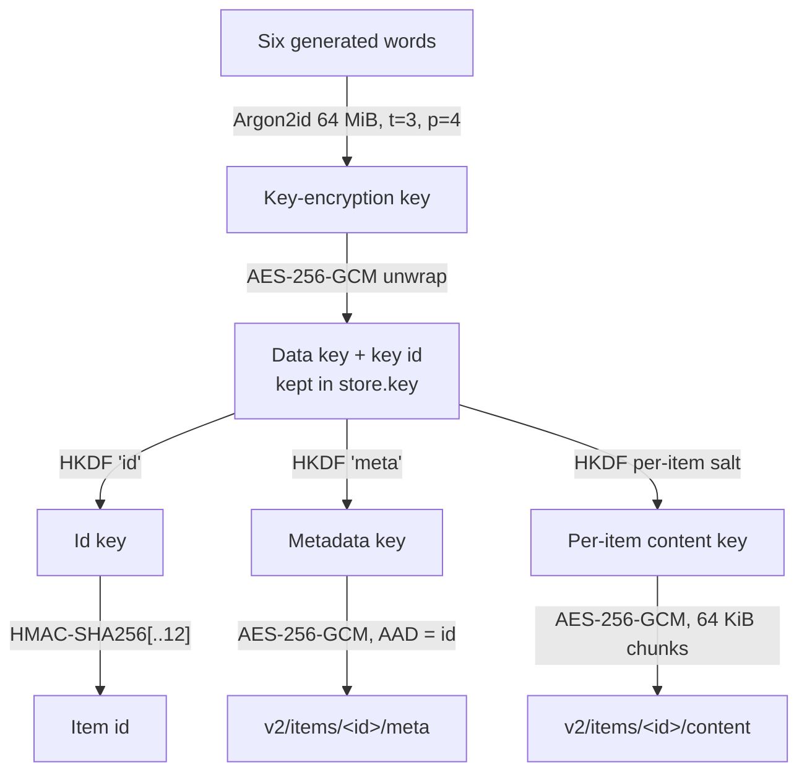
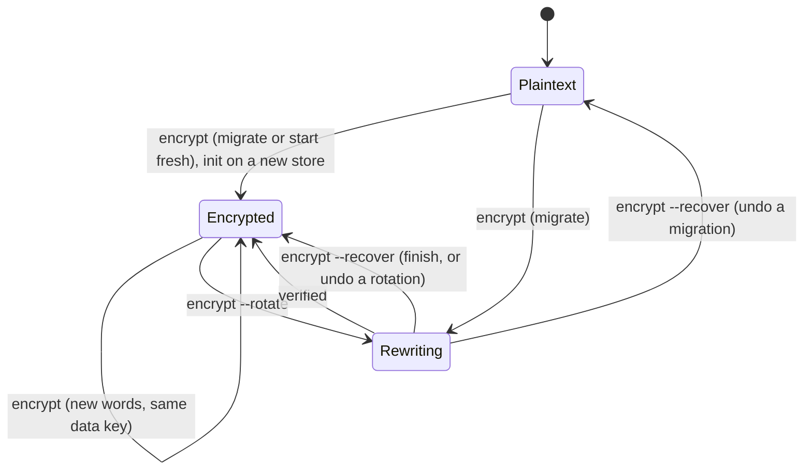

# Idea 00001 r04: Encryption At Rest

> [!abstract] Recommendation: `proceed-to-experiment`
> Every design question is now settled: the user confirmed on 2026-09-15
> that passphrases are always generated (typing is only for joining) and
> that the git work-tree refusal applies only to key files git does not
> ignore. That resolves both remaining Low findings from r03. One Major
> finding stays open until the spike: keyless and pre-0.1.7 clients must be
> unable to write plaintext into an encrypted store. There are no open
> questions; the idea is ready to be accepted, or to be planned from this
> revision with the spike as the plan's first step.

## 1. Seed Idea

### Original proposition

Unchanged from r01: optional client-side encryption of everything a store
holds, with a per-device key file, AES-256, encrypted metadata, set-up from
`init` and `encrypt`, a recoverable migration, and a way for other devices to
take the key. r02 replaced re-encryption on every key change with key
wrapping; r03 adds rotation and a fresh start.

### Motivation and timing

The server operator, or the cloud provider behind a synced `local` folder,
can read every item today (`docs/architecture.md`, Security model). v0.1.7 is
the release the backlog reserves for encryption at rest.

## 2. Context and Intent

| Field | Detail |
|---|---|
| Intended outcome | The storage reveals no content, names, types, previews, or device names, and a lost device can be locked out. |
| Target users or beneficiaries | Users of SSH servers they do not fully trust, and users of the `local` backend on Dropbox, Google Drive, or OneDrive. |
| Current stage | Concept settled; ready for the spike and then the v0.1.7 plan. |
| Known constraints | CLI on Linux and macOS; `FsStore` shared by both backends; `list` from the cache in about 4 ms; no secrets in the repository; Apache-2.0 licence. |
| Non-negotiables | AES-256; optional; generated passphrases; hidden prompts; recoverable rewrites; key file 0600, never in a git work tree. |
| Related project context | Ids are `<ts>-<content key>`; deduplication scans directory names; pull mode tracks seen ids; the list cache holds decrypted metadata per client. |

## 3. Problem or Opportunity

Every item's metadata and content are plaintext on the storage side, and the
id embeds the first 12 hex digits of the plaintext SHA-256
(`crates/passalong-core/src/model.rs`). Anyone who can read the storage can
read everything and confirm guesses about short content from the id alone.

## 4. Proposed Feature or Concept

### User-visible outcome

One device encrypts the store and shows six generated words. Every other
device joins once by typing those words. Commands then work as before. The
passphrase can be changed at any time without rewriting anything, and the
data key can be rotated to lock out a lost device.

### Principal use cases

- Set up a new encrypted store with `passalong init`.
- Join an encrypted store: `init` on a new device, or `encrypt --join` on a
  device that already has a config.
- Encrypt an existing plaintext store with `passalong encrypt`, either
  migrating every item or starting fresh.
- Change the passphrase with `passalong encrypt`.
- Rotate the data key with `passalong encrypt --rotate` after losing a
  device.
- Finish or undo an interrupted migration or rotation with
  `passalong encrypt --recover`.
- Remove plaintext items left by a fresh start with `passalong prune --plain`.

### Important edge cases

- A device without the key, on v0.1.6 or earlier, or holding a rotated-out
  key meets the store.
- A `serve` on another device keeps running during and after a rotation.
- `init` or `encrypt` runs against a store that is already encrypted.
- A migration or rotation is interrupted.
- A cloud-sync client syncs a partial item or makes a conflicted copy of
  the header.
- The user's home directory is itself a git work tree (dotfiles).
- The passphrase is forgotten while key files survive, or every key file is
  lost.

## 5. Desired Outcomes and Success Measures

| Outcome | Measure | Baseline | Target | Evidence needed |
|---|---|---:|---:|---|
| Storage reveals no content or metadata | Plaintext fields readable from an encrypted store | All | Only id timestamps, item count, ciphertext sizes | Test scanning the store for known text, name, device, and SHA-256 |
| Short clipboard text is not guessable from ids | Candidates confirmable from an id for a 6-digit code | 10^6 in < 1 s | None without the key | Keyed content key test |
| Old, keyless, and rotated-out clients cannot write | Items written into an encrypted store by such clients | Possible | 0 | Spike with the v0.1.6 binary; rotation test |
| Passphrase strength | Entropy of a generated passphrase | n/a | ≈ 77.5 bits (6 words of 7,776) | Unit test on the generator |
| Speed is kept | `list` from cache; `list --nocache`, 100 items | 4 ms; 140 ms | Unchanged; within 10 % | Timings as in the v0.1.6 notes |
| Passphrase change is cheap | Items rewritten | n/a | 0 | Test |
| Rewrites are safe | Items lost after a kill at any step, then `--recover` | n/a | 0 | Fault-injection tests for migration and rotation |
| Rotation locks out old keys | Reads or writes accepted with a rotated-out key | n/a | 0 | Test |

## 6. Scope and Non-goals

### In scope

- Encryption in `FsStore`, so the `ssh` and `local` backends both get it.
- Encrypted metadata: everything except the schema version and id,
  including the device name.
- Keyed content keys in ids.
- A store header with the wrapped data key and its key id; a client key
  file; Argon2id at 64 MiB, t=3, p=4.
- Six-word generated passphrases from the EFF large word list; users
  never choose their own, and type words only to join.
- Commands: `init` (set up or join), `encrypt` (migrate or start fresh on a
  plaintext store; change the passphrase on an encrypted one),
  `encrypt --join`, `encrypt --rotate`, `encrypt --recover`,
  `prune --plain`.
- One re-encryption engine shared by migration and rotation.
- Refusing a key file inside a git work tree unless git ignores it
  (`git check-ignore`; any `.git` above the file when `git` is not
  installed).
- Documentation of what remains visible, and word-list attribution.

### Out of scope

- Hiding creation times, item counts, or sizes.
- Hardware keys, OS keychains, several recipients per store.
- Decrypting back to a plaintext store.
- Windows, GUI, Android, and S3 (v0.2+); the design must not block them.
- Configurable Argon2 settings (fixed at 64 MiB; stored in the header so a
  later version can raise them).

## 7. Users and Stakeholders

| Stakeholder | Need or incentive | Impact | Involvement needed |
|---|---|---|---|
| Maintainer (user) | Safe, maintainable v0.1.7 | High | Review the spike; approve the plan |
| SSH-server users | Privacy from the operator | High | Upgrade every device; keep the six words |
| Cloud-folder users | Privacy from the provider | High | Same; keep devices online during rewrites |
| Storage operator or cloud provider | Adversary | n/a | None |
| Users of v0.1.6 or earlier | Keep working until upgraded | Break against encrypted stores (accepted) | Release notes |
| Future GUI and Android clients | Reuse the core; join with the words | Medium | Key import later |

## 8. Assumption Ledger

| ID | Statement | Classification | Impact if wrong | Evidence status | Confidence | Cheapest test |
|---|---|---|---|---|---|---|
| A1 | Users record the six words (for example in a password manager) | Desirability | A store is lost with its last key file | Not tested | Medium | Set-up asks the user to type the words back once |
| A2 | Argon2id at 64 MiB, t=3, p=4 runs in under 1 s on target machines | Feasibility | Slow join, change, rotation | Unmeasured | Medium | Spike timing |
| A3 | A regular file named `items` makes every v0.1.6 command that touches items fail without writing plaintext | Feasibility | Old clients leak | `put` runs `create_dir_all("items")` (`fs_store.rs:193`) | Medium | Spike with the v0.1.6 binary |
| A4 | Directory rename is atomic on SFTP and local disks | Feasibility | Partial items visible | Relied on by `put` and `delete` today | High | Existing tests |
| A5 | Cloud-sync clients deliver an item's files eventually but not atomically | Feasibility | Items briefly look corrupt | Unverified per provider | Low | Manual test on one provider |
| A6 | Reading the header's key id before each write costs little | Viability | Slower `serve` sends | One small file read, or a size and time check | Medium | Spike timing |
| A7 | Users keep typing short content key prefixes such as `2cf2` | Desirability | Keyed keys must stay 12 hex digits | Current behaviour | High | None |

## 9. Research and Fact Check

| Claim | Finding | Status | Evidence | Checked on |
|---|---|---|---|---|
| Ids expose 12 hex digits of the plaintext SHA-256 | True | Verified | `model.rs` `ContentKey::from_sha256` | 2026-09-15 |
| Deduplication and prefix lookup use directory names | True | Verified | `fs_store.rs:277` `find_by_content_key` | 2026-09-15 |
| A v0.1.6 client recreates a missing `items/` directory | True | Verified | `fs_store.rs:193` | 2026-09-15 |
| A v0.1.6 client has no schema check when reading metadata | True; unparsable metadata is skipped as corrupt | Verified | `fs_store.rs:81` | 2026-09-15 |
| Pull mode applies every id it has not seen | True | Verified | `serve/pull.rs` | 2026-09-15 |
| `init` refuses an existing config without `--force` | True | Verified | `commands/init.rs:88` | 2026-09-15 |
| `aes-gcm`, `argon2`, `hkdf`, `hmac`, and `zeroize` are in `Cargo.lock` | True, through `russh` and `ssh-key` | Verified | `cargo tree -i` | 2026-09-15 |
| GCM: plaintext ≤ 2^39−256 bits per message; ≤ 2^32 invocations per key with random IVs | True | Verified | NIST SP 800-38D §5.2.1.1, §8.3 | 2026-09-15 |
| RFC 9106 second recommended option: Argon2id, t=3, p=4, 64 MiB, 128-bit salt | True | Verified | RFC 9106 §4 | 2026-09-15 |
| Six words from the EFF large list give about 2^77 alternatives | True: EFF states 221,073,919,720,733,357,899,776 alternatives, which is 7,776^6 (≈ 77.5 bits) | Verified | eff.org/dice | 2026-09-15 |
| The EFF word list may be embedded in an Apache-2.0 project | Likely: EFF licenses original site material under CC BY 4.0 "unless otherwise noted"; the list file itself carries no licence header | Partially verified | eff.org/copyright; the list file | 2026-09-15 |
| Cloud-sync clients make conflicted copies and sync partial directories | Plausible | Unverified | None | — |

### Evidence limitations

Cloud-sync behaviour has not been tested for any provider. Argon2 timing on
the user's machines is unmeasured. The v0.1.6 failure mode against the new
layout is inferred from code. The word list's licence rests on EFF's
site-wide notice, not on a notice in the list itself.

## 10. Challenge Review

### Strongest version of the idea

A random data key per store, wrapped by a key derived from six generated
words, gives end-to-end encryption with one-time set-up per device, instant
passphrase changes, and a real lock-out through rotation. One re-encryption
engine serves both the first migration and rotation, and because all
backends go through `FsStore`, SSH servers, cloud folders, and later S3 get
the same protection.

### Formal findings

#### IDEA-00001-R04-MAJ-01: Keyless and old clients can write plaintext into an encrypted store

> [!warning] Major
> - **Confidence:** High
> - **Category:** Security
> - **Evidence:** A v0.1.6 `put` recreates `items/` when it is missing (`fs_store.rs:193`) and reads metadata without a schema check (`fs_store.rs:81`). Carried from IDEA-00001-R02-MAJ-02.
> - **Failure scenario:** A laptop on v0.1.6, or a device with no key file, sends a password from the clipboard; it lands in plaintext beside encrypted items.
> - **Impact:** Silent disclosure the user believes impossible.
> - **Mitigation or test:** The store header `<root>/encryption.json` is authoritative: v0.1.7 clients refuse every command on an encrypted store without a matching key. Encrypted items live under `<root>/v2/`, and `<root>/items` becomes a regular file saying the store needs v0.1.7, so v0.1.6 `put` and `list` fail. The spike must show with the real v0.1.6 binary that `clipboard`, `file`, `list`, `serve`, and `check` write nothing under `items` and fail visibly.
> - **References:** `crates/passalong-core/src/store/fs_store.rs`.

#### IDEA-00001-R04-MED-01: The streaming AEAD construction is easy to get subtly wrong

> [!warning] Medium
> - **Confidence:** High
> - **Category:** Security
> - **Evidence:** Uploads are streamed; GCM limits one message to 2^39−256 bits and a key with random IVs to 2^32 invocations (NIST SP 800-38D). The id is known only after the whole content is hashed. Carried from IDEA-00001-R02-MED-01.
> - **Failure scenario:** Whole files are buffered in memory, or truncation, chunk reordering, or content swapped between items goes undetected.
> - **Impact:** Memory exhaustion or undetected tampering.
> - **Mitigation or test:** A STREAM-style construction: per-item random 32-byte salt, per-item subkey `HKDF-SHA256(data key, salt)`, 64 KiB chunks, nonce of chunk counter and last-chunk flag. The metadata, sealed with the id as associated data, records the content salt, plaintext size, and SHA-256, checked after decryption. Tests for truncation, reordering, duplication, cross-item swaps, moved metadata, and bit flips in every field.
> - **References:** NIST SP 800-38D.

#### IDEA-00001-R04-MED-02: Migration and rotation rewrite every item and change every id

> [!warning] Medium
> - **Confidence:** High
> - **Category:** Operations
> - **Evidence:** Both the first migration and rotation re-encrypt every item, and keyed content keys change with the key, so every id changes. Pull mode applies unseen ids (`serve/pull.rs`); the list cache is keyed by store identity (`list_cache.rs`). Carried and widened from IDEA-00001-R02-MED-02.
> - **Failure scenario:** A dropped connection strands items halfway; afterwards every other device's pull mode downloads every file again and replaces its clipboard; a pre-rewrite list cache is shown as current.
> - **Impact:** Lost or stranded items, duplicate downloads, a clobbered clipboard, stale lists.
> - **Mitigation or test:** One journalled engine with two sources (plaintext items, or items under the old key). It takes the server lock, renames the source directory to `.rewrite/source/` in one step, re-encrypts each item into `v2/items/`, verifies each by decrypting and comparing SHA-256, then removes the source and the lock. `--recover` finishes from the journal or restores the source. Pull mode resets its seen set, applying nothing, whenever the header's key id changes; the list cache includes the key id in its identity. Fault-injection tests kill the process after every step.
> - **References:** `crates/passalong-core/src/serve/pull.rs`; `crates/passalong-cli/src/list_cache.rs`.

#### IDEA-00001-R04-MED-03: Cloud-synced folders offer no cross-device atomicity

> [!warning] Medium
> - **Confidence:** Medium
> - **Category:** Reliability
> - **Evidence:** `FsStore` relies on atomic rename and exclusive creation, which hold on one disk but not across devices that sync a folder. Carried from IDEA-00001-R02-MED-03.
> - **Failure scenario:** A device sees `meta` before `content` has synced; two devices change the passphrase offline and a conflicted copy of the header appears; a v0.1.6 device recreates `items/` while the sync client delivers the `items` stop file.
> - **Impact:** Spurious errors, or a header some devices cannot unwrap.
> - **Mitigation or test:** Write the header only at set-up, passphrase change, and rotation, through a temporary file and a rename; warn when a conflicted-copy sibling exists; treat an authentication failure on an item under a few minutes old as "not yet synced"; document that rewrites and passphrase changes need every device online and idle. Manual provider test in the spike.
> - **References:** `docs/architecture.md` Storage layout.

#### IDEA-00001-R04-MED-04: Starting fresh leaves plaintext items on the storage

> [!warning] Medium
> - **Confidence:** High
> - **Category:** Data
> - **Evidence:** Decision of 2026-09-15: `encrypt` may start an empty encrypted store and leave old items to `prune`. The `items` stop file needed for IDEA-00001-R04-MAJ-01 occupies the path those items live in.
> - **Failure scenario:** The old items stay readable by the operator indefinitely, and neither `list` nor `prune` on the encrypted store can see them, so the user forgets they exist.
> - **Impact:** The plaintext the user wanted protected stays exposed.
> - **Mitigation or test:** Starting fresh renames `items/` to `plain/items/` in one step before writing the stop file. On an encrypted store, `list` and `check` print one line saying how many unencrypted items remain, and `prune --plain` removes them after confirmation, honouring `--older-than` and `--keep` like `prune`. The `encrypt` warning says the old items stay readable until pruned.
> - **References:** Decision log, 2026-09-15.

#### IDEA-00001-R04-MED-05: Clients still holding the old data key keep writing after a rotation

> [!warning] Medium
> - **Confidence:** High
> - **Category:** Security
> - **Evidence:** `serve` keeps one store open for hours and each device's key file holds the data key. Rotation replaces the data key in the header but cannot reach other devices' memory or key files.
> - **Failure scenario:** During or after a rotation, a `serve` on another device writes a new item under the old key into `v2/items/`. No device with the new key can read it, and the lost laptop the rotation was meant to shut out keeps writing too.
> - **Impact:** Unreadable items, and a rotation that does not lock anyone out.
> - **Mitigation or test:** The header carries the key id, and every `put`, `delete`, and pull poll re-checks it (cheaply, by size and modification time, re-reading only on change). A client whose key id no longer matches, or that finds the rewrite lock, stops writing and tells the user to run `encrypt --join`. Rotation always generates new words as well as a new data key, since every device must re-join anyway. Test: a client with the old key cannot put, delete, or list after rotation.
> - **References:** `crates/passalong-core/src/serve/`.

#### IDEA-00001-R04-LOW-01: The embedded word list needs attribution

> [!note] Low
> - **Confidence:** Medium
> - **Category:** Compliance
> - **Evidence:** EFF licenses original site material under CC BY 4.0 "unless otherwise noted"; the large word list file has no licence header of its own.
> - **Failure scenario:** The list ships inside the binary and crates without attribution.
> - **Impact:** Licence non-compliance.
> - **Mitigation or test:** Keep the list in its own file with a header naming EFF, the source URL, and CC BY 4.0; add a NOTICE entry and a line in the README; check that `cargo deny` and the crate package include it.
> - **References:** eff.org/copyright.

#### IDEA-00001-R04-INFO-01: Some metadata stays visible

> [!info] Info
> The storage still sees creation times (in ids), the number of items,
> ciphertext sizes, which items share content, and access times. The
> security model and release notes should say so.

#### IDEA-00001-R04-INFO-02: Each client's list cache holds decrypted metadata

> [!info] Info
> `list-cache.json` is 0600 in the user's state folder and will contain file
> names and previews in plaintext, the same exposure as terminal output.
> Document it.

#### IDEA-00001-R04-INFO-03: The building blocks are already available

> [!info] Info
> `aes-gcm`, `argon2`, `hkdf`, `hmac`, and `zeroize` are already in
> `Cargo.lock`; `crossterm`, already used by `ratatui`, can drive a hidden
> prompt. The word list adds 7,776 words, tens of kilobytes, to the binary.

### Failure modes and unintended consequences

- Losing every key file and the six words loses the store; there is
  deliberately no recovery.
- Every rotation forces every device to re-join, so users may postpone it.
- Encrypted items can no longer be inspected by hand with `cat`.

### Conditions to revise, park, or reject

- Revise if the spike shows a v0.1.6 client can still write plaintext into
  an encrypted store.
- Revise if Argon2 at 64 MiB takes several seconds on target machines.
- Park the cloud-folder part if sync behaviour makes items unreliable.

## 11. Options and Trade-offs

| Option | Benefits | Costs and risks | Reversibility | Evidence needed |
|---|---|---|---|---|
| A. Wrapped data key, keyed ids, rotation, encryption in `FsStore` (chosen) | Instant passphrase change; real lock-out by rotation; both backends | Rotation needs every device to re-join; rewrite machinery to get right | Medium | Spike |
| B. Re-encrypt on every key change (r01) | One flow | Every change rewrites the store | Low | Rejected 2026-09-15 |
| C. `age` format | Reviewed streaming format | Not AES-256; per-item headers rewritten on passphrase change | Medium | Not pursued |
| D. Argon2id at 2 GiB | ~32× memory per guess | Small devices cannot join; little gain with generated words | High (stored in header) | Rejected 2026-09-15 |
| E. Typed passphrases with a minimum length | Familiar | Weak phrases fall offline | High | Rejected 2026-09-15 |

## 12. Recommended Concept





```text
<root>/
├── encryption.json   format, key id, Argon2id salt and settings, wrapped data key
├── items             regular file: "encrypted store, needs passalong 0.1.7+"
├── v2/items/<id>/{content, meta}
├── v2/tmp/
├── plain/items/      only after a fresh start, until `prune --plain`
└── .rewrite/         only during a migration or rotation, with its journal and lock
```

- **Header.** Created exclusively; replaced only by a passphrase change or
  rotation that has just unwrapped it, through a temporary file and a
  rename.
- **Key file.** `store.key` next to the user config, overridable with
  `client.key_file`; 0600 in a 0700 directory; refused when others can read
  it or when it sits in a git work tree without being ignored.
- **Passphrases.** Always six generated words; the only typed input is the
  words another device showed, when joining.
- **Metadata.** `{"schema":2,"id":...,"sealed":...}`; everything else,
  including the device name, is sealed.
- **Commands.**
  - `init`: on a store without a header, offers encryption and shows six new
    words, which the user types back once; on an encrypted store, joins by
    asking for the words. Still refuses an existing config without
    `--force`.
  - `encrypt`: on a plaintext store, warns, needs `y`, and asks whether to
    migrate every item or start fresh; on an encrypted store, asks for the
    current words and shows new ones (same data key, nothing rewritten).
  - `encrypt --join`: asks for the words and writes `store.key`.
  - `encrypt --rotate`: warns that every device must re-join, needs `y`,
    generates a new data key and new words, and rewrites every item.
  - `encrypt --recover`: finishes or undoes an interrupted rewrite.
  - `prune --plain`: removes plaintext items left by a fresh start.
- **Every client.** Reads the header first and re-checks its key id before
  writes; with no matching key, or during a rewrite, refuses and names the
  command to run.

## 13. Dependencies, Risks, and Safeguards

| Item | Type | Likelihood | Impact | Mitigation, test, or owner |
|---|---|---|---|---|
| Old and keyless clients (MAJ-01) | Risk | Medium | High | Stop file; spike with v0.1.6 |
| AEAD construction (MED-01) | Risk | Medium | High | Known construction; tamper tests |
| Migration and rotation (MED-02) | Risk | Medium | High | One journalled engine; fault injection |
| Cloud sync (MED-03) | Risk | Medium | Medium | Provider test; "not yet synced" |
| Fresh-start plaintext (MED-04) | Risk | Medium | Medium | `plain/`, reminder line, `prune --plain` |
| Old-key writers after rotation (MED-05) | Risk | Medium | High | Key id check before writes |
| Word list licence (LOW-01) | Dependency | Low | Low | Attribution header and NOTICE |
| Crypto crates | Dependency | Low | Medium | Already locked; `cargo deny` |

## 14. Highest-value Next Experiment

- **Hypothesis:** The layout makes every v0.1.6 command fail without
  writing plaintext; keyless and rotated-out v0.1.7 clients refuse to work;
  the sealed format rejects every tampering case; speed is unchanged.
- **Method:** As STEP-01 of the v0.1.7 plan (or a throwaway branch),
  implement the header, key file, sealed metadata, chunked content, and the
  key id check in `FsStore` over `LocalFs`. Run the released v0.1.6 binary,
  a keyless build, and a build holding a rotated-out key against an
  encrypted store in a temporary folder. Add the tamper tests. Time Argon2
  and `list` for 100 items. Try one cloud provider by hand.
- **Inputs or participants:** The maintainer's Linux and macOS machines; one
  cloud-synced folder.
- **Success threshold:** Zero writes by old, keyless, or rotated-out
  clients; every tamper case rejected; Argon2 under 1 s; list overhead under
  10 %.
- **Failure threshold:** Any such write, any tamper accepted, or Argon2
  over 3 s.
- **Expected effort:** Two days.
- **Risks and safeguards:** Temporary folders only; no real store, key, or
  clipboard touched.
- **Evidence to capture:** Test output, timings, v0.1.6 error messages.
- **Decision enabled:** Accept this idea and continue the v0.1.7 plan, or
  revise the layout.

## 15. Open Questions and Loose Ends

### Blocking

None.

### Important but non-blocking

None. The user settled the last two questions on 2026-09-15.

### Later considerations

- [ ] Key import for GUI and Android (for example a QR code) in v0.2+.
- [ ] Several stores on one machine, each with its own key file.
- [ ] The S3 backend (v0.2) must reuse the same sealing code.
- [ ] Raising the Argon2 settings at a later passphrase change.

## 16. Feedback Incorporated

| Feedback or prior finding | Disposition | Change in this revision | Rationale |
|---|---|---|---|
| Answer: typed passphrases as recommended (generated words only) | accepted | Concept, scope, and option E updated | Removes weak human-chosen passphrases |
| Answer: git check via `git check-ignore` is acceptable | accepted | Scope states the rule and its fallback without `git` | Protects against commits without breaking dotfile repositories |
| IDEA-00001-R03-MAJ-01: old and keyless clients | still-open | Now IDEA-00001-R04-MAJ-01 | Needs the spike |
| IDEA-00001-R03-MED-01: AEAD construction | still-open | Now IDEA-00001-R04-MED-01 | Implementation risk |
| IDEA-00001-R03-MED-02: migration and rotation | still-open | Now IDEA-00001-R04-MED-02 | Implementation risk |
| IDEA-00001-R03-MED-03: cloud sync | still-open | Now IDEA-00001-R04-MED-03 | Unverified per provider |
| IDEA-00001-R03-MED-04: fresh-start plaintext | still-open | Now IDEA-00001-R04-MED-04 | Mitigation designed, not built |
| IDEA-00001-R03-MED-05: old-key writers after rotation | still-open | Now IDEA-00001-R04-MED-05 | Mitigation designed, not built |
| IDEA-00001-R03-LOW-01: typed passphrases | resolved | Generated words only | User decision |
| IDEA-00001-R03-LOW-02: git work tree and dotfile repositories | resolved | Refuse only un-ignored key files | User decision |
| IDEA-00001-R03-LOW-03: word list attribution | still-open | Now IDEA-00001-R04-LOW-01 | Attribution to add |
| IDEA-00001-R03-INFO-01 to INFO-03 | superseded | Now IDEA-00001-R04-INFO-01 to INFO-03 | Still relevant |

## 17. Decision Log

| Date | Decision or change | Rationale | Owner |
|---|---|---|---|
| 2026-09-15 | Encrypt all metadata except the id and schema, including the device name | Privacy | User |
| 2026-09-15 | Key wrapping for passphrase changes | Safety and speed | User |
| 2026-09-15 | Clients before v0.1.7 may break against encrypted stores | Prevent plaintext writes | User |
| 2026-09-15 | Both `ssh` and `local` backends | Cloud folders are untrusted | User |
| 2026-09-15 | Data key rotation in v0.1.7 | Lock out lost devices | User |
| 2026-09-15 | `encrypt` offers a fresh start as well as migration | Large stores | User |
| 2026-09-15 | Generated words as the passphrase | Entropy | User |
| 2026-09-15 | Refuse a key file inside a git work tree | Avoid committed keys | User |
| 2026-09-15 | Argon2id at 64 MiB | Every device can join; enough with generated words | User |
| 2026-09-15 | Passphrases are always generated; typing only to join | No weak passphrases | User |
| 2026-09-15 | Refuse only key files git does not ignore (`git check-ignore`) | Dotfile repositories keep working | User |

## 18. Recommended Next Actions

1. Commit the idea reports on a v0.1.7 branch, so the repository is clean
   for planning.
2. Accept this idea in a final revision, or explicitly authorise planning
   from r04 with acceptance after the spike.
3. Write the v0.1.7 delivery plan with the spike as STEP-01 and a stop
   condition if it fails; update `docs/backlog.md`.

## 19. Revision History

| Revision | Status | Kind | Supersedes | Summary |
|---|---|---|---|---|
| r01 | draft | initial | — | User brief; front matter added |
| r02 | revised | feedback | r01 | Decisions 1–4; concept, 14 findings, spike |
| r03 | revised | feedback | r02 | Rotation, fresh start, generated words, git refusal, 64 MiB; 12 findings |
| r04 | revised | feedback | r03 | Generated words only; `git check-ignore` rule; 10 findings, no open questions |

## References

1. IETF. "RFC 9106: Argon2 Memory-Hard Function for Password Hashing and
   Proof-of-Work Applications." September 2021. Accessed 2026-09-15.
   https://www.rfc-editor.org/rfc/rfc9106.html
2. NIST. "SP 800-38D: Recommendation for Block Cipher Modes of Operation:
   Galois/Counter Mode (GCM) and GMAC." November 2007. Accessed 2026-09-15.
   https://nvlpubs.nist.gov/nistpubs/Legacy/SP/nistspecialpublication800-38d.pdf
3. Electronic Frontier Foundation. "EFF Dice-Generated Passphrases."
   Accessed 2026-09-15. https://www.eff.org/dice
4. Electronic Frontier Foundation. "EFF large word list." July 2016.
   Accessed 2026-09-15.
   https://www.eff.org/files/2016/07/18/eff_large_wordlist.txt
5. Electronic Frontier Foundation. "Copyright." Accessed 2026-09-15.
   https://www.eff.org/copyright

## Confidence

**Medium.** The repository facts, cryptographic limits, and passphrase
entropy are verified, and the design uses standard constructions. The main
uncertainties are how v0.1.6 and cloud-sync clients behave against the new
layout, which the spike tests directly, and the word list's licence, which
rests on EFF's site-wide notice.
