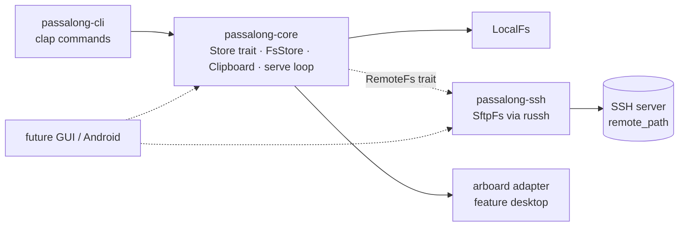

# Delivery Plan 00001: Initial Plan

> [!abstract] Plan status: `approved`
> Deliver `passalong` v0.1.0: a Rust CLI that pushes clipboard text and files to
> an SSH/SFTP-backed store and lists/loads them back, with a reusable core
> library, TDD, `just`-driven quality gates, containers, and full documentation.
> All material decisions are resolved (D-01 to D-03 confirmed by the user on
> 2026-09-12; D-04 revised to time-sortable ids at the user's request). Approved
> by the user at 2026-09-12T10:54:05Z; Builder-ready.

## 1. Objective and outcome

`passalong` is a lightweight, cross-platform clipboard and file sharing tool.
One device runs an SSH server with a storage directory ("the Server"); every
client is configured with the Server's address, its pinned SSH host public key,
and the client's SSH identity. Clients push clipboard text and files to the
Server and pull them back by id.

At the end of this plan a user can, on macOS or Linux:

1. `passalong clipboard` — push the current clipboard text to the Server.
2. `passalong file <path>` — push a file to the Server.
3. `passalong list` — list what the Server holds, newest first.
4. `passalong load <id> [dest]` — copy an item to a local path, or to the
   clipboard when `dest` is omitted.
5. `passalong serve` — run a long-lived process that pushes every new clipboard
   text and every file dropped into a configured folder.

The code is split so a future GUI (desktop and Android) reuses the core and SSH
crates without the CLI, and so additional server backends (web API, S3) can be
added behind one storage trait without touching commands.

## 2. Source traceability

| Requirement | Source | Source location | Interpretation |
|---|---|---|---|
| PLAN-00001-REQ-01 | User / Repository | User request ("written in Rust", "Cargo to manage", "GUI wrapper in the future"); `AGENTS.md` § Stack | Cargo workspace with reusable library crates and one binary crate |
| PLAN-00001-REQ-02 | User / Repository | User request ("`just` to trigger general tasks and CI pipelines"); `AGENTS.md` § Commands | `justfile` wrapping the exact mandated cargo commands |
| PLAN-00001-REQ-03 | Repository | `AGENTS.md` § Commands ("Pre-commit must enforce the same checks"); user request ("CI pipelines") | Pre-commit hooks and a CI workflow both call `just` |
| PLAN-00001-REQ-04 | Repository | `AGENTS.md` § Stack ("Must run in containers") | Dockerfile for the CLI and a compose file for the integration SSH server |
| PLAN-00001-REQ-05 | User / Repository | User request ("clients will have the Server's IP and SSH public key configured"); `AGENTS.md` § Config and secrets (lookup order, `config.toml`) | TOML config with the mandated lookup order |
| PLAN-00001-REQ-06 | Repository | `AGENTS.md` § Config and secrets, § Non-negotiables ("No secrets in code…") | Secrets only via `.env`/environment; `.env.sample` maintained |
| PLAN-00001-REQ-07 | Repository | `AGENTS.md` § Observability | `tracing`-based syslog-compatible logging with the five exposed levels |
| PLAN-00001-REQ-08 | User | User request ("list the Server contents", "load <content_id>") | Item metadata schema and stable content ids |
| PLAN-00001-REQ-09 | User | User request ("We may support other servers… keep the code extendable") | Backend-agnostic `Store` trait and factory |
| PLAN-00001-REQ-10 | User | User request ("Central storage… SSH Server and a storage path") | Filesystem layout shared by SFTP and local backends |
| PLAN-00001-REQ-11 | User | User request ("SSH Server", "Server's IP and SSH public key configured") | Pure-Rust SSH/SFTP backend with strict host-key pinning |
| PLAN-00001-REQ-12 | User / Repository | User request ("send the clipboard content", "copy to the clipboard"); `AGENTS.md` § Non-negotiables (mock external interfaces) | Clipboard abstraction with real adapter and mock |
| PLAN-00001-REQ-13 | User | User request ("`passalong clipboard` to send the clipboard content") | `clipboard` command |
| PLAN-00001-REQ-14 | User | User request ("`passalong file path/to/file` to send the file") | `file` command |
| PLAN-00001-REQ-15 | User | User request ("`passalong list` to list the Server contents") | `list` command |
| PLAN-00001-REQ-16 | User | User request ("`passalong load <content_id> <destination_path>`… If the destination path is omitted, copy to the clipboard") | `load` command |
| PLAN-00001-REQ-17 | User | User request ("`passalong serve` to start a background process to listen for new clipboard entry, and new file drop into the configured file drop folder") | `serve` command |
| PLAN-00001-REQ-18 | User / Repository | User request ("CLI initially"); `AGENTS.md` § Observability (`println!` only for user output) | CLI conventions: flags, exit codes, stdout/stderr split |
| PLAN-00001-REQ-19 | User / Repository | User request ("Use TDD… ensure full test coverage"); `AGENTS.md` § Non-negotiables (TDD, mocks, integration tests) | Test strategy per component |
| PLAN-00001-REQ-20 | Repository | `AGENTS.md` § Non-negotiables ("line coverage >= 80%"), § Commands (coverage command) | Coverage gate |
| PLAN-00001-REQ-21 | Repository | `AGENTS.md` § Docs to maintain, § Backlog rules, § New feature workflow step 3 (CHANGELOG) | Documentation set |
| PLAN-00001-REQ-22 | Repository | `AGENTS.md` § Non-negotiables ("No secrets… logs"); user request (SSH host key configured) | Security controls: id validation, name sanitisation, no TOFU |
| PLAN-00001-REQ-23 | User | User request ("GUI wrapper in the future", "MacOS, Linux and Android devices") | Core/SSH crates free of CLI and optional desktop-only dependencies |
| PLAN-00001-REQ-24 | Repository | `AGENTS.md` § Release workflow (SemVer, start at `v0.1.0`) | Version `0.1.0` across crates |

## 3. Repository baseline

| Field | Value |
|---|---|
| Repository | `/home/joel/Projects/GitHub/passalong` (git initialised on 2026-09-12 by the planner with `git init -b main`; no remote) |
| Branch | `main` (unborn; no commits yet) |
| HEAD | `c164d2310f2d5efff368a0d7ff3326384d07c4e7` ("Initial Commit", instruction files and this plan; no application code). `eb196a60cb60367ce752969676ecd3b60fcf5732` changed only this plan. |
| Working tree at publication | Not clean: the six pre-existing untracked paths listed in the planner's hand-off. No application code exists; the only repository content is instruction files and this plan. |
| Applicable instructions | `AGENTS.md` (root); `docs/plans/AGENTS.md` (plan format, numbering, immutability); `~/.claude/CLAUDE.md` (graphify trigger; not relevant to this plan) |
| Toolchain verified on planner machine | `rustc 1.98.1`, `cargo 1.98.1`, `just`, `docker`. Not installed: `cargo-llvm-cov`, `cargo-nextest`, `pre-commit`. |

## 4. Scope

### In scope

- Cargo workspace: `passalong-core` (library), `passalong-ssh` (library),
  `passalong-cli` (binary named `passalong`).
- Commands `clipboard`, `file`, `list`, `load`, `serve` with the semantics in
  § 9.
- SSH/SFTP backend with pinned host key and public-key authentication.
- Local-directory backend (`LocalFs`) sharing the same on-disk layout; used by
  tests and usable as a real backend for a locally mounted share.
- Text clipboard (UTF-8) on macOS and Linux (X11 and Wayland).
- Drop-folder watching, clipboard polling, retries, graceful shutdown.
- Configuration, secrets handling, logging, CLI conventions.
- `justfile`, pre-commit configuration, GitHub Actions workflow, Dockerfile,
  docker compose for the integration SSH server.
- Unit tests with mocks, integration tests (local filesystem, CLI binary,
  Docker SSH server), coverage gate.
- Documentation: `README.md`, `docs/architecture.md`,
  `docs/configuration.md`, `docs/usage.md`, `docs/developer-guide.md`,
  `docs/backlog.md`, `CHANGELOG.md`, service unit examples.

### Out of scope

- GUI of any kind; Android build or packaging (the crate split prepares for it
  but no Android target is compiled in this plan).
- Backends other than SSH/SFTP and local directory (web API, S3): only the trait
  seam is delivered.
- Image, rich-text, or multi-format clipboard content (see D-03).
- Pull/auto-apply mode in `serve` (applying remote items to the local clipboard
  automatically).
- `delete`/`prune`/retention on the Server.
- Encryption at rest on the Server.
- ssh-agent authentication, `known_hosts` fallback, password authentication.
- Self-daemonising `serve` (see D-01).
- Windows support (not requested; nothing in the design prevents it later).
- Publishing to crates.io, Homebrew, or other package registries.

## 5. Constraints and preserved decisions

- Follow `AGENTS.md` (root) for stack, TDD, mocking, coverage, config lookup,
  observability, docs, and workflow. Where the root `AGENTS.md` "New feature
  workflow" conflicts with `docs/plans/AGENTS.md` (timestamped plan filenames,
  moving plans to `docs/plans/done/`), the deeper `docs/plans/AGENTS.md` wins:
  plans are numbered, immutable after approval, and never moved. Builder must
  not move this plan.
- Builder works on branch `feature/initial-plan` (derived from this plan's
  filename per the Builder agent definition) and adds a `CHANGELOG.md`
  `Unreleased` entry in the first step.
- The exact quality commands are those in `AGENTS.md` § Commands; `just`
  recipes wrap them verbatim and add nothing that weakens them.
- Rust edition 2024; toolchain pinned to the verified `1.98.1` via
  `rust-toolchain.toml`; `Cargo.lock` committed; builds use `--locked`.
- No `unsafe`. No `println!`/`eprintln!` except for user-facing CLI output.
- Pure-Rust dependencies where a mature option exists (SSH via `russh`), so the
  core and SSH crates can later cross-compile for Android without C toolchains
  beyond what the chosen crypto backend needs.
- Every public item has rustdoc. Comments explain non-obvious reasons only.
- All crates share version `0.1.0`.
- Secrets never appear in code, tests, fixtures, docs, or logs. Test SSH keys
  are generated at test time into a git-ignored directory, never committed.

## 6. Assumptions

None. Unresolved matters are recorded as decisions and block approval when
material.

## 7. Decisions and blockers

| ID | Decision or blocker | Resolution | Owner | Status |
|---|---|---|---|---|
| D-01 | How does `passalong serve` run "in the background"? | **Confirmed by user (2026-09-12):** `serve` runs in the foreground with structured logs to stderr; background operation is provided by an OS service manager. The plan ships example units (`docs/service/passalong-serve.service` for systemd `--user`, `docs/service/com.passalong.serve.plist` for launchd). Self-daemonising is platform-specific, hard to test, and makes log capture worse. `--daemon` can be a later feature. | User | Resolved |
| D-02 | What happens to a dropped file after it is sent? | **Confirmed by user (2026-09-12):** move it into `<drop_folder>/sent/` (config `serve.after_send = "move"`, alternative `"delete"`). The folder itself then shows what is pending versus done, restarts never re-send, and no local ledger database is needed. | User | Resolved |
| D-03 | Clipboard content types in v0.1.0. | **Confirmed by user (2026-09-12):** UTF-8 text only. The item schema carries `kind` and `mime` so images can be added later without a storage migration. Image support goes to `docs/backlog.md`. | User | Resolved |
| D-04 | Content identifier scheme. | **Revised at user request (2026-09-12):** ids are time-sortable. `id = <ts>-<key>` where `<ts>` is the item's creation time as 8 lowercase hex characters (seconds since the Unix epoch, zero-padded, valid until 2106) and `<key>` (the *content key*) is the first 12 lowercase hex characters of the SHA-256 of the content; example `6aa52107-2cf24dba5fb0`. Because the width is fixed, plain lexical descending order of directory names is newest-first, so `list` sorts without reading every `meta.json`. Idempotency and echo-loop prevention are kept by deduplicating on the content key: `put` and the `serve` clipboard watcher skip content whose key already exists on the Server. Typeability is kept by resolving user input against the content key: `load 2cf2` matches the item whose key starts with `2cf2`; input containing `-` is matched as a prefix of the full id. The earlier pure-hash scheme was rejected because a hash prefix carries no ordering. | User | Resolved |
| D-05 | SSH client library. | **Resolved by planner (non-blocking):** `russh` with `russh-sftp` (pure Rust, async, cross-compiles). `ssh2`/libssh2 rejected because of C dependencies; shelling out to `ssh`/`scp` rejected because it is unavailable on Android and hard to mock. | Planner | Resolved |
| D-06 | Client authentication. | **Resolved by planner (non-blocking):** public-key authentication using `server.ssh.identity_file` (path in `config.toml`), optional passphrase from environment variable `PASSALONG_SSH_KEY_PASSPHRASE` loaded from `.env`. ssh-agent support is backlog. | Planner | Resolved |
| D-07 | Integration-test SSH server. | **Resolved by planner (non-blocking):** a real OpenSSH server in Docker (`linuxserver/openssh-server` image) started by `just test-integration`, with an ephemeral key pair generated per run. Tests needing it are `#[ignore]` and run with `--ignored`; they fail loudly (not skip) if the environment variables are missing. | Planner | Resolved |
| D-08 | `passalong clipboard --stdin`. | **Resolved by planner (non-blocking, additive):** add an optional `--stdin` flag that reads the text from standard input instead of the clipboard. Cost is one flag; benefit is scriptability and an end-to-end CLI test that runs on headless CI where no clipboard exists. | Planner | Resolved |

Blocking decisions: 0. All decisions above are resolved; the plan body reflects
them.

## 8. Affected architecture and components

Everything is new. Target layout:

```text
passalong/
├── Cargo.toml                      # workspace, shared [workspace.package] + [workspace.dependencies]
├── Cargo.lock
├── rust-toolchain.toml             # channel = "1.98.1"
├── justfile
├── .pre-commit-config.yaml
├── .github/workflows/ci.yml
├── Dockerfile
├── .dockerignore
├── .gitignore                      # target/, .env, tests/docker/keys/
├── .env.sample
├── config.sample.toml
├── CHANGELOG.md
├── README.md
├── docs/
│   ├── architecture.md
│   ├── configuration.md
│   ├── usage.md
│   ├── developer-guide.md
│   ├── backlog.md
│   ├── service/passalong-serve.service
│   ├── service/com.passalong.serve.plist
│   └── plans/00001-Initial_Plan.md
├── tests/docker/docker-compose.yml # integration sshd
└── crates/
    ├── passalong-core/             # lib: config, model, store, fs layout, clipboard, watchers, telemetry
    │   └── src/{lib,config,model,error,telemetry,store/mod,store/fs_store,store/factory,
    │            fs/mod,fs/local,clipboard/mod,clipboard/arboard,serve/mod,serve/clipboard_watcher,
    │            serve/drop_watcher,serve/retry,clock}.rs
    ├── passalong-ssh/              # lib: SftpFs (russh + russh-sftp), host-key pinning, auth
    │   └── src/{lib,connect,host_key,sftp_fs,error}.rs
    └── passalong-cli/              # bin "passalong": clap, command handlers, output formatting
        ├── src/{main,cli,app,commands/{mod,clipboard,file,list,load,serve},output}.rs
        └── tests/{cli_local_backend.rs, cli_ssh_backend.rs}
```

Key interfaces (Builder implements exactly these shapes; internal helper names
are Builder's choice):

```rust
// passalong-core::model
pub enum ItemKind { Text, File }
pub struct ItemMeta {
    pub schema: u32,            // 1
    pub id: ItemId,             // "<8 hex ts>-<12 hex content key>", 21 chars
    pub kind: ItemKind,
    pub name: Option<String>,   // file name for File; None for Text
    pub mime: String,           // "text/plain; charset=utf-8" or guessed from extension
    pub size: u64,
    pub sha256: String,         // full 64 hex chars
    pub created_at: DateTime<Utc>,
    pub device: String,         // client.device_name
}

// passalong-core::store
#[async_trait]
pub trait Store: Send + Sync {
    async fn put(&self, meta: NewItem, content: Box<dyn AsyncRead + Send + Unpin>) -> Result<ItemMeta, StoreError>;
    async fn list(&self) -> Result<Vec<ItemMeta>, StoreError>;        // newest first
    async fn get(&self, id: &ItemId) -> Result<(ItemMeta, Box<dyn AsyncRead + Send + Unpin>), StoreError>;
    async fn exists(&self, id: &ItemId) -> Result<bool, StoreError>;
    async fn resolve(&self, input: &str) -> Result<ItemId, StoreError>;  // unique match, see REQ-10
    async fn find_by_content_key(&self, key: &ContentKey) -> Result<Option<ItemMeta>, StoreError>;
}

// passalong-core::fs — minimal SFTP-like surface shared by LocalFs and SftpFs
#[async_trait]
pub trait RemoteFs: Send + Sync {
    async fn create_dir_all(&self, path: &RemotePath) -> Result<(), FsError>;
    async fn read_dir(&self, path: &RemotePath) -> Result<Vec<DirEntry>, FsError>;
    async fn open_read(&self, path: &RemotePath) -> Result<Box<dyn AsyncRead + Send + Unpin>, FsError>;
    async fn open_write(&self, path: &RemotePath) -> Result<Box<dyn AsyncWrite + Send + Unpin>, FsError>;
    async fn rename(&self, from: &RemotePath, to: &RemotePath) -> Result<(), FsError>;
    async fn remove_dir_all(&self, path: &RemotePath) -> Result<(), FsError>;
    async fn stat(&self, path: &RemotePath) -> Result<Option<Metadata>, FsError>;
}

// passalong-core::clipboard
pub trait Clipboard: Send {
    fn read_text(&mut self) -> Result<Option<String>, ClipboardError>;
    fn write_text(&mut self, text: &str) -> Result<(), ClipboardError>;
}

// passalong-core::clock
pub trait Clock: Send + Sync { fn now(&self) -> DateTime<Utc>; }

// passalong-core::store::factory
pub async fn open_store(cfg: &Config) -> Result<Box<dyn Store>, StoreError>; // dispatches on cfg.server.kind
```

Server-side layout produced by `FsStore` (identical for SFTP and local):

```text
<remote_path>/
├── items/
│   └── <ts>-<key>/          # id; fixed width so `ls | sort -r` is newest first
│       ├── content          # raw bytes (UTF-8 for Text)
│       └── meta.json        # ItemMeta, written last
└── tmp/
    └── <id>-<random>/       # staging; renamed atomically into items/<id>/
```

Component relationships:



Configuration surface (`config.toml`, all keys documented in
`docs/configuration.md`):

```toml
[client]
device_name = "megamind"                 # default: OS hostname
log_level = "info"                       # error | warning | info | verbose | debug

[server]
kind = "ssh"                             # only "ssh" in v0.1.0; "local" also accepted (LocalFs)

[server.ssh]
host = "192.168.1.10"
port = 22
user = "passalong"
host_key = "ssh-ed25519 AAAAC3..."       # pinned OpenSSH public key line; required
identity_file = "~/.ssh/id_ed25519"
remote_path = "/srv/passalong"           # absolute, or relative to the SSH login home
connect_timeout_secs = 10

[server.local]                           # used when kind = "local"
path = "/mnt/share/passalong"

[serve]
drop_folder = "~/PassAlong"
clipboard_poll_interval_ms = 750
file_stable_wait_ms = 1000
after_send = "move"                      # move | delete
```

Environment: `PASSALONG_CONFIG_FILE` (config path override),
`PASSALONG_SSH_KEY_PASSPHRASE` (secret, from `.env`), `PASSALONG_LOG_LEVEL`
(overrides `client.log_level`).

## 9. Requirement catalogue

### PLAN-00001-REQ-01 — Cargo workspace with reusable crates

- **Requirement:** A Cargo workspace containing `crates/passalong-core`,
  `crates/passalong-ssh`, and `crates/passalong-cli` (binary target named
  `passalong`). Shared metadata via `[workspace.package]`; shared dependency
  versions via `[workspace.dependencies]`; `Cargo.lock` committed;
  `rust-toolchain.toml` pins `1.98.1`; edition 2024.
- **Rationale:** The GUI and Android front-ends must reuse core and SSH code
  without pulling in `clap`; separate crates enforce that boundary at compile
  time.
- **Source:** User request; `AGENTS.md` § Stack.
- **Acceptance evidence:** `cargo build --workspace --all-features --locked`
  succeeds; `cargo tree -p passalong-core -e normal` and the same for
  `passalong-ssh` do not list `clap`.

### PLAN-00001-REQ-02 — `just` recipes for every task

- **Requirement:** `justfile` with recipes `setup`, `fmt`, `fmt-check`, `lint`,
  `test`, `test-integration`, `coverage`, `coverage-full`, `build`, `check`,
  `ci`, `docker-build`, `run`. `fmt-check`, `lint`, `test`, `coverage`, `build`
  execute the exact commands from `AGENTS.md` § Commands. `check` runs
  fmt-check, lint, test, coverage, build in that order. `ci` runs `check` and
  then `test-integration`. `setup` installs `cargo-llvm-cov` and the
  `llvm-tools-preview` component.
- **Rationale:** User mandate; single entry point for humans, hooks, and CI.
- **Source:** User request; `AGENTS.md` § Commands.
- **Acceptance evidence:** `just --list` shows the recipes; `just check` exits 0.

### PLAN-00001-REQ-03 — Pre-commit and CI enforce the same gates

- **Requirement:** `.pre-commit-config.yaml` with a local hook that runs
  `just check`. `.github/workflows/ci.yml` runs `just ci` on `ubuntu-latest`
  and `just check` on `macos-latest` (Docker is not available on the macOS
  runner), using a pinned toolchain and cargo caching.
- **Rationale:** `AGENTS.md` requires identical checks in pre-commit; user
  asked for CI pipelines via `just`.
- **Source:** `AGENTS.md` § Commands; user request.
- **Acceptance evidence:** Files exist; the workflow YAML parses; running the
  hook command locally exits 0.

### PLAN-00001-REQ-04 — Container build and runtime

- **Requirement:** Multi-stage `Dockerfile` producing a minimal image with the
  `passalong` binary as entrypoint (no clipboard support inside the container is
  expected; `file`, `list`, `load <id> <dest>`, and `serve` with a mounted drop
  folder must work). `tests/docker/docker-compose.yml` defines the integration
  OpenSSH server. No absolute host paths in any of these files.
- **Rationale:** `AGENTS.md` § Stack.
- **Source:** `AGENTS.md` § Stack.
- **Acceptance evidence:** `just docker-build` succeeds; `docker run --rm
  passalong:dev --help` prints usage.

### PLAN-00001-REQ-05 — Configuration file and lookup order

- **Requirement:** Load `config.toml` in this order, first hit wins: `--config`
  argument; `PASSALONG_CONFIG_FILE`; `$XDG_CONFIG_HOME/passalong/config.toml`;
  `$HOME/.config/passalong/config.toml`; `/etc/passalong/config.toml`;
  `./config.toml`. Schema as in § 8. Validation errors name the key and the
  problem. Leading `~` in local paths expands to `$HOME`. Missing optional keys
  take the documented defaults; missing required keys (`server.kind`, and for
  `ssh`: `host`, `user`, `host_key`, `identity_file`, `remote_path`) are errors.
  `config.sample.toml` is committed. `.env` is loaded (if present) from the
  current directory via `dotenvy` before config resolution.
- **Rationale:** User requirement for configured server and host key;
  `AGENTS.md` lookup order.
- **Source:** User request; `AGENTS.md` § Config and secrets.
- **Acceptance evidence:** Unit tests cover each lookup position, defaults,
  each required-key error, and `~` expansion, using temp dirs and injected
  environment maps (no global env mutation in tests).

### PLAN-00001-REQ-06 — Secrets handling

- **Requirement:** The only secret is the optional SSH key passphrase, read from
  `PASSALONG_SSH_KEY_PASSPHRASE`. It is held in a type whose `Debug` output is
  redacted and is never logged. `.env` is in `.gitignore`; `.env.sample` lists
  the variable with an empty example value.
- **Rationale:** `AGENTS.md` § Config and secrets, § Non-negotiables.
- **Source:** `AGENTS.md`.
- **Acceptance evidence:** Unit test asserts the redacted `Debug` output; grep
  of the repository for the sample passphrase value in logs/tests is empty.

### PLAN-00001-REQ-07 — Syslog-compatible logging

- **Requirement:** `tracing` with a custom formatter emitting one line per
  event: RFC 3339 UTC timestamp, syslog level name (`err`, `warning`, `info`,
  `notice`, `debug`), target, message, and `op=<id>` when inside an operation
  span. Exposed level names `error | warning | info | verbose | debug` map to
  tracing `ERROR | WARN | INFO | DEBUG | TRACE` and to the syslog names above
  (Verbose = `notice`). Level chosen by `--log-level`, then
  `PASSALONG_LOG_LEVEL`, then `client.log_level`, default `info`. Logs go to
  stderr. Every command invocation and every `serve` event opens an `op` span
  with a fresh correlation id.
- **Rationale:** `AGENTS.md` § Observability.
- **Source:** `AGENTS.md` § Observability.
- **Acceptance evidence:** Unit tests render events through the formatter into
  a buffer and assert the exact line shape and level mapping.

### PLAN-00001-REQ-08 — Item model and identifiers

- **Requirement:** `ItemMeta` as in § 8 with `schema = 1`. `ItemId` is exactly
  `^[0-9a-f]{8}-[0-9a-f]{12}$`: the first 8 characters are the creation time
  (seconds since the Unix epoch from the injected `Clock`, lowercase hex,
  zero-padded), the last 12 are the `ContentKey` (first 6 bytes of the SHA-256
  of the content, lowercase hex). Parsing rejects anything else. `ItemId`
  exposes `timestamp() -> DateTime<Utc>` and `content_key() -> &ContentKey`.
  Lexical order of ids equals chronological order (ties broken by key). Serialisation to JSON is stable
  (field order as declared) and deserialisation ignores unknown fields so newer
  writers do not break older readers. `mime` for text is
  `text/plain; charset=utf-8`; for files it is guessed from the extension with
  `application/octet-stream` fallback.
- **Rationale:** Time-sortable ids so newest items sort first (user
  instruction); content key for idempotent uploads (D-04).
- **Source:** User request; D-04.
- **Acceptance evidence:** Unit tests for id construction from a fixed clock
  and a known SHA-256 vector, lexical-order-equals-time-order property, id
  parsing rejections, JSON round-trip, unknown-field tolerance.

### PLAN-00001-REQ-09 — Backend-agnostic `Store` trait and factory

- **Requirement:** `Store` trait exactly as in § 8, object-safe, implemented by
  `FsStore<F: RemoteFs>`. `open_store(&Config)` returns `Box<dyn Store>` for
  `server.kind = "ssh"` (via `passalong-ssh`) and `"local"` (via `LocalFs`);
  any other value returns `StoreError::UnsupportedBackend(kind)`. The CLI
  depends only on `dyn Store`.
- **Rationale:** User requirement to keep backends extendable.
- **Source:** User request.
- **Acceptance evidence:** Unit test for unsupported kind; CLI command tests
  run against `FsStore<LocalFs>` through `dyn Store` only.

### PLAN-00001-REQ-10 — Shared filesystem layout with atomic publish

- **Requirement:** `RemoteFs` trait as in § 8 with `LocalFs` (tokio fs) and a
  test double that can inject failures per operation. `FsStore` writes
  `tmp/<id>-<random>/content` then `meta.json`, then renames the directory to
  `items/<id>/`; if `items/<id>/` already exists the upload is skipped and the
  existing meta is returned; before staging, `put` calls
  `find_by_content_key` and, if an item with the same content key exists,
  returns its meta without uploading (idempotent). `find_by_content_key`
  scans the `items/` directory names for the suffix `-<key>` (no `meta.json`
  reads). `list` sorts directory names descending (newest first), then reads
  each `meta.json`, ignoring directories without a readable one. `get`
  streams `content`. `resolve(input)`: if `input` contains `-` it is matched
  as a prefix of the full id; otherwise it must be at least 4 characters and
  is matched as a prefix of the content key; exactly one match returns the
  id, zero returns `NotFound`, more than one returns
  `Ambiguous(Vec<ItemId>)`, shorter input returns `InvalidPrefix`. Content is
  streamed in chunks; no whole-file buffering for `File` items.
- **Rationale:** Readers never observe partial items; the same code serves SFTP
  and local backends.
- **Source:** User request (storage path on the Server); D-04.
- **Acceptance evidence:** Unit tests on `FsStore<LocalFs>` in temp dirs plus
  the failing double: put/list/get/exists/resolve, idempotent re-put, partial
  upload leaves nothing under `items/`, list ignores an item without
  `meta.json`, rename failure surfaces as `StoreError`.

### PLAN-00001-REQ-11 — SSH/SFTP backend with pinned host key

- **Requirement:** `passalong-ssh::SftpFs` implements `RemoteFs` over `russh`
  and `russh-sftp`. Connection: TCP with `connect_timeout_secs`; server host key
  must equal the configured `host_key` (parsed with the `ssh-key` crate; any
  mismatch or unparseable configured key is `SshError::HostKeyMismatch` /
  `SshError::InvalidHostKey`, never trust-on-first-use); authentication by the
  private key at `identity_file` with optional passphrase; failure is
  `SshError::AuthenticationFailed`. `remote_path` starting with `/` is used as
  is; otherwise it is joined to the SFTP canonical path of `.`. Errors are
  typed so the CLI can print one-line actionable messages (host key mismatch
  explains how to obtain the real key with `ssh-keyscan`).
- **Rationale:** User requirement (SSH server, pinned public key); security.
- **Source:** User request; D-05, D-06.
- **Acceptance evidence:** Unit tests for host-key comparison (match, mismatch,
  malformed), config-to-connection-parameter mapping, remote path resolution
  logic. Ignored integration tests against the Docker OpenSSH server: connect,
  `create_dir_all`, write/rename/read round trip, wrong host key rejected, wrong
  identity rejected.

### PLAN-00001-REQ-12 — Clipboard abstraction

- **Requirement:** `Clipboard` trait as in § 8. `ArboardClipboard` adapter (crate
  `arboard` with its Wayland feature enabled on Linux) behind core cargo
  feature `desktop` (default on). `MockClipboard` in the test support module
  records writes and serves scripted reads. `read_text` returns `Ok(None)` when
  the clipboard holds no text.
- **Rationale:** User requirement; `AGENTS.md` mocking rule; Android/GUI will
  supply its own implementation.
- **Source:** User request; `AGENTS.md` § Non-negotiables.
- **Acceptance evidence:** All command and watcher tests use `MockClipboard`;
  `cargo build -p passalong-core --no-default-features` succeeds (no
  `arboard`).

### PLAN-00001-REQ-13 — `passalong clipboard [--stdin]`

- **Requirement:** Reads clipboard text (or all of stdin with `--stdin`),
  rejects empty/whitespace-only input with exit code 1 and message
  `clipboard is empty`, uploads a `Text` item, prints the id on stdout, logs
  at Info with size and id. If the item already exists it prints the id and
  logs `already present`.
- **Rationale:** User command list; D-08.
- **Source:** User request.
- **Acceptance evidence:** Unit tests with `MockClipboard` + `FsStore<LocalFs>`;
  `assert_cmd` test using `--stdin`.

### PLAN-00001-REQ-14 — `passalong file <path>`

- **Requirement:** Streams the file at `path` as a `File` item with
  `name = file_name`, mime guessed from extension; prints the id. Missing or
  unreadable path, or a directory, exits 1 with a message naming the path.
- **Rationale:** User command list.
- **Source:** User request.
- **Acceptance evidence:** Unit and `assert_cmd` tests including a 5 MiB file
  whose stored `sha256` and `size` match.

### PLAN-00001-REQ-15 — `passalong list [--json]`

- **Requirement:** Prints a table with columns `ID`, `KIND`, `NAME`, `SIZE`,
  `DEVICE`, `CREATED` newest first; for `Text` items `NAME` shows the first 40
  characters of the content preview stored in meta (`preview: Option<String>`
  added to `ItemMeta` for text, first 80 chars, newlines collapsed). `--json`
  prints the `Vec<ItemMeta>` as a JSON array. Empty store prints
  `no items` on stdout and exits 0.
- **Rationale:** User command list; JSON output for the future GUI and scripts.
- **Source:** User request.
- **Acceptance evidence:** Snapshot-style unit tests of the rendered table and
  JSON with a fixed `Clock`.

### PLAN-00001-REQ-16 — `passalong load <id> [dest] [--force]`

- **Requirement:** Resolves `id` via `Store::resolve` (content-key prefix, or
  full-id prefix when the input contains `-`; ambiguous → exit 1 listing
  candidates; not found → exit 1). With no `dest`: `Text` items are written to
  the clipboard; `File` items exit 1 with `destination required for file items`.
  With `dest`: if `dest` is an existing directory the item is written to
  `dest/<sanitised name>` (Text items use `<id>.txt`); otherwise `dest` is the
  target file. Existing target → exit 1 unless `--force`. Content is streamed
  to a temp file next to the target, SHA-256 verified against meta, then
  renamed into place; mismatch → exit 1 and temp file removed. Name
  sanitisation strips any path component and rejects empty results.
- **Rationale:** User command list; integrity and path-traversal safety.
- **Source:** User request; REQ-22.
- **Acceptance evidence:** Unit tests for each branch; `assert_cmd` round trip
  `file` → `list --json` → `load` comparing bytes.

### PLAN-00001-REQ-17 — `passalong serve`

- **Requirement:** Foreground loop (D-01) that:
  1. On start, connects to the store once to fail fast on configuration
     errors, then scans `drop_folder` and enqueues existing regular files.
  2. Polls the clipboard every `clipboard_poll_interval_ms`; when the text
     changes (compared by SHA-256 of the text) and is non-empty, uploads it.
     Content already present on the Server (by content key) is not re-uploaded.
  3. Watches `drop_folder` (crate `notify`, non-recursive) for created/modified
     files; ignores `sent/`, names starting with `.`, and suffixes `.part`,
     `.crdownload`, `.tmp`; waits until size and mtime are unchanged for
     `file_stable_wait_ms` before uploading; after success applies
     `after_send` (`move` → `drop_folder/sent/<name>` with numeric suffix on
     collision; `delete`).
  4. On store failure logs Warning, keeps the item queued, and retries with
     exponential backoff 1 s, 2 s, 4 s … capped at 60 s, rebuilding the store
     connection via `open_store` on each retry.
  5. Shuts down cleanly on Ctrl-C/SIGTERM: stops watchers, finishes or abandons
     the in-flight upload (abandoned uploads leave nothing under `items/` by
     REQ-10), exits 0.
  6. Never terminates because a single item failed; terminates with exit 1 only
     when configuration is invalid or the drop folder cannot be created/watched.
- **Rationale:** User command list; user's "background process" intent
  fulfilled via service units (D-01).
- **Source:** User request; D-01, D-02.
- **Acceptance evidence:** Unit tests of the clipboard watcher and drop watcher
  state machines with `MockClipboard`, a scripted `Clock`, tokio paused time,
  and the failing `RemoteFs` double; an integration test running the serve loop
  against `FsStore<LocalFs>` with a real temp drop folder that observes upload
  and move-to-`sent/`.

### PLAN-00001-REQ-18 — CLI conventions

- **Requirement:** `clap` derive; global flags `--config <path>`,
  `--log-level <level>`; `--json` on `list`; `--stdin` on `clipboard`;
  `--force` on `load`. Exit codes: 0 success, 1 runtime error, 2 usage error
  (clap default). User output on stdout; errors as a single `error: <message>`
  line on stderr plus a log record. `--version` prints `passalong 0.1.0`.
- **Rationale:** Predictable scripting surface; `AGENTS.md` output rule.
- **Source:** User request; `AGENTS.md` § Observability.
- **Acceptance evidence:** `assert_cmd` tests for `--help`, `--version`,
  unknown subcommand (exit 2), missing config (exit 1 with message).

### PLAN-00001-REQ-19 — TDD and test doubles

- **Requirement:** Every behaviour in REQ-05 to REQ-18 is introduced by a
  failing unit test first. External interfaces are mocked: clipboard
  (`MockClipboard`), filesystem edges and remote storage (failing `RemoteFs`
  double), clock (`FixedClock`/`StepClock`), randomness (injected temp-name
  generator), SSH (unit tests never open sockets), subprocesses (none used).
  Integration tests exist for: `FsStore<LocalFs>`, the CLI binary with the
  `local` backend, the serve loop with a temp drop folder, and `SftpFs` with
  the Docker OpenSSH server (ignored, run by `just test-integration`).
- **Rationale:** User and `AGENTS.md` mandates.
- **Source:** User request; `AGENTS.md` § Non-negotiables.
- **Acceptance evidence:** Work-log entries per step record the red command and
  its failure, then the green result.

### PLAN-00001-REQ-20 — Coverage gate

- **Requirement:** `cargo llvm-cov --workspace --all-features
  --fail-under-lines 80 --summary-only` passes without the Docker-backed tests.
  `just coverage-full` additionally passes `-- --include-ignored` and is used
  in `just ci` on Linux. Coverage percentages are recorded in the work log.
- **Rationale:** `AGENTS.md` gate.
- **Source:** `AGENTS.md` § Non-negotiables, § Commands.
- **Acceptance evidence:** Command output in the work log showing ≥ 80 % lines.

### PLAN-00001-REQ-21 — Documentation set

- **Requirement:** `README.md` (what/why, install, 5-minute setup including
  server preparation and `ssh-keyscan`), `docs/architecture.md` (crates,
  traits, storage layout, sequence for each command, extension points),
  `docs/configuration.md` (every key, default, env var, lookup order),
  `docs/usage.md` (each command with examples and exit codes; running `serve`
  under systemd/launchd), `docs/developer-guide.md` (toolchain, `just`
  recipes, TDD workflow, running integration tests, Docker), `docs/backlog.md`
  (items listed in § 4 Out of scope under `Agent suggested next steps`),
  `CHANGELOG.md` with an `Unreleased` section, service unit examples under
  `docs/service/`.
- **Rationale:** `AGENTS.md` docs and backlog rules.
- **Source:** `AGENTS.md` § Docs to maintain, § Backlog rules.
- **Acceptance evidence:** Files exist; every config key in code appears in
  `docs/configuration.md` (Builder verifies by grep); every command flag in
  `--help` appears in `docs/usage.md`.

### PLAN-00001-REQ-22 — Security controls

- **Requirement:** `ItemId` parsing is the only way to build an id used in
  remote paths (prevents traversal). `load` sanitises names (REQ-16). Host key
  pinning is strict (REQ-11). The passphrase type redacts `Debug` (REQ-06).
  Downloaded content is hash-verified (REQ-16). Log lines never include file
  contents or clipboard text, only sizes, ids, and names.
- **Rationale:** Untrusted network and shared server directory.
- **Source:** `AGENTS.md` § Non-negotiables; user request (pinned host key).
- **Acceptance evidence:** Unit tests: id parse rejects `../x`, name
  sanitisation of `../../etc/passwd` yields `passwd`; formatter test that a
  logged event with a `text` field is not emitted (fields allow-listed).

### PLAN-00001-REQ-23 — Reusability for GUI and Android

- **Requirement:** `passalong-core` and `passalong-ssh` have no dependency on
  `clap`, `assert_cmd`, or terminal formatting crates; desktop clipboard code is
  behind the `desktop` feature; no `std::process` usage in library crates;
  public API documented with rustdoc; `cargo doc --workspace --no-deps` has no
  warnings.
- **Rationale:** User's stated future GUI and Android targets.
- **Source:** User request.
- **Acceptance evidence:** `cargo tree` checks (REQ-01) and
  `cargo build -p passalong-core -p passalong-ssh --no-default-features`.

### PLAN-00001-REQ-24 — Version 0.1.0

- **Requirement:** All three crates have `version = "0.1.0"` via
  `workspace.package`; `passalong --version` prints it; `CHANGELOG.md`
  `Unreleased` lists the delivered features (the release cut itself is a
  separate release-workflow task, not part of this plan).
- **Rationale:** `AGENTS.md` release workflow starting point.
- **Source:** `AGENTS.md` § Release workflow.
- **Acceptance evidence:** `passalong --version` output.

## 10. Delivery strategy

Sequencing follows the dependency graph from foundations to commands to the
long-running process, so each step is verifiable in isolation and the test
suite grows monotonically:

1. **Foundations (STEP-01 to STEP-03):** scaffold, logging, configuration.
   These have no domain logic and unblock every later step. `just check` is
   green from STEP-01 onward and stays green at every step boundary.
2. **Storage core (STEP-04 to STEP-06):** model, `RemoteFs` + `LocalFs`,
   `FsStore`. Delivered entirely against the local filesystem so the bulk of
   behaviour is tested fast, deterministically, and without Docker.
3. **Clipboard and commands (STEP-07 to STEP-10):** clipboard trait, then the
   four one-shot commands wired through `dyn Store` with the `local` backend.
   At the end of STEP-10 the CLI is fully usable against a local directory
   (for example a mounted network share), which is itself a useful checkpoint.
4. **SSH backend (STEP-11 to STEP-12):** `SftpFs`, then the factory switch to
   `ssh`. Unit-tested logic first; Docker integration tests prove real
   OpenSSH compatibility.
5. **Serve (STEP-13):** watchers and retry loop, tested with mocks and paused
   time, then end-to-end with a temp drop folder.
6. **Documentation and release readiness (STEP-14 to STEP-15).**

Test approach: red-green-refactor per behaviour; unit tests colocated in
`#[cfg(test)]` modules with test doubles in `passalong_core::testing` (a
`pub mod` gated by feature `testing`, enabled by dev-dependencies of the other
crates); integration tests in each crate's `tests/`. Coverage is measured at
STEP-06, STEP-10, STEP-13, and STEP-15 checkpoints; the final gate is STEP-15.

Why the increments are safe: no step changes a previously published interface
except by addition; every step ends with `just check` green; the SSH backend is
introduced behind the existing `RemoteFs` seam so commands do not change when
it lands; `serve` is the only long-running component and is the last
behavioural step.

## 11. Detailed implementation steps

### PLAN-00001-STEP-01 — Workspace scaffold, tooling, and quality gates

- **Status placeholder:** `not-started`
- **Objective:** Create the workspace, `just` recipes, pre-commit, CI, Docker
  files, and documentation skeletons so that `just check` runs green on an
  empty-but-real project.
- **Requirements:** `PLAN-00001-REQ-01`, `PLAN-00001-REQ-02`,
  `PLAN-00001-REQ-03`, `PLAN-00001-REQ-04`, `PLAN-00001-REQ-24`
- **Depends on:** None
- **Affected components:** `Cargo.toml`, `Cargo.lock`, `rust-toolchain.toml`,
  `justfile`, `.pre-commit-config.yaml`, `.github/workflows/ci.yml`,
  `Dockerfile`, `.dockerignore`, `.gitignore`, `.env.sample`,
  `config.sample.toml`, `CHANGELOG.md`, `README.md` (stub), `docs/*.md`
  (stubs), `tests/docker/docker-compose.yml`, `crates/*/Cargo.toml`,
  `crates/*/src/lib.rs`, `crates/passalong-cli/src/main.rs`.
- **Preconditions:** Branch `feature/initial-plan` created from the approval
  commit; clean worktree; `cargo-llvm-cov` installed via `just setup`.
- **Test or evidence first:** Scaffolding is declarative; evidence is the
  quality gate itself. Add one trivial unit test per crate
  (e.g. `passalong_core::VERSION == env!("CARGO_PKG_VERSION")`) so
  `cargo test` and coverage have something to measure.
- **Implementation tasks:**
  1. Write `Cargo.toml` workspace with `[workspace.package] version = "0.1.0"`,
     `edition = "2024"`, `rust-version = "1.98"`, `license`, and
     `[workspace.dependencies]` pinning exact versions of: `tokio` (rt-multi-thread,
     macros, fs, io-util, signal, time, sync), `async-trait`, `serde`,
     `serde_json`, `toml`, `thiserror`, `anyhow` (cli only), `tracing`,
     `tracing-subscriber`, `chrono` (serde), `sha2`, `hex`, `mime_guess`,
     `gethostname`, `dotenvy`, `clap` (derive), `arboard`, `notify`, `russh`,
     `russh-sftp`, `ssh-key`, dev: `tempfile`, `assert_cmd`, `predicates`,
     `tokio-test`. Builder selects the latest stable release of each at build
     time and pins it; record chosen versions in the work log.
  2. Create the three crates with `lib.rs`/`main.rs` stubs, rustdoc crate-level
     comments, `#![forbid(unsafe_code)]`, and `#![warn(missing_docs)]` on the
     libraries.
  3. `rust-toolchain.toml`: `channel = "1.98.1"`, components `rustfmt`,
     `clippy`, `llvm-tools-preview`.
  4. `justfile` per REQ-02; `just run *ARGS` runs `cargo run -p passalong-cli
     -- {{ARGS}}`; `test-integration` generates an ed25519 key pair into
     `tests/docker/keys/` (git-ignored) with `ssh-keygen -t ed25519 -N ""`,
     runs `docker compose -f tests/docker/docker-compose.yml up -d --wait`,
     reads the host public key from the container, exports
     `PASSALONG_IT_SSH_HOST=127.0.0.1`, `PASSALONG_IT_SSH_PORT=2222`,
     `PASSALONG_IT_SSH_USER=passalong`, `PASSALONG_IT_SSH_HOST_KEY`,
     `PASSALONG_IT_SSH_IDENTITY`, `PASSALONG_IT_SSH_REMOTE_PATH=/config/passalong`,
     runs `cargo test --workspace --all-features -- --ignored`, and always
     tears the container down (use a `just` recipe with a trailing cleanup
     step; do not leave containers running on failure).
  5. `.pre-commit-config.yaml`: one `repo: local` hook, `entry: just check`,
     `language: system`, `pass_filenames: false`.
  6. `.github/workflows/ci.yml`: jobs `linux` (`just ci`) and `macos`
     (`just check`), `dtolnay/rust-toolchain` pinned to `1.98.1`,
     `Swatinem/rust-cache`, `taiki-e/install-action@cargo-llvm-cov`,
     `extractions/setup-just`.
  7. `Dockerfile`: `rust:1.98.1` builder stage (`cargo build --release
     --locked -p passalong-cli`) → `debian:bookworm-slim` runtime with the
     binary and `ENTRYPOINT ["passalong"]`. `.dockerignore` excludes `target/`,
     `.git/`, `.env`.
  8. `tests/docker/docker-compose.yml`: service `sshd` from
     `linuxserver/openssh-server`, env `USER_NAME=passalong`,
     `PUBLIC_KEY_FILE=/keys/id_ed25519.pub`, `SUDO_ACCESS=false`,
     `PASSWORD_ACCESS=false`, port `2222:2222`, volume mounting
     `tests/docker/keys` read-only, healthcheck on port 2222.
  9. `.gitignore`: `target/`, `.env`, `tests/docker/keys/`, `*.profraw`,
     `lcov.info`.
  10. `.env.sample` with `PASSALONG_SSH_KEY_PASSPHRASE=` and
      `PASSALONG_CONFIG_FILE=` (commented explanations).
  11. `CHANGELOG.md` with `## Unreleased` → `### Added` → one line per planned
      command (updated as steps land). Stub `README.md`, `docs/architecture.md`,
      `docs/configuration.md`, `docs/usage.md`, `docs/developer-guide.md`,
      `docs/backlog.md` with headings only (content in STEP-14).
- **Documentation/configuration/operations:** `docs/developer-guide.md` gets
  the `just setup` instructions immediately so a reviewer can run the gates.
- **Verification:** `just setup && just check` exits 0; `just --list` shows all
  REQ-02 recipes; `just docker-build` exits 0; `docker run --rm passalong:dev
  --help` prints usage; `cargo tree -p passalong-core -e normal | grep -c
  clap` prints `0`.
- **Completion criteria:** All verification commands pass; `Cargo.lock`
  committed; chosen dependency versions recorded in the work log.
- **Rollback or recovery:** Delete the branch; nothing else is affected.
- **Builder stop conditions:** `cargo-llvm-cov` cannot be installed; a chosen
  crate fails to build on the pinned toolchain (report the crate and pick the
  newest compatible version only if it is a patch/minor step back; otherwise
  stop); Docker unavailable (document and continue, since `just check` does
  not need Docker, but `just ci` cannot be verified locally — record it).

### PLAN-00001-STEP-02 — Telemetry: levels, syslog-style formatter, operation ids

- **Status placeholder:** `not-started`
- **Objective:** Implement `passalong_core::telemetry` so every crate logs
  through `tracing` in the mandated format.
- **Requirements:** `PLAN-00001-REQ-07`, `PLAN-00001-REQ-22`
- **Depends on:** `PLAN-00001-STEP-01`
- **Affected components:** `crates/passalong-core/src/telemetry.rs`
  (`LogLevel` enum with `FromStr`/`Display`, `to_tracing_filter()`,
  `syslog_name()`, `SyslogFormat` implementing
  `tracing_subscriber::fmt::FormatEvent`, `init(level, writer)`,
  `op_span(name) -> tracing::Span` generating a 16-hex-char correlation id
  from an injected random source).
- **Preconditions:** STEP-01 complete.
- **Test or evidence first:** Unit tests: `LogLevel::from_str` for the five
  names (case-insensitive) and rejection of others; mapping table
  verbose→`notice`/DEBUG etc.; formatter renders an event inside an `op` span
  as `2026-09-12T09:53:11Z notice passalong_core::x op=0123456789abcdef
  message key=value`; formatter drops a field named `text` or `content`
  (allow-list: `id`, `size`, `name`, `path`, `kind`, `device`, `attempt`,
  `error`, `op`); timestamp comes from the injected `Clock`.
- **Implementation tasks:**
  1. Define `LogLevel` and conversions.
  2. Implement `SyslogFormat` writing the fixed layout; take a `dyn Clock` for
     timestamps so tests are deterministic.
  3. Implement `init` building a `tracing_subscriber` registry with an
     `EnvFilter` derived from `LogLevel` and the formatter on stderr (or a test
     writer).
  4. Implement `op_span` and a `new_op_id(rng)` helper.
- **Documentation/configuration/operations:** `docs/configuration.md` gains
  the level names and their syslog mapping (finalised in STEP-14).
- **Verification:** `cargo test -p passalong-core telemetry`; `just check`.
- **Completion criteria:** Tests pass; no `println!` in library code
  (`grep -rn "println!" crates/passalong-core/src` is empty).
- **Rollback or recovery:** Revert the step commit.
- **Builder stop conditions:** `tracing-subscriber` formatter API prevents the
  exact layout (report and propose the nearest layout; do not silently change
  the required fields).

### PLAN-00001-STEP-03 — Configuration loading and validation

- **Status placeholder:** `not-started`
- **Objective:** Implement `passalong_core::config` per REQ-05/REQ-06.
- **Requirements:** `PLAN-00001-REQ-05`, `PLAN-00001-REQ-06`
- **Depends on:** `PLAN-00001-STEP-01`
- **Affected components:** `crates/passalong-core/src/config.rs` (`Config`,
  `ClientConfig`, `ServerConfig { kind, ssh: Option<SshConfig>, local:
  Option<LocalConfig> }`, `ServeConfig`, `AfterSend`, `Passphrase` (redacted
  Debug), `ConfigSource` enum, `locate(explicit: Option<&Path>, env: &dyn
  EnvProvider) -> Result<PathBuf, ConfigError>`, `load(path, env) ->
  Result<Config, ConfigError>`, `expand_tilde(path, env)`).
- **Preconditions:** STEP-01 complete.
- **Test or evidence first:** Unit tests using a `MapEnv` test double and
  `tempfile` directories: each of the six lookup positions wins in order;
  `ConfigError::NotFound` lists the six probed paths; defaults applied
  (`port = 22`, `connect_timeout_secs = 10`, `clipboard_poll_interval_ms =
  750`, `file_stable_wait_ms = 1000`, `after_send = move`, `device_name =
  hostname`); each required ssh key missing → `ConfigError::MissingKey("server.ssh.host")`
  style errors; `kind = "local"` requires `server.local.path`; `~/x` expands
  using `HOME` from the env double; `Passphrase` `Debug` prints
  `Passphrase(<redacted>)`; `PASSALONG_SSH_KEY_PASSPHRASE` present → `Some`.
- **Implementation tasks:**
  1. Define the `EnvProvider` trait (`fn var(&self, key) -> Option<String>`)
     with `StdEnv` and test `MapEnv`.
  2. Implement `locate` in the exact order from REQ-05.
  3. Implement TOML deserialisation with `serde` + `toml`, `#[serde(default)]`
     for optional sections, and a `validate()` pass producing
     `ConfigError::MissingKey` / `InvalidValue { key, reason }`.
  4. Load `.env` with `dotenvy::dotenv().ok()` in the CLI (not in the library)
     before building `StdEnv`.
- **Documentation/configuration/operations:** `config.sample.toml` updated to
  the final schema; `docs/configuration.md` content deferred to STEP-14 but the
  key list must be kept in sync from here on.
- **Verification:** `cargo test -p passalong-core config`; `just check`.
- **Completion criteria:** Tests pass; no test mutates process environment.
- **Rollback or recovery:** Revert the step commit.
- **Builder stop conditions:** A config key not listed in § 8 appears
  necessary — stop and report (scope).

### PLAN-00001-STEP-04 — Item model, ids, hashing, and clock

- **Status placeholder:** `not-started`
- **Objective:** Implement `passalong_core::model` and `passalong_core::clock`.
- **Requirements:** `PLAN-00001-REQ-08`, `PLAN-00001-REQ-22`
- **Depends on:** `PLAN-00001-STEP-01`
- **Affected components:** `crates/passalong-core/src/model.rs` (`ItemId`,
  `ItemKind`, `ItemMeta`, `NewItem { kind, name, mime, device }`,
  `preview_of(text) -> String`, `mime_for_file_name`), `clock.rs` (`Clock`,
  `SystemClock`, testing `FixedClock`), `error.rs` (top-level error enums).
- **Preconditions:** STEP-01 complete.
- **Test or evidence first:** Unit tests: `ContentKey::from_sha256(&digest)`
  for the SHA-256 of `"hello"` equals `2cf24dba5fb0`; `ItemId::new(ts, key)`
  with `ts = 2026-09-12T09:53:11Z` (epoch `1789206791`) yields
  `6aa52107-2cf24dba5fb0`; ids built at increasing clock instants compare
  ascending as strings (property test over 100 random pairs);
  `ItemId::parse` rejects uppercase, missing `-`, 7/9-char timestamps, 11/13-char
  keys, non-hex, `../abc123abc1`; `ItemMeta` JSON round trip
  with exact expected string; JSON with an extra field deserialises; `preview_of`
  collapses newlines and truncates to 80 chars with `…`;
  `mime_for_file_name("a.png")` = `image/png`, unknown → `application/octet-stream`;
  `FixedClock` returns the configured instant.
- **Implementation tasks:**
  1. Implement `ContentKey` and `ItemId` newtypes with `Display`, `FromStr`,
     `as_str`, `ItemId::new(DateTime<Utc>, ContentKey)`, `timestamp()`,
     `content_key()`; `serde` derives on all model types.
  2. Implement `Hasher` helper (`sha2`) usable incrementally on streams.
  3. Implement `Clock` trait and impls.
- **Documentation/configuration/operations:** `docs/architecture.md` "Item
  schema v1" section drafted now (finalised STEP-14).
- **Verification:** `cargo test -p passalong-core model clock`; `just check`.
- **Completion criteria:** Tests pass; `ItemMeta` includes `preview`.
- **Rollback or recovery:** Revert the step commit.
- **Builder stop conditions:** None specific.

### PLAN-00001-STEP-05 — `RemoteFs` trait, `LocalFs`, and failing test double

- **Status placeholder:** `not-started`
- **Objective:** Provide the filesystem seam used by both backends.
- **Requirements:** `PLAN-00001-REQ-10`, `PLAN-00001-REQ-19`
- **Depends on:** `PLAN-00001-STEP-04`
- **Affected components:** `crates/passalong-core/src/fs/mod.rs` (`RemoteFs`,
  `RemotePath` newtype with `join`, `FsError`, `DirEntry`, `Metadata`),
  `fs/local.rs` (`LocalFs { root }`), `testing.rs` (`FaultyFs<F>` wrapper that
  fails the N-th call of a named operation; `MockClipboard`, `MapEnv`,
  `FixedClock` also live here behind feature `testing`).
- **Preconditions:** STEP-04 complete.
- **Test or evidence first:** Unit tests for `LocalFs` in a `tempfile` dir:
  create/read_dir/write/read round trip; `stat` of a missing path is
  `Ok(None)`; `rename` over an existing directory fails with `FsError::AlreadyExists`;
  `RemotePath::join` rejects components containing `/` or `..`. `FaultyFs`
  test: configured `rename` failure surfaces once and then succeeds.
- **Implementation tasks:**
  1. Define trait and types (§ 8).
  2. Implement `LocalFs` with `tokio::fs`, rooted so every `RemotePath` is
     resolved under `root` (defence in depth).
  3. Implement `FaultyFs`.
- **Documentation/configuration/operations:** None.
- **Verification:** `cargo test -p passalong-core fs`; `just check`.
- **Completion criteria:** Tests pass; `RemoteFs` is object-safe (a
  `Box<dyn RemoteFs>` compiles in a test).
- **Rollback or recovery:** Revert the step commit.
- **Builder stop conditions:** None specific.

### PLAN-00001-STEP-06 — `FsStore` layout with atomic publish and `Store` trait

- **Status placeholder:** `not-started`
- **Objective:** Implement `Store` on top of any `RemoteFs`.
- **Requirements:** `PLAN-00001-REQ-09`, `PLAN-00001-REQ-10`
- **Depends on:** `PLAN-00001-STEP-05`
- **Affected components:** `crates/passalong-core/src/store/mod.rs` (`Store`,
  `StoreError { NotFound, Ambiguous(Vec<ItemId>), InvalidPrefix,
  UnsupportedBackend(String), Fs(FsError), Integrity, .. }`), `store/fs_store.rs` (`FsStore<F> { fs,
  root, clock, rng }`), `store/factory.rs` (`open_store` supporting only
  `"local"` in this step; `"ssh"` added in STEP-12).
- **Preconditions:** STEP-05 complete.
- **Test or evidence first:** Unit tests with `FsStore<LocalFs>`: `put` text
  creates `items/<id>/{content,meta.json}` and no `tmp/` residue; `put` of a
  2 MiB stream stores exact bytes and size; re-`put` of identical content at
  a later clock instant returns the existing meta (original id and timestamp)
  without writing anything (`items/` entry count unchanged, no `tmp/`
  residue); `find_by_content_key` finds by directory-name suffix; `list`
  order is descending id (three items put at ascending clock instants come
  back newest first) and ignores `items/x/` without `meta.json`; `get`
  streams identical bytes; `resolve("2cf2")` → id, `resolve("6aa52107-2c")`
  → id, `resolve("2c")` → `InvalidPrefix`, two items whose keys share a
  4-char prefix → `Ambiguous`, `resolve("zzzz")` → `NotFound`;
  with `FaultyFs` failing `rename`, `put` returns `Err` and `items/` has no new
  entry; `open_store` with kind `"nope"` → `UnsupportedBackend`.
- **Implementation tasks:**
  1. Implement `put`: hash while streaming to `tmp/<rand>/content`, derive
     the content key, call `find_by_content_key`; if found, remove tmp and
     return the existing meta; else build `id = <clock now>-<key>`, write
     `meta.json`, rename `tmp/<rand>` → `items/<id>`; on any error remove tmp
     best-effort and propagate. (Hashing happens before the key lookup
     because the content must be read once anyway; for `Text` items the
     caller may pre-compute the key and the watcher uses `find_by_content_key`
     directly to avoid staging.)
  2. Implement `list` (sort directory names descending before reading meta),
     `get`, `exists`, `find_by_content_key`, `resolve`.
  3. Implement `open_store` for `"local"`.
- **Documentation/configuration/operations:** `docs/architecture.md` storage
  layout section drafted.
- **Verification:** `cargo test -p passalong-core store`; `just coverage`
  (checkpoint, record percentage); `just check`.
- **Completion criteria:** Tests pass; coverage checkpoint recorded.
- **Rollback or recovery:** Revert the step commit.
- **Builder stop conditions:** Atomic rename semantics unavailable for a
  backend (report; do not fall back to copy-then-delete silently).

### PLAN-00001-STEP-07 — Clipboard trait, arboard adapter, mock

- **Status placeholder:** `not-started`
- **Objective:** Implement REQ-12.
- **Requirements:** `PLAN-00001-REQ-12`, `PLAN-00001-REQ-23`
- **Depends on:** `PLAN-00001-STEP-01`
- **Affected components:** `crates/passalong-core/src/clipboard/mod.rs`
  (`Clipboard`, `ClipboardError`), `clipboard/arboard.rs`
  (`ArboardClipboard`, `#[cfg(feature = "desktop")]`), `testing.rs`
  (`MockClipboard` with `reads: VecDeque<Option<String>>`, `writes:
  Vec<String>`, optional error injection).
- **Preconditions:** STEP-01 complete.
- **Test or evidence first:** Unit tests: `MockClipboard` serves scripted reads
  in order and records writes; `Clipboard` is usable as `Box<dyn Clipboard>`.
  The arboard adapter is exercised only by a `#[ignore]` test (`just
  test-integration` on a machine with a display; CI does not have one) that
  writes then reads a string.
- **Implementation tasks:**
  1. Define trait and error.
  2. Implement `ArboardClipboard` mapping `arboard::Error::ContentNotAvailable`
     to `Ok(None)`; enable `wayland-data-control` feature on Linux.
  3. Add `desktop` feature (default) to `passalong-core`.
- **Documentation/configuration/operations:** Note in `docs/usage.md` that
  Linux needs X11 or a Wayland compositor with `wlr-data-control`.
- **Verification:** `cargo test -p passalong-core clipboard`;
  `cargo build -p passalong-core --no-default-features`; `just check`.
- **Completion criteria:** Both builds pass; tests pass.
- **Rollback or recovery:** Revert the step commit.
- **Builder stop conditions:** `arboard` fails to build on the pinned
  toolchain (report version tried).

### PLAN-00001-STEP-08 — CLI skeleton, `App` wiring, and `list`

- **Status placeholder:** `not-started`
- **Objective:** Stand up the `passalong` binary with clap, config/telemetry
  bootstrap, and the first command (`list`).
- **Requirements:** `PLAN-00001-REQ-15`, `PLAN-00001-REQ-18`
- **Depends on:** `PLAN-00001-STEP-02`, `PLAN-00001-STEP-03`,
  `PLAN-00001-STEP-06`
- **Affected components:** `crates/passalong-cli/src/cli.rs` (clap `Cli`,
  `Command` enum), `app.rs` (`App { config, store: Box<dyn Store>, clipboard:
  Box<dyn Clipboard>, clock, out: Box<dyn Write>, err: Box<dyn Write> }`,
  `App::from_cli`, `App::run`), `commands/list.rs`, `output.rs` (table
  rendering, humanised sizes, JSON), `main.rs` (dotenv, telemetry init, exit
  code mapping), `tests/cli_local_backend.rs`.
- **Preconditions:** STEP-02, 03, 06 complete.
- **Test or evidence first:** Unit tests of `commands::list::run(&App)` with
  `FsStore<LocalFs>` seeded with two items and `FixedClock`: exact table
  text; `--json` exact JSON; empty store prints `no items`. `assert_cmd`
  tests: `passalong --help` exit 0; `passalong --version` prints
  `passalong 0.1.0`; `passalong bogus` exit 2; `passalong list` with a config
  pointing at a temp `local` backend exit 0; no config anywhere (HOME set to
  temp dir, `--config` absent) exit 1 with `error: no config file found`.
- **Implementation tasks:**
  1. Define `Cli` with global `--config`, `--log-level`, subcommands with
     placeholders for the others (marked `unimplemented` returning exit 1 with
     `not implemented yet` until their steps land — acceptable only within this
     branch, removed by STEP-10/STEP-13).
  2. Implement `main`: load `.env`, parse CLI, resolve level, init telemetry,
     build `App` (uses `open_store`), open `op` span, run, map errors to
     `error: <msg>` on stderr and exit code 1.
  3. Implement `list` and `output`.
- **Documentation/configuration/operations:** `docs/usage.md` `list` section
  drafted.
- **Verification:** `cargo test -p passalong-cli`; `just check`.
- **Completion criteria:** All listed tests pass.
- **Rollback or recovery:** Revert the step commit.
- **Builder stop conditions:** None specific.

### PLAN-00001-STEP-09 — `clipboard` and `file` commands

- **Status placeholder:** `not-started`
- **Objective:** Implement upload commands.
- **Requirements:** `PLAN-00001-REQ-13`, `PLAN-00001-REQ-14`
- **Depends on:** `PLAN-00001-STEP-07`, `PLAN-00001-STEP-08`
- **Affected components:** `crates/passalong-cli/src/commands/clipboard.rs`,
  `commands/file.rs`, `tests/cli_local_backend.rs`.
- **Test or evidence first:** Unit tests: clipboard with text → id printed,
  item exists; empty/whitespace clipboard → error `clipboard is empty`; `Ok(None)`
  → same error; `--stdin` uses provided reader; second identical send prints
  same id and logs `already present`. `file`: regular file → meta name/mime/size
  correct; directory → error naming path; missing → error naming path; 5 MiB
  random-but-seeded content → `sha256` matches locally computed digest.
  `assert_cmd`: `echo hi | passalong clipboard --stdin` prints an id matching `^[0-9a-f]{8}-[0-9a-f]{12}$`;
  `passalong file <tmp>` prints id.
- **Preconditions:** STEP-07 and STEP-08 complete.
- **Implementation tasks:**
  1. Implement `clipboard` reading from `App.clipboard` or stdin.
  2. Implement `file` streaming via `tokio::fs::File`.
  3. Remove the `not implemented yet` placeholders for these two commands.
- **Documentation/configuration/operations:** `docs/usage.md` sections drafted.
- **Verification:** `cargo test -p passalong-cli`; `just check`.
- **Completion criteria:** Tests pass.
- **Rollback or recovery:** Revert the step commit.
- **Builder stop conditions:** None specific.

### PLAN-00001-STEP-10 — `load` command with integrity check

- **Status placeholder:** `not-started`
- **Objective:** Implement download to clipboard or path.
- **Requirements:** `PLAN-00001-REQ-16`, `PLAN-00001-REQ-22`
- **Depends on:** `PLAN-00001-STEP-09`
- **Affected components:** `crates/passalong-cli/src/commands/load.rs`,
  `passalong-core/src/model.rs` (`sanitise_file_name`),
  `tests/cli_local_backend.rs`.
- **Test or evidence first:** Unit tests: text item, no dest → `MockClipboard`
  received text; file item, no dest → error `destination required for file
  items`; dest is dir → file at `dir/<name>`; dest is file path → written;
  existing target → error unless `--force`; ambiguous prefix → error listing
  candidates; unknown → error; corrupted `content` on disk (edit after put) →
  `integrity check failed`, no target file, no temp file left;
  `sanitise_file_name("../../etc/passwd")` = `passwd`, `sanitise_file_name("..")`
  → error. `assert_cmd` round trip: `file` → `list --json` (parse id) → `load
  <id> <tmpdir>` → bytes equal.
- **Preconditions:** STEP-09 complete.
- **Implementation tasks:**
  1. Implement prefix resolution via `Store::resolve`.
  2. Implement streamed download to `<target>.passalong-part`, hash, verify,
     rename; clean up on error.
  3. Implement clipboard path.
  4. Remove the placeholder for `load`.
- **Documentation/configuration/operations:** `docs/usage.md` `load` section.
- **Verification:** `cargo test -p passalong-cli`; `just coverage`
  (checkpoint); `just check`.
- **Completion criteria:** Tests pass; coverage checkpoint recorded; the CLI
  is fully usable with `server.kind = "local"`.
- **Rollback or recovery:** Revert the step commit.
- **Builder stop conditions:** None specific.

### PLAN-00001-STEP-11 — SSH backend: connection, host-key pinning, `SftpFs`

- **Status placeholder:** `not-started`
- **Objective:** Implement `passalong-ssh`.
- **Requirements:** `PLAN-00001-REQ-11`, `PLAN-00001-REQ-22`,
  `PLAN-00001-REQ-23`
- **Depends on:** `PLAN-00001-STEP-05`
- **Affected components:** `crates/passalong-ssh/src/host_key.rs`
  (`PinnedHostKey::parse(&str)`, `PinnedHostKey::matches(&russh::keys::PublicKey)`),
  `connect.rs` (`SshParams::from_config(&SshConfig, passphrase)`,
  `connect(params) -> Result<SshSession, SshError>` with timeout),
  `sftp_fs.rs` (`SftpFs` implementing `RemoteFs` over `russh_sftp::client::SftpSession`;
  `resolve_remote_root`), `error.rs` (`SshError` variants listed in REQ-11),
  `crates/passalong-ssh/tests/sftp_docker.rs` (ignored tests).
- **Preconditions:** STEP-05 complete; Docker available for the ignored tests.
- **Test or evidence first:** Unit tests (no network): `PinnedHostKey::parse`
  accepts an OpenSSH `ssh-ed25519 AAAA…` line generated in-test with the
  `ssh-key` crate, rejects garbage, rejects a key with a trailing comment
  mismatch only in comment (comment ignored); `matches` true for the same key,
  false for a different key of the same type and for a different type;
  `SshParams::from_config` maps port, user, timeout, identity path, passphrase
  (redacted in Debug); `resolve_remote_root("/abs", home)` = `/abs`,
  `("rel", "/home/u")` = `/home/u/rel`. Ignored integration tests (env from
  `just test-integration`): connect succeeds; wrong host key →
  `HostKeyMismatch`; identity without access → `AuthenticationFailed`;
  `RemoteFs` round trip (create_dir_all, open_write, rename, read_dir,
  open_read, stat, remove_dir_all); `FsStore<SftpFs>` put/list/get with a
  1 MiB stream.
- **Implementation tasks:**
  1. Implement `russh::client::Handler` whose `check_server_key` compares to
     `PinnedHostKey` and returns `Ok(false)` on mismatch (russh then errors;
     map to `HostKeyMismatch`).
  2. Implement connect with `tokio::time::timeout` and key loading via
     `russh::keys::load_secret_key(path, passphrase)`.
  3. Implement `SftpFs` methods; map `russh_sftp` status codes to `FsError`
     (`NoSuchFile` → `NotFound`, `PermissionDenied`, other → `Other`).
  4. Ensure streams returned by `open_read`/`open_write` are `Unpin + Send`.
- **Documentation/configuration/operations:** `docs/configuration.md` gains
  the `[server.ssh]` keys and `README.md` the `ssh-keyscan -t ed25519 <host>`
  instruction for obtaining `host_key` (drafted; finalised STEP-14).
- **Verification:** `cargo test -p passalong-ssh` (unit); `just
  test-integration` (Docker); `just check`.
- **Completion criteria:** Unit tests pass; all ignored SSH tests pass against
  the Docker server with output recorded in the work log.
- **Rollback or recovery:** Revert the step commit; STEP-10 state remains
  fully functional.
- **Builder stop conditions:** `russh`/`russh-sftp` API differs materially
  from the assumed shape (e.g. host-key callback removed) — report the
  version and actual API before adapting; Docker image unavailable or
  `linuxserver/openssh-server` cannot be configured for key-only login (report;
  do not switch to password auth).

### PLAN-00001-STEP-12 — Wire the `ssh` backend into the factory and CLI

- **Status placeholder:** `not-started`
- **Objective:** `open_store` supports `kind = "ssh"`; CLI end-to-end against
  the Docker server.
- **Requirements:** `PLAN-00001-REQ-09`, `PLAN-00001-REQ-11`
- **Depends on:** `PLAN-00001-STEP-10`, `PLAN-00001-STEP-11`
- **Affected components:** `crates/passalong-core/src/store/factory.rs` (the
  factory must not depend on `passalong-ssh` to avoid a cycle: expose a
  `BackendRegistry` where the CLI registers the `ssh` constructor; core ships
  `local` registered by default), `crates/passalong-cli/src/app.rs`,
  `crates/passalong-cli/tests/cli_ssh_backend.rs` (ignored).
- **Preconditions:** STEP-10 and STEP-11 complete.
- **Test or evidence first:** Unit test: registry with `local` only →
  `"ssh"` gives `UnsupportedBackend("ssh")`; after registering a stub
  constructor, `"ssh"` dispatches to it. Ignored `assert_cmd` test with a
  generated config pointing at the Docker server: `clipboard --stdin` →
  `list --json` → `load <id> <dir>` round trip; config with a wrong `host_key`
  → exit 1, stderr contains `host key mismatch`.
- **Implementation tasks:**
  1. Introduce `BackendRegistry` (map from kind to
     `Box<dyn Fn(&Config) -> BoxFuture<Result<Box<dyn Store>, StoreError>>>`).
  2. Register `ssh` in the CLI's `App::from_cli`.
  3. Improve CLI error text for `SshError` variants.
- **Documentation/configuration/operations:** `docs/architecture.md`
  "Adding a backend" section (registry, `RemoteFs` vs direct `Store`).
- **Verification:** `cargo test -p passalong-core factory`; `just
  test-integration`; `just check`.
- **Completion criteria:** All tests pass; the ignored CLI SSH tests pass with
  evidence in the work log.
- **Rollback or recovery:** Revert the step commit.
- **Builder stop conditions:** None specific.

### PLAN-00001-STEP-13 — `serve`: clipboard watcher, drop-folder watcher, retry loop

- **Status placeholder:** `not-started`
- **Objective:** Implement REQ-17.
- **Requirements:** `PLAN-00001-REQ-17`, `PLAN-00001-REQ-19`
- **Depends on:** `PLAN-00001-STEP-12`
- **Affected components:** `crates/passalong-core/src/serve/mod.rs`
  (`ServeOptions`, `run(opts, deps, shutdown: CancellationToken)`),
  `serve/clipboard_watcher.rs` (pure state machine `ClipboardWatcher {
  last_hash }` + async poll loop taking `&mut dyn Clipboard` and a `Sleeper`),
  `serve/drop_watcher.rs` (`DropWatcher` using `notify::RecommendedWatcher`
  behind a `FsEvents` trait so tests inject events; stability check;
  ignore rules; `after_send` handling), `serve/retry.rs` (`Backoff` iterator
  1,2,4…60 s; `with_retry(op, backoff, sleeper)`), `serve/queue.rs`
  (bounded `mpsc` of `Job::{Text(String), File(PathBuf)}`),
  `crates/passalong-cli/src/commands/serve.rs` (signal handling via
  `tokio::signal::ctrl_c` and `unix::signal(SIGTERM)`),
  `crates/passalong-core/tests/serve_local.rs`.
- **Preconditions:** STEP-12 complete.
- **Test or evidence first:** Unit tests with `tokio::time::pause`:
  `ClipboardWatcher` emits a job once for "a", not again for "a", again for
  "b", never for empty/whitespace, and not for content whose content key
  already exists in the store (`find_by_content_key`); `Backoff` yields exactly 1,2,4,8,16,32,60,60; `with_retry`
  calls a failing op N times then succeeds and rebuilds the store via the
  injected factory each time; `DropWatcher` ignores `.hidden`, `x.part`,
  `sent/y`, waits for stability (mtime change resets the timer), moves the
  file to `sent/` after success and to `sent/name (1)` on collision, deletes
  when `after_send = delete`, and leaves the file in place after a failed
  upload; startup scan enqueues pre-existing files; cancellation stops both
  watchers within one poll interval. Integration test (`serve_local.rs`):
  run `serve::run` with `FsStore<LocalFs>` in a temp store, a real temp drop
  folder, a `MockClipboard` scripted with `[None, Some("hello"), Some("hello")]`,
  drop a file, assert both items appear in `list` within 5 s and the file is
  in `sent/`; cancel; assert exit.
- **Implementation tasks:**
  1. Implement `Backoff` and `with_retry`.
  2. Implement `ClipboardWatcher` (hash compare; consult `Store::find_by_content_key`).
  3. Implement `DropWatcher` with `notify` and stability polling.
  4. Implement the orchestrator: start-up store probe, startup scan, job
     queue, single uploader task with retry, structured `op` span per job.
  5. Implement the CLI `serve` command: create `drop_folder` and `sent/` if
     missing, wire signals to the cancellation token, exit codes per REQ-17.
  6. Remove the last `not implemented yet` placeholder.
- **Documentation/configuration/operations:** `docs/service/passalong-serve.service`
  (systemd user unit, `Restart=on-failure`, `ExecStart=%h/.cargo/bin/passalong serve`),
  `docs/service/com.passalong.serve.plist` (launchd, `KeepAlive`),
  `docs/usage.md` "Running serve in the background" section.
- **Verification:** `cargo test -p passalong-core serve`;
  `cargo test -p passalong-core --test serve_local`; `just coverage`
  (checkpoint); `just check`.
- **Completion criteria:** All tests pass deterministically (run the serve
  tests three times in a row: `for i in 1 2 3; do cargo test -p passalong-core
  serve || exit 1; done`).
- **Rollback or recovery:** Revert the step commit; one-shot commands are
  unaffected.
- **Builder stop conditions:** `notify` delivers no events on the CI
  platform (report; the stability poll must still make the integration test
  pass because startup scan plus periodic rescan every 5 s is part of the
  design — implement the periodic rescan as a fallback in this step if events
  prove unreliable, and record it).

### PLAN-00001-STEP-14 — Documentation, samples, and backlog

- **Status placeholder:** `not-started`
- **Objective:** Complete all documentation to match the implemented behaviour.
- **Requirements:** `PLAN-00001-REQ-21`
- **Depends on:** `PLAN-00001-STEP-13`
- **Affected components:** `README.md`, `docs/architecture.md`,
  `docs/configuration.md`, `docs/usage.md`, `docs/developer-guide.md`,
  `docs/backlog.md`, `CHANGELOG.md`, `config.sample.toml`, `.env.sample`,
  `docs/service/*`.
- **Preconditions:** STEP-13 complete.
- **Test or evidence first:** Documentation-only; evidence is a consistency
  check: every config key name in `config.rs` (grep for `pub ` fields) appears
  in `docs/configuration.md`; every flag in `passalong <cmd> --help` output
  appears in `docs/usage.md`; every recipe in `just --list` appears in
  `docs/developer-guide.md`. Builder records the three grep/diff commands and
  their empty difference in the work log.
- **Implementation tasks:**
  1. Write each document per REQ-21, including server preparation: create a
     dedicated `passalong` user on the server, `remote_path` owned by it,
     `authorized_keys` with the client public keys, obtain `host_key` with
     `ssh-keyscan -t ed25519 <host>`.
  2. `docs/backlog.md` under `Agent suggested next steps`: image clipboard,
     pull/auto-apply mode, `delete`/`prune`/retention, encryption at rest
     (`age`), ssh-agent auth, `--daemon`, S3 and HTTP backends, Android
     cross-compile check in CI, `cargo deny` supply-chain audit, persistent
     SSH session in `serve`, Windows support, `passalong init` helper that
     writes config and fetches the host key.
  3. `CHANGELOG.md` `Unreleased` lists all delivered features.
- **Documentation/configuration/operations:** This step is the documentation.
- **Verification:** The consistency checks above; `just check` (docs do not
  affect it but the gate must remain green).
- **Completion criteria:** Checks show no missing keys/flags/recipes.
- **Rollback or recovery:** Revert the step commit.
- **Builder stop conditions:** A documented behaviour disagrees with code —
  fix the doc, never the code, in this step; if the code is wrong, stop and
  report.

### PLAN-00001-STEP-15 — Final quality gate and coverage report

- **Status placeholder:** `not-started`
- **Objective:** Prove the whole plan against the mandated gates.
- **Requirements:** `PLAN-00001-REQ-02`, `PLAN-00001-REQ-03`,
  `PLAN-00001-REQ-19`, `PLAN-00001-REQ-20`, `PLAN-00001-REQ-24`
- **Depends on:** `PLAN-00001-STEP-14`
- **Affected components:** None new; possibly small test additions to reach
  the gate.
- **Preconditions:** STEP-14 complete.
- **Test or evidence first:** Not applicable (verification-only step). If
  coverage is below 80 %, add tests for the uncovered behaviour; do not add
  tests that assert nothing.
- **Implementation tasks:**
  1. Run `just ci` (Linux with Docker).
  2. Run `pre-commit run --all-files` if `pre-commit` is installed; otherwise
     run the hook's `entry` directly and record that `pre-commit` was absent.
  3. Run `just docker-build` and the container smoke test from STEP-01.
  4. Record per-crate and total line coverage, chosen dependency versions,
     and all command outputs in the work log.
- **Documentation/configuration/operations:** None.
- **Verification:** `cargo fmt --all -- --check`; `cargo clippy --workspace
  --all-targets --all-features -- -D warnings`; `cargo test --workspace
  --all-targets --all-features`; `cargo llvm-cov --workspace --all-features
  --fail-under-lines 80 --summary-only`; `cargo build --workspace
  --all-features --locked`; `just test-integration`; `just docker-build`.
- **Completion criteria:** Every command above exits 0; coverage ≥ 80 %
  recorded.
- **Rollback or recovery:** Not applicable.
- **Builder stop conditions:** Any gate fails and the fix would change scope or
  weaken a threshold.

## 12. Cross-cutting concerns

| Area | Applicability | Planned action or reason not applicable | Step or requirement |
|---|---|---|---|
| Compatibility and APIs | Applicable | `ItemMeta.schema = 1`; readers ignore unknown fields; `Store`/`RemoteFs`/`Clipboard` traits are the public extension surface and are rustdoc'd; CLI flags are the user API and are documented with exit codes | REQ-08, REQ-09, REQ-18, STEP-04, STEP-06 |
| Data and migration | Applicable | Greenfield layout; atomic publish via `tmp/` + rename guarantees no partial items; no migration in this plan; future schema bumps read `schema` | REQ-10, STEP-06 |
| Security and privacy | Applicable | Strict host-key pinning (no TOFU); key-only auth; passphrase only via env with redacted Debug; id/name validation against traversal; hash-verified downloads; log field allow-list excludes content | REQ-06, REQ-11, REQ-22, STEP-02, STEP-10, STEP-11 |
| Performance and scale | Applicable | Streaming upload/download (no whole-file buffering); `list` reads only `meta.json` files; clipboard polling interval configurable; single uploader task with bounded queue | REQ-10, REQ-17, STEP-06, STEP-13 |
| Reliability and failure handling | Applicable | Typed errors per layer; capped exponential backoff with reconnect in `serve`; items stay queued/on disk until success; graceful shutdown | REQ-17, STEP-13 |
| Observability and operations | Applicable | Syslog-style `tracing` lines with op ids; service unit examples; `serve` logs one Info line per item with id/size/name | REQ-07, STEP-02, STEP-13, STEP-14 |
| Dependencies and supply chain | Applicable | Exact version pins in `[workspace.dependencies]`; `Cargo.lock` committed; `--locked` builds; pure-Rust SSH; `cargo deny` deferred to backlog | REQ-01, STEP-01 |
| Accessibility and UX | Applicable | Plain-text table with fixed columns, `--json` for machines, one-line actionable errors (host key mismatch tells the user how to fetch the key) | REQ-15, REQ-18, STEP-08, STEP-12 |
| Documentation and release | Applicable | Full docs set, CHANGELOG `Unreleased`, version 0.1.0; release cut is a later release-workflow task | REQ-21, REQ-24, STEP-14 |
| Deployment and rollback | Applicable | Binary + Docker image; `serve` under systemd/launchd; rollback = install previous binary, storage layout unchanged | REQ-04, STEP-01, STEP-14 |

## 13. Verification strategy

| Level | Evidence or command | When | Required result |
|---|---|---|---|
| Focused unit tests | `cargo test -p <crate> <module>` | Every step (red then green) | Red fails for the missing behaviour; green passes |
| Workspace tests | `cargo test --workspace --all-targets --all-features` | Every step boundary via `just check` | Exit 0 |
| Integration (local backend, CLI, serve) | Included in the workspace test run (`tests/` dirs) | STEP-06, 08–10, 13 | Exit 0 |
| Integration (SSH via Docker) | `just test-integration` | STEP-11, 12, 15 | Exit 0; container torn down |
| Formatting | `cargo fmt --all -- --check` | Every step boundary | Exit 0 |
| Lint | `cargo clippy --workspace --all-targets --all-features -- -D warnings` | Every step boundary | Exit 0 |
| Coverage | `cargo llvm-cov --workspace --all-features --fail-under-lines 80 --summary-only` | STEP-06, 10, 13 (checkpoints), 15 (gate) | ≥ 80 % lines at STEP-15; checkpoints recorded |
| Build | `cargo build --workspace --all-features --locked` | Every step boundary | Exit 0 |
| Container | `just docker-build && docker run --rm passalong:dev --help` | STEP-01, 15 | Usage printed |
| Library reusability | `cargo tree -p passalong-core -e normal \| grep -c clap` and `cargo build -p passalong-core -p passalong-ssh --no-default-features` | STEP-01, 07, 15 | `0`; exit 0 |
| Docs consistency | grep/diff checks defined in STEP-14 | STEP-14 | No missing keys, flags, or recipes |
| Pre-commit | `pre-commit run --all-files` (or the hook entry directly) | STEP-15 | Exit 0 |
| Manual acceptance | On a desktop: `passalong clipboard`, `passalong load <id>` to clipboard, `passalong serve` with a real SSH server | User after STEP-15 (not Builder-verifiable on headless CI) | Clipboard round trip observed |

## 14. Acceptance criteria

- [ ] `PLAN-00001-AC-01` `just check` exits 0 on a clean checkout of the feature branch on Linux and macOS.
- [ ] `PLAN-00001-AC-02` `just ci` exits 0 on Linux with Docker, including the ignored SSH integration tests.
- [ ] `PLAN-00001-AC-03` `cargo llvm-cov --workspace --all-features --fail-under-lines 80 --summary-only` reports ≥ 80 % line coverage and the percentage is recorded in the Builder Work Log.
- [ ] `PLAN-00001-AC-04` `cargo tree -p passalong-core -e normal` and `cargo tree -p passalong-ssh -e normal` contain no `clap`; both crates build with `--no-default-features`.
- [ ] `PLAN-00001-AC-05` Config discovery follows the six-position order and each position is covered by a unit test that passes.
- [ ] `PLAN-00001-AC-06` `Passphrase` `Debug` output is `Passphrase(<redacted>)` (unit test) and `grep -rn PASSALONG_SSH_KEY_PASSPHRASE crates/` shows only the env-var name, never a value.
- [ ] `PLAN-00001-AC-07` A unit test renders a log event as `<RFC3339Z> <syslog-level> <target> op=<16 hex> <message> …` and `verbose` maps to `notice`.
- [ ] `PLAN-00001-AC-08` `ItemId::new(2026-09-12T09:53:11Z, key_of("hello"))` is `6aa52107-2cf24dba5fb0`; ids created at increasing instants sort ascending as strings; `ItemId::parse` rejects `../abc123abc1` and `2cf24dba5fb0`.
- [ ] `PLAN-00001-AC-09` `FsStore` never leaves a directory under `items/` without `meta.json` after a failed `put` (unit test with injected rename failure).
- [ ] `PLAN-00001-AC-10` Re-uploading identical content at a later time returns the original id (same timestamp) and adds nothing under `items/` (unit test); `passalong list` prints items newest first by id.
- [ ] `PLAN-00001-AC-11` `echo hi | passalong clipboard --stdin` against a `local` backend prints an id matching `^[0-9a-f]{8}-[0-9a-f]{12}$` and exits 0; `passalong clipboard --stdin < /dev/null` exits 1 with `error: clipboard is empty`.
- [ ] `PLAN-00001-AC-12` `passalong file <5 MiB file>` then `passalong load <id> <dir>` yields byte-identical output (assert_cmd test).
- [ ] `PLAN-00001-AC-13` `passalong load <id>` for a text item writes the text to the (mock) clipboard; for a file item exits 1 with `destination required for file items`.
- [ ] `PLAN-00001-AC-14` `passalong list` prints newest first with columns `ID KIND NAME SIZE DEVICE CREATED`; `--json` parses as an array of objects each containing `id`, `kind`, `size`, `sha256`, `created_at`, `device`.
- [ ] `PLAN-00001-AC-15` Against the Docker OpenSSH server, a config with the correct pinned host key completes `clipboard --stdin` → `list --json` → `load`; a config with a different valid host key exits 1 and stderr contains `host key mismatch`.
- [ ] `PLAN-00001-AC-16` The `serve` integration test observes a dropped file uploaded and moved to `sent/` and a scripted clipboard change uploaded exactly once, and completes within its timeout three consecutive runs.
- [ ] `PLAN-00001-AC-17` `Backoff` unit test yields `1,2,4,8,16,32,60,60` seconds and `with_retry` reconstructs the store on each retry (counted via the injected factory).
- [ ] `PLAN-00001-AC-18` `docker run --rm passalong:dev --help` prints usage; `Dockerfile` and compose file contain no absolute host paths.
- [ ] `PLAN-00001-AC-19` Every config key, CLI flag, and `just` recipe appears in the corresponding document (STEP-14 consistency checks recorded with empty diff).
- [ ] `PLAN-00001-AC-20` `passalong --version` prints `passalong 0.1.0`; `CHANGELOG.md` has an `Unreleased` section listing the five commands; `docs/backlog.md` lists the out-of-scope items under `Agent suggested next steps`.

## 15. Risks and mitigations

| Risk | Likelihood | Impact | Mitigation or test | Owner/step |
|---|---|---|---|---|
| `russh`/`russh-sftp` API differs from the shape assumed here (host-key callback, key loading) | Medium | Medium | STEP-11 stop condition requires Builder to report the actual API before adapting; the `RemoteFs` seam isolates the change to one crate | STEP-11 |
| Headless CI has no clipboard, so the real adapter is untested automatically | High | Low | Adapter kept to a few lines; all logic tested via `MockClipboard`; manual acceptance listed in § 13 | STEP-07, STEP-15 |
| Coverage below 80 % because SSH I/O code is exercised only by ignored tests | Medium | High (gate) | Keep `SftpFs` thin; unit-test host-key, params, and path logic; `just coverage-full` includes ignored tests on Linux CI; STEP-15 adds tests for real gaps | STEP-11, STEP-15 |
| `notify` events unreliable on some filesystems (network mounts, CI) | Medium | Medium | Stability polling plus a periodic 5 s rescan fallback (STEP-13 stop condition) | STEP-13 |
| `serve` re-uploads text that `load` just placed on the clipboard | Low (by design) | Low | Content-key deduplication via `Store::find_by_content_key`; unit test in STEP-13 | STEP-13 |
| Client clocks skewed across devices make `list` order differ from true send order | Medium | Low | Ids use the sending client's clock by design; documented in `docs/usage.md`; ties and skew do not affect correctness or dedup | STEP-14 |
| Docker unavailable on the Builder machine | Medium | Medium | `just check` needs no Docker; SSH integration evidence then comes from CI and must be recorded; Builder must not mark STEP-11/12 complete without that evidence | STEP-11, STEP-12 |
| `linuxserver/openssh-server` image changes its key-only configuration | Low | Medium | Compose pins an image tag; failure surfaces in `just test-integration` | STEP-01 |
| macOS runner lacks Docker, so `just ci` cannot run there | Certain | Low | macOS job runs `just check` only; documented in CI file and developer guide | STEP-01 |
| Repository has no initial commit; Builder cannot validate an approval commit | Certain until fixed | High | User creates the initial commit, commits this draft, then requests approval | User |

## 16. Builder hand-off

- **Start condition:** User approval and a clean repository with an approval
  commit reachable from `HEAD`.
- **First step:** `PLAN-00001-STEP-01` — Workspace scaffold, tooling, and
  quality gates.
- **Required sequence:** STEP-01 → STEP-02 → STEP-03 → STEP-04 → STEP-05 →
  STEP-06 → STEP-07 → STEP-08 → STEP-09 → STEP-10 → STEP-11 → STEP-12 →
  STEP-13 → STEP-14 → STEP-15. Dependencies allow STEP-02, STEP-03, STEP-04,
  STEP-07 to follow STEP-01 in any order and STEP-11 to start after STEP-05, but
  Builder executes one step at a time in the listed order unless the user
  requests otherwise.
- **Parallel-safe work:** None (single Builder, one step per transaction).
- **Do not change:** approved scope, requirements, steps, acceptance criteria,
  or content outside Builder's permitted work-log area.
- **Escalate when:** any Builder stop condition in § 11 triggers; a dependency
  cannot be pinned on toolchain 1.98.1; Docker-backed evidence cannot be
  produced locally or in CI; coverage cannot reach 80 % without changing
  scope; a config key or flag not in this plan appears necessary.
- **Completion hand-off:** Work log with per-step red/green evidence,
  dependency versions, coverage percentages, `just ci` output summary, and the
  manual-acceptance items left for the user (real clipboard on a desktop, real
  SSH server).

<!-- BUILDER_WORK_LOG_START -->
## 17. Builder Work Log

> [!warning] Builder-maintained section
> Delivery Planner creates this section. After approval, Builder may update only
> this delimited section and the Builder-maintained front-matter fields. Builder
> must preserve prior entries and use UTC timestamps.

### Step status

| Step | Status | Started (UTC) | Completed (UTC) | Evidence | Builder notes |
|---|---|---|---|---|---|
| PLAN-00001-STEP-01 | completed | 2026-09-12T10:54:05Z | 2026-09-12T10:59:49Z | Commit `build: complete PLAN-00001-STEP-01 - Workspace scaffold, tooling, and quality gates`; `just check` green, 82.35 % lines | User-directed additions: Apache-2.0 `LICENSE`, full initial `README.md`. Pinned deps: anyhow 1.0.104, arboard 3.6.1, async-trait 0.1.92, chrono 0.4.45, clap 4.6.6, dotenvy 0.15.7, gethostname 1.1.0, hex 0.4.3, mime_guess 2.0.5, notify 8.2.0, russh 0.63.3, russh-sftp 3.0.0, serde 1.0.229, serde_json 1.0.151, sha2 0.11.0, ssh-key 0.6.7, thiserror 2.0.20, tokio 1.53.1, toml 1.1.6, tracing 0.1.44, tracing-subscriber 0.3.23; dev: assert_cmd 2.2.2, predicates 3.1.4, tempfile 3.27.0, tokio-test 0.4.5 |
| PLAN-00001-STEP-02 | completed | 2026-09-12T10:59:49Z | 2026-09-12T11:05:44Z | Commit `build: complete PLAN-00001-STEP-02 - Telemetry: levels, syslog-style formatter, operation ids`; `just check` green, 97.54 % lines | Third-party targets capped at warning except at `debug`; `op` span created at ERROR level so every record carries the id; `Targets` filter used instead of `EnvFilter` (no regex dependency) |
| PLAN-00001-STEP-03 | not-started | — | — | — | — |
| PLAN-00001-STEP-04 | not-started | — | — | — | — |
| PLAN-00001-STEP-05 | not-started | — | — | — | — |
| PLAN-00001-STEP-06 | not-started | — | — | — | — |
| PLAN-00001-STEP-07 | not-started | — | — | — | — |
| PLAN-00001-STEP-08 | not-started | — | — | — | — |
| PLAN-00001-STEP-09 | not-started | — | — | — | — |
| PLAN-00001-STEP-10 | not-started | — | — | — | — |
| PLAN-00001-STEP-11 | not-started | — | — | — | — |
| PLAN-00001-STEP-12 | not-started | — | — | — | — |
| PLAN-00001-STEP-13 | not-started | — | — | — | — |
| PLAN-00001-STEP-14 | not-started | — | — | — | — |
| PLAN-00001-STEP-15 | not-started | — | — | — | — |

Allowed status values: `not-started`, `in-progress`, `blocked`, `completed`,
`skipped`. A skipped step requires explicit user approval recorded in Evidence.

### Execution log

| Timestamp (UTC) | Step | Event | Evidence or reference | Next action |
|---|---|---|---|---|
| 2026-09-12T10:54:05Z | — | Plan approved (commit ecdf1ed1bb3b6c7bf6d1078081f3ea49da550350); branch `feature/initial-plan` created from it | `git switch -c feature/initial-plan` | Begin STEP-01 |
| 2026-09-12T10:54:05Z | PLAN-00001-STEP-01 | Started | User instruction: add LICENSE, README, .gitignore and implement STEP-01 to STEP-03 | Red phase |
| 2026-09-12T10:59:49Z | PLAN-00001-STEP-01 | Verified; commit authorised by the user's instruction to implement STEP-01 to STEP-03 in one run | `build: complete PLAN-00001-STEP-01 - Workspace scaffold, tooling, and quality gates` | Begin STEP-02 |
| 2026-09-12T10:59:49Z | PLAN-00001-STEP-02 | Started | — | Red phase |
| 2026-09-12T11:05:44Z | PLAN-00001-STEP-02 | Verified; commit authorised by the user's instruction to implement STEP-01 to STEP-03 | `build: complete PLAN-00001-STEP-02 - Telemetry: levels, syslog-style formatter, operation ids` | Begin STEP-03 |

### Deviations and blockers

| Timestamp (UTC) | Step | Deviation or blocker | Impact | Decision required from |
|---|---|---|---|---|
| 2026-09-12T10:59:49Z | PLAN-00001-STEP-01 | Root `AGENTS.md` is empty (0 bytes) in commits c164d23 and eb196a6. The rules this plan cites were read before they were emptied and are reproduced in the plan; Builder followed the plan. | None on delivery; future agents lose the repository rules | User |
| 2026-09-12T10:59:49Z | PLAN-00001-STEP-01 | Dockerfile uses `rust:1.98.1-slim-trixie` and `debian:trixie-slim` instead of `rust:1.98.1` and `debian:bookworm-slim` so builder and runtime glibc match; runtime runs as non-root user `passalong`. | None; AC-18 met | None (routine) |
| 2026-09-12T10:59:49Z | PLAN-00001-STEP-01 | CI installs `just` and `cargo-llvm-cov` with `taiki-e/install-action@v2` instead of `extractions/setup-just`; `just ci` runs `check`, `test-integration`, then `coverage-full` to satisfy both REQ-02 and REQ-20. | None | None (routine) |
| 2026-09-12T10:59:49Z | PLAN-00001-STEP-01 | Compose pins `lscr.io/linuxserver/openssh-server:10.3_p1-r1-ls236` and binds port 2222 to 127.0.0.1 only; `notify` 8.2.0 and `ssh-key` 0.6.7 are the latest stable releases (newest published are release candidates). | None | None (routine) |
| 2026-09-12T11:05:44Z | PLAN-00001-STEP-02 | `Clock`/`SystemClock` (planned for STEP-04) and the `testing` feature with `FixedClock` (planned for STEP-05) were introduced here because the formatter needs an injected clock. Added `random::RandomSource`/`StdRandom` (std-only, no new dependency) for correlation ids, and `testing::SeqRandom` and `testing::LogBuffer` doubles. | STEP-04 and STEP-05 reuse these instead of creating them | None (routine) |

### Verification results

| Timestamp (UTC) | Step | Command or check | Result | Evidence |
|---|---|---|---|---|
| 2026-09-12T10:54:05Z | PLAN-00001-STEP-01 | Red: `cargo test --workspace --all-targets --all-features` | Exit 101 (expected) | E0425 cannot find value `VERSION` in passalong-core and passalong-ssh |
| 2026-09-12T10:59:49Z | PLAN-00001-STEP-01 | `just check` (fmt-check, clippy -D warnings, tests, llvm-cov ≥ 80, locked build) | Exit 0 | 4 tests passed; lines 82.35 % (17 lines, 3 missed) |
| 2026-09-12T10:59:49Z | PLAN-00001-STEP-01 | `just --list` | Pass | All REQ-02 recipes listed |
| 2026-09-12T10:59:49Z | PLAN-00001-STEP-01 | `just docker-build`; `docker run --rm passalong:dev --help` and `--version` | Exit 0 | Usage printed; `passalong 0.1.0` |
| 2026-09-12T10:59:49Z | PLAN-00001-STEP-01 | `just test-integration` | Exit 0 | Container healthy, 0 ignored tests yet, container removed; keys git-ignored |
| 2026-09-12T10:59:49Z | PLAN-00001-STEP-01 | `cargo tree -p passalong-core -e normal` and `-p passalong-ssh`, grep -c clap | 0 and 0 | REQ-01, REQ-23 |
| 2026-09-12T10:59:49Z | PLAN-00001-STEP-02 | Red: `cargo test -p passalong-core --all-features` | Exit 101 (expected) | E0425/E0433: missing `LogLevel`, `subscriber`, `op_span`, `new_op_id`, `syslog_name`, `init`, `StdRandom`, `SystemClock` |
| 2026-09-12T11:05:44Z | PLAN-00001-STEP-02 | Green: `cargo test -p passalong-core --all-features` | Exit 0 | 19 unit and 1 integration test passed |
| 2026-09-12T11:05:44Z | PLAN-00001-STEP-02 | Refactor: removed unused import, applied `cargo fmt --all` | — | No behaviour change |
| 2026-09-12T11:05:44Z | PLAN-00001-STEP-02 | Determinism: telemetry tests run 5 times | 5 of 5 passed | Scoped subscribers per test |
| 2026-09-12T11:05:44Z | PLAN-00001-STEP-02 | `just check` | Exit 0 | Lines 97.54 % (366 lines, 9 missed); telemetry.rs 98.97 % |
| 2026-09-12T11:05:44Z | PLAN-00001-STEP-02 | `grep -rn println! crates/passalong-core/src crates/passalong-ssh/src` | Empty | Library crates log only through tracing |

### Completion summary

- **Implementation status:** `in-progress`
- **Completed requirements:** REQ-01, REQ-02, REQ-03, REQ-04, REQ-07, REQ-24 (scaffold parts); REQ-22 (log allow-list part)
- **Incomplete requirements:** REQ-05 to REQ-23
- **Outstanding blockers:** None
- **Review request:** Not ready
<!-- BUILDER_WORK_LOG_END -->

## 18. Planning change log

| Timestamp (UTC) | Plan status | Change | Reason | Requested/approved by |
|---|---|---|---|---|
| 2026-09-12T09:53:11Z | draft | Initial draft created. Repository was not a git repository; planner ran `git init -b main` (no commit) so the plan workflow can proceed. Clean-state gate could not pass (unborn branch, untracked instruction files); plan written on explicit user instruction. | User requested the initial plan | User (joel@joeworks.com) |
| 2026-09-12T10:35:32Z | draft | D-01, D-02, D-03 marked resolved as recommended; `blocking_decisions` 3 → 0. D-04 revised from pure content-hash ids to time-sortable `<ts>-<key>` ids with content-key deduplication; updated § 8 interfaces and layout, REQ-08, REQ-10, REQ-16, REQ-17, STEP-04, STEP-06, STEP-09, STEP-13, AC-08, AC-10, AC-11, § 15 risks, § 20 confidence. Draft still uncommitted at amendment time; amended on explicit user instruction. | User confirmed decisions and asked for timestamp-sortable ids | User (joel@joeworks.com) |
| 2026-09-12T10:54:05Z | approved | Plan approved; `plan_status` → approved, `build_ready` → true, `approved_at` set, `baseline_commit` set to the initial commit, § 3 HEAD row filled in. No scope, requirement, step, or acceptance-criteria change. | User stated "Plans approved" | User (joel@joeworks.com) |

## 19. External references

None. No web research was used; crate choices are based on the planner's prior
knowledge and are to be confirmed by Builder against current crate releases at
STEP-01 (versions recorded in the work log).

## 20. Confidence

**High.** Repository coverage is complete (it contains only instruction files),
and the user request, the confirmed decisions D-01 to D-04, and `AGENTS.md`
define the target precisely. Residual uncertainty: the repository has no
baseline commit yet, and third-party crate APIs (`russh`, `russh-sftp`,
`arboard`, `notify`) were not verified against current releases during
planning; STEP-01 and STEP-11 carry explicit stop conditions for that.
