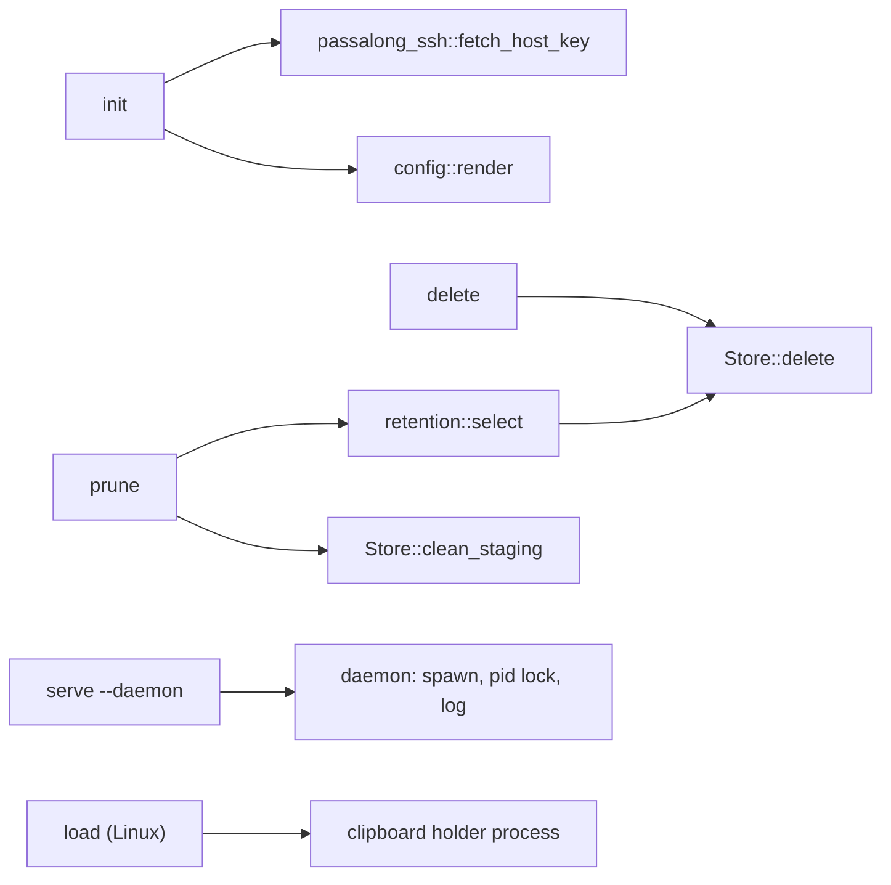

# Delivery Plan 00002: V0 1 1 CLI Stabilisation

> [!abstract] Plan status: `approved`
> Deliver `passalong` v0.1.1: a Docker-based SSH server guide, the missing
> v0.1.0 release records, `delete`, `prune`, `init`, `serve --daemon`,
> crates.io publishing, and a set of low-effort hardening items, all within
> the SSH-only CLI scope of the v0.1.x road map. Decisions D-01 to D-05
> were confirmed as proposed; approved by the user at 2026-09-12T17:42:30Z; Builder-ready.

## 1. Objective and outcome

v0.1.0 shipped the five core commands. v0.1.1 makes the CLI complete for
day-to-day use over SSH and easy to install:

1. A reader can stand up a passalong server in Docker, with items stored in
   a directory on the host, by following one tested guide.
2. The v0.1.0 release has the records the repository's release workflow
   requires.
3. Users can remove items (`delete`) and expire them (`prune`).
4. `passalong init` writes a working config and pins the server's host key
   after the user confirms its fingerprint.
5. `passalong serve --daemon` runs `serve` in the background without a
   service manager, with `--status` and `--stop`.
6. `cargo install passalong` works once the crates are published, and tagged
   releases publish crates and attach binaries automatically.
7. Several findings from v0.1.0 are fixed (see REQ-05 and REQ-16 to REQ-20).

Road map constraint from the user: v0.1.x stabilises the CLI over SSH only.
GUI, Windows, and other platforms or backends belong to v0.2.x and later.

## 2. Source traceability

| Requirement | Source | Source location | Interpretation |
|---|---|---|---|
| PLAN-00002-REQ-01 | User | Request item 1 | Guide `docs/docker-ssh-server-setup.md` for a Docker SSH server with host storage volume |
| PLAN-00002-REQ-02 | User / Repository | Request item 1; `tests/docker/docker-compose.yml` (proven image and settings) | A tested, copyable compose example backing the guide |
| PLAN-00002-REQ-03 | User / Repository | Request item 2; release workflow rules recorded in PLAN-00001 § 5 (root `AGENTS.md` § Release workflow, now empty) | `docs/release/v0.1.0.md` |
| PLAN-00002-REQ-04 | User / Repository | Request item 2; `CHANGELOG.md` still has only `Unreleased`; tag `v0.1.0` created 2026-09-12T14:24:52Z | CHANGELOG release section for v0.1.0 |
| PLAN-00002-REQ-05 | User / Repository | Request items 2 and 7; `Cargo.toml` `repository = "https://github.com/joeworks/passalong"` vs remote `github.com/joelee/passalong`; root `AGENTS.md` is 0 bytes | Metadata and instruction-file fixes |
| PLAN-00002-REQ-06 | User | Request item 3; `docs/backlog.md` "delete and prune" | Store-level deletion and staging clean-up |
| PLAN-00002-REQ-07 | User | Request item 3 | `passalong delete` command |
| PLAN-00002-REQ-08 | User | Request item 3 | `passalong prune` command |
| PLAN-00002-REQ-09 | User | Request item 4; `docs/backlog.md` "passalong init … fetch and confirm the server's host key" | Host-key discovery in `passalong-ssh` |
| PLAN-00002-REQ-10 | User | Request item 4 | `passalong init` command |
| PLAN-00002-REQ-11 | User | Request item 5; `docs/backlog.md` "serve --daemon" | Detached `serve` with single-instance guard |
| PLAN-00002-REQ-12 | User | Request item 5 | `serve --status` and `serve --stop` |
| PLAN-00002-REQ-13 | User | Request item 6; crates.io API: `passalong`, `passalong-core`, `passalong-ssh`, `passalong-cli` unregistered on 2026-09-12 | Crate metadata and package naming for publishing |
| PLAN-00002-REQ-14 | User | Request item 6 | Publish dry run locally and in CI |
| PLAN-00002-REQ-15 | User / Repository | Request items 6 and 7; v0.1.0 release has no assets (`gh release view v0.1.0`) | Tag-driven release workflow: crates.io and binaries |
| PLAN-00002-REQ-16 | User / Repository | Request item 7; `docs/backlog.md` "Supply-chain audit in CI" (RUSTSEC-2023-0071 via `russh` `rsa`) | `cargo deny` in CI |
| PLAN-00002-REQ-17 | User / Repository | Request item 7; PLAN-00001 STEP-15 finding: unreadable config reported as "no config file found" | Distinguish unreadable from missing config |
| PLAN-00002-REQ-18 | User / Repository | Request item 7; `docs/backlog.md` "Retry skipped files" | `serve` retries skipped files after they change |
| PLAN-00002-REQ-19 | User / Repository | Request item 7; `docs/backlog.md` "Clipboard holder on Linux"; PLAN-00001 STEP-07 deviation | Loaded text survives `load` exiting on Linux |
| PLAN-00002-REQ-20 | User / Repository | Request item 7; `docs/backlog.md` "Desktop clipboard test in CI" | Desktop clipboard test under Xvfb |
| PLAN-00002-REQ-21 | Repository | Documentation rules recorded in PLAN-00001 REQ-21 | Documentation updates |
| PLAN-00002-REQ-22 | User / Repository | Request (v0.1.1); release workflow rules recorded in PLAN-00001 § 5 | v0.1.1 release preparation, tag and publish left to the user |
| PLAN-00002-REQ-23 | Repository | Non-negotiables recorded in PLAN-00001 § 5 and REQ-19, REQ-20 | TDD, mocks, integration tests, coverage ≥ 80 % |
| PLAN-00002-REQ-24 | User | Road map in the request | SSH-only CLI scope guard |

## 3. Repository baseline

| Field | Value |
|---|---|
| Repository | `joelee/passalong` (`git@github.com:joelee/passalong.git`) |
| Branch | `main`, in sync with `origin/main` |
| HEAD | `8cac4f360b361ccc22c90ac13916b5aa575b58c2` (merge of PR #1; tag `v0.1.0`) |
| Working tree at publication | Clean before allocation; the only change is this plan file |
| Applicable instructions | `docs/plans/AGENTS.md`; root `AGENTS.md` is empty, so the Rust rules recorded in PLAN-00001 § 5 and its requirements apply |
| Release state | GitHub release `v0.1.0` published 2026-09-12T14:35:49Z with no assets; nothing on crates.io |

## 4. Scope

### In scope

- `docs/docker-ssh-server-setup.md` and a tested compose example under
  `deploy/ssh-server/`.
- v0.1.0 records: `docs/release/v0.1.0.md`, CHANGELOG section, repository URL
  fix, root `AGENTS.md` restore (D-05).
- `Store::delete` and staging clean-up for every backend; `passalong delete`;
  `passalong prune`.
- Host-key discovery and `passalong init`.
- `serve --daemon`, `serve --status`, `serve --stop`, and a single-instance
  guard for every `serve`.
- Crate metadata, package rename of the CLI to `passalong`, caret dependency
  requirements, publish dry run, and a tag-driven release workflow.
- Low-effort items selected in D-05: `cargo deny`, unreadable-config error,
  retrying skipped files, Linux clipboard holder, Xvfb desktop test.
- Documentation and v0.1.1 release preparation (version bump, notes).

### Out of scope

- GUI, Windows, Android, and any backend other than `ssh` and `local`
  (road map: v0.2.x and later).
- Image clipboard, two-way sync, encryption at rest, connection reuse,
  interactive prefix disambiguation.
- Log rotation for the daemon log.
- Actually pushing the `v0.1.1` tag, publishing to crates.io, or creating
  the GitHub release: the user does these; the workflow automates them.

## 5. Constraints and preserved decisions

- Every decision and constraint of PLAN-00001 remains in force: ids,
  storage layout, host-key pinning, `ring` crypto, foreground `serve` as the
  default (D-01 of PLAN-00001; `--daemon` is additive), text-only clipboard.
- Quality rules recorded in PLAN-00001 apply: TDD with a failing test first,
  mocks for external interfaces, integration tests per feature, `just check`
  green at every step, coverage ≥ 80 %, rustdoc for public items, no
  `unsafe`, no `println!` for logs, secrets only in `.env`.
- Library crates (`passalong-core`, `passalong-ssh`) must not spawn
  processes; process spawning (`--daemon`, clipboard holder, `kill`) lives in
  the CLI crate.
- New public `Store` methods are allowed: the crates are pre-1.0 and not yet
  published.
- Builder works on the user's branch `feature/00002-v0.1.1-CLI_Stabilisation`,
  one commit per step, as the user asked for v0.1.0.
- Builder must not run `cargo publish` (without `--dry-run`), push tags, or
  create releases.

## 6. Assumptions

None. Unresolved matters are recorded as decisions and block approval when
material.

## 7. Decisions and blockers

| ID | Decision or blocker | Resolution | Owner | Status |
|---|---|---|---|---|
| D-01 | Behaviour of `delete` and `prune`. | **Confirmed by user (2026-09-12):** `passalong delete <ID>...` resolves every id first (same prefix rules as `load`), deletes nothing if any id is unknown or ambiguous, then deletes and prints each id; no prompt, like `rm`. `passalong prune` needs `--older-than <AGE>` (units `m`, `h`, `d`, `w`) and/or `--keep <N>`; with both, an item survives if it is among the newest N or younger than AGE. It prints the items it will delete, asks `Delete N items? [y/N]` on a terminal, refuses without `--yes` when not on a terminal, and supports `--dry-run`. Prune also removes staging directories in `tmp/` older than 1 hour, which interrupted uploads leave behind. | User | Resolved |
| D-02 | How `init` establishes trust in the host key. | **Confirmed by user (2026-09-12):** `init` connects once without logging in, captures the server's host key (preferring ed25519), shows its SHA-256 fingerprint with the command to check it on the server, and writes it only after the user types `yes`. Scripted use: `--host-key "<line>"` supplies the key directly, or `--fingerprint SHA256:…` must match the fetched key; `--yes` alone is refused, so scripts can never trust blindly. `init` writes to `--config` or `~/.config/passalong/config.toml`, refuses to overwrite without `--force`, then tests login and the storage directory unless `--no-test`. | User | Resolved |
| D-03 | How `serve --daemon` detaches. | **Confirmed by user (2026-09-12):** Unix only. The CLI re-runs itself as `serve` in a new process group with standard input closed and output appended to a log file, then waits up to 5 seconds and reports either the child's pid or its start-up error. Every `serve` holds an exclusive lock on a pid file (std `File::try_lock`, no `unsafe`), which gives single-instance protection and makes stale pid files harmless. `--status` reads the lock and pid; `--stop` sends SIGTERM via `kill` and waits up to 10 seconds. Files: Linux `${XDG_STATE_HOME:-~/.local/state}/passalong/serve.{pid,log}`; macOS `~/Library/Logs/passalong/serve.log` and `~/Library/Application Support/passalong/serve.pid`. Service-manager units stay the recommended way. | User | Resolved |
| D-04 | Publishing setup. | **Confirmed by user (2026-09-12):** Rename the CLI package `passalong-cli` → `passalong` (binary name unchanged; directory unchanged) so `cargo install passalong` works; publish `passalong-core`, `passalong-ssh`, `passalong`. Switch third-party dependency requirements from exact `=` pins to caret requirements, since exact pins in published libraries cause conflicts for users; `Cargo.lock` and `--locked` keep builds reproducible; internal crates stay pinned to each other with `=`. A `release.yml` workflow on `v*` tags checks the tag equals the workspace version, builds and attaches binaries for Linux x86_64 and macOS arm64, and runs `cargo publish --workspace` with a `CARGO_REGISTRY_TOKEN` repository secret that the user creates. | User | Resolved |
| D-05 | Which low-effort extras to include. | **Confirmed by user (2026-09-12), include:** (a) fix the repository URL; (b) restore the root `AGENTS.md` verbatim from the rules captured at the start of PLAN-00001; (c) `cargo deny` in CI, keeping `russh`'s `rsa` feature for RSA identity files and recording RUSTSEC-2023-0071 as an accepted, documented exception; (d) report an unreadable config as unreadable; (e) `serve` retries skipped files once they change; (f) Linux clipboard holder so text from `load` survives the command exiting; (g) desktop clipboard test under Xvfb in CI. **Exclude:** connection reuse, interactive disambiguation, log rotation. | User | Resolved |
| D-06 | Crate name availability. | **Resolved by planner:** crates.io returned 404 for `passalong`, `passalong-core`, `passalong-ssh`, `passalong-cli` on 2026-09-12. Names are not reserved until first publish; Builder records a fresh check in STEP-02. | Planner | Resolved |
| D-07 | Where the Docker server example lives. | **Resolved by planner:** `deploy/ssh-server/compose.yaml` plus `authorized_keys.example`, using the same pinned `lscr.io/linuxserver/openssh-server:10.3_p1-r1-ls236` image the integration tests already prove, with `/config` persisted so the host key survives container re-creation (essential for pinning). | Planner | Resolved |

Blocking decisions: 0. The user confirmed D-01 to D-05 as proposed on
2026-09-12; the plan body already reflects them.

## 8. Affected architecture and components

| Area | Paths | Change |
|---|---|---|
| Release records | `docs/release/v0.1.0.md`, `docs/release/v0.1.1.md`, `CHANGELOG.md`, `AGENTS.md` | New and updated |
| Workspace metadata | `Cargo.toml`, `crates/*/Cargo.toml`, `crates/passalong-core/README.md`, `crates/passalong-ssh/README.md`, `Cargo.lock` | Metadata, rename, caret requirements |
| Storage | `crates/passalong-core/src/store/{mod,fs_store}.rs` | `Store::delete`, `Store::clean_staging` |
| Retention | `crates/passalong-core/src/retention.rs` (new) | Age parsing and prune selection, pure functions |
| Config | `crates/passalong-core/src/config.rs` | Unreadable-file error; config rendering for `init` |
| Serve | `crates/passalong-core/src/serve/{drop_watcher,upload,mod}.rs` | Retry skipped files |
| SSH | `crates/passalong-ssh/src/host_key.rs`, `connect.rs` | `fetch_host_key`, ed25519 preference |
| CLI | `crates/passalong-cli/src/{cli,app}.rs`, `commands/{delete,prune,init,serve,load}.rs`, `daemon.rs`, `prompt.rs` (new) | New commands and flags |
| Deploy | `deploy/ssh-server/compose.yaml`, `deploy/ssh-server/authorized_keys.example` (new) | Server example |
| Tooling | `justfile`, `deny.toml` (new), `.github/workflows/ci.yml`, `.github/workflows/release.yml` (new) | Recipes and workflows |
| Docs | `README.md`, `docs/*.md`, `docs/docker-ssh-server-setup.md` (new) | Updated |

New trait methods:

```rust
// passalong-core::store::Store
async fn delete(&self, id: &ItemId) -> Result<ItemMeta, StoreError>;
async fn clean_staging(&self, older_than: Duration) -> Result<usize, StoreError>;
```

`FsStore::delete` renames `items/<id>` to `tmp/deleted-<id>-<random>` and
then removes it, so an item disappears from `list` in one step and a failed
removal leaves only a staging leftover that `prune` cleans.



## 9. Requirement catalogue

### PLAN-00002-REQ-01 — Docker SSH server guide

- **Requirement:** `docs/docker-ssh-server-setup.md` explains, end to end:
  prerequisites; creating a host storage directory; collecting client public
  keys into `authorized_keys`; starting `deploy/ssh-server/compose.yaml` with
  the storage directory mounted at `/data` and owned by the host user
  (`PUID`/`PGID`); reading the host key and its fingerprint from the
  container; configuring clients with `passalong init` (or by hand) with
  `remote_path = "/data"` and port 2222; firewall exposure; upgrading the
  image without changing the host key; backing up the storage directory;
  troubleshooting (host key mismatch, permission denied, port in use).
- **Rationale:** User request item 1.
- **Source:** User.
- **Acceptance evidence:** AC-01; STEP-14 docs consistency check.

### PLAN-00002-REQ-02 — Tested server example

- **Requirement:** `deploy/ssh-server/compose.yaml` runs
  `lscr.io/linuxserver/openssh-server:10.3_p1-r1-ls236` with key-only login,
  no sudo, port `${PASSALONG_SSH_PORT:-2222}:2222`, volumes `./config:/config`
  (host keys persist), `./authorized_keys:/keys/authorized_keys:ro`, and
  `${PASSALONG_STORAGE:-./storage}:/data`, `restart: unless-stopped`.
  `just test-deploy` starts it with a temporary storage directory, runs the
  CLI round trip (`clipboard --stdin`, `list`, `load`) against it, checks the
  item exists under the host storage directory owned by the invoking UID,
  re-creates the container and checks the host key fingerprint is unchanged,
  and always tears it down. `just ci` includes it.
- **Rationale:** A guide nobody tests goes stale; v0.1.0 showed this with the
  container command.
- **Source:** User; repository (`tests/docker/docker-compose.yml`).
- **Acceptance evidence:** AC-01.

### PLAN-00002-REQ-03 — v0.1.0 release record

- **Requirement:** `docs/release/v0.1.0.md` with summary, changes, tests,
  coverage (92.84 % without Docker, 96.45 % with), configuration (the full
  v0.1.0 key set), upgrade notes (first release), and links to the GitHub
  release and PLAN-00001.
- **Rationale:** Release workflow step 6 was skipped.
- **Source:** User; release rules in PLAN-00001 § 5.
- **Acceptance evidence:** AC-02.

### PLAN-00002-REQ-04 — CHANGELOG release section

- **Requirement:** Rename `## Unreleased` to `## v0.1.0 - 2026-09-12T14:24:52Z`
  (the tag's creation time) and add a fresh `## Unreleased` above it, which
  collects v0.1.1 changes during this plan.
- **Rationale:** Release workflow step 5 was skipped.
- **Source:** User; `CHANGELOG.md`; tag `v0.1.0`.
- **Acceptance evidence:** AC-02.

### PLAN-00002-REQ-05 — Metadata and instruction-file fixes

- **Requirement:** `repository` is `https://github.com/joelee/passalong` in
  the workspace; root `AGENTS.md` is restored with the Rust/cargo rules text
  it held when PLAN-00001 was written (D-05 b).
- **Rationale:** v0.1.0 findings.
- **Source:** Repository.
- **Acceptance evidence:** AC-03.

### PLAN-00002-REQ-06 — Store deletion and staging clean-up

- **Requirement:** `Store::delete(&ItemId) -> ItemMeta` and
  `Store::clean_staging(older_than) -> usize` as in § 8, implemented once in
  `FsStore` for `local` and `ssh`. Deleting an unknown id is
  `StoreError::NotFound`. `clean_staging` removes `tmp/` entries whose
  modification time is older than `older_than` by the injected clock, and
  leaves younger ones (uploads in progress) alone.
- **Rationale:** Needed by `delete` and `prune`; also cleans leftovers from
  interrupted uploads, a v0.1.0 gap.
- **Source:** User; repository.
- **Acceptance evidence:** AC-05, AC-07; SFTP ignored tests.

### PLAN-00002-REQ-07 — `passalong delete`

- **Requirement:** `passalong delete <ID>...` per D-01. Exit 0 when all
  deleted, 1 when any id fails to resolve (nothing deleted) or a deletion
  fails (the ids already deleted are printed).
- **Rationale:** User request item 3.
- **Source:** User.
- **Acceptance evidence:** AC-04.

### PLAN-00002-REQ-08 — `passalong prune`

- **Requirement:** `passalong prune [--older-than AGE] [--keep N] [--dry-run]
  [--yes]` per D-01. Selection is a pure function
  `retention::select(items, now, older_than, keep) -> Vec<ItemId>` with unit
  tests; ages parse as `<n><unit>` with units `m`, `h`, `d`, `w`; neither
  option is an error; the prompt is behind a `Prompt` trait so tests are
  deterministic. Staging directories older than 1 hour are cleaned unless
  `--dry-run`.
- **Rationale:** User request item 3.
- **Source:** User.
- **Acceptance evidence:** AC-06, AC-07.

### PLAN-00002-REQ-09 — Host-key discovery

- **Requirement:** `passalong_ssh::fetch_host_key(host, port, timeout) ->
  Result<DiscoveredKey, SshError>` connects, records the server's host key in
  the handler, rejects it so no authentication happens, and returns the
  OpenSSH line and SHA-256 fingerprint. Key algorithm preference puts
  ed25519 first. Ignored Docker test: the fingerprint equals the one computed
  from the container's `ssh_host_ed25519_key.pub`.
- **Rationale:** `init` needs the key without prior trust.
- **Source:** User; backlog.
- **Acceptance evidence:** AC-08.

### PLAN-00002-REQ-10 — `passalong init`

- **Requirement:** `passalong init` per D-02 with flags `--host`, `--port`,
  `--user`, `--identity-file`, `--remote-path`, `--device-name`,
  `--host-key`, `--fingerprint`, `--force`, `--no-test`. Interactive prompts
  offer defaults (port 22, user `passalong`, identity `~/.ssh/id_ed25519` if
  present, remote path `/srv/passalong`, device name = host name). The
  written file is valid for `config::load` (unit test) and keeps the
  commented layout of `config.sample.toml`. After writing it prints the
  identity's public key path to add to the server's `authorized_keys`.
- **Rationale:** User request item 4.
- **Source:** User; backlog.
- **Acceptance evidence:** AC-08, AC-09.

### PLAN-00002-REQ-11 — `serve --daemon`

- **Requirement:** Per D-03. `serve --daemon` validates configuration first,
  spawns the detached child, and exits 0 with `serve started (pid N, log
  <path>)` once the child holds the pid lock, or exits 1 with the child's
  error if it stops within 5 seconds. The child ignores SIGHUP and stops on
  SIGTERM. Every `serve`, foreground or daemon, takes the pid lock and exits
  1 with `serve is already running (pid N)` when it cannot.
- **Rationale:** User request item 5.
- **Source:** User; backlog.
- **Acceptance evidence:** AC-10, AC-11.

### PLAN-00002-REQ-12 — `serve --status` and `serve --stop`

- **Requirement:** `--status` prints `running (pid N, log <path>)` exit 0, or
  `not running` exit 3; `--stop` signals the running instance, waits up to
  10 seconds for the lock to be released, prints `stopped`, and exits 0; when
  nothing runs it prints `not running` and exits 0.
- **Rationale:** A daemon needs to be inspectable and stoppable.
- **Source:** User.
- **Acceptance evidence:** AC-10.

### PLAN-00002-REQ-13 — Crate metadata and naming

- **Requirement:** Per D-04: CLI package renamed to `passalong`; every
  published crate has `description`, `license`, `repository`, `homepage`,
  `documentation`, `readme`, `keywords` (≤ 5), `categories`, `rust-version`;
  `passalong-core` and `passalong-ssh` get short README files; docs.rs builds
  with all features. Third-party requirements become caret requirements;
  internal crates depend on each other with `=`.
- **Rationale:** User request item 6.
- **Source:** User; crates.io check.
- **Acceptance evidence:** AC-15, AC-16.

### PLAN-00002-REQ-14 — Publish dry run

- **Requirement:** `just publish-dry-run` runs
  `cargo publish --workspace --dry-run --locked`; CI runs it on Linux.
- **Rationale:** Catch packaging errors before a tag.
- **Source:** User.
- **Acceptance evidence:** AC-15.

### PLAN-00002-REQ-15 — Release workflow

- **Requirement:** `.github/workflows/release.yml` per D-04: on `v*` tags,
  a guard script `scripts/check-release-tag.sh` fails unless the tag equals
  `v` + workspace version; a build matrix produces
  `passalong-<version>-x86_64-unknown-linux-gnu.tar.gz` and
  `passalong-<version>-aarch64-apple-darwin.tar.gz` with SHA-256 files and
  uploads them to the GitHub release; a publish job runs
  `cargo publish --workspace --locked` with `CARGO_REGISTRY_TOKEN`.
- **Rationale:** User request item 6; v0.1.0 had no binaries.
- **Source:** User; repository.
- **Acceptance evidence:** AC-18.

### PLAN-00002-REQ-16 — Supply-chain audit

- **Requirement:** `deny.toml` with advisories (deny, with RUSTSEC-2023-0071
  ignored and explained), licences allow-list, bans (duplicates warn), and
  sources (crates.io only); `just audit` runs `cargo deny check`; CI runs it.
- **Rationale:** Backlog item; `rsa` advisory.
- **Source:** Backlog; D-05 c.
- **Acceptance evidence:** AC-17.

### PLAN-00002-REQ-17 — Unreadable config error

- **Requirement:** When a lookup candidate exists but cannot be read,
  `config::locate` returns `ConfigError::Unreadable { path, reason }`
  (`cannot read config file <path>: permission denied`) instead of skipping
  it.
- **Rationale:** v0.1.0 container finding.
- **Source:** Repository; D-05 d.
- **Acceptance evidence:** AC-13.

### PLAN-00002-REQ-18 — Retry skipped files

- **Requirement:** When the uploader skips a file for a local reason, the
  drop tracker forgets its in-flight state as soon as the file's size or
  modification time changes, so it is sent after it is fixed, without a
  restart.
- **Rationale:** Backlog item.
- **Source:** Backlog; D-05 e.
- **Acceptance evidence:** AC-14.

### PLAN-00002-REQ-19 — Linux clipboard holder

- **Requirement:** On Linux, `load` to the clipboard hands the text to a
  detached helper (a hidden `passalong __hold-clipboard` subcommand reading
  the text from standard input) that owns the clipboard until another
  program replaces it, then exits. `load` returns immediately. On macOS the
  existing direct write stays.
- **Rationale:** Backlog item; v0.1.0 limitation.
- **Source:** Backlog; D-05 f.
- **Acceptance evidence:** AC-12.

### PLAN-00002-REQ-20 — Desktop clipboard test in CI

- **Requirement:** A Linux CI job runs the ignored desktop tests (including
  the new holder test) under `xvfb-run`.
- **Rationale:** The desktop adapter has never been tested automatically.
- **Source:** Backlog; D-05 g.
- **Acceptance evidence:** AC-12, AC-19.

### PLAN-00002-REQ-21 — Documentation

- **Requirement:** `README.md`, `docs/usage.md` (new commands, flags, exit
  codes), `docs/configuration.md` (daemon file locations, `init`),
  `docs/architecture.md` (deletion, daemon, holder, release pipeline),
  `docs/developer-guide.md` (new recipes, publishing), `docs/backlog.md`
  (remove delivered items), all passing the consistency script from
  PLAN-00001 STEP-14 extended to the new files.
- **Rationale:** Documentation rules.
- **Source:** Repository.
- **Acceptance evidence:** AC-20, AC-21.

### PLAN-00002-REQ-22 — v0.1.1 release preparation

- **Requirement:** All crates at `0.1.1`; `CHANGELOG.md` `Unreleased` holds
  the v0.1.1 entries (renamed at tagging time by the user or the release
  workflow instructions); `docs/release/v0.1.1.md` drafted with summary,
  changes, tests, coverage, config changes (`init`, daemon files), and
  upgrade notes (the `passalong-cli` → `passalong` package rename; how to
  switch `cargo install`).
- **Rationale:** The user will tag v0.1.1 after this plan.
- **Source:** User; release rules.
- **Acceptance evidence:** AC-20.

### PLAN-00002-REQ-23 — Quality gates

- **Requirement:** Every behaviour introduced test-first; external interfaces
  mocked (clipboard, prompts, process spawning behind a trait where
  practical, filesystem, clock); integration tests for each command
  (binary tests with the `local` backend, ignored Docker tests with `ssh`);
  `just ci` green on Linux and macOS; line coverage ≥ 80 %.
- **Rationale:** Repository non-negotiables.
- **Source:** PLAN-00001 § 5.
- **Acceptance evidence:** AC-21.

### PLAN-00002-REQ-24 — Road map guard

- **Requirement:** No GUI, Windows, Android, or new backend work;
  `BackendRegistry` kinds remain `local` and `ssh`.
- **Rationale:** User road map.
- **Source:** User.
- **Acceptance evidence:** AC-22.

## 10. Delivery strategy

1. **Housekeeping first (STEP-01, STEP-02).** Release records and packaging
   changes touch many files but no behaviour; doing them first keeps later
   diffs focused and proves `cargo publish --dry-run` early.
2. **Deletion (STEP-03 to STEP-05).** Store API, then the two commands.
3. **Onboarding (STEP-06, STEP-07).** Host-key discovery, then `init`.
4. **Background operation (STEP-08, STEP-09).** Daemon machinery, then the
   clipboard holder, which reuses its detached-spawn helper.
5. **Hardening (STEP-10).** Unreadable config and skipped-file retry.
6. **Server guide (STEP-11).** Written after `init` so it can use it, and
   tested with the new `just test-deploy` recipe.
7. **Automation (STEP-12).** CI additions and the release workflow.
8. **Docs, release prep, final gate (STEP-13, STEP-14).**

Each step ends with `just check` green and one commit. Docker-backed tests
run at STEP-03, STEP-06, STEP-07, STEP-11, and STEP-14.

## 11. Detailed implementation steps

### PLAN-00002-STEP-01 — v0.1.0 release records and metadata fixes

- **Status placeholder:** `not-started`
- **Objective:** Complete the skipped v0.1.0 release steps and fix known
  metadata.
- **Requirements:** `PLAN-00002-REQ-03`, `PLAN-00002-REQ-04`, `PLAN-00002-REQ-05`
- **Depends on:** None
- **Affected components:** `docs/release/v0.1.0.md`, `CHANGELOG.md`,
  `Cargo.toml`, `AGENTS.md`
- **Preconditions:** Plan approved; branch created from the approval commit.
- **Test or evidence first:** Documentation step: evidence is the extended
  consistency script (relative links, required sections present in
  `docs/release/v0.1.0.md`) and `grep` showing no `joeworks/passalong`.
- **Implementation tasks:**
  1. Write `docs/release/v0.1.0.md` from the published release notes and
     PLAN-00001's work log (tests, coverage, config).
  2. Rename the CHANGELOG section; add a fresh `Unreleased`.
  3. Fix `repository`; restore `AGENTS.md` (D-05 b).
- **Documentation/configuration/operations:** None beyond the above.
- **Verification:** consistency script; `just check`.
- **Completion criteria:** AC-02, AC-03.
- **Rollback or recovery:** Revert the commit.
- **Builder stop conditions:** The user rejects D-05 b (then skip the
  `AGENTS.md` task only).

### PLAN-00002-STEP-02 — Crate metadata, package rename, caret requirements, publish dry run

- **Status placeholder:** `not-started`
- **Objective:** Make the workspace publishable.
- **Requirements:** `PLAN-00002-REQ-13`, `PLAN-00002-REQ-14`
- **Depends on:** `PLAN-00002-STEP-01`
- **Affected components:** `Cargo.toml`, `crates/*/Cargo.toml`, crate
  READMEs, `Cargo.lock`, `justfile`, `Dockerfile` (`-p passalong`), docs that
  mention `-p passalong-cli`
- **Preconditions:** STEP-01 committed; fresh crates.io name check recorded.
- **Test or evidence first:** Run `cargo publish --workspace --dry-run
  --locked` before the changes and record its failures (missing metadata);
  the step is done when it passes.
- **Implementation tasks:**
  1. Rename the package; update every `-p passalong-cli` reference.
  2. Add metadata and `[package.metadata.docs.rs] all-features = true`.
  3. Convert `=x.y.z` third-party requirements to `x.y.z`; keep `Cargo.lock`
     versions unchanged (`cargo update --workspace` must not bump them).
  4. Add `just publish-dry-run`.
- **Documentation/configuration/operations:** Developer guide publishing
  section (draft).
- **Verification:** `just publish-dry-run`; `cargo install --locked --path
  crates/passalong-cli --root <tmp>` produces `<tmp>/bin/passalong`;
  `just check`.
- **Completion criteria:** AC-15, AC-16.
- **Rollback or recovery:** Revert the commit.
- **Builder stop conditions:** A name is taken on crates.io by then; the
  dry run requires changes to public APIs.

### PLAN-00002-STEP-03 — Store deletion and staging clean-up

- **Status placeholder:** `not-started`
- **Objective:** Implement REQ-06.
- **Requirements:** `PLAN-00002-REQ-06`
- **Depends on:** `PLAN-00002-STEP-02`
- **Affected components:** `store/mod.rs`, `store/fs_store.rs`,
  `testing.rs` (the `Flaky` test store in `serve::upload` tests gains the new
  methods), `passalong-ssh/tests/sftp_docker.rs`
- **Preconditions:** STEP-02 committed.
- **Test or evidence first:** Unit tests: delete removes the item from
  `list` and returns its meta; unknown id → `NotFound`; with `FaultyFs`
  failing `remove_dir_all`, the item is already absent from `list` and a
  `tmp/deleted-…` leftover remains; `clean_staging` with `ManualClock`
  removes entries older than the threshold, keeps younger ones, returns the
  count, and succeeds when `tmp/` is missing. Ignored SFTP test: delete and
  clean_staging over SFTP.
- **Implementation tasks:** Add trait methods; implement in `FsStore`; update
  test doubles.
- **Documentation/configuration/operations:** Architecture storage section
  (draft).
- **Verification:** `cargo test -p passalong-core store::`;
  `just test-integration`; `just check`.
- **Completion criteria:** AC-05, AC-07 (store part).
- **Rollback or recovery:** Revert.
- **Builder stop conditions:** SFTP rename of a directory into `tmp/` fails
  on the test server.

### PLAN-00002-STEP-04 — `passalong delete`

- **Status placeholder:** `not-started`
- **Objective:** Implement REQ-07.
- **Requirements:** `PLAN-00002-REQ-07`
- **Depends on:** `PLAN-00002-STEP-03`
- **Affected components:** `cli.rs`, `app.rs`, `commands/delete.rs`,
  `tests/cli_local_backend.rs`
- **Test or evidence first:** Unit tests: multiple prefixes delete exactly
  those items; one unknown id → exit error and nothing deleted; ambiguous
  prefix → nothing deleted; output lists deleted ids. Binary test with the
  local backend.
- **Implementation tasks:** Resolve all ids, then delete in order; print ids.
- **Documentation/configuration/operations:** `docs/usage.md` section.
- **Verification:** `cargo test -p passalong`; `just check`.
- **Completion criteria:** AC-04.
- **Rollback or recovery:** Revert.
- **Builder stop conditions:** None specific.

### PLAN-00002-STEP-05 — `passalong prune`

- **Status placeholder:** `not-started`
- **Objective:** Implement REQ-08.
- **Requirements:** `PLAN-00002-REQ-08`
- **Depends on:** `PLAN-00002-STEP-04`
- **Affected components:** `passalong-core/src/retention.rs`,
  `passalong-cli/src/prompt.rs` (`Prompt` trait with terminal and scripted
  implementations), `commands/prune.rs`, `cli.rs`, `app.rs`, binary tests
- **Test or evidence first:** Unit tests for `parse_age` (valid units,
  zero, overflow, garbage) and `select` (keep only, age only, both,
  keep ≥ count, empty list); command tests with a scripted prompt: `n`
  deletes nothing, `y` deletes the selection, non-terminal without `--yes`
  refuses, `--dry-run` prints and deletes nothing, stale staging is cleaned
  only without `--dry-run`. Binary test `prune --keep 1 --yes`.
- **Implementation tasks:** Pure selection; prompt abstraction; command.
- **Documentation/configuration/operations:** `docs/usage.md` section.
- **Verification:** `cargo test -p passalong-core retention`;
  `cargo test -p passalong`; `just check`.
- **Completion criteria:** AC-06, AC-07.
- **Rollback or recovery:** Revert.
- **Builder stop conditions:** None specific.

### PLAN-00002-STEP-06 — Host-key discovery

- **Status placeholder:** `not-started`
- **Objective:** Implement REQ-09.
- **Requirements:** `PLAN-00002-REQ-09`
- **Depends on:** `PLAN-00002-STEP-02`
- **Affected components:** `passalong-ssh/src/host_key.rs`, `connect.rs`,
  `tests/sftp_docker.rs`
- **Test or evidence first:** Unit test for the recording handler (records
  the key, returns rejection) and for the preferred key-algorithm list
  (ed25519 first). Ignored Docker test comparing fingerprints.
- **Implementation tasks:** `DiscoveredKey { openssh_line, fingerprint,
  algorithm }`; `fetch_host_key`; ed25519-first `Preferred` key list in the
  client config used by both `connect` and discovery.
- **Documentation/configuration/operations:** None.
- **Verification:** `cargo test -p passalong-ssh`; `just test-integration`;
  `just check`.
- **Completion criteria:** AC-08 (discovery part).
- **Rollback or recovery:** Revert.
- **Builder stop conditions:** `russh` offers no way to set host-key
  algorithm preference (report; fall back to accepting whatever the server
  offers and showing its algorithm).

### PLAN-00002-STEP-07 — `passalong init`

- **Status placeholder:** `not-started`
- **Objective:** Implement REQ-10.
- **Requirements:** `PLAN-00002-REQ-10`
- **Depends on:** `PLAN-00002-STEP-05`, `PLAN-00002-STEP-06`
- **Affected components:** `passalong-core/src/config.rs`
  (`render(&InitAnswers) -> String`), `commands/init.rs`, `cli.rs`, `app.rs`
  (`init` must run without an existing config), `tests/cli_ssh_backend.rs`
- **Test or evidence first:** Unit tests: rendered config parses with
  `config::parse` and round-trips every answer; scripted prompt flow accepts
  defaults; refusing the fingerprint writes nothing; `--fingerprint`
  mismatch refuses; `--yes` without `--host-key` or `--fingerprint` refuses;
  existing file without `--force` refuses. Ignored Docker binary test:
  scripted `init --host … --fingerprint <expected> --yes` then `list`.
- **Implementation tasks:** Config rendering; command with `Prompt`,
  discovery, write, and connection test.
- **Documentation/configuration/operations:** README quick start uses
  `init`; `docs/usage.md` and `docs/configuration.md` sections.
- **Verification:** `cargo test -p passalong-core config`;
  `cargo test -p passalong`; `just test-integration`; `just check`.
- **Completion criteria:** AC-08, AC-09.
- **Rollback or recovery:** Revert.
- **Builder stop conditions:** None specific.

### PLAN-00002-STEP-08 — `serve --daemon`, `--status`, `--stop`

- **Status placeholder:** `not-started`
- **Objective:** Implement REQ-11 and REQ-12.
- **Requirements:** `PLAN-00002-REQ-11`, `PLAN-00002-REQ-12`
- **Depends on:** `PLAN-00002-STEP-07`
- **Affected components:** `passalong-cli/src/daemon.rs` (paths, pid lock,
  detached spawn helper), `commands/serve.rs`, `cli.rs`,
  `tests/cli_local_backend.rs`
- **Test or evidence first:** Unit tests: state paths for Linux and macOS
  from an injected environment; pid lock acquire, conflict, stale-file
  takeover, and release, using temporary directories. Binary tests on Unix:
  `serve --daemon` returns and `--status` reports running; a second
  `serve` fails with the pid; `--stop` stops it and the log contains `serve
  stopped`; `--daemon` with a broken config exits 1 with the error.
- **Implementation tasks:** Paths; lock; spawn with `process_group(0)`;
  start-up handshake by waiting for the child to hold the lock; SIGHUP
  ignored in the child; status and stop.
- **Documentation/configuration/operations:** `docs/usage.md`,
  `docs/configuration.md` (file locations).
- **Verification:** `cargo test -p passalong`; `just check`.
- **Completion criteria:** AC-10, AC-11.
- **Rollback or recovery:** Revert; foreground `serve` is unaffected apart
  from taking the lock.
- **Builder stop conditions:** `File::try_lock` is unavailable on the
  pinned toolchain; the macOS CI job cannot detach the child.

### PLAN-00002-STEP-09 — Linux clipboard holder

- **Status placeholder:** `not-started`
- **Objective:** Implement REQ-19.
- **Requirements:** `PLAN-00002-REQ-19`, `PLAN-00002-REQ-20`
- **Depends on:** `PLAN-00002-STEP-08`
- **Affected components:** `passalong-core/src/clipboard/desktop.rs`
  (`hold_text` using arboard's `wait`), `commands/load.rs`, hidden
  subcommand in `cli.rs`, `daemon.rs` spawn helper
- **Test or evidence first:** Unit test that `load` on Linux routes clipboard
  writes through an injected holder launcher (mock records the text); hidden
  subcommand excluded from `--help` (CLI test). Ignored desktop test: after
  `load` returns, reading the clipboard yields the text; the holder exits
  when the clipboard is replaced.
- **Implementation tasks:** Holder launcher trait, Linux implementation
  spawning the hidden subcommand detached, macOS direct write.
- **Documentation/configuration/operations:** Remove the "2 seconds" caveat
  from `docs/usage.md`.
- **Verification:** `cargo test -p passalong`; desktop test under `xvfb-run`
  locally if available, otherwise in CI (STEP-12); `just check`.
- **Completion criteria:** AC-12 (evidence may land in STEP-12's CI run).
- **Rollback or recovery:** Revert.
- **Builder stop conditions:** arboard `wait` does not return when another
  program takes the clipboard under Xvfb.

### PLAN-00002-STEP-10 — Unreadable config error and skipped-file retry

- **Status placeholder:** `not-started`
- **Objective:** Implement REQ-17 and REQ-18.
- **Requirements:** `PLAN-00002-REQ-17`, `PLAN-00002-REQ-18`
- **Depends on:** `PLAN-00002-STEP-02`
- **Affected components:** `config.rs`, `serve/drop_watcher.rs`,
  `serve/upload.rs`, `serve/mod.rs`
- **Test or evidence first:** Unit test: a candidate directory without
  execute permission yields `Unreadable` naming the path (skipped when tests
  run as root); tracker test: a skipped path is re-offered after its size or
  mtime changes and not before.
- **Implementation tasks:** `metadata`-based probing in `locate`; a skipped
  feedback channel from uploader to drop loop; tracker `mark_skipped`.
- **Documentation/configuration/operations:** Configuration and usage notes.
- **Verification:** `cargo test -p passalong-core`; `just check`.
- **Completion criteria:** AC-13, AC-14.
- **Rollback or recovery:** Revert.
- **Builder stop conditions:** None specific.

### PLAN-00002-STEP-11 — Docker SSH server guide and tested example

- **Status placeholder:** `not-started`
- **Objective:** Implement REQ-01 and REQ-02.
- **Requirements:** `PLAN-00002-REQ-01`, `PLAN-00002-REQ-02`
- **Depends on:** `PLAN-00002-STEP-07`
- **Affected components:** `deploy/ssh-server/*`,
  `docs/docker-ssh-server-setup.md`, `justfile` (`test-deploy`, `ci`)
- **Test or evidence first:** Write `just test-deploy` first and see it fail
  (no compose file), then add the example.
- **Implementation tasks:** Compose example; guide; recipe with a temporary
  storage directory, round trip, ownership check, re-create and fingerprint
  comparison, guaranteed teardown, image pull retries as in `_with-sshd`.
- **Documentation/configuration/operations:** README link to the guide.
- **Verification:** `just test-deploy`; `just check`.
- **Completion criteria:** AC-01.
- **Rollback or recovery:** Revert.
- **Builder stop conditions:** `PUID`/`PGID` mapping does not produce
  host-owned files.

### PLAN-00002-STEP-12 — CI additions and release workflow

- **Status placeholder:** `not-started`
- **Objective:** Implement REQ-14, REQ-15, REQ-16, REQ-20.
- **Requirements:** `PLAN-00002-REQ-14`, `PLAN-00002-REQ-15`, `PLAN-00002-REQ-16`, `PLAN-00002-REQ-20`
- **Depends on:** `PLAN-00002-STEP-09`, `PLAN-00002-STEP-11`
- **Affected components:** `deny.toml`, `justfile` (`audit`, `setup`,
  `ci`), `.github/workflows/ci.yml`, `.github/workflows/release.yml`,
  `scripts/check-release-tag.sh`
- **Test or evidence first:** Tests for `check-release-tag.sh` (matching
  tag passes, mismatch and malformed tags fail) run by `just check`;
  `cargo deny check` run before `deny.toml` exists records the failures to
  address.
- **Implementation tasks:** `deny.toml` with the documented `rsa` exception;
  CI jobs: audit, publish dry run, Xvfb desktop tests; release workflow per
  D-04; workflow syntax checked with `actionlint` (installed by
  `just setup`).
- **Documentation/configuration/operations:** Developer guide: releasing,
  the `CARGO_REGISTRY_TOKEN` secret, what the workflow does.
- **Verification:** `just audit`; `just publish-dry-run`; `actionlint`;
  GitHub CI on the pushed branch (Linux, macOS, Xvfb job).
- **Completion criteria:** AC-17, AC-18, AC-19.
- **Rollback or recovery:** Revert; workflows are inert until a tag.
- **Builder stop conditions:** A dependency licence is not on the allow-list
  (report rather than widen silently); a new advisory appears.

### PLAN-00002-STEP-13 — Documentation and v0.1.1 release preparation

- **Status placeholder:** `not-started`
- **Objective:** Implement REQ-21 and REQ-22.
- **Requirements:** `PLAN-00002-REQ-21`, `PLAN-00002-REQ-22`
- **Depends on:** `PLAN-00002-STEP-12`
- **Affected components:** docs, `README.md`, `CHANGELOG.md`,
  `docs/release/v0.1.1.md`, all `Cargo.toml` versions, `Cargo.lock`
- **Test or evidence first:** Documentation step; evidence is the extended
  consistency script (new flags, recipes, and files) and
  `passalong --version`.
- **Implementation tasks:** Update docs; remove delivered backlog items;
  bump versions to 0.1.1; draft release notes with the upgrade note about
  the package rename.
- **Documentation/configuration/operations:** This step.
- **Verification:** consistency script; `just check`.
- **Completion criteria:** AC-20.
- **Rollback or recovery:** Revert.
- **Builder stop conditions:** Documented behaviour disagrees with code.

### PLAN-00002-STEP-14 — Final quality gate

- **Status placeholder:** `not-started`
- **Objective:** Prove the plan.
- **Requirements:** `PLAN-00002-REQ-23`, `PLAN-00002-REQ-24`
- **Depends on:** `PLAN-00002-STEP-13`
- **Affected components:** None new.
- **Test or evidence first:** Verification-only step.
- **Implementation tasks:** Run `just ci`; push the branch and record the
  GitHub CI result for Linux, macOS, and Xvfb jobs; review the diff for
  road-map scope; record coverage.
- **Documentation/configuration/operations:** None.
- **Verification:** `just ci`; GitHub CI; `git diff --stat` scope review.
- **Completion criteria:** AC-21, AC-22.
- **Rollback or recovery:** Not applicable.
- **Builder stop conditions:** Any gate fails in a way that needs scope or
  threshold changes.

## 12. Cross-cutting concerns

| Area | Applicability | Planned action or reason not applicable | Step or requirement |
|---|---|---|---|
| Compatibility and APIs | Applicable | New `Store` methods (pre-1.0, unpublished); CLI package rename needs an upgrade note; config file format unchanged | REQ-06, REQ-13, REQ-22 |
| Data and migration | Applicable | Deletion moves items into `tmp/` before removal; no layout change; staging clean-up only touches `tmp/` | REQ-06, REQ-08 |
| Security and privacy | Applicable | `init` never trusts a host key without an explicit fingerprint confirmation; prune refuses non-interactive runs without `--yes`; pid lock prevents duplicate uploaders; `cargo deny` advisories | REQ-08, REQ-10, REQ-11, REQ-16 |
| Performance and scale | Applicable | Prune reads metadata once; deletion is a rename plus removal | REQ-06, REQ-08 |
| Reliability and failure handling | Applicable | Daemon start-up handshake reports early failures; stale pid files harmless via locks; holder exits when replaced | REQ-11, REQ-19 |
| Observability and operations | Applicable | Daemon log file; `--status`; delete and prune log each id | REQ-11, REQ-12 |
| Dependencies and supply chain | Applicable | Caret requirements with committed lock; `cargo deny`; no new runtime crates expected | REQ-13, REQ-16 |
| Accessibility and UX | Applicable | Guided `init`; clear prompts; consistent exit codes documented | REQ-10, REQ-21 |
| Documentation and release | Applicable | Server guide, release records for v0.1.0 and v0.1.1 | REQ-01, REQ-03, REQ-21, REQ-22 |
| Deployment and rollback | Applicable | Release workflow publishes crates and binaries; crates.io versions cannot be deleted, only yanked, so the dry run gates it | REQ-14, REQ-15 |

## 13. Verification strategy

| Level | Evidence or command | When | Required result |
|---|---|---|---|
| Unit | `cargo test -p <crate> <module>` | Every step, red then green | Pass |
| Workspace gate | `just check` | Every step | Exit 0 |
| SSH integration | `just test-integration` | STEP-03, 06, 07, 14 | Exit 0 |
| Server example | `just test-deploy` | STEP-11, 14 | Exit 0 |
| Packaging | `just publish-dry-run` | STEP-02, 12, 14 | Exit 0 |
| Supply chain | `just audit` | STEP-12, 14 | Exit 0 |
| Workflows | `actionlint` | STEP-12 | No findings |
| Desktop | desktop tests under `xvfb-run` in CI | STEP-12, 14 | Pass |
| Coverage | `cargo llvm-cov … --fail-under-lines 80` | STEP-05, 08, 14 | ≥ 80 % |
| Docs | extended consistency script | STEP-01, 13 | No gaps |
| Full | `just ci` locally and GitHub CI | STEP-14 | Pass on Linux and macOS |

## 14. Acceptance criteria

- [ ] `PLAN-00002-AC-01` `docs/docker-ssh-server-setup.md` exists and `just test-deploy` exits 0: the CLI round trip succeeds against `deploy/ssh-server/compose.yaml`, the stored item is present under the host storage directory owned by the invoking UID, and re-creating the container keeps the host key fingerprint.
- [ ] `PLAN-00002-AC-02` `docs/release/v0.1.0.md` has summary, changes, tests, coverage, configuration, and upgrade-notes sections; `CHANGELOG.md` has `## v0.1.0 - 2026-09-12T14:24:52Z` below a new `## Unreleased`.
- [ ] `PLAN-00002-AC-03` No file references `github.com/joeworks/passalong`; the root `AGENTS.md` is non-empty (if D-05 b is accepted).
- [ ] `PLAN-00002-AC-04` `passalong delete <a> <b>` deletes exactly those two items and prints their ids; with one unknown id it exits 1 and deletes nothing.
- [ ] `PLAN-00002-AC-05` A unit test with an injected removal failure shows a deleted item already absent from `list`, with only a `tmp/` leftover.
- [ ] `PLAN-00002-AC-06` `prune --older-than 30d --dry-run` deletes nothing; `prune --keep 2 --yes` leaves exactly the newest 2 items; `prune --keep 2` without a terminal and without `--yes` exits 1 and deletes nothing.
- [ ] `PLAN-00002-AC-07` Prune removes `tmp/` entries older than 1 hour and keeps younger ones (unit test with `ManualClock`).
- [ ] `PLAN-00002-AC-08` Scripted `passalong init --fingerprint <expected> --yes …` against the Docker server writes a config whose `host_key` is the server's ed25519 key, and `passalong list` succeeds with it.
- [ ] `PLAN-00002-AC-09` `init` refuses an existing config without `--force`, a fingerprint mismatch, and `--yes` without `--host-key` or `--fingerprint`, writing nothing in each case.
- [ ] `PLAN-00002-AC-10` `serve --daemon` exits 0 within 5 s; a second `serve` exits 1 with `serve is already running (pid N)`; `serve --status` prints the pid; `serve --stop` stops it within 10 s; the log file contains `serve stopped`.
- [ ] `PLAN-00002-AC-11` `serve --daemon` with an invalid config exits 1 and prints the configuration error.
- [ ] `PLAN-00002-AC-12` Under Xvfb, text loaded to the clipboard by `load` can be read back after `load` has exited.
- [ ] `PLAN-00002-AC-13` An existing but unreadable config file produces `error: cannot read config file <path>: permission denied`.
- [ ] `PLAN-00002-AC-14` A tracker unit test shows a skipped file is offered again after it changes, and not before.
- [ ] `PLAN-00002-AC-15` `just publish-dry-run` exits 0 for `passalong-core`, `passalong-ssh`, and `passalong`; `cargo install --locked --path crates/passalong-cli` installs a `passalong` binary.
- [ ] `PLAN-00002-AC-16` No third-party dependency requirement in `Cargo.toml` uses `=`; `cargo build --workspace --locked` passes with an unchanged set of locked versions.
- [ ] `PLAN-00002-AC-17` `just audit` (`cargo deny check`) passes locally and in CI, with the RUSTSEC-2023-0071 exception explained in `deny.toml`.
- [ ] `PLAN-00002-AC-18` `.github/workflows/release.yml` passes `actionlint`; `scripts/check-release-tag.sh` tests pass; the workflow defines the binary matrix and the `cargo publish --workspace` job using `CARGO_REGISTRY_TOKEN`.
- [ ] `PLAN-00002-AC-19` GitHub CI runs the desktop tests under Xvfb and they pass.
- [ ] `PLAN-00002-AC-20` All crates are at `0.1.1`; `passalong --version` prints `passalong 0.1.1`; `CHANGELOG.md` `Unreleased` lists the v0.1.1 changes; `docs/release/v0.1.1.md` exists with an upgrade note for the package rename; the consistency script reports no gaps.
- [ ] `PLAN-00002-AC-21` `just ci` passes locally and GitHub CI passes on Linux and macOS for the final commit; line coverage is at least 80 %.
- [ ] `PLAN-00002-AC-22` The diff adds no GUI, Windows, Android, or backend code; `BackendRegistry` kinds are still `local` and `ssh`.

## 15. Risks and mitigations

| Risk | Likelihood | Impact | Mitigation or test | Owner/step |
|---|---|---|---|---|
| The release workflow cannot be exercised before a real tag | Certain | Medium | `actionlint`, tag-guard tests, publish dry run; first real run is v0.1.1, watched by the user | STEP-12 |
| A crate name is registered by someone else before first publish | Low | High | Fresh check in STEP-02; publish v0.1.1 promptly after merge | STEP-02, user |
| Converting to caret requirements changes resolved versions | Low | Medium | Keep `Cargo.lock`; verify no version change in the lock diff | STEP-02 |
| Detached child still receives terminal signals on some platform | Medium | Medium | New process group plus SIGHUP ignored; binary test on Linux and macOS CI | STEP-08 |
| Clipboard holder never exits on some compositors | Medium | Low | Holder exits when replaced; document; Xvfb test; macOS unaffected | STEP-09 |
| `PUID`/`PGID` mapping differs across hosts | Low | Medium | `just test-deploy` checks ownership | STEP-11 |
| `cargo deny` flags a licence or advisory in the tree | Medium | Low | Report and decide per item; do not widen silently | STEP-12 |
| Registry rate limits in CI | Medium | Low | Pull retries already in place; reused by `test-deploy` | STEP-11 |

## 16. Builder hand-off

- **Start condition:** User approval and a clean repository.
- **First step:** `PLAN-00002-STEP-01` — v0.1.0 release records and metadata
  fixes.
- **Required sequence:** STEP-01 → 02 → 03 → 04 → 05 → 06 → 07 → 08 → 09 →
  10 → 11 → 12 → 13 → 14, one commit per step without review pauses unless
  blocked (user's standing preference).
- **Parallel-safe work:** None (single Builder).
- **Do not change:** approved scope, requirements, steps, acceptance
  criteria, or content outside Builder's permitted work-log area.
- **Escalate when:** a Builder stop condition triggers; a decision in § 7
  turns out unworkable; a dependency licence or advisory needs a policy
  choice.
- **Completion hand-off:** Work log with evidence, local and GitHub CI
  results, coverage, and the exact commands for the user to tag and publish
  v0.1.1.

<!-- BUILDER_WORK_LOG_START -->
## 17. Builder Work Log

> [!warning] Builder-maintained section
> Delivery Planner creates this section. After approval, Builder may update only
> this delimited section and the Builder-maintained front-matter fields. Builder
> must preserve prior entries and use UTC timestamps.

### Step status

| Step | Status | Started (UTC) | Completed (UTC) | Evidence | Builder notes |
|---|---|---|---|---|---|
| PLAN-00002-STEP-01 | completed | 2026-09-12T17:42:30Z | 2026-09-12T17:42:44Z | Commit `build: complete PLAN-00002-STEP-01 - v0.1.0 release records and metadata fixes`; `just check` green, 92.84% lines | Plans under docs/plans keep their historical text; the repository URL finding stays documented there |
| PLAN-00002-STEP-02 | completed | 2026-09-12T17:43:07Z | 2026-09-12T17:45:33Z | Commit `build: complete PLAN-00002-STEP-02 - Crate metadata, package rename, caret requirements, publish dry run`; `just check` green, 92.84% lines | Package `passalong` lives in `crates/passalong-cli/` (directory unchanged); libraries get READMEs and docs.rs all-features builds |
| PLAN-00002-STEP-03 | completed | 2026-09-12T17:45:48Z | 2026-09-12T17:47:55Z | Commit `build: complete PLAN-00002-STEP-03 - Store deletion and staging clean-up`; `just check` green, 92.89% lines | AC-05 by `a_failed_removal_still_hides_the_item_at_once`; AC-07 store part by `clean_staging_removes_only_entries_older_than_the_threshold` |
| PLAN-00002-STEP-04 | completed | 2026-09-12T17:49:04Z | 2026-09-12T17:49:23Z | Commit `build: complete PLAN-00002-STEP-04 - `passalong delete``; `just check` green, 92.99% lines | AC-04 by unit tests and the binary test `delete_removes_named_items_and_rejects_unknown_ones` |
| PLAN-00002-STEP-05 | completed | 2026-09-12T17:49:23Z | 2026-09-12T17:53:56Z | Commit `build: complete PLAN-00002-STEP-05 - `passalong prune``; `just check` green, 93.43% lines | Coverage checkpoint (STEP-05) in the `just check` row; AC-06 by unit and binary tests; AC-07 by `stale_staging_is_cleaned_except_in_dry_runs` |
| PLAN-00002-STEP-06 | completed | 2026-09-12T17:54:15Z | 2026-09-12T17:56:28Z | Commit `build: complete PLAN-00002-STEP-06 - Host-key discovery`; `just check` green, 92.93% lines | `russh`'s default host-key preference already starts with Ed25519; a unit test pins that order instead of copying the whole algorithm list |
| PLAN-00002-STEP-07 | completed | 2026-09-12T17:57:20Z | 2026-09-12T18:02:28Z | Commit `build: complete PLAN-00002-STEP-07 - `passalong init``; `just check` green, 93.02% lines | AC-09 by unit tests and the offline binary test `init_writes_a_config_offline_and_refuses_to_overwrite_it` |
| PLAN-00002-STEP-08 | completed | 2026-09-12T18:03:19Z | 2026-09-12T18:07:58Z | Commit `build: complete PLAN-00002-STEP-08 - `serve --daemon`, `--status`, `--stop``; `just check` green, 93.10% lines | Coverage checkpoint (STEP-08) in the `just check` row; no stray daemon processes after the tests |
| PLAN-00002-STEP-09 | completed | 2026-09-12T18:08:31Z | 2026-09-12T18:11:18Z | Commit `build: complete PLAN-00002-STEP-09 - Linux clipboard holder`; `just check` green, 92.42% lines | Desktop tests `desktop_held_text_outlives_the_writer_until_replaced` and `desktop_loaded_text_survives_load_exiting` were not run here: on this developer machine they would replace the user's real clipboard. They run under Xvfb in CI from STEP-12, where AC-12 evidence is recorded. |
| PLAN-00002-STEP-10 | completed | 2026-09-12T18:11:54Z | 2026-09-12T18:14:14Z | Commit `build: complete PLAN-00002-STEP-10 - Unreadable config error and skipped-file retry`; `just check` green, 92.49% lines | AC-13 by `an_unreadable_candidate_is_reported_instead_of_skipped`; AC-14 by `skipped_files_are_offered_again_once_they_change` |
| PLAN-00002-STEP-11 | completed | 2026-09-12T18:14:55Z | 2026-09-12T18:19:21Z | Commit `build: complete PLAN-00002-STEP-11 - Docker SSH server guide and tested example`; `just check` green, 92.49% lines | AC-01: the recipe uses the guide's own fingerprint command, `init --fingerprint --yes`, a clipboard/list/load round trip, a host-UID ownership check, and a fingerprint comparison after re-creating the container |
| PLAN-00002-STEP-12 | completed | 2026-09-12T18:19:59Z | 2026-09-12T18:30:15Z | Commit `build: complete PLAN-00002-STEP-12 - CI additions and release workflow`; `just check` green, 92.52% lines | AC-17 local, AC-18 met. Licence allow-list is exactly the set the dependency tree needs: Apache-2.0, Apache-2.0 WITH LLVM-exception, BSD-3-Clause, BSL-1.0, CC0-1.0, ISC, MIT, Unicode-3.0, Zlib; LGPL-2.1-or-later appears only as an OR alternative and is not allowed. AC-12 and AC-19 need the Xvfb job on GitHub, recorded in STEP-14 after the push |
| PLAN-00002-STEP-13 | not-started | — | — | — | — |
| PLAN-00002-STEP-14 | not-started | — | — | — | — |

Allowed status values: `not-started`, `in-progress`, `blocked`, `completed`,
`skipped`. A skipped step requires explicit user approval recorded in Evidence.

### Execution log

| Timestamp (UTC) | Step | Event | Evidence or reference | Next action |
|---|---|---|---|---|
| 2026-09-12T17:42:30Z | PLAN-00002-STEP-01 | Started | — | Evidence first |
| 2026-09-12T17:42:44Z | PLAN-00002-STEP-01 | Verified and committed (continuous execution authorised by the user) | `build: complete PLAN-00002-STEP-01 - v0.1.0 release records and metadata fixes` | Begin PLAN-00002-STEP-02 |
| 2026-09-12T17:42:30Z | — | Plan approved (commit d86a411e26d5916a40bba8176163db9223e1ba77) on the user's branch `feature/00002-v0.1.1-CLI_Stabilisation` | User: "The defaults are acceptable. Please proceed as before." | STEP-01 |
| 2026-09-12T17:43:07Z | PLAN-00002-STEP-02 | Started | — | Evidence first |
| 2026-09-12T17:45:33Z | PLAN-00002-STEP-02 | Verified and committed (continuous execution authorised by the user) | `build: complete PLAN-00002-STEP-02 - Crate metadata, package rename, caret requirements, publish dry run` | Begin PLAN-00002-STEP-03 |
| 2026-09-12T17:45:48Z | PLAN-00002-STEP-03 | Started | — | Red phase |
| 2026-09-12T17:47:55Z | PLAN-00002-STEP-03 | Verified and committed (continuous execution authorised by the user) | `build: complete PLAN-00002-STEP-03 - Store deletion and staging clean-up` | Begin PLAN-00002-STEP-04 |
| 2026-09-12T17:49:04Z | PLAN-00002-STEP-04 | Started | — | Red phase |
| 2026-09-12T17:49:23Z | PLAN-00002-STEP-04 | Verified and committed (continuous execution authorised by the user) | `build: complete PLAN-00002-STEP-04 - `passalong delete`` | Begin PLAN-00002-STEP-05 |
| 2026-09-12T17:49:23Z | PLAN-00002-STEP-05 | Started | — | Red phase |
| 2026-09-12T17:53:56Z | PLAN-00002-STEP-05 | Verified and committed (continuous execution authorised by the user) | `build: complete PLAN-00002-STEP-05 - `passalong prune`` | Begin PLAN-00002-STEP-06 |
| 2026-09-12T17:54:15Z | PLAN-00002-STEP-06 | Started | — | Red phase |
| 2026-09-12T17:56:28Z | PLAN-00002-STEP-06 | Verified and committed (continuous execution authorised by the user) | `build: complete PLAN-00002-STEP-06 - Host-key discovery` | Begin PLAN-00002-STEP-07 |
| 2026-09-12T17:57:20Z | PLAN-00002-STEP-07 | Started | — | Red phase |
| 2026-09-12T18:02:28Z | PLAN-00002-STEP-07 | Verified and committed (continuous execution authorised by the user) | `build: complete PLAN-00002-STEP-07 - `passalong init`` | Begin PLAN-00002-STEP-08 |
| 2026-09-12T18:03:19Z | PLAN-00002-STEP-08 | Started | — | Red phase |
| 2026-09-12T18:07:58Z | PLAN-00002-STEP-08 | Verified and committed (continuous execution authorised by the user) | `build: complete PLAN-00002-STEP-08 - `serve --daemon`, `--status`, `--stop`` | Begin PLAN-00002-STEP-09 |
| 2026-09-12T18:08:31Z | PLAN-00002-STEP-09 | Started | — | Red phase |
| 2026-09-12T18:11:18Z | PLAN-00002-STEP-09 | Verified and committed (continuous execution authorised by the user) | `build: complete PLAN-00002-STEP-09 - Linux clipboard holder` | Begin PLAN-00002-STEP-10 |
| 2026-09-12T18:11:54Z | PLAN-00002-STEP-10 | Started | — | Red phase |
| 2026-09-12T18:14:14Z | PLAN-00002-STEP-10 | Verified and committed (continuous execution authorised by the user) | `build: complete PLAN-00002-STEP-10 - Unreadable config error and skipped-file retry` | Begin PLAN-00002-STEP-11 |
| 2026-09-12T18:14:55Z | PLAN-00002-STEP-11 | Started | — | Red phase |
| 2026-09-12T18:19:21Z | PLAN-00002-STEP-11 | Verified and committed (continuous execution authorised by the user) | `build: complete PLAN-00002-STEP-11 - Docker SSH server guide and tested example` | Begin PLAN-00002-STEP-12 |
| 2026-09-12T18:19:59Z | PLAN-00002-STEP-12 | Started | — | Red phase |
| 2026-09-12T18:30:15Z | PLAN-00002-STEP-12 | Verified and committed (continuous execution authorised by the user) | `build: complete PLAN-00002-STEP-12 - CI additions and release workflow` | Begin PLAN-00002-STEP-13 |

### Deviations and blockers

| Timestamp (UTC) | Step | Deviation or blocker | Impact | Decision required from |
|---|---|---|---|---|
| 2026-09-12T17:42:44Z | PLAN-00002-STEP-01 | Builder works on the user's branch `feature/00002-v0.1.1-CLI_Stabilisation` (the plan's § 5 was updated at approval). `docs/release/v0.1.0.md` also records the test counts per suite and the known limitations. The root `AGENTS.md` was restored verbatim from the text read at the start of PLAN-00001 (D-05 b), and the matching backlog entry was removed. The consistency script now also checks release documents, the CHANGELOG release sections, the repository URL, and a non-empty `AGENTS.md`. | None | None (routine) |
| 2026-09-12T17:45:33Z | PLAN-00002-STEP-02 | STEP-01's commit did not set the Builder front-matter fields (branch, start time, builder, status); this step records them and the approval event. The CLI package's `readme` points at the root README and its `documentation` at docs/usage.md, since docs.rs is not useful for a binary. The published v0.1.0 notes keep the old `passalong-cli` name because that was correct for v0.1.0. | None | None (routine) |
| 2026-09-12T17:47:55Z | PLAN-00002-STEP-03 | `clean_staging` only removes directories (staging entries are always directories) and skips entries without a modification time. An item whose `meta.json` is corrupt cannot be deleted through `Store::delete`, which returns its metadata; listings already skip such items. Recorded as a backlog candidate rather than widening the trait. | Corrupt items stay until removed by hand | None (routine) |
| 2026-09-12T17:53:56Z | PLAN-00002-STEP-05 | `prune` prints the selection as the same table `list` uses, then `deleted N items`; ages larger than date arithmetic can subtract are rejected; `--keep 0` is accepted and, with no age, selects everything for confirmation. The `Prompt` trait lives in the CLI crate (`prompt.rs`) with a test-only scripted double that `init` will extend. | Documented in docs/usage.md | None (routine) |
| 2026-09-12T17:56:28Z | PLAN-00002-STEP-06 | Ed25519 preference comes from `russh`'s `Preferred::DEFAULT`, guarded by `the_client_prefers_ed25519_host_keys_and_keeps_sessions_alive`, rather than a hand-written list, which could drop algorithms. `DiscoveredKey` also carries the algorithm name. `format_address` and `client_config` are shared by `connect` and `fetch_host_key`. | None | None (routine) |
| 2026-09-12T18:02:28Z | PLAN-00002-STEP-07 | `init` runs before config lookup and chooses its log level from `--log-level`, then `PASSALONG_LOG_LEVEL`, then `info`. Host-key discovery and the connection test sit behind `HostKeySource` and `ConnectionCheck` traits so every trust rule is unit-tested offline. The config is written through a temporary file and rename, validated by `config::parse` first; `--host-key` lines are stored as given after validation. `InitArgs` is a separate clap `Args` struct because `init` has eleven options. | None | None (routine) |
| 2026-09-12T18:07:58Z | PLAN-00002-STEP-08 | Start-up handshake uses readiness, not just the lock: core gained `serve::run_with_ready` (additive; `run` delegates), and the child appends `ready` to its pid file once start-up succeeds, so an unreachable server is reported by `--daemon` instead of after it detached. Exit code 3 for `--status` uses a `QuietExit` error that `app::run` maps without printing `error:`. `ServeArgs` carries a hidden `--daemon-child` flag for the background process. The binary-test sandbox now also clears `XDG_STATE_HOME` and the display variables. | None | None (routine) |
| 2026-09-12T18:11:18Z | PLAN-00002-STEP-09 | Instead of changing `load`, the CLI hands it a `HolderClipboard` on Linux whose writes launch the hidden `passalong __hold-clipboard` subcommand detached (reusing `daemon::detached_command`), so `load` is unchanged and still tested through its opener. On Linux the CLI first checks a clipboard is reachable, keeping the clear `clipboard unavailable` error on headless machines instead of reporting success. | AC-12 evidence deferred to STEP-12's Xvfb CI job | None (routine) |
| 2026-09-12T18:14:14Z | PLAN-00002-STEP-10 | The unreadable-location check also applies to `--config` and `PASSALONG_CONFIG_FILE`. A path that runs through a regular file counts as absent rather than an error. Permission-based tests return early when run as root, where permissions are not enforced. Files already sent are still never re-offered while they stay in the drop folder; only skipped ones are. | None | None (routine) |
| 2026-09-12T18:19:21Z | PLAN-00002-STEP-11 | Client keys come from a `keys/` directory (`PUBLIC_KEY_DIR`, one file per device) instead of a single `authorized_keys` file, because the image only ever appends keys; the guide explains removal via `config/.ssh/authorized_keys`. The example also ships `deploy/ssh-server/.env.sample`, and `.gitignore` excludes `config/` (host private keys), `storage/`, `keys/`, and `.env` under `deploy/ssh-server/`. `test-deploy` uses port 2223 and its own compose project so it never collides with the integration-test server. | None | None (routine) |
| 2026-09-12T18:30:15Z | PLAN-00002-STEP-12 | `just publish-dry-run` (and the release workflow's verify job) first runs `cargo clean -p passalong-core -p passalong-ssh -p passalong`. The dry run compiles packaged crates as registry dependencies in the shared target directory, and cargo does not rebuild a registry crate whose version is unchanged, so it verified against STEP-02 builds and failed with unresolved imports; a fresh target directory and the clean both pass. | Dry run rebuilds the three workspace crates each time | None (routine) |
| 2026-09-12T18:30:15Z | PLAN-00002-STEP-12 | Added `just lint-workflows` (local actionlint, else its pinned Docker image) and put `audit`, `publish-dry-run`, and `lint-workflows` in `just ci`, so the Linux CI job covers them without separate jobs. `just setup` installs actionlint only when Go is present. The tag-guard tests are a Rust integration test in the CLI crate so `just check` runs them. | None | None (routine) |

### Verification results

| Timestamp (UTC) | Step | Command or check | Result | Evidence |
|---|---|---|---|---|
| 2026-09-12T17:42:44Z | PLAN-00002-STEP-01 | Evidence first (documentation step, no TDD) | — | `grep` found `github.com/joeworks/passalong` in Cargo.toml before the fix; `docs/release/` did not exist; root `AGENTS.md` was 0 bytes |
| 2026-09-12T17:42:44Z | PLAN-00002-STEP-01 | `/tmp/claude-1000/-home-joel-Projects-GitHub-passalong/cb409cac-8fd2-4e7d-be1b-e82764887e17/scratchpad/doccheck2.sh` | Pass | documentation consistent: config keys, variables, flags, recipes, links, release documents, CHANGELOG |
| 2026-09-12T17:42:44Z | PLAN-00002-STEP-01 | `just check` | Exit 0 | Lines 92.84% (4956 lines, 355 missed) |
| 2026-09-12T17:45:33Z | PLAN-00002-STEP-02 | Evidence first: `cargo publish --workspace --dry-run --locked` before changes | Exit 0 | Already packaged, but as `passalong-cli`, without readme, keywords, categories, homepage, or documentation, and with exact `=` pins; crates.io still returned 404 for all four names at 2026-09-12T17:43:02Z |
| 2026-09-12T17:45:33Z | PLAN-00002-STEP-02 | Cargo.lock locked third-party versions before and after | Identical | Only the workspace package rename changed the lock |
| 2026-09-12T17:45:33Z | PLAN-00002-STEP-02 | `/tmp/claude-1000/-home-joel-Projects-GitHub-passalong/cb409cac-8fd2-4e7d-be1b-e82764887e17/scratchpad/p2check02.sh` | Pass | publish dry run verified passalong-core, passalong-ssh, passalong; cargo install --path gave 'passalong 0.1.0'; 0 exact third-party pins |
| 2026-09-12T17:45:33Z | PLAN-00002-STEP-02 | `/tmp/claude-1000/-home-joel-Projects-GitHub-passalong/cb409cac-8fd2-4e7d-be1b-e82764887e17/scratchpad/doccheck2.sh` | Pass | documentation consistent: config keys, variables, flags, recipes, links, release documents, CHANGELOG |
| 2026-09-12T17:45:33Z | PLAN-00002-STEP-02 | `cargo test -p passalong` | Pass | test result: ok. 34 passed; 0 failed; 0 ignored; 0 measured; 0 filtered out; finished in 0.19s |
| 2026-09-12T17:45:33Z | PLAN-00002-STEP-02 | `just check` | Exit 0 | Lines 92.84% (4956 lines, 355 missed) |
| 2026-09-12T17:45:48Z | PLAN-00002-STEP-03 | Red: `cargo test -p passalong-core --all-features store::` | Exit 101 (expected) | E0599 no method named `clean_staging` no method named `delete` |
| 2026-09-12T17:47:55Z | PLAN-00002-STEP-03 | `just test-integration` (Docker OpenSSH) | Exit 0 | 8 ignored tests passed, including the new `delete_and_clean_staging_work_over_sftp` |
| 2026-09-12T17:47:55Z | PLAN-00002-STEP-03 | `cargo test -p passalong-core --all-features store::` | Pass | test result: ok. 21 passed; 0 failed; 0 ignored; 0 measured; 103 filtered out; finished in 0.08s |
| 2026-09-12T17:47:55Z | PLAN-00002-STEP-03 | `just check` | Exit 0 | Lines 92.89% (5063 lines, 360 missed); fs_store.rs 97.99% |
| 2026-09-12T17:49:04Z | PLAN-00002-STEP-04 | Red: `cargo test -p passalong` | Exit 101 (expected) | Missing `Delete` `run` |
| 2026-09-12T17:49:23Z | PLAN-00002-STEP-04 | `cargo test -p passalong` | Pass | test result: ok. 38 passed; 0 failed; 0 ignored; 0 measured; 0 filtered out; finished in 0.18s |
| 2026-09-12T17:49:23Z | PLAN-00002-STEP-04 | `/tmp/claude-1000/-home-joel-Projects-GitHub-passalong/cb409cac-8fd2-4e7d-be1b-e82764887e17/scratchpad/doccheck2.sh` | Pass | documentation consistent: config keys, variables, flags, recipes, links, release documents, CHANGELOG |
| 2026-09-12T17:49:23Z | PLAN-00002-STEP-04 | `just check` | Exit 0 | Lines 92.99% (5166 lines, 362 missed); delete.rs 98.90% |
| 2026-09-12T17:49:23Z | PLAN-00002-STEP-05 | Red: `cargo test -p passalong-core retention`; `cargo test -p passalong` | Exit 101 (expected) | Missing `crate::prompt::ScriptedPrompt` `is_yes` `parse_age` `Prune` `PruneOptions` `run` `ScriptedPrompt` `select` |
| 2026-09-12T17:53:56Z | PLAN-00002-STEP-05 | `cargo test -p passalong-core --all-features retention` | Pass | test result: ok. 6 passed; 0 failed; 0 ignored; 0 measured; 124 filtered out; finished in 0.00s |
| 2026-09-12T17:53:56Z | PLAN-00002-STEP-05 | `cargo test -p passalong` | Pass | test result: ok. 48 passed; 0 failed; 0 ignored; 0 measured; 0 filtered out; finished in 0.18s |
| 2026-09-12T17:53:56Z | PLAN-00002-STEP-05 | `/tmp/claude-1000/-home-joel-Projects-GitHub-passalong/cb409cac-8fd2-4e7d-be1b-e82764887e17/scratchpad/doccheck2.sh` | Pass | documentation consistent: config keys, variables, flags, recipes, links, release documents, CHANGELOG |
| 2026-09-12T17:53:56Z | PLAN-00002-STEP-05 | `just check` | Exit 0 | Lines 93.43% (5664 lines, 372 missed); retention.rs 100.00%; prune.rs 99.14%; prompt.rs 86.44% |
| 2026-09-12T17:54:15Z | PLAN-00002-STEP-06 | Red: `cargo test -p passalong-ssh` | Exit 101 (expected) | Missing `client_config` `DiscoveredKey` `format_address` `KeyRecorder` |
| 2026-09-12T17:56:28Z | PLAN-00002-STEP-06 | `just test-integration` (Docker OpenSSH) | Exit 0 | 10 ignored tests passed, including `the_fetched_host_key_is_the_servers_ed25519_key` (fingerprint equals the container's ed25519 key) and `fetching_from_a_closed_port_is_a_connection_error` |
| 2026-09-12T17:56:28Z | PLAN-00002-STEP-06 | `cargo test -p passalong-ssh` | Pass | test result: ok. 20 passed; 0 failed; 0 ignored; 0 measured; 0 filtered out; finished in 0.00s |
| 2026-09-12T17:56:28Z | PLAN-00002-STEP-06 | `just check` | Exit 0 | Lines 92.93% (5786 lines, 409 missed); host_key.rs 94.95%; connect.rs 57.84% |
| 2026-09-12T17:57:20Z | PLAN-00002-STEP-07 | Red: `cargo test -p passalong-core config::`; `cargo test -p passalong` | Exit 101 (expected) | Missing `async_trait` `config` `Config` `ConnectionCheck` `default_config_path` `DiscoveredKey` `HostKeySource` `InitAnswers` `InitArgs` `InitDeps` `PathBuf` `render` `run` `SshError` |
| 2026-09-12T18:02:28Z | PLAN-00002-STEP-07 | `just test-integration` (Docker OpenSSH) | Exit 0 | 11 ignored tests passed, including `scripted_init_pins_the_confirmed_key_and_connects` (AC-08) |
| 2026-09-12T18:02:28Z | PLAN-00002-STEP-07 | `cargo test -p passalong` | Pass | test result: ok. 60 passed; 0 failed; 0 ignored; 0 measured; 0 filtered out; finished in 0.21s |
| 2026-09-12T18:02:28Z | PLAN-00002-STEP-07 | `cargo test -p passalong-core --all-features config::` | Pass | test result: ok. 29 passed; 0 failed; 0 ignored; 0 measured; 104 filtered out; finished in 0.00s |
| 2026-09-12T18:02:28Z | PLAN-00002-STEP-07 | `/tmp/claude-1000/-home-joel-Projects-GitHub-passalong/cb409cac-8fd2-4e7d-be1b-e82764887e17/scratchpad/doccheck2.sh` | Pass | documentation consistent: config keys, variables, flags, recipes, links, release documents, CHANGELOG |
| 2026-09-12T18:02:28Z | PLAN-00002-STEP-07 | `just check` | Exit 0 | Lines 93.02% (6418 lines, 448 missed); init.rs 96.61%; config.rs 97.94%; prompt.rs 74.74% |
| 2026-09-12T18:03:19Z | PLAN-00002-STEP-08 | Red: `cargo test -p passalong-core --test serve_local`; `cargo test -p passalong` | Exit 101 (expected) | Missing `log_tail` `Os` `parse_state` `PathBuf` `PidLock` `run_with_ready` `ServeArgs` `StatePaths` `status` `Status` |
| 2026-09-12T18:07:58Z | PLAN-00002-STEP-08 | Binary test `serve_daemon_starts_reports_refuses_a_second_copy_and_stops` | Pass | Real background process: started, `--status` running, second daemon and foreground serve refused with the pid, dropped file delivered, `--stop` stopped it, `--status` exit 3, log contains `serve stopped`, pid file removed (AC-10) |
| 2026-09-12T18:07:58Z | PLAN-00002-STEP-08 | Binary test `serve_daemon_reports_start_up_failures` | Pass | Invalid config exits 1 with the key name; an unusable SSH key makes the child exit and the parent report `stopped during start-up` with the log tail (AC-11) |
| 2026-09-12T18:07:58Z | PLAN-00002-STEP-08 | `cargo test -p passalong` | Pass | test result: ok. 66 passed; 0 failed; 0 ignored; 0 measured; 0 filtered out; finished in 0.18s |
| 2026-09-12T18:07:58Z | PLAN-00002-STEP-08 | `cargo test -p passalong-core --all-features --test serve_local` | Pass | test result: ok. 5 passed; 0 failed; 0 ignored; 0 measured; 0 filtered out; finished in 0.13s |
| 2026-09-12T18:07:58Z | PLAN-00002-STEP-08 | `/tmp/claude-1000/-home-joel-Projects-GitHub-passalong/cb409cac-8fd2-4e7d-be1b-e82764887e17/scratchpad/doccheck2.sh` | Pass | documentation consistent: config keys, variables, flags, recipes, links, release documents, CHANGELOG |
| 2026-09-12T18:07:58Z | PLAN-00002-STEP-08 | `just check` | Exit 0 | Lines 93.10% (6800 lines, 469 missed); daemon.rs 95.90%; serve.rs 92.94%; mod.rs 90.18% |
| 2026-09-12T18:08:31Z | PLAN-00002-STEP-09 | Red: `cargo test -p passalong-core clipboard`; `cargo test -p passalong` | Exit 101 (expected) | Missing `Clipboard` `ClipboardError` `HolderClipboard` `HolderLauncher` `hold_text` `io` |
| 2026-09-12T18:11:18Z | PLAN-00002-STEP-09 | `cargo test -p passalong` | Pass | test result: ok. 68 passed; 0 failed; 0 ignored; 0 measured; 0 filtered out; finished in 0.18s |
| 2026-09-12T18:11:18Z | PLAN-00002-STEP-09 | `/tmp/claude-1000/-home-joel-Projects-GitHub-passalong/cb409cac-8fd2-4e7d-be1b-e82764887e17/scratchpad/doccheck2.sh` | Pass | documentation consistent: config keys, variables, flags, recipes, links, release documents, CHANGELOG |
| 2026-09-12T18:11:18Z | PLAN-00002-STEP-09 | `just check` | Exit 0 | Lines 92.42% (6926 lines, 525 missed); clipboard_holder.rs 79.75%; desktop.rs 18.18% |
| 2026-09-12T18:11:54Z | PLAN-00002-STEP-10 | Red: `cargo test -p passalong-core --all-features` | Exit 101 (expected) | Missing `mark_skipped` |
| 2026-09-12T18:14:14Z | PLAN-00002-STEP-10 | `for i in 1 2 3; do cargo test -p passalong-core serve; done` | 3 of 3 passed | Includes the new end-to-end `serve_retries_a_skipped_file_after_it_changes` |
| 2026-09-12T18:14:14Z | PLAN-00002-STEP-10 | `cargo test -p passalong-core --all-features config::` | Pass | test result: ok. 31 passed; 0 failed; 0 ignored; 0 measured; 107 filtered out; finished in 0.00s |
| 2026-09-12T18:14:14Z | PLAN-00002-STEP-10 | `cargo test -p passalong-core --all-features serve` | Pass | test result: ok. 24 passed; 0 failed; 0 ignored; 0 measured; 114 filtered out; finished in 0.00s |
| 2026-09-12T18:14:14Z | PLAN-00002-STEP-10 | `/tmp/claude-1000/-home-joel-Projects-GitHub-passalong/cb409cac-8fd2-4e7d-be1b-e82764887e17/scratchpad/doccheck2.sh` | Pass | documentation consistent: config keys, variables, flags, recipes, links, release documents, CHANGELOG |
| 2026-09-12T18:14:14Z | PLAN-00002-STEP-10 | `just check` | Exit 0 | Lines 92.49% (7031 lines, 528 missed); config.rs 97.78%; drop_watcher.rs 99.29%; mod.rs 90.29% |
| 2026-09-12T18:14:55Z | PLAN-00002-STEP-11 | Red: `just test-deploy` before the example existed | Failed (expected) | compose file "/home/joel/Projects/GitHub/passalong/deploy/ssh-server/compose.yaml" is invalid: open /home/joel/Projects/GitHub/passalong/deploy/ssh-server/compose.yaml: no such file or directory compo |
| 2026-09-12T18:19:21Z | PLAN-00002-STEP-11 | `just test-deploy` | Pass |  Container passalong-deploy-test-passalong-sshd-1 Healthy |
| 2026-09-12T18:19:21Z | PLAN-00002-STEP-11 | `/tmp/claude-1000/-home-joel-Projects-GitHub-passalong/cb409cac-8fd2-4e7d-be1b-e82764887e17/scratchpad/doccheck2.sh` | Pass | documentation consistent: config keys, variables, flags, recipes, links, release documents, CHANGELOG |
| 2026-09-12T18:19:21Z | PLAN-00002-STEP-11 | `just check` | Exit 0 | Lines 92.49% (7031 lines, 528 missed) |
| 2026-09-12T18:19:59Z | PLAN-00002-STEP-12 | Red: `cargo test -p passalong --test release_tag_script` before the script existed; `cargo deny check` with no `deny.toml` | Exit 101 and exit 5 (expected) | 4 of 4 tag-guard tests failed; cargo-deny without a policy: advisories FAILED (RUSTSEC-2023-0071 via `rsa`), licenses FAILED (290 rejections against the empty default allow-list), bans ok, sources ok |
| 2026-09-12T18:30:15Z | PLAN-00002-STEP-12 | `cargo test -p passalong --test release_tag_script` | Exit 0 | 4 passed: matching tag, 5 mismatched/malformed tags rejected with exit 1, missing tag exit 2, repository tag matches CARGO_PKG_VERSION |
| 2026-09-12T18:30:15Z | PLAN-00002-STEP-12 | `cargo deny check` with `deny.toml` | Exit 0 | advisories ok, bans ok, licenses ok, sources ok; 14 duplicate-version warnings (warn by policy) |
| 2026-09-12T18:30:15Z | PLAN-00002-STEP-12 | `actionlint` 1.7.12 on ci.yml and release.yml | Exit 0 | No findings; Docker fallback `rhysd/actionlint:1.7.12` also exit 0 |
| 2026-09-12T18:30:15Z | PLAN-00002-STEP-12 | `just audit` | Pass | └── passalong-core v0.1.0 (*) |
| 2026-09-12T18:30:15Z | PLAN-00002-STEP-12 | `just lint-workflows` | Pass | if command -v actionlint >/dev/null; then actionlint; else docker run --rm -v "$PWD:/repo" -w /repo rhysd/actionlint:1.7.12 -color; fi |
| 2026-09-12T18:30:15Z | PLAN-00002-STEP-12 | `just publish-dry-run --allow-dirty` | Pass | warning: aborting upload due to dry run |
| 2026-09-12T18:30:15Z | PLAN-00002-STEP-12 | `cargo test -p passalong --test release_tag_script` | Pass | test result: ok. 4 passed; 0 failed; 0 ignored; 0 measured; 0 filtered out; finished in 0.02s |
| 2026-09-12T18:30:15Z | PLAN-00002-STEP-12 | `/tmp/claude-1000/-home-joel-Projects-GitHub-passalong/cb409cac-8fd2-4e7d-be1b-e82764887e17/scratchpad/doccheck2.sh` | Pass | documentation consistent: config keys, variables, flags, recipes, links, release documents, CHANGELOG |
| 2026-09-12T18:30:15Z | PLAN-00002-STEP-12 | `just check` | Exit 0 | Lines 92.52% (7031 lines, 526 missed) |

### Completion summary

- **Implementation status:** `in-progress`
- **Completed requirements:** REQ-01 to REQ-18, REQ-20; REQ-19 (implementation; Xvfb CI evidence pending the push in STEP-14)
- **Incomplete requirements:** REQ-21 to REQ-24
- **Outstanding blockers:** None
- **Review request:** Not ready
<!-- BUILDER_WORK_LOG_END -->

## 18. Planning change log

| Timestamp (UTC) | Plan status | Change | Reason | Requested/approved by |
|---|---|---|---|---|
| 2026-09-12T15:12:38Z | draft | Initial draft. Clean-state gate passed at `8cac4f3` before allocation; the second check showed only the newly allocated plan file, which the allocation script creates by design. | User requested a v0.1.1 plan | User (joel@joeworks.com) |
| 2026-09-12T17:42:30Z | approved | D-01 to D-05 confirmed as proposed and marked resolved; `blocking_decisions` 5 → 0; `plan_status` → approved, `build_ready` → true, `approved_at` set; § 5 names the user's branch `feature/00002-v0.1.1-CLI_Stabilisation` (created by the user with the draft commit `fc9a011`). No requirement, step, or acceptance-criteria change. | User: "I approved and commited your Plan#00002. The defaults are acceptable." | User (joel@joeworks.com) |

## 19. External references

- crates.io registry API, `GET https://crates.io/api/v1/crates/<name>` for
  `passalong`, `passalong-core`, `passalong-ssh`, `passalong-cli`; all
  returned HTTP 404 (unregistered). Accessed 2026-09-12.
- GitHub release `v0.1.0` of `joelee/passalong` via `gh release view`:
  published 2026-09-12T14:35:49Z, target `main`, no assets. Accessed
  2026-09-12.

## 20. Confidence

**Medium.** The repository, the v0.1.0 evidence, and the user's request
define the work precisely. Confidence is not high because five behavioural
decisions await confirmation, the release workflow cannot be exercised until
a real tag is pushed, and daemon detachment and the Linux clipboard holder
depend on platform behaviour that only CI on Linux and macOS will confirm.
