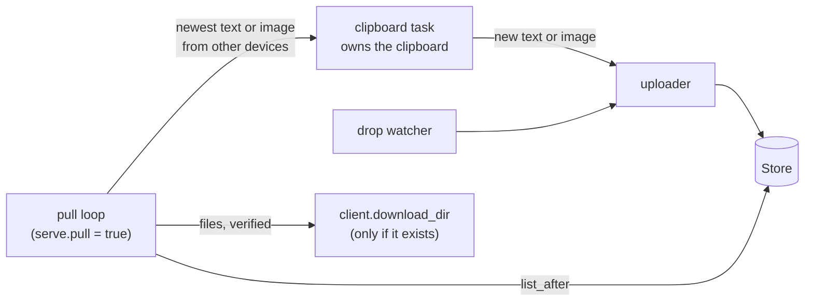

# Delivery Plan 00003: V0 1 2 Images Pull And Downloads

> [!abstract] Plan status: `approved`
> Deliver `passalong` v0.1.2: `passalong cat`, a download directory that
> `load` uses when no destination is given, interactive choice between
> ambiguous id prefixes, clipboard images, an opt-in pull mode for `serve`,
> a policy that fails CI on new duplicate dependency versions, and removal
> of the `rsa` advisory exception from default builds. Decisions D-01 to
> D-06 were confirmed as proposed, with option (a) for D-06; approved by the
> user at 2026-09-12T23:55:51Z; Builder-ready.

## 1. Objective and outcome

v0.1.1 completed the SSH-only CLI for sending and fetching. v0.1.2 makes
day-to-day sharing between devices practical:

1. `passalong cat <ID>` prints an item to standard output, so it can be
   piped or redirected.
2. `passalong load <ID>` without a destination downloads file items into a
   configured download directory, `~/Downloads` by default, instead of
   refusing them.
3. An id prefix that matches several items offers a numbered choice on a
   terminal instead of failing.
4. Clipboard images can be sent, listed, loaded back to the clipboard,
   saved, and printed; `serve` sends them too.
5. With `pull` enabled in the config, `serve` also applies items that other
   devices send: text and images to the clipboard, and files into the
   download directory when it exists.
6. `cargo deny` fails on any new duplicate dependency version; each
   accepted duplicate is recorded with its reason.
7. Default builds no longer contain the `rsa` crate, so the
   RUSTSEC-2023-0071 exception can be removed (D-06).

## 2. Source traceability

| Requirement | Source | Evidence |
|---|---|---|
| PLAN-00003-REQ-01, REQ-02 | User request item 1 (2026-09-12) | No command prints content; `load` writes files or the clipboard only |
| PLAN-00003-REQ-03, REQ-04 | User request items 2 and 3 | `crates/passalong-cli/src/commands/load.rs` refuses file items without a destination: `destination required for file items` |
| PLAN-00003-REQ-05 | User request item 4; `docs/backlog.md` Interactive disambiguation | `StoreError::Ambiguous` in `crates/passalong-core/src/store/mod.rs` |
| PLAN-00003-REQ-06 to REQ-10 | User request item 5; `docs/backlog.md` Image clipboard | `Clipboard` trait is text-only (`crates/passalong-core/src/clipboard/mod.rs`); `arboard` is built without `image-data` (`Cargo.toml`) |
| PLAN-00003-REQ-11 to REQ-13 | User request item 6; `docs/backlog.md` Pull mode for `serve` | `serve` runs only a clipboard watcher, a drop watcher, and an uploader (`crates/passalong-core/src/serve/mod.rs`) |
| PLAN-00003-REQ-14 | User request item 7; `docs/backlog.md` Duplicate dependency versions | `cargo tree -d`: `generic-array`, `getrandom`, `hashbrown` (3 versions), `sha3`, `syn` |
| PLAN-00003-REQ-15 | User request item 8; `docs/backlog.md` `rsa` advisory exception; `deny.toml` | RustSec advisory lists no patched version |
| PLAN-00003-REQ-16 | Repository: PLAN-00002 REQ-20 (desktop tests under Xvfb) | `.github/workflows/ci.yml` desktop job |
| PLAN-00003-REQ-17, REQ-18 | Repository release rules (PLAN-00001 § 5); `docs/plans/AGENTS.md` backlog rule | `CHANGELOG.md` still lists the v0.1.1 entries under `## Unreleased`, and `docs/release/v0.1.1.md` still opens with `Draft for the v0.1.1 tag` |
| PLAN-00003-REQ-19 | Repository quality rules (PLAN-00001 § 5) | `justfile` `check`, `ci` |
| PLAN-00003-REQ-20 | User road map (2026-09-12): v0.1.x is the SSH-only CLI | — |

## 3. Repository baseline

| Field | Value |
|---|---|
| Repository | `joelee/passalong` (`git@github.com:joelee/passalong.git`) |
| Branch | `main`, in sync with `origin/main` |
| HEAD | `df32a81d75b189142f37ccef77883b0ddc710974` (merge of PR #2; tag `v0.1.1`) |
| Working tree at publication | Clean before allocation; the only change is this plan file |
| Release state | v0.1.1 released 2026-09-12 with Linux and macOS binaries; `passalong`, `passalong-core`, `passalong-ssh` 0.1.1 on crates.io |
| Tooling | Rust 1.98.1, `just`, `cargo-deny`, `actionlint`; CI jobs: Linux (`just ci`), macOS (`just check`), Linux desktop (Xvfb) |

Planner research on scratch copies of HEAD (2026-09-12; the repository was
not modified):

- Enabling `arboard`'s `image-data` feature and adding `png = "0.18.1"`
  adds 18 locked crates (among them `image`, `png`, `fdeflate`, and on macOS
  `tiff` and `zune-jpeg`), one new duplicate (`miniz_oxide` 0.8.9 beside
  0.9.1), and `cargo deny check` still passes.
- Removing `russh`'s `rsa` feature removes the `rsa` crate entirely;
  `cargo check -p passalong-ssh --all-targets --all-features` passes and
  `cargo deny check advisories` passes with an empty `ignore` list.
- The v0.1.1 release records were not finalised at tagging: `CHANGELOG.md`
  has no `## v0.1.1` section, and `docs/release/v0.1.1.md` is still marked
  as a draft. Tag `v0.1.1` was created at 2026-09-12T20:00:12Z on
  `df32a81`; the GitHub release was published at 2026-09-12T20:05:05Z with
  four assets.
- v0.1.1 treats a `meta.json` it cannot parse as corrupt: `list` skips the
  item with a warning and `load` fails. A new `kind` value would therefore
  hide items from v0.1.1 clients, while a new optional field would not,
  because readers ignore unknown fields.

## 4. Scope

### In scope

- `passalong cat <ID>` (D-01).
- `client.download_dir` and file downloads by `load` without a destination
  (D-02).
- Interactive choice between ambiguous prefixes for `load`, `cat`, and
  `delete` (D-03).
- Clipboard images: item format, PNG codec, clipboard access, `clipboard`,
  `load`, `cat`, `list`, `serve`, and the Linux clipboard holder (D-04).
- `Store::list_after` and pull mode for `serve` (D-05).
- `cargo deny` duplicate-version policy (D-07).
- RSA support per D-06.
- Desktop image tests under Xvfb, documentation, and v0.1.2 release
  preparation.

### Out of scope

- GUI, Windows, Android, and any backend other than `ssh` and `local`
  (road map: v0.2.x and later).
- Encryption at rest, ssh-agent authentication, connection reuse.
- Clipboard formats other than plain text and images (HTML, RTF, file
  lists).
- Pulling items created before `serve` started.
- Log rotation for the daemon log.
- Tagging, publishing, or creating the v0.1.2 release: the user does these;
  the release workflow automates them.

## 5. Constraints and preserved decisions

- Every decision of PLAN-00001 and PLAN-00002 stays in force: ids, storage
  layout, host-key pinning, `ring` crypto, one `serve` per machine,
  foreground `serve` as the default, and the release workflow.
- The item schema stays at version 1. `meta.json` changes are additive
  optional fields only, so v0.1.1 clients keep working.
- Quality rules: TDD with a failing test first, mocks for external
  interfaces, integration tests per feature, `just check` green at every
  step, line coverage at least 80 %, rustdoc for public items, no `unsafe`,
  no `println!` for logs, secrets only in `.env`.
- Library crates (`passalong-core`, `passalong-ssh`) must not spawn
  processes; the clipboard holder stays in the CLI crate.
- Desktop clipboard tests never run on the user's machine, because they
  replace the real clipboard; they run under Xvfb in CI.
- Builder works on a branch the user creates from the approval commit, one
  commit per step, without review pauses unless blocked.
- Builder must not run `cargo publish` without `--dry-run`, push tags, or
  create releases.

## 6. Assumptions

None. Unresolved matters are recorded as decisions and block approval.

## 7. Decisions and blockers

| ID | Decision or blocker | Resolution | Owner | Status |
|---|---|---|---|---|
| D-01 | How `cat` writes content and treats binary items. | **Confirmed by user (2026-09-12):** stream the content to standard output in chunks while hashing it, and verify SHA-256 and size after the last chunk; on a mismatch exit 1 with `item <id> failed verification` (the output is already written, as with `curl`). Buffering whole items first was rejected because files can be large. Nothing is added to the output, not even a trailing newline. When standard output is a terminal and the item is not text (not a text item and not a file with a `text/*` MIME type), refuse with `item <id> is binary (<mime>); redirect the output or use --force`. | User | Resolved |
| D-02 | Download directory and `load` without a destination. | **Confirmed by user (2026-09-12):** new key `client.download_dir`, default `~/Downloads`. `load <file-id>` without `DEST` writes into it under the item's sanitised name, creating the directory and its parents if missing, and prints the path. If the name is taken it writes `<stem> (1).<ext>`, `(2)`, and so on, up to 999, instead of failing; `--force` overwrites the exact name instead. Text items without `DEST` still go to the clipboard, and clipboard images go to the clipboard (D-04). An explicit `DEST` behaves as in v0.1.1. Pull mode (D-05) uses the same naming but never creates the directory. | User | Resolved |
| D-03 | Interactive choice between ambiguous prefixes. | **Confirmed by user (2026-09-12):** when a prefix matches several items and both standard input and standard error are terminals, list up to 9 candidates newest first (number, kind, name or text preview, device, age) and ask `Choose 1-N, or press Enter to cancel:`. An invalid answer is asked again up to 3 times. Cancelling exits 1 with `cancelled` and changes nothing. With more than 9 matches, show 9 and `and N more; type more characters of the id`. Applies to `load`, `cat`, and `delete`; `delete` resolves every id, asking as needed, before deleting anything. Without a terminal the v0.1.1 error listing the candidates is unchanged. | User | Resolved |
| D-04 | Image item format and clipboard behaviour. | **Confirmed by user (2026-09-12):** store clipboard images as PNG file items: `kind = "file"`, `mime = "image/png"`, name `clipboard-YYYYMMDD-HHMMSS.png` (UTC creation time), and a new optional `meta.json` field `origin = "clipboard"`. v0.1.1 clients then see an ordinary PNG file instead of a corrupt item. `passalong clipboard` sends text when the clipboard has text, otherwise the image; `--stdin` stays text-only. `load <image-id>` without `DEST` puts the image on the clipboard (on Linux through the clipboard holder); with `DEST` it writes the PNG. `cat` prints the PNG bytes (D-01 applies). `list` shows kind `image`. `serve` sends clipboard images when `serve.clipboard_images` is true (default), reading the image only when there is no text and sending it only when its pixels change. Images above 64 megapixels are refused. PNG files sent with `passalong file` stay files. | User | Resolved |
| D-05 | Pull mode behaviour. | **Confirmed by user (2026-09-12):** `serve.pull = false` by default; `serve.pull_interval_ms`, default 5000, range 1000 to 3600000. When enabled, `serve` records the newest existing item at start-up and every interval asks the store for newer items (`Store::list_after`), ignoring items whose `device` equals this device's `client.device_name`. Of the new text and clipboard-image items, only the newest is applied to the clipboard. Each new file item, including PNG files sent with `passalong file`, is downloaded, verified, into `client.download_dir` if that directory exists; it is never created, names are never overwritten (D-02 numbering), and a missing directory is logged once and the files are skipped. Pulled content is marked as seen by the clipboard watcher, so it is never sent back. A store error leaves the position unchanged and is retried at the next interval; a failed local write is logged and skipped. With `pull = true`, `download_dir` must not be the drop folder or inside it. Without a clipboard, text and images are skipped with a warning and files are still pulled. | User | Resolved |
| D-06 | What to do about RUSTSEC-2023-0071 (`rsa`, no patched release). | **Confirmed by user (2026-09-12), option (a):** RSA support becomes an opt-in cargo feature `rsa` of `passalong-ssh`, forwarded by the `passalong` package; default builds, release binaries, and plain `cargo install passalong` contain no `rsa` crate, and the advisory exception is removed. In a default build an RSA identity file or an `ssh-rsa` pinned host key fails with `RSA keys need passalong built with the rsa feature (cargo install passalong --features rsa); Ed25519 keys work in every build`. **Alternatives:** (b) keep RSA on by default and keep the documented exception; (c) remove RSA support completely. Option (a) is a breaking change for anyone logging in with an RSA key, so the release notes carry an upgrade note. | User | Resolved |
| D-07 | Duplicate dependency policy. | **Resolved by planner:** every current duplicate comes from upstream crates (`russh`, `ring`, `russh-sftp`'s `dashmap`, `arboard`'s `wl-clipboard-rs`, `async-trait` and `clap_derive` on `syn` 3), and image support adds `miniz_oxide` 0.8 beside 0.9. Update what semver-compatible updates allow; then set `bans.multiple-versions = "deny"` and list each remaining duplicate as a `skip` entry with `crate@version` and a reason naming the dependency path. No forks or `[patch]` overrides. | Planner | Resolved |
| D-08 | Version and branch. | **Resolved by planner:** release as v0.1.2 (the user's request), with all crates and internal `=` requirements at `0.1.2`. Suggested branch name: `feature/00003-v0.1.2-Images_Pull_Downloads`. | Planner | Resolved |

Blocking decisions: 0. The user confirmed D-01 to D-06 as proposed on
2026-09-12, with option (a) for D-06; the plan body already reflects them.

## 8. Affected architecture and components

| Area | Paths | Change |
|---|---|---|
| Config | `crates/passalong-core/src/config.rs`, `config.sample.toml` | `client.download_dir`, `serve.clipboard_images`, `serve.pull`, `serve.pull_interval_ms` |
| Model | `crates/passalong-core/src/model.rs` | Optional `origin` field; clipboard-image constructor and helpers |
| Clipboard | `crates/passalong-core/src/clipboard/{mod,desktop,image}.rs` (`image.rs` new), `crates/passalong-core/src/testing.rs` | Image read and write; PNG codec; mock images |
| Store | `crates/passalong-core/src/store/{mod,fs_store}.rs` | `Store::list_after` |
| Downloads | `crates/passalong-core/src/download.rs` (new) | Verified writing and download naming shared by `load` and pull |
| Serve | `crates/passalong-core/src/serve/{mod,clipboard_watcher,upload,pull}.rs` (`pull.rs` new) | Clipboard images; pull loop; clipboard writes through the clipboard task |
| SSH | `crates/passalong-ssh/Cargo.toml`, `src/{connect,host_key,error}.rs` | `rsa` feature and the RSA-unsupported error |
| CLI | `crates/passalong-cli/src/{cli,app,output,clipboard_holder}.rs`, `src/resolve.rs` (new), `src/commands/{cat,load,clipboard,delete}.rs` (`cat.rs` new) | New command, downloads, choice prompt, images |
| Tooling | `Cargo.toml`, `Cargo.lock`, `deny.toml`, `justfile`, `.github/workflows/ci.yml` | Features, image dependencies, duplicate policy, CI steps |
| Docs | `README.md`, `docs/{usage,configuration,architecture,developer-guide,backlog}.md`, `docs/release/v0.1.2.md` (new), `CHANGELOG.md` | Updated |

New public interfaces:

```rust
// passalong-core::clipboard
pub struct RgbaImage { pub width: u32, pub height: u32, pub rgba: Vec<u8> }
pub fn encode_png(image: &RgbaImage) -> Result<Vec<u8>, ImageError>;
pub fn decode_png(png: &[u8]) -> Result<RgbaImage, ImageError>;

pub trait Clipboard: Send {
    // existing: read_text, write_text
    /// Default: `Ok(None)`, for clipboards without image support.
    fn read_image(&mut self) -> Result<Option<RgbaImage>, ClipboardError>;
    /// Default: `Err(ClipboardError::Unavailable(..))`.
    fn write_image(&mut self, image: &RgbaImage) -> Result<(), ClipboardError>;
}

// passalong-core::store::Store
/// Items newer than `after` (all items for `None`), newest first. Reads
/// `meta.json` only for those items.
async fn list_after(&self, after: Option<&ItemId>) -> Result<Vec<ItemMeta>, StoreError>;
```



## 9. Requirement catalogue

### PLAN-00003-REQ-01 — `passalong cat`

- **Requirement:** `passalong cat <ID>` writes the item's content to
  standard output exactly as stored, streaming and verifying it per D-01;
  id resolution matches `load`, including REQ-05.
- **Rationale:** Piping and redirecting items without temporary files.
- **Source:** User request item 1.
- **Acceptance evidence:** AC-01, AC-02.

### PLAN-00003-REQ-02 — `cat` on a terminal

- **Requirement:** With standard output on a terminal, `cat` refuses
  non-text items unless `--force` is given (D-01).
- **Rationale:** Binary data written to a terminal can garble it.
- **Source:** User request item 1; D-01.
- **Acceptance evidence:** AC-03.

### PLAN-00003-REQ-03 — Download directory setting

- **Requirement:** `client.download_dir`, a path defaulting to
  `~/Downloads`, with `~` expanded and an absolute path required after
  expansion; an invalid value is a configuration error naming the key.
- **Rationale:** User request item 2.
- **Source:** User request item 2.
- **Acceptance evidence:** AC-04.

### PLAN-00003-REQ-04 — `load` downloads files

- **Requirement:** `load <file-id>` without `DEST` downloads into
  `client.download_dir` per D-02, with verification before the file appears.
- **Rationale:** Removes the v0.1.1 refusal `destination required for file
  items`.
- **Source:** User request item 3; `commands/load.rs`.
- **Acceptance evidence:** AC-05.

### PLAN-00003-REQ-05 — Interactive disambiguation

- **Requirement:** Ambiguous prefixes offer a choice on a terminal in
  `load`, `cat`, and `delete` per D-03; without a terminal the existing
  error is unchanged.
- **Rationale:** Backlog item; short prefixes collide as stores grow.
- **Source:** User request item 4; `docs/backlog.md`.
- **Acceptance evidence:** AC-06.

### PLAN-00003-REQ-06 — Image items

- **Requirement:** Clipboard images are stored per D-04 with the optional
  `origin` field; schema version stays 1; `list` shows kind `image`;
  `list --json` includes `origin`; v0.1.1 `meta.json` files still parse.
- **Rationale:** Backward compatibility with v0.1.1 clients (§ 3 research).
- **Source:** User request item 5; D-04.
- **Acceptance evidence:** AC-08.

### PLAN-00003-REQ-07 — Image codec and clipboard access

- **Requirement:** `RgbaImage`, `encode_png`, and `decode_png` in
  `passalong-core` using the `png` crate, refusing images above 64
  megapixels and malformed data; `Clipboard::read_image` and
  `Clipboard::write_image` with default implementations; `ArboardClipboard`
  implements both through `arboard`'s `image-data` feature, including a
  holding variant for Linux; `MockClipboard` supports images.
- **Rationale:** Images need a portable storage format; arboard exchanges
  raw RGBA pixels.
- **Source:** User request item 5; `arboard` 3.6.1 features.
- **Acceptance evidence:** AC-07, AC-18.

### PLAN-00003-REQ-08 — `clipboard` sends images

- **Requirement:** `passalong clipboard` sends text when present, otherwise
  the clipboard image as a PNG image item; with neither it exits 1 with
  `clipboard is empty`.
- **Rationale:** User request item 5.
- **Source:** D-04.
- **Acceptance evidence:** AC-09.

### PLAN-00003-REQ-09 — Loading and printing images

- **Requirement:** `load <image-id>` without `DEST` puts the image on the
  clipboard, through the clipboard holder on Linux; with `DEST` it writes the
  PNG; `cat` prints the PNG bytes.
- **Rationale:** User request item 5.
- **Source:** D-04; PLAN-00002 REQ-19 (Linux clipboard holder).
- **Acceptance evidence:** AC-10, AC-18.

### PLAN-00003-REQ-10 — `serve` sends clipboard images

- **Requirement:** With `serve.clipboard_images = true` (default), the
  clipboard watcher reads the image only when there is no text, and queues
  it only when its pixel hash changes; identical content already stored is
  not uploaded again.
- **Rationale:** Automatic sending for images, as for text.
- **Source:** D-04.
- **Acceptance evidence:** AC-11.

### PLAN-00003-REQ-11 — Incremental listing

- **Requirement:** `Store::list_after`, implemented by `FsStore` for local
  and SFTP storage, reading `meta.json` only for items newer than the given
  id and skipping corrupt items as `list` does.
- **Rationale:** Pull mode polls every few seconds; reading every
  `meta.json` over SSH each time would not scale.
- **Source:** D-05.
- **Acceptance evidence:** AC-12.

### PLAN-00003-REQ-12 — Pull settings

- **Requirement:** `serve.pull` (default `false`) and `serve.pull_interval_ms`
  (default 5000, 1000 to 3600000); with `pull = true`, `client.download_dir`
  must not be `serve.drop_folder` or inside it.
- **Rationale:** User request item 6: disabled by default, enabled in the
  config; the drop-folder rule prevents a pulled file from being sent back.
- **Source:** User request item 6.
- **Acceptance evidence:** AC-04, AC-13.

### PLAN-00003-REQ-13 — Pull behaviour

- **Requirement:** When enabled, `serve` applies items from other devices
  per D-05: the newest text or image to the clipboard, and files into an
  existing download directory.
- **Rationale:** Backlog item: two-way sync.
- **Source:** User request item 6; D-05.
- **Acceptance evidence:** AC-14, AC-15, AC-19.

### PLAN-00003-REQ-14 — Duplicate dependency policy

- **Requirement:** Per D-07: semver-compatible updates, then
  `multiple-versions = "deny"` with a reasoned `skip` entry per remaining
  duplicate; the developer guide explains how to handle a new duplicate.
- **Rationale:** Backlog item; new duplicates should be a decision, not an
  accident.
- **Source:** User request item 7; `deny.toml`.
- **Acceptance evidence:** AC-17.

### PLAN-00003-REQ-15 — RSA and RUSTSEC-2023-0071

- **Requirement:** Per D-06. For the proposed option (a): feature `rsa` on
  `passalong-ssh` and `passalong`, off by default; the RSA-unsupported error
  in default builds; the advisory exception removed; `just audit` checks
  the default feature set; `just check` also tests `passalong-ssh` without
  the feature; the Docker tests cover an RSA login with the feature.
- **Rationale:** The advisory has no patched release; the backlog item
  proposes dropping RSA identity support.
- **Source:** User request item 8; RustSec RUSTSEC-2023-0071.
- **Acceptance evidence:** AC-16.

### PLAN-00003-REQ-16 — Desktop image tests in CI

- **Requirement:** Ignored `desktop_` tests for an image round trip through
  `ArboardClipboard` and, on Linux, an image loaded by `load` surviving the
  command's exit; the existing Xvfb job runs them.
- **Rationale:** Clipboard behaviour cannot be proven with mocks alone.
- **Source:** PLAN-00002 REQ-20.
- **Acceptance evidence:** AC-18.

### PLAN-00003-REQ-17 — Documentation

- **Requirement:** `README.md`; `docs/usage.md` (`cat`, downloads, the
  choice prompt, images, pull mode); `docs/configuration.md` (new keys);
  `docs/architecture.md` (image items, `list_after`, pull loop, clipboard
  task); `docs/developer-guide.md` (the `rsa` feature, the duplicate
  policy); `docs/backlog.md` (remove delivered items); all passing the
  documentation consistency script.
- **Rationale:** Documentation rules.
- **Source:** Repository.
- **Acceptance evidence:** AC-20.

### PLAN-00003-REQ-18 — v0.1.2 release preparation

- **Requirement:** First finalise the v0.1.1 records: move the v0.1.1
  entries from `## Unreleased` to `## v0.1.1 - 2026-09-12T20:00:12Z`, and
  turn `docs/release/v0.1.1.md` from a draft into the release record (tag
  commit `df32a81`, publication time, release link, assets). Then: all
  crates at `0.1.2`, internal requirements `=0.1.2`; a fresh
  `CHANGELOG.md` `Unreleased` lists the v0.1.2 changes; `docs/release/v0.1.2.md`
  with summary, changes, tests, coverage, configuration (new keys), and
  upgrade notes (the RSA feature under D-06 (a); images appear as PNG files
  to v0.1.1 clients; pull mode is opt-in).
- **Rationale:** The user tags v0.1.2 after this plan.
- **Source:** User; release rules.
- **Acceptance evidence:** AC-20.

### PLAN-00003-REQ-19 — Quality gates

- **Requirement:** TDD evidence per step; `just check` green at every step;
  `just ci` green locally; GitHub CI green on Linux, macOS, and Xvfb for the
  final commit; line coverage at least 80 %.
- **Rationale:** Repository quality rules.
- **Source:** PLAN-00001 § 5.
- **Acceptance evidence:** AC-21.

### PLAN-00003-REQ-20 — Road map guard

- **Requirement:** No GUI, Windows, Android, or new backend code;
  `BackendRegistry` kinds remain `local` and `ssh`.
- **Rationale:** v0.1.x is the SSH-only CLI.
- **Source:** User road map.
- **Acceptance evidence:** AC-22.

## 10. Delivery strategy

1. **RSA first (STEP-01).** It changes the dependency graph and `deny.toml`
   before new dependencies arrive.
2. **Settings (STEP-02).** All new keys at once, so later steps only read
   them.
3. **Retrieval (STEP-03 to STEP-05).** `cat`, downloads, then the choice
   prompt used by `load`, `cat`, and `delete`.
4. **Images (STEP-06 to STEP-08).** Model, codec, and trait; then the CLI;
   then `serve`.
5. **Pull (STEP-09, STEP-10).** Incremental listing, then the pull loop,
   which reuses the download and image code.
6. **Dependency policy (STEP-11).** After the image dependencies land, so
   the skip list is final.
7. **CI (STEP-12).** Push the branch and prove the desktop image tests
   under Xvfb.
8. **Docs, release preparation, final gate (STEP-13, STEP-14).**

Each step ends with `just check` green and one commit. Docker-backed tests
run at STEP-01, STEP-09, STEP-10, and STEP-14.

## 11. Detailed implementation steps

### PLAN-00003-STEP-01 — RSA support per D-06

- **Status placeholder:** `not-started`
- **Objective:** Implement REQ-15.
- **Requirements:** `PLAN-00003-REQ-15`
- **Depends on:** None
- **Affected components:** `Cargo.toml` (`russh` features),
  `crates/passalong-ssh/Cargo.toml` (`[features] rsa = ["russh/rsa"]`),
  `crates/passalong-cli/Cargo.toml` (`rsa = ["passalong-ssh/rsa"]`),
  `crates/passalong-ssh/src/{connect,host_key,error}.rs`, `deny.toml`,
  `justfile`, `.github/workflows/ci.yml`
- **Preconditions:** Plan approved; branch created from the approval commit.
- **Test or evidence first:** Without the feature: an `ssh-rsa` pinned host
  key and an RSA identity file generated at test time with
  `ssh-keygen -t rsa -N ''` both fail with the RSA-unsupported error; the
  test fails before the error exists. With the feature: a Docker test logs
  in with an RSA key.
- **Implementation tasks:**
  1. Move `rsa` from the workspace `russh` features to the new crate
     features.
  2. Add `SshError::RsaUnsupported` and map RSA keys to it in builds without
     the feature, before any connection is attempted.
  3. Remove the `ignore` entry from `deny.toml` and make `cargo deny` check
     the default feature set.
  4. `just check` runs the `passalong-ssh` tests once without `rsa`, besides
     the all-features runs; `just test-integration` includes the RSA login
     test under the feature.
- **Documentation/configuration/operations:** Developer guide: the feature
  and how to build with it; configuration docs: `host_key` note.
- **Verification:** `cargo tree -p passalong -i rsa` reports no package;
  `just audit`; `just check`; `just test-integration`.
- **Completion criteria:** AC-16.
- **Rollback or recovery:** Revert the commit.
- **Builder stop conditions:** D-06 resolves to (b) or (c) differently from
  this draft's amendment; an ed25519 login fails without the feature.

### PLAN-00003-STEP-02 — New settings

- **Status placeholder:** `not-started`
- **Objective:** Implement the settings of REQ-03, REQ-10, and REQ-12.
- **Requirements:** `PLAN-00003-REQ-03`, `PLAN-00003-REQ-12`
- **Depends on:** `PLAN-00003-STEP-01`
- **Affected components:** `crates/passalong-core/src/config.rs`,
  `config.sample.toml`, `docs/configuration.md`
- **Preconditions:** None.
- **Test or evidence first:** Config unit tests for defaults, `~`
  expansion, the `pull_interval_ms` range, a relative `download_dir`, and a
  `download_dir` inside `drop_folder` with `pull = true`, each error naming
  its key.
- **Implementation tasks:**
  1. `ClientConfig::download_dir`; `ServeConfig::{clipboard_images, pull,
     pull_interval_ms}` with validation.
  2. Keep unknown-key rejection; `init` output unchanged (defaults apply).
- **Documentation/configuration/operations:** Configuration reference and
  sample file.
- **Verification:** `cargo test -p passalong-core config`; consistency
  script; `just check`.
- **Completion criteria:** AC-04.
- **Rollback or recovery:** Revert.
- **Builder stop conditions:** None expected.

### PLAN-00003-STEP-03 — `passalong cat`

- **Status placeholder:** `not-started`
- **Objective:** Implement REQ-01 and REQ-02.
- **Requirements:** `PLAN-00003-REQ-01`, `PLAN-00003-REQ-02`
- **Depends on:** `PLAN-00003-STEP-02`
- **Affected components:** `crates/passalong-cli/src/cli.rs`
  (`Command::Cat { id, force }`), `src/commands/cat.rs` (new), `src/app.rs`
- **Preconditions:** None.
- **Test or evidence first:** Unit tests with the test store: text and file
  output, a corrupted item failing after output, terminal refusal and
  `--force` (terminal state injected); binary test piping a file item.
- **Implementation tasks:**
  1. Stream with `ContentHasher`, flush, then verify.
  2. Detect a terminal with `std::io::IsTerminal` in `app.rs` and pass it in.
- **Documentation/configuration/operations:** `docs/usage.md` section.
- **Verification:** `cargo test -p passalong cat`; `just check`.
- **Completion criteria:** AC-01, AC-02, AC-03.
- **Rollback or recovery:** Revert.
- **Builder stop conditions:** None expected.

### PLAN-00003-STEP-04 — Downloads for `load`

- **Status placeholder:** `not-started`
- **Objective:** Implement REQ-04.
- **Requirements:** `PLAN-00003-REQ-04`
- **Depends on:** `PLAN-00003-STEP-03`
- **Affected components:** `crates/passalong-core/src/download.rs` (new:
  verified writing moved from `commands/load.rs`, plus download naming),
  `crates/passalong-cli/src/commands/load.rs`
- **Preconditions:** None.
- **Test or evidence first:** Unit tests for naming (`report.pdf` →
  `report (1).pdf`; no extension; a dot file such as `.bashrc` →
  `.bashrc (1)`; the limit of 999), directory creation, `--force`, and the
  unchanged explicit-`DEST` behaviour; a binary test with the sandbox home.
- **Implementation tasks:**
  1. Move `write_verified` and friends to `passalong_core::download` so pull
     mode can reuse them; `load` keeps its behaviour for explicit `DEST`.
  2. Without `DEST`, file items go to the download directory per D-02.
- **Documentation/configuration/operations:** `docs/usage.md` `load` table.
- **Verification:** `cargo test -p passalong load`; `cargo test -p
  passalong-core download`; `just check`.
- **Completion criteria:** AC-05.
- **Rollback or recovery:** Revert.
- **Builder stop conditions:** None expected.

### PLAN-00003-STEP-05 — Interactive disambiguation

- **Status placeholder:** `not-started`
- **Objective:** Implement REQ-05.
- **Requirements:** `PLAN-00003-REQ-05`
- **Depends on:** `PLAN-00003-STEP-04`
- **Affected components:** `crates/passalong-cli/src/resolve.rs` (new),
  `src/prompt.rs`, `src/commands/{load,cat,delete}.rs`, `src/app.rs`
- **Preconditions:** None.
- **Test or evidence first:** `ScriptedPrompt` tests: choosing, cancelling,
  three invalid answers, more than 9 matches, non-interactive fallback, and
  `delete` resolving all ids before deleting.
- **Implementation tasks:**
  1. `resolve_item(store, input, prompt, err)`: `Store::resolve`, and on
     `Ambiguous` with an interactive prompt, fetch the candidates' metadata
     once and ask.
  2. `Prompt::is_interactive` covers standard input and standard error.
- **Documentation/configuration/operations:** `docs/usage.md`.
- **Verification:** `cargo test -p passalong resolve`; `just check`.
- **Completion criteria:** AC-06.
- **Rollback or recovery:** Revert.
- **Builder stop conditions:** None expected.

### PLAN-00003-STEP-06 — Image items, PNG codec, clipboard image access

- **Status placeholder:** `not-started`
- **Objective:** Implement REQ-06 (model) and REQ-07.
- **Requirements:** `PLAN-00003-REQ-06`, `PLAN-00003-REQ-07`
- **Depends on:** `PLAN-00003-STEP-05`
- **Affected components:** `Cargo.toml` (`png`, `arboard` `image-data`),
  `crates/passalong-core/src/{model.rs,clipboard/mod.rs,clipboard/image.rs,clipboard/desktop.rs,testing.rs}`
- **Preconditions:** None.
- **Test or evidence first:** Codec round trip, the 64-megapixel limit, and
  malformed PNG; `meta.json` tests: a v0.1.1 fixture parses with no origin,
  an image item serialises `kind = "file"`, `mime = "image/png"`,
  `origin = "clipboard"`, and a copy of the v0.1.1 struct parses it; mock
  image reads and writes; desktop test `desktop_image_round_trip` (ignored).
- **Implementation tasks:**
  1. `ItemOrigin`, `ItemMeta::origin` (skipped when absent),
     `NewItem::clipboard_image`, `ItemMeta::is_clipboard_image`.
  2. `RgbaImage`, `encode_png`, `decode_png`, `ImageError`.
  3. Trait methods with defaults; `ArboardClipboard::{read_image,
     write_image, hold_image}`; mock support.
- **Documentation/configuration/operations:** Architecture: item schema.
- **Verification:** `cargo test -p passalong-core`; `just audit` (new
  licences); `just check`.
- **Completion criteria:** AC-07, AC-08 (model part).
- **Rollback or recovery:** Revert.
- **Builder stop conditions:** A new dependency licence is not on the
  allow-list; arboard cannot read images on the Xvfb clipboard.

### PLAN-00003-STEP-07 — Images in `clipboard`, `load`, `cat`, and `list`

- **Status placeholder:** `not-started`
- **Objective:** Implement REQ-08, REQ-09, and the `list` part of REQ-06.
- **Requirements:** `PLAN-00003-REQ-06`, `PLAN-00003-REQ-08`, `PLAN-00003-REQ-09`
- **Depends on:** `PLAN-00003-STEP-06`
- **Affected components:** `crates/passalong-cli/src/commands/{clipboard,load,cat,list}.rs`,
  `src/output.rs`, `src/clipboard_holder.rs`, `src/app.rs`
- **Preconditions:** None.
- **Test or evidence first:** Mock tests for sending images and text
  priority; loading an image to the mock clipboard and to a directory;
  `cat` of an image; `list` kind column and JSON; holder launcher records
  the PNG payload; Linux desktop test
  `desktop_loaded_image_survives_load_exiting` (ignored).
- **Implementation tasks:**
  1. `clipboard` falls back to the image.
  2. `load` routes clipboard images to the clipboard; the holder accepts
     `__hold-clipboard --image` with PNG on standard input.
  3. `list` shows `image`; JSON adds `origin`.
- **Documentation/configuration/operations:** `docs/usage.md` clipboard
  support.
- **Verification:** `cargo test -p passalong`; `just check`.
- **Completion criteria:** AC-08 (list part), AC-09, AC-10.
- **Rollback or recovery:** Revert.
- **Builder stop conditions:** None expected.

### PLAN-00003-STEP-08 — `serve` sends clipboard images

- **Status placeholder:** `not-started`
- **Objective:** Implement REQ-10.
- **Requirements:** `PLAN-00003-REQ-10`
- **Depends on:** `PLAN-00003-STEP-07`
- **Affected components:** `crates/passalong-core/src/serve/{mod,clipboard_watcher,upload}.rs`
- **Preconditions:** None.
- **Test or evidence first:** Scripted mock clipboard: a new image is sent
  once, an unchanged image is not re-sent, `clipboard_images = false` sends
  nothing, and text still wins.
- **Implementation tasks:**
  1. The watcher hashes the RGBA pixels and queues `Job::Image`.
  2. The uploader encodes PNG and checks the content key before uploading.
  3. Clipboard reads and writes run off the async runtime
     (`spawn_blocking`).
- **Documentation/configuration/operations:** Architecture: `serve`.
- **Verification:** `cargo test -p passalong-core serve`; `just check`.
- **Completion criteria:** AC-11.
- **Rollback or recovery:** Revert.
- **Builder stop conditions:** None expected.

### PLAN-00003-STEP-09 — `Store::list_after`

- **Status placeholder:** `not-started`
- **Objective:** Implement REQ-11.
- **Requirements:** `PLAN-00003-REQ-11`
- **Depends on:** `PLAN-00003-STEP-08`
- **Affected components:** `crates/passalong-core/src/store/{mod,fs_store}.rs`,
  test stores in `crates/passalong-cli/src/commands/support.rs` and the
  `serve` tests, `crates/passalong-ssh/tests/sftp_docker.rs`
- **Preconditions:** None.
- **Test or evidence first:** Unit tests with a counting filesystem showing
  only newer `meta.json` files are read; SFTP Docker test.
- **Implementation tasks:**
  1. Trait method and `FsStore` implementation sharing `list`'s handling of
     corrupt items.
  2. Delegate in every test store.
- **Documentation/configuration/operations:** Architecture: storage.
- **Verification:** `cargo test -p passalong-core store`;
  `just test-integration`; `just check`.
- **Completion criteria:** AC-12.
- **Rollback or recovery:** Revert.
- **Builder stop conditions:** None expected.

### PLAN-00003-STEP-10 — Pull mode

- **Status placeholder:** `not-started`
- **Objective:** Implement REQ-13.
- **Requirements:** `PLAN-00003-REQ-12`, `PLAN-00003-REQ-13`
- **Depends on:** `PLAN-00003-STEP-09`
- **Affected components:** `crates/passalong-core/src/serve/{mod,pull,clipboard_watcher}.rs`
  (`pull.rs` new), `crates/passalong-core/src/download.rs`,
  `crates/passalong-core/tests/serve_local.rs`,
  `crates/passalong-cli/tests/cli_local_backend.rs`
- **Preconditions:** None.
- **Test or evidence first:** With a `ManualClock`, a mock clipboard, and
  the local backend: disabled by default; a text from another device is
  applied; own-device and pre-start items are ignored; only the newest of
  two texts is applied; a file lands in an existing download directory
  without overwriting; a missing directory skips the file and creates
  nothing; pulled text is not sent back; a store error does not advance the
  position.
- **Implementation tasks:**
  1. The clipboard task owns the clipboard and accepts write requests over
     a channel, marking written content as seen.
  2. The pull loop per D-05, using `list_after` and
     `passalong_core::download`.
  3. A binary test runs `serve --daemon` with `pull = true` and receives a
     file sent through a second config with another device name.
- **Documentation/configuration/operations:** `docs/usage.md` pull mode;
  architecture: pull loop.
- **Verification:** `cargo test -p passalong-core --test serve_local`;
  `cargo test -p passalong --test cli_local_backend`;
  `just test-integration`; `just check`.
- **Completion criteria:** AC-13, AC-14, AC-15, AC-19.
- **Rollback or recovery:** Revert.
- **Builder stop conditions:** Clipboard writes from `serve` do not persist
  on Linux under Xvfb.

### PLAN-00003-STEP-11 — Duplicate dependency policy

- **Status placeholder:** `not-started`
- **Objective:** Implement REQ-14.
- **Requirements:** `PLAN-00003-REQ-14`
- **Depends on:** `PLAN-00003-STEP-10`
- **Affected components:** `Cargo.lock`, `deny.toml`,
  `docs/developer-guide.md`
- **Preconditions:** None.
- **Test or evidence first:** With `multiple-versions = "deny"` and no skip
  list, `just audit` fails and lists every duplicate (red evidence).
- **Implementation tasks:**
  1. `cargo update` within existing requirements; review the lock diff.
  2. One `skip` entry per remaining duplicate with `crate@version` and the
     dependency path as its reason.
- **Documentation/configuration/operations:** Developer guide: handling a
  new duplicate.
- **Verification:** `just audit`; `just check`; `just publish-dry-run`.
- **Completion criteria:** AC-17.
- **Rollback or recovery:** Revert; `multiple-versions = "warn"` restores
  v0.1.1 behaviour.
- **Builder stop conditions:** An update changes behaviour or breaks the
  build.

### PLAN-00003-STEP-12 — CI proof for desktop images

- **Status placeholder:** `not-started`
- **Objective:** Implement REQ-16.
- **Requirements:** `PLAN-00003-REQ-16`
- **Depends on:** `PLAN-00003-STEP-11`
- **Affected components:** `.github/workflows/ci.yml` (only if the desktop
  job needs changes)
- **Preconditions:** Branch pushed.
- **Test or evidence first:** The desktop tests from STEP-06 and STEP-07.
- **Implementation tasks:**
  1. Push the branch; confirm the Xvfb job runs and passes every `desktop_`
     test, including the image tests.
  2. Fix failures found in CI.
- **Documentation/configuration/operations:** None.
- **Verification:** GitHub CI run on the branch; `actionlint`.
- **Completion criteria:** AC-18.
- **Rollback or recovery:** Revert workflow changes.
- **Builder stop conditions:** Xvfb cannot provide image clipboard support.

### PLAN-00003-STEP-13 — Documentation and v0.1.2 release preparation

- **Status placeholder:** `not-started`
- **Objective:** Implement REQ-17 and REQ-18.
- **Requirements:** `PLAN-00003-REQ-17`, `PLAN-00003-REQ-18`
- **Depends on:** `PLAN-00003-STEP-12`
- **Affected components:** docs, `README.md`, `CHANGELOG.md`,
  `docs/release/v0.1.1.md`, `docs/release/v0.1.2.md`, all `Cargo.toml` versions, `Cargo.lock`, tests
  that pin the version string
- **Preconditions:** None.
- **Test or evidence first:** Documentation step; evidence is the
  consistency script and `passalong --version`.
- **Implementation tasks:** Finalise the v0.1.1 records (REQ-18); update
  docs; remove the delivered backlog items (interactive disambiguation,
  image clipboard, pull mode, duplicate dependency versions, `rsa` advisory
  exception); bump versions; draft the v0.1.2 release notes.
- **Documentation/configuration/operations:** This step.
- **Verification:** Consistency script; `just check`; `just publish-dry-run`.
- **Completion criteria:** AC-20.
- **Rollback or recovery:** Revert.
- **Builder stop conditions:** Documented behaviour disagrees with code.

### PLAN-00003-STEP-14 — Final quality gate

- **Status placeholder:** `not-started`
- **Objective:** Prove the plan.
- **Requirements:** `PLAN-00003-REQ-19`, `PLAN-00003-REQ-20`
- **Depends on:** `PLAN-00003-STEP-13`
- **Affected components:** None new.
- **Test or evidence first:** Verification-only step.
- **Implementation tasks:** Run `just ci`; push and record the GitHub CI
  result for Linux, macOS, and Xvfb; review the diff for road-map scope;
  record coverage.
- **Documentation/configuration/operations:** None.
- **Verification:** `just ci`; GitHub CI; `git diff --stat` scope review.
- **Completion criteria:** AC-21, AC-22.
- **Rollback or recovery:** Not applicable.
- **Builder stop conditions:** Any gate fails in a way that needs scope or
  threshold changes.

## 12. Cross-cutting concerns

| Area | Applicability | Planned action or reason not applicable | Step or requirement |
|---|---|---|---|
| Compatibility and APIs | Applicable | Schema stays 1; `origin` is optional, so v0.1.1 clients see images as PNG files; new trait methods have defaults or are implemented by every store; under D-06 (a) RSA users need the `rsa` feature | REQ-06, REQ-11, REQ-15 |
| Data and migration | Applicable | No layout change; existing items keep working; no migration | REQ-06 |
| Security and privacy | Applicable | Pull writes only into an existing download directory, never overwrites, sanitises names, and verifies SHA-256 first; the choice prompt shows previews only on the local terminal; removing `rsa` removes the advisory from default builds | REQ-04, REQ-13, REQ-15 |
| Performance and scale | Applicable | `list_after` reads only new metadata; images are read only when there is no text and hashed to detect change; a 64-megapixel limit bounds memory | REQ-07, REQ-10, REQ-11 |
| Reliability and failure handling | Applicable | Pull retries store errors without skipping items; clipboard writes run off the async runtime; loops are prevented by the seen-content mark and the drop-folder rule | REQ-12, REQ-13 |
| Observability and operations | Applicable | Pull logs each applied or skipped item with its id; a missing download directory is logged once | REQ-13 |
| Dependencies and supply chain | Applicable | `png` and `arboard` `image-data` add 18 locked crates with allowed licences; duplicates become a reviewed list | REQ-07, REQ-14 |
| Accessibility and UX | Applicable | Choice prompt instead of an error; clear refusal for binary output; download naming like a browser | REQ-02, REQ-04, REQ-05 |
| Documentation and release | Applicable | Usage, configuration, architecture, developer guide, release notes with upgrade notes | REQ-17, REQ-18 |
| Deployment and rollback | Applicable | Released through the existing tag workflow; pull is off by default, so upgrading changes nothing until it is enabled | REQ-12, REQ-18 |

## 13. Verification strategy

| Level | Evidence or command | When | Required result |
|---|---|---|---|
| Unit | `cargo test -p <crate> <module>` | Every step, red then green | Pass |
| Workspace gate | `just check` | Every step | Exit 0 |
| SSH integration | `just test-integration` | STEP-01, 09, 10, 14 | Exit 0 |
| Supply chain | `just audit` | STEP-01, 06, 11, 14 | Exit 0 |
| Packaging | `just publish-dry-run` | STEP-11, 13, 14 | Exit 0 |
| Desktop | desktop tests under `xvfb-run` in CI | STEP-12, 14 | Pass |
| Coverage | `cargo llvm-cov … --fail-under-lines 80` | Every step via `just check` | At least 80 % |
| Docs | consistency script | STEP-02, 13 | No gaps |
| Full | `just ci` locally and GitHub CI | STEP-14 | Pass on Linux, macOS, and Xvfb |

## 14. Acceptance criteria

- [ ] `PLAN-00003-AC-01` `cat` of a text item prints exactly the stored text with nothing added; `cat` of a file item redirected to a file produces bytes whose SHA-256 equals the item's; both exit 0.
- [ ] `PLAN-00003-AC-02` `cat` of an item whose content fails verification exits 1 with `item <id> failed verification`.
- [ ] `PLAN-00003-AC-03` With standard output on a terminal, `cat` refuses a non-text item without `--force` and prints it with `--force`; text items print without `--force`.
- [ ] `PLAN-00003-AC-04` Defaults are `download_dir` = `$HOME/Downloads`, `clipboard_images` = true, `pull` = false, `pull_interval_ms` = 5000; `~` is expanded; `pull_interval_ms = 10`, a relative `download_dir`, and `pull = true` with `download_dir` inside `drop_folder` are each rejected with an error naming the key.
- [ ] `PLAN-00003-AC-05` `load <file-id>` without `DEST` writes `<download_dir>/<name>`, creating the directory; loading it again writes `<stem> (1).<ext>`; `--force` overwrites `<name>`; the printed path is the file written.
- [ ] `PLAN-00003-AC-06` With an ambiguous prefix on a terminal, answering `2` loads the second-newest candidate; an empty answer exits 1 with `cancelled` and writes nothing; without a terminal the command exits 1 with the ambiguity error listing the candidates; `delete` with one ambiguous id deletes nothing before the answer.
- [ ] `PLAN-00003-AC-07` The PNG codec round-trips an RGBA image byte for byte; images above 64 megapixels and malformed PNG data are refused with errors.
- [ ] `PLAN-00003-AC-08` An image item's `meta.json` has `"kind": "file"`, `"mime": "image/png"`, `"origin": "clipboard"`, and schema 1; a v0.1.1 `meta.json` without `origin` parses; `list` shows `image` in the kind column and `list --json` includes `origin`.
- [ ] `PLAN-00003-AC-09` `clipboard` with only an image on the mock clipboard stores an image item; with text and an image it stores the text; with neither it exits 1 with `clipboard is empty`.
- [ ] `PLAN-00003-AC-10` `load <image-id>` without `DEST` puts the decoded image on the mock clipboard; with a directory `DEST` it writes the PNG under the item's name, byte-identical to the stored content; `cat <image-id>` output is byte-identical too.
- [ ] `PLAN-00003-AC-11` `serve` with a scripted clipboard image sends it once, does not resend it while unchanged, sends nothing with `clipboard_images = false`, and still prefers text.
- [ ] `PLAN-00003-AC-12` `list_after(Some(id))` returns only newer items, newest first, reading only their `meta.json`; `list_after(None)` equals `list()`; the SFTP Docker test passes.
- [ ] `PLAN-00003-AC-13` With the default config, `serve` never writes to the clipboard or the download directory for items sent by another device.
- [ ] `PLAN-00003-AC-14` With `pull = true`, a text item sent by another device after start-up is on the clipboard within one interval; items from this device and items created before start-up are ignored; of two texts arriving within one interval only the newer is applied.
- [ ] `PLAN-00003-AC-15` With `pull = true`, a file from another device is written, verified, into an existing download directory without overwriting an existing name; with no download directory the file is skipped with a warning and no directory is created; pulled text is not sent back.
- [ ] `PLAN-00003-AC-16` Under D-06 (a): `cargo tree -p passalong -i rsa` finds no package in a default build; `deny.toml` has no advisory `ignore` and `just audit` passes; an RSA identity file or `ssh-rsa` host key fails with the `rsa` feature message; with `--features rsa` the RSA login Docker test passes.
- [ ] `PLAN-00003-AC-17` `deny.toml` sets `multiple-versions = "deny"`; every `skip` entry names `crate@version` and a reason; `just audit` passes; the red phase shows the check failing without the skip list.
- [ ] `PLAN-00003-AC-18` GitHub CI's Xvfb job passes the image desktop tests: an image round trip through the clipboard, and on Linux an image loaded by `load` still on the clipboard after `load` exits.
- [ ] `PLAN-00003-AC-19` A binary test runs `serve --daemon` with `pull = true` over the local backend and finds a file, sent through a second config with another device name, in the download directory.
- [ ] `PLAN-00003-AC-20` `CHANGELOG.md` has `## v0.1.1 - 2026-09-12T20:00:12Z` and `docs/release/v0.1.1.md` is no longer marked as a draft; all crates are at `0.1.2`; `passalong --version` prints `passalong 0.1.2`; `CHANGELOG.md` `Unreleased` lists the v0.1.2 changes; `docs/release/v0.1.2.md` exists with upgrade notes; the delivered backlog items are removed; the consistency script reports no gaps.
- [ ] `PLAN-00003-AC-21` `just ci` passes locally and GitHub CI passes on Linux, macOS, and Xvfb for the final commit; line coverage is at least 80 %.
- [ ] `PLAN-00003-AC-22` The diff adds no GUI, Windows, Android, or backend code; `BackendRegistry` kinds are still `local` and `ssh`.

## 15. Risks and mitigations

| Risk | Likelihood | Impact | Mitigation or test | Owner/step |
|---|---|---|---|---|
| Reading clipboard images every poll is expensive on Linux, where the owner encodes each read | Medium | Medium | Read images only when there is no text; hash to detect change; `serve.clipboard_images = false` disables it; document | STEP-08 |
| Image clipboard behaviour differs on Wayland compositors and macOS, which CI does not exercise | Medium | Medium | Xvfb covers X11; mocks cover logic; document the supported environments; macOS behaviour relies on arboard | STEP-06, 12 |
| Pull replaces the clipboard unexpectedly | Low | Medium | Off by default; only items from other devices created after start-up; documented | STEP-10 |
| Pull polling loads the SSH server | Low | Low | `list_after` reads only new metadata; interval at least 1 s, default 5 s | STEP-09, 10 |
| Pulled files overwrite or escape the download directory | Low | High | Sanitised names; numbered names instead of overwriting; verified before rename; tests | STEP-04, 10 |
| Large images exhaust memory | Low | Medium | 64-megapixel limit in the codec and clipboard paths | STEP-06 |
| RSA users are locked out after upgrading (D-06 a) | Medium | Medium | Clear error with the install command; upgrade note; Ed25519 recommended | STEP-01, 13 |
| Image dependencies add duplicates or licences | Certain | Low | Measured in § 3; handled by the skip list and `just audit` | STEP-06, 11 |
| A pulled text loops back to the server | Low | Low | Seen-content mark in the clipboard task plus the stored content-key check | STEP-10 |

## 16. Builder hand-off

- **Start condition:** User approval and a clean repository.
- **First step:** `PLAN-00003-STEP-01` — RSA support per D-06.
- **Required sequence:** STEP-01 → 02 → 03 → 04 → 05 → 06 → 07 → 08 → 09 →
  10 → 11 → 12 → 13 → 14, one commit per step without review pauses unless
  blocked (user's standing preference).
- **Parallel-safe work:** None (single Builder).
- **Do not change:** approved scope, requirements, steps, acceptance
  criteria, or content outside Builder's permitted work-log area.
- **Escalate when:** a Builder stop condition triggers; a decision in § 7
  turns out unworkable; a dependency licence or advisory needs a policy
  choice.
- **Completion hand-off:** Work log with evidence, local and GitHub CI
  results, coverage, and the exact commands for the user to tag v0.1.2.

<!-- BUILDER_WORK_LOG_START -->
## 17. Builder Work Log

> [!warning] Builder-maintained section
> Delivery Planner creates this section. After approval, Builder may update only
> this delimited section and the Builder-maintained front-matter fields. Builder
> must preserve prior entries and use UTC timestamps.

### Step status

| Step | Status | Started (UTC) | Completed (UTC) | Evidence | Builder notes |
|---|---|---|---|---|---|
| PLAN-00003-STEP-01 | completed | 2026-09-12T23:56:44Z | 2026-09-13T00:02:03Z | Commit `build: complete PLAN-00003-STEP-01 - RSA support per D-06`; `just check` green, 92.44% lines | AC-16: default build has no rsa crate; deny.toml has no advisory ignore and audits default features; RSA identity file and ssh-rsa host key fail with the feature message; RSA Docker login passes with --features rsa |
| PLAN-00003-STEP-02 | completed | 2026-09-13T00:02:03Z | 2026-09-13T00:04:58Z | Commit `build: complete PLAN-00003-STEP-02 - New settings`; `just check` green, 92.53% lines | AC-04. Keys documented in docs/configuration.md and config.sample.toml; init output unchanged. STEP-01 audit evidence row corrected (the finisher had recorded a dependency-tree line) |
| PLAN-00003-STEP-03 | completed | 2026-09-13T00:04:59Z | 2026-09-13T00:07:52Z | Commit `build: complete PLAN-00003-STEP-03 - passalong cat`; `just check` green, 92.62% lines | AC-01, AC-02, AC-03. Docs: usage section, README command row, CHANGELOG |
| PLAN-00003-STEP-04 | completed | 2026-09-13T00:07:52Z | 2026-09-13T00:12:12Z | Commit `build: complete PLAN-00003-STEP-04 - Downloads for load`; `just check` green, 92.75% lines | AC-05. Verified writing moved from commands/load.rs to passalong_core::download for reuse by pull mode; load keeps its explicit-DEST behaviour and messages |
| PLAN-00003-STEP-05 | completed | 2026-09-13T00:12:12Z | 2026-09-13T00:17:05Z | Commit `build: complete PLAN-00003-STEP-05 - Interactive disambiguation`; `just check` green, 92.90% lines | AC-06. load and cat take a Lookup (input plus optional chooser); delete takes an optional chooser; app.rs builds one from TerminalPrompt and standard error. TerminalPrompt is interactive only when standard input and standard error are terminals (REQ-05), which also applies to prune and init |
| PLAN-00003-STEP-06 | completed | 2026-09-13T00:17:05Z | 2026-09-13T00:23:24Z | Commit `build: complete PLAN-00003-STEP-06 - Image items, PNG codec, clipboard image access`; `just check` green, 92.14% lines | AC-07, AC-08 (model part). desktop_image_round_trip (ignored) runs under Xvfb in CI (STEP-12). png 0.18.1 and arboard image-data added; audit passes; architecture meta.json table documents origin |
| PLAN-00003-STEP-07 | completed | 2026-09-13T00:23:24Z | 2026-09-13T00:28:00Z | Commit `build: complete PLAN-00003-STEP-07 - Images in clipboard, load, cat, and list`; `just check` green, 92.19% lines | AC-08 (list part), AC-09, AC-10. desktop_loaded_image_survives_load_exiting (ignored, Linux) runs under Xvfb in STEP-12. The hidden __hold-clipboard --image holds a PNG read from standard input |
| PLAN-00003-STEP-08 | completed | 2026-09-13T00:28:00Z | 2026-09-13T00:32:20Z | Commit `build: complete PLAN-00003-STEP-08 - serve sends clipboard images`; `just check` green, 92.30% lines | AC-11. Clipboard reads now run on spawn_blocking, the clipboard moving in and out of the blocking task each poll; images are read only when there is no text |
| PLAN-00003-STEP-09 | completed | 2026-09-13T00:32:20Z | 2026-09-13T00:34:45Z | Commit `build: complete PLAN-00003-STEP-09 - Store::list_after`; `just check` green, 92.32% lines | AC-12. list() now delegates to list_after(None); the upload test store forwards list_after. Architecture documents the method |
| PLAN-00003-STEP-10 | completed | 2026-09-13T00:34:45Z | 2026-09-13T00:42:12Z | Commit `build: complete PLAN-00003-STEP-10 - Pull mode`; `just check` green, 92.19% lines | AC-13, AC-14, AC-15, AC-19. The clipboard task owns the clipboard and accepts write requests from the pull loop, marking written content as seen; the puller starts before any task is spawned and before ready. Docs: usage pull-mode section (with the clock-sync caveat), architecture pull loop, CHANGELOG |
| PLAN-00003-STEP-11 | completed | 2026-09-13T00:42:12Z | 2026-09-13T00:46:12Z | Commit `build: complete PLAN-00003-STEP-11 - Duplicate dependency policy`; `just check` green, 92.19% lines | AC-17. Developer guide explains handling a new duplicate and the dry-run clean-up |
| PLAN-00003-STEP-12 | completed | 2026-09-13T00:46:12Z | 2026-09-13T00:52:42Z | Commit `build: complete PLAN-00003-STEP-12 - CI proof for desktop images`; `just check` green, 92.19% lines | AC-18. No workflow change was needed: the Xvfb job already runs every ignored desktop_ test on one thread |
| PLAN-00003-STEP-13 | completed | 2026-09-13T00:52:42Z | 2026-09-13T00:55:09Z | Commit `build: complete PLAN-00003-STEP-13 - Documentation and v0.1.2 release preparation`; `just check` green, 92.19% lines | AC-20. CHANGELOG: 11 PLAN-00002 entries moved to ## v0.1.1 - 2026-09-12T20:00:12Z, 7 PLAN-00003 entries under Unreleased; v0.1.1 release notes finalised (tag df32a81, PR #2, release link, crates.io); docs/release/v0.1.2.md drafted with upgrade notes (RSA feature, load without DEST, mixed versions, HOME); README status and features; backlog drops image clipboard, pull mode, interactive disambiguation, rsa advisory exception, duplicate dependency versions |
| PLAN-00003-STEP-14 | completed | 2026-09-13T00:55:09Z | 2026-09-13T01:00:02Z | Commit `build: complete PLAN-00003-STEP-14 - Final quality gate`; `just check` green, 92.19% lines | AC-21 by local just ci and GitHub CI (coverage 92.19 % without Docker, 94.63 % with); AC-22 by the scope review. This commit changes only the plan, and its own CI run is checked after the push |

Allowed status values: `not-started`, `in-progress`, `blocked`, `completed`,
`skipped`. A skipped step requires explicit user approval recorded in Evidence.

### Execution log

| Timestamp (UTC) | Step | Event | Evidence or reference | Next action |
|---|---|---|---|---|
| 2026-09-12T23:55:51Z | PLAN-00003 | Plan approved (commit 23bbab9); Builder starts on the user's branch feature/00003-v0.1.2 | `docs(plan): approve PLAN-00003 - V0 1 2 Images Pull And Downloads` | Begin PLAN-00003-STEP-01 |
| 2026-09-12T23:56:44Z | PLAN-00003-STEP-01 | Started | — | Red phase |
| 2026-09-13T00:02:03Z | PLAN-00003-STEP-01 | Verified and committed (continuous execution authorised by the user) | `build: complete PLAN-00003-STEP-01 - RSA support per D-06` | Begin PLAN-00003-STEP-02 |
| 2026-09-13T00:02:03Z | PLAN-00003-STEP-02 | Started | — | Red phase |
| 2026-09-13T00:04:58Z | PLAN-00003-STEP-02 | Verified and committed (continuous execution authorised by the user) | `build: complete PLAN-00003-STEP-02 - New settings` | Begin PLAN-00003-STEP-03 |
| 2026-09-13T00:04:59Z | PLAN-00003-STEP-03 | Started | — | Red phase |
| 2026-09-13T00:07:52Z | PLAN-00003-STEP-03 | Verified and committed (continuous execution authorised by the user) | `build: complete PLAN-00003-STEP-03 - passalong cat` | Begin PLAN-00003-STEP-04 |
| 2026-09-13T00:07:52Z | PLAN-00003-STEP-04 | Started | — | Red phase |
| 2026-09-13T00:12:12Z | PLAN-00003-STEP-04 | Verified and committed (continuous execution authorised by the user) | `build: complete PLAN-00003-STEP-04 - Downloads for load` | Begin PLAN-00003-STEP-05 |
| 2026-09-13T00:12:12Z | PLAN-00003-STEP-05 | Started | — | Red phase |
| 2026-09-13T00:17:05Z | PLAN-00003-STEP-05 | Verified and committed (continuous execution authorised by the user) | `build: complete PLAN-00003-STEP-05 - Interactive disambiguation` | Begin PLAN-00003-STEP-06 |
| 2026-09-13T00:17:05Z | PLAN-00003-STEP-06 | Started | — | Red phase |
| 2026-09-13T00:23:24Z | PLAN-00003-STEP-06 | Verified and committed (continuous execution authorised by the user) | `build: complete PLAN-00003-STEP-06 - Image items, PNG codec, clipboard image access` | Begin PLAN-00003-STEP-07 |
| 2026-09-13T00:23:24Z | PLAN-00003-STEP-07 | Started | — | Red phase |
| 2026-09-13T00:28:00Z | PLAN-00003-STEP-07 | Verified and committed (continuous execution authorised by the user) | `build: complete PLAN-00003-STEP-07 - Images in clipboard, load, cat, and list` | Begin PLAN-00003-STEP-08 |
| 2026-09-13T00:28:00Z | PLAN-00003-STEP-08 | Started | — | Red phase |
| 2026-09-13T00:32:20Z | PLAN-00003-STEP-08 | Verified and committed (continuous execution authorised by the user) | `build: complete PLAN-00003-STEP-08 - serve sends clipboard images` | Begin PLAN-00003-STEP-09 |
| 2026-09-13T00:32:20Z | PLAN-00003-STEP-09 | Started | — | Red phase |
| 2026-09-13T00:34:45Z | PLAN-00003-STEP-09 | Verified and committed (continuous execution authorised by the user) | `build: complete PLAN-00003-STEP-09 - Store::list_after` | Begin PLAN-00003-STEP-10 |
| 2026-09-13T00:34:45Z | PLAN-00003-STEP-10 | Started | — | Red phase |
| 2026-09-13T00:42:12Z | PLAN-00003-STEP-10 | Verified and committed (continuous execution authorised by the user) | `build: complete PLAN-00003-STEP-10 - Pull mode` | Begin PLAN-00003-STEP-11 |
| 2026-09-13T00:42:12Z | PLAN-00003-STEP-11 | Started | — | Red phase |
| 2026-09-13T00:46:12Z | PLAN-00003-STEP-11 | Verified and committed (continuous execution authorised by the user) | `build: complete PLAN-00003-STEP-11 - Duplicate dependency policy` | Begin PLAN-00003-STEP-12 |
| 2026-09-13T00:46:12Z | PLAN-00003-STEP-12 | Started | — | Evidence first |
| 2026-09-13T00:52:42Z | PLAN-00003-STEP-12 | Verified and committed (continuous execution authorised by the user) | `build: complete PLAN-00003-STEP-12 - CI proof for desktop images` | Begin PLAN-00003-STEP-13 |
| 2026-09-13T00:52:42Z | PLAN-00003-STEP-13 | Started | — | Red phase |
| 2026-09-13T00:55:09Z | PLAN-00003-STEP-13 | Verified and committed (continuous execution authorised by the user) | `build: complete PLAN-00003-STEP-13 - Documentation and v0.1.2 release preparation` | Begin PLAN-00003-STEP-14 |
| 2026-09-13T00:55:09Z | PLAN-00003-STEP-14 | Started | — | Evidence first |
| 2026-09-13T01:00:02Z | PLAN-00003-STEP-14 | Verified and committed (continuous execution authorised by the user) | `build: complete PLAN-00003-STEP-14 - Final quality gate` | Builder hand-off |

### Deviations and blockers

| Timestamp (UTC) | Step | Deviation or blocker | Impact | Decision required from |
|---|---|---|---|---|
| 2026-09-13T00:02:03Z | PLAN-00003-STEP-01 | The Docker test server now trusts every public key in `tests/docker/keys/authorized/` (`PUBLIC_KEY_DIR`) instead of one `PUBLIC_KEY_FILE`, so `_with-sshd` can authorise the generated RSA key beside the Ed25519 key. `cargo deny` sets `all-features = false`: the audit covers default features, which is what ships. | None | None (routine) |
| 2026-09-13T00:04:58Z | PLAN-00003-STEP-02 | The default `client.download_dir` (`~/Downloads`) is validated before `[serve]`, so with HOME unset the first reported key is now `client.download_dir` instead of `serve.drop_folder`; `tilde_without_home_names_the_key` and the serve options test (which parses without HOME) were updated accordingly. As before, a config without HOME must give absolute paths. | Error names a different key when HOME is unset | None (routine) |
| 2026-09-13T00:07:52Z | PLAN-00003-STEP-03 | `cat` also ends quietly with exit 0 when the reader closes the pipe (for example `| head`), as `cat` does, instead of reporting a broken pipe; covered by a_closed_pipe_ends_the_output_quietly. | None | None (routine) |
| 2026-09-13T00:17:05Z | PLAN-00003-STEP-05 | Each candidate line also shows the full id besides D-03's number, kind, name or preview, device, and age, so the user can type more characters of it. | None | None (routine) |
| 2026-09-13T00:28:00Z | PLAN-00003-STEP-07 | `passalong clipboard` takes the current time to name image items (`clipboard-YYYYMMDD-HHMMSS.png`); the item id comes from the store's clock, so the two can differ by the upload time. | None | None (routine) |
| 2026-09-13T00:42:12Z | PLAN-00003-STEP-10 | Added `Store::newest_id` (default: first of `list_after(None)`; `FsStore` overrides it with one directory read) so the puller's starting position reads no metadata. Reading every meta.json before ready could exceed the 5 s `serve --daemon` readiness wait on a large store over SSH. D-05's meaning (start after the newest existing item) is unchanged; covered by newest_id_is_the_latest_item_without_reading_metadata. | One extra Store method with a default | None (routine) |
| 2026-09-13T00:46:12Z | PLAN-00003-STEP-11 | `cargo deny` now checks only the four supported targets (x86_64 and aarch64 Linux and macOS) instead of every target, so Windows-only duplicates (windows-sys x3, windows-targets and the windows_* crates x2) need no skip entries; Windows is out of scope before v0.2. Advisory and licence checks cover the same targets, and BSL-1.0, now unused, left the allow-list. | Windows-only crates are no longer audited | None (routine) |
| 2026-09-13T00:46:12Z | PLAN-00003-STEP-11 | `just publish-dry-run` also deletes `passalong-*` sources unpacked from cargo's temporary registries (`~/.cargo/registry/src/-<hash>/`). The dry run verified the new CLI against a passalong-core 0.1.1 copy unpacked during the v0.1.1 dry run (no download.rs), because cargo never re-unpacks an unchanged version; `cargo clean` alone does not cover this. | None | None (routine) |
| 2026-09-13T00:55:09Z | PLAN-00003-STEP-13 | Backlog gains one engineering item found in STEP-10: pull mode orders items by the sender's clock, so remembering seen ids would remove the clock-sync caveat. | None | None (routine) |
| 2026-09-13T01:00:02Z | PLAN-00003-STEP-14 | The first local `just check audit publish-dry-run lint-workflows` invocation failed because `publish-dry-run` takes trailing arguments and received `lint-workflows` as one; both recipes were rerun on their own and passed. Not a code problem. | None | None (routine) |

None.

### Verification results

| Timestamp (UTC) | Step | Command or check | Result | Evidence |
|---|---|---|---|---|
| 2026-09-12T23:56:44Z | PLAN-00003-STEP-01 | Red: `cargo test -p passalong-ssh --lib` with the new RSA tests | Exit 101 (expected) | 2 x E0599: no variant named `RsaUnsupported` found for enum `error::SshError` |
| 2026-09-13T00:02:03Z | PLAN-00003-STEP-01 | `cargo test -p passalong-ssh --lib` (default features) | Exit 0 | 22 passed, including rsa_host_keys_need_the_rsa_feature and rsa_identity_files_need_the_rsa_feature (key generated with ssh-keygen; error raised before any connection) |
| 2026-09-13T00:02:03Z | PLAN-00003-STEP-01 | `cargo test -p passalong-ssh --lib --features rsa` | Exit 0 | 21 passed, including rsa_host_keys_parse_with_the_rsa_feature |
| 2026-09-13T00:02:03Z | PLAN-00003-STEP-01 | `just test-integration` (Docker, all features) | Exit 0 | 12 ignored SSH tests passed, including an_rsa_identity_logs_in_with_the_rsa_feature (3072-bit key trusted through PUBLIC_KEY_DIR) |
| 2026-09-13T00:02:03Z | PLAN-00003-STEP-01 | `just lint` | Exit 0 | clippy -D warnings for the workspace with all features and for passalong-ssh with default features |
| 2026-09-13T00:02:03Z | PLAN-00003-STEP-01 | `just audit` | Pass | advisories ok, bans ok, licenses ok, sources ok (default features; no advisory ignore) |
| 2026-09-13T00:02:03Z | PLAN-00003-STEP-01 | `bash -c '! cargo tree -p passalong -i rsa -e normal >/dev/null 2>&1 && echo "no rsa crate in the default build: verified"'` | Pass | no rsa crate in the default build: verified |
| 2026-09-13T00:02:03Z | PLAN-00003-STEP-01 | `/tmp/claude-1000/-home-joel-Projects-GitHub-passalong/cb409cac-8fd2-4e7d-be1b-e82764887e17/scratchpad/doccheck2.sh` | Pass | documentation consistent: config keys, variables, flags, recipes, links, release documents, CHANGELOG |
| 2026-09-13T00:02:03Z | PLAN-00003-STEP-01 | `just check` | Exit 0 | Lines 92.44% (7039 lines, 532 missed); host_key.rs 95.15%; connect.rs 57.84% |
| 2026-09-13T00:02:03Z | PLAN-00003-STEP-02 | Red: `cargo test -p passalong-core --lib config` with the new settings tests | Exit 101 (expected) | 10 x E0609: no field download_dir on ClientConfig; no fields clipboard_images, pull, pull_interval_ms on ServeConfig |
| 2026-09-13T00:04:58Z | PLAN-00003-STEP-02 | `cargo test -p passalong-core --lib` | Exit 0 | Defaults (download_dir $HOME/Downloads, clipboard_images true, pull false, pull_interval_ms 5000), explicit values with ~ expansion, range and relative-path errors naming their key, download_dir inside drop_folder refused only with pull = true (sibling /drop2 accepted) |
| 2026-09-13T00:04:58Z | PLAN-00003-STEP-02 | `cargo test -p passalong-core --lib config` | Pass | test result: ok. 39 passed; 0 failed; 0 ignored; 0 measured; 103 filtered out; finished in 0.00s |
| 2026-09-13T00:04:58Z | PLAN-00003-STEP-02 | `/tmp/claude-1000/-home-joel-Projects-GitHub-passalong/cb409cac-8fd2-4e7d-be1b-e82764887e17/scratchpad/doccheck2.sh` | Pass | documentation consistent: config keys, variables, flags, recipes, links, release documents, CHANGELOG |
| 2026-09-13T00:04:58Z | PLAN-00003-STEP-02 | `just check` | Exit 0 | Lines 92.53% (7106 lines, 531 missed); config.rs 97.96% |
| 2026-09-13T00:04:59Z | PLAN-00003-STEP-03 | Red: `cargo test -p passalong` with the cat unit, parse, name, and binary tests | Exit 101 (expected) | E0425: cannot find function `run` in commands/cat.rs; 2 x E0599: no variant named `Cat` found for enum `cli::Command` |
| 2026-09-13T00:07:52Z | PLAN-00003-STEP-03 | `cargo test -p passalong` | Exit 0 | 75 unit tests (cat: exact text, exact 200 kB file, binary refused on a terminal and printed with --force, text files print on a terminal, corrupted content fails verification after output, unknown id prints nothing, closed pipe ends quietly) and 22 binary tests (cat_prints_text_and_file_items_exactly) |
| 2026-09-13T00:07:52Z | PLAN-00003-STEP-03 | `cargo test -p passalong --bin passalong cat` | Pass | test result: ok. 7 passed; 0 failed; 0 ignored; 0 measured; 68 filtered out; finished in 0.01s |
| 2026-09-13T00:07:52Z | PLAN-00003-STEP-03 | `/tmp/claude-1000/-home-joel-Projects-GitHub-passalong/cb409cac-8fd2-4e7d-be1b-e82764887e17/scratchpad/doccheck2.sh` | Pass | documentation consistent: config keys, variables, flags, recipes, links, release documents, CHANGELOG |
| 2026-09-13T00:07:52Z | PLAN-00003-STEP-03 | `just check` | Exit 0 | Lines 92.62% (7266 lines, 536 missed); cat.rs 96.53% |
| 2026-09-13T00:07:52Z | PLAN-00003-STEP-04 | Red: `cargo test -p passalong-core --lib download` and `cargo test -p passalong` | Exit 101 (expected) | core: E0425 numbered_name, free_target, write_verified, MAX_NUMBERED_NAMES not found; CLI: E0061 load::run takes 6 arguments but 7 were supplied |
| 2026-09-13T00:12:12Z | PLAN-00003-STEP-04 | `cargo test -p passalong-core --lib download` | Exit 0 | 7 passed: numbered names (report (1).pdf, archive.tar (2).gz, README (3), .bashrc (1), trailing. (1)), free names skip existing files, the 999 limit, verified writes keep the target and leave no part file on a mismatch |
| 2026-09-13T00:12:12Z | PLAN-00003-STEP-04 | `cargo test -p passalong` | Exit 0 | 76 unit and 23 binary tests: files without a destination go to the download directory (created), downloads are numbered unless --force; load_without_a_destination_downloads_files_into_downloads (sandbox ~/Downloads) |
| 2026-09-13T00:12:12Z | PLAN-00003-STEP-04 | `cargo test -p passalong-core --lib download` | Pass | test result: ok. 7 passed; 0 failed; 0 ignored; 0 measured; 139 filtered out; finished in 0.01s |
| 2026-09-13T00:12:12Z | PLAN-00003-STEP-04 | `cargo test -p passalong --bin passalong load` | Pass | test result: ok. 12 passed; 0 failed; 0 ignored; 0 measured; 64 filtered out; finished in 0.02s |
| 2026-09-13T00:12:12Z | PLAN-00003-STEP-04 | `/tmp/claude-1000/-home-joel-Projects-GitHub-passalong/cb409cac-8fd2-4e7d-be1b-e82764887e17/scratchpad/doccheck2.sh` | Pass | documentation consistent: config keys, variables, flags, recipes, links, release documents, CHANGELOG |
| 2026-09-13T00:12:12Z | PLAN-00003-STEP-04 | `just check` | Exit 0 | Lines 92.75% (7437 lines, 539 missed); download.rs 96.47%; load.rs 98.78% |
| 2026-09-13T00:12:12Z | PLAN-00003-STEP-05 | Red: `cargo test -p passalong` with the resolve and delete choice tests | Exit 101 (expected) | 7 errors: Chooser (E0422, E0432), resolve_item (2 x E0425), age (E0425), delete::run takes 3 arguments but 4 were supplied (2 x E0061) |
| 2026-09-13T00:17:05Z | PLAN-00003-STEP-05 | `cargo test -p passalong` | Exit 0 | 84 unit and 23 binary tests. resolve: unique prefix asks nothing; answer 2 returns the second-newest candidate with a listed table (number, id, kind, name, device, age); empty answer cancels; one invalid answer is re-asked, three give 'cancelled: no valid choice'; 11 matches offer 9 plus 'and 2 more'; without a terminal the ambiguity error is unchanged; delete cancels before deleting anything and deletes the chosen item on 1 |
| 2026-09-13T00:17:05Z | PLAN-00003-STEP-05 | `cargo test -p passalong --bin passalong resolve` | Pass | test result: ok. 7 passed; 0 failed; 0 ignored; 0 measured; 77 filtered out; finished in 0.00s |
| 2026-09-13T00:17:05Z | PLAN-00003-STEP-05 | `cargo test -p passalong --bin passalong delete` | Pass | test result: ok. 8 passed; 0 failed; 0 ignored; 0 measured; 76 filtered out; finished in 0.00s |
| 2026-09-13T00:17:05Z | PLAN-00003-STEP-05 | `/tmp/claude-1000/-home-joel-Projects-GitHub-passalong/cb409cac-8fd2-4e7d-be1b-e82764887e17/scratchpad/doccheck2.sh` | Pass | documentation consistent: config keys, variables, flags, recipes, links, release documents, CHANGELOG |
| 2026-09-13T00:17:05Z | PLAN-00003-STEP-05 | `just check` | Exit 0 | Lines 92.90% (7784 lines, 553 missed); resolve.rs 95.60%; delete.rs 98.67% |
| 2026-09-13T00:17:05Z | PLAN-00003-STEP-06 | Red: `cargo test -p passalong-core --lib` with codec, model, trait-default, mock, and desktop image tests | Exit 101 (expected) | 38 compile errors: RgbaImage, ImageError, encode_png, decode_png, NewItem::clipboard_image, ItemMeta::is_clipboard_image, ItemOrigin, Clipboard::read_image/write_image, MockClipboard::with_image/with_image_reads not found |
| 2026-09-13T00:23:24Z | PLAN-00003-STEP-06 | `cargo test -p passalong-core --lib` | Exit 0 | 153 passed: codec round trip byte for byte with PNG signature; grey, grey+alpha, and RGB expand to RGBA; a crafted IHDR claiming 10000 x 10000 (valid CRC) is refused as TooLarge before decoding; malformed data and mismatched buffers refused; clipboard image items are kind file, image/png, origin clipboard, schema 1, named clipboard-20260913-080405.png; a v0.1.1-shaped struct reads them; v0.1.1 meta without origin parses; text-only clipboards default to no images; the mock keeps either text or an image |
| 2026-09-13T00:23:24Z | PLAN-00003-STEP-06 | `just audit` | Pass | advisories ok, bans ok, licenses ok, sources ok |
| 2026-09-13T00:23:24Z | PLAN-00003-STEP-06 | `cargo test -p passalong-core --lib clipboard` | Pass | test result: ok. 14 passed; 0 failed; 3 ignored; 0 measured; 139 filtered out; finished in 0.00s |
| 2026-09-13T00:23:24Z | PLAN-00003-STEP-06 | `cargo test -p passalong-core --lib model` | Pass | test result: ok. 22 passed; 0 failed; 0 ignored; 0 measured; 134 filtered out; finished in 0.00s |
| 2026-09-13T00:23:24Z | PLAN-00003-STEP-06 | `/tmp/claude-1000/-home-joel-Projects-GitHub-passalong/cb409cac-8fd2-4e7d-be1b-e82764887e17/scratchpad/doccheck2.sh` | Pass | documentation consistent: config keys, variables, flags, recipes, links, release documents, CHANGELOG |
| 2026-09-13T00:23:24Z | PLAN-00003-STEP-06 | `just check` | Exit 0 | Lines 92.14% (8134 lines, 639 missed); image.rs 89.81%; model.rs 98.54%; testing.rs 98.08% |
| 2026-09-13T00:23:24Z | PLAN-00003-STEP-07 | Red: `cargo test -p passalong` with clipboard, load, cat, list, holder, hold-command, and desktop image tests | Exit 101 (expected) | 15 compile errors: 11 x E0061 clipboard::run takes 4 arguments but 5 were supplied; E0407 launch_image is not a member of HolderLauncher; 3 x E0559 variant HoldClipboard has no field image |
| 2026-09-13T00:28:00Z | PLAN-00003-STEP-07 | `cargo test -p passalong` | Exit 0 | 92 unit and 23 binary tests (2 desktop tests ignored): clipboard sends the image when there is no or only blank text and text wins; load puts clipboard images on the clipboard, writes the PNG with a destination, and downloads PNG files sent as files; cat prints image PNG bytes and refuses them on a terminal; list shows kind image and JSON origin; the holder receives PNG; __hold-clipboard --image parses |
| 2026-09-13T00:28:00Z | PLAN-00003-STEP-07 | `cargo test -p passalong --bin passalong clipboard` | Pass | test result: ok. 15 passed; 0 failed; 0 ignored; 0 measured; 77 filtered out; finished in 0.00s |
| 2026-09-13T00:28:00Z | PLAN-00003-STEP-07 | `cargo test -p passalong --bin passalong load` | Pass | test result: ok. 15 passed; 0 failed; 0 ignored; 0 measured; 77 filtered out; finished in 0.01s |
| 2026-09-13T00:28:00Z | PLAN-00003-STEP-07 | `cargo test -p passalong --bin passalong output` | Pass | test result: ok. 9 passed; 0 failed; 0 ignored; 0 measured; 83 filtered out; finished in 0.00s |
| 2026-09-13T00:28:00Z | PLAN-00003-STEP-07 | `/tmp/claude-1000/-home-joel-Projects-GitHub-passalong/cb409cac-8fd2-4e7d-be1b-e82764887e17/scratchpad/doccheck2.sh` | Pass | documentation consistent: config keys, variables, flags, recipes, links, release documents, CHANGELOG |
| 2026-09-13T00:28:00Z | PLAN-00003-STEP-07 | `just check` | Exit 0 | Lines 92.19% (8357 lines, 653 missed); clipboard.rs 100.00%; clipboard_holder.rs 79.49%; output.rs 100.00% |
| 2026-09-13T00:28:00Z | PLAN-00003-STEP-08 | Red: `cargo test -p passalong-core` with watcher, uploader, options, and serve_local image tests | Exit 101 (expected) | 10 compile errors: ServeOptions has no field clipboard_images (E0560); no method observe_image (7 x E0599); no variant Job::Image (2 x E0599) |
| 2026-09-13T00:32:20Z | PLAN-00003-STEP-08 | `cargo test -p passalong-core --all-features` | Exit 0 | watcher reports each new image once (size is part of identity); uploader stores Job::Image as a PNG clipboard image and returns AlreadyPresent for the same image; serve_local: an image is sent once while unchanged, text is preferred over an image, and clipboard_images = false sends no image |
| 2026-09-13T00:32:20Z | PLAN-00003-STEP-08 | `cargo test -p passalong-core --all-features --lib serve` | Pass | test result: ok. 26 passed; 0 failed; 0 ignored; 0 measured; 132 filtered out; finished in 0.00s |
| 2026-09-13T00:32:20Z | PLAN-00003-STEP-08 | `cargo test -p passalong-core --all-features --test serve_local` | Pass | test result: ok. 9 passed; 0 failed; 0 ignored; 0 measured; 0 filtered out; finished in 1.61s |
| 2026-09-13T00:32:20Z | PLAN-00003-STEP-08 | `/tmp/claude-1000/-home-joel-Projects-GitHub-passalong/cb409cac-8fd2-4e7d-be1b-e82764887e17/scratchpad/doccheck2.sh` | Pass | documentation consistent: config keys, variables, flags, recipes, links, release documents, CHANGELOG |
| 2026-09-13T00:32:20Z | PLAN-00003-STEP-08 | `just check` | Exit 0 | Lines 92.30% (8472 lines, 652 missed); clipboard_watcher.rs 100.00%; mod.rs 90.00%; upload.rs 94.64% |
| 2026-09-13T00:32:20Z | PLAN-00003-STEP-09 | Red: `cargo test -p passalong-core --all-features --lib store` with the list_after tests | Exit 101 (expected) | 5 x E0599: no method named list_after found for FsStore |
| 2026-09-13T00:34:45Z | PLAN-00003-STEP-09 | `cargo test -p passalong-core --all-features` | Exit 0 | list_after(Some(old)) returns [new, mid]; after the newest is empty; None equals list(); only 2 OpenRead calls for 2 newer items (FaultyFs counter); a corrupt newer item is skipped like list() |
| 2026-09-13T00:34:45Z | PLAN-00003-STEP-09 | `just test-integration` (Docker) | Exit 0 | list_after_works_over_sftp passed with the other ignored SSH tests |
| 2026-09-13T00:34:45Z | PLAN-00003-STEP-09 | `cargo test -p passalong-core --all-features --lib store` | Pass | test result: ok. 27 passed; 0 failed; 0 ignored; 0 measured; 134 filtered out; finished in 0.08s |
| 2026-09-13T00:34:45Z | PLAN-00003-STEP-09 | `/tmp/claude-1000/-home-joel-Projects-GitHub-passalong/cb409cac-8fd2-4e7d-be1b-e82764887e17/scratchpad/doccheck2.sh` | Pass | documentation consistent: config keys, variables, flags, recipes, links, release documents, CHANGELOG |
| 2026-09-13T00:34:45Z | PLAN-00003-STEP-09 | `just check` | Exit 0 | Lines 92.32% (8533 lines, 655 missed); fs_store.rs 98.16% |
| 2026-09-13T00:34:45Z | PLAN-00003-STEP-10 | Red: `cargo test -p passalong-core --all-features` with the watcher, Puller, serve options, serve_local, and binary pull tests | Exit 101 (expected) | 13 compile errors: Puller and ClipboardWrite not found (E0425, E0433), ServeOptions has no fields pull, pull_interval, download_dir (E0560), no methods mark_text, mark_image (E0599) |
| 2026-09-13T00:42:12Z | PLAN-00003-STEP-10 | `cargo test -p passalong-core --all-features` | Exit 0 | 167 lib and 11 serve_local tests. Puller: pre-start and own-device items ignored; only the newest of two texts applied, nothing twice; clipboard images decoded; files downloaded into an existing directory as report (1).pdf beside the user's report.pdf, PNG files stay files; without a directory files are skipped, nothing created, not fetched later; a store error keeps the position and the next poll applies; without a clipboard files still arrive. serve_local: pulled text reaches the clipboard and is not sent back; with pull off nothing is written |
| 2026-09-13T00:42:12Z | PLAN-00003-STEP-10 | `cargo test -p passalong` | Exit 0 | 92 unit and 24 binary tests, including serve_daemon_pulls_files_sent_by_another_device (daemon with pull = true receives a file sent through a second config) |
| 2026-09-13T00:42:12Z | PLAN-00003-STEP-10 | `cargo test -p passalong-core --all-features --lib pull` | Pass | test result: ok. 11 passed; 0 failed; 0 ignored; 0 measured; 159 filtered out; finished in 0.00s |
| 2026-09-13T00:42:12Z | PLAN-00003-STEP-10 | `cargo test -p passalong-core --all-features --test serve_local` | Pass | test result: ok. 11 passed; 0 failed; 0 ignored; 0 measured; 0 filtered out; finished in 1.61s |
| 2026-09-13T00:42:12Z | PLAN-00003-STEP-10 | `cargo test -p passalong --test cli_local_backend serve_daemon_pulls` | Pass | test result: ok. 1 passed; 0 failed; 0 ignored; 0 measured; 25 filtered out; finished in 1.12s |
| 2026-09-13T00:42:12Z | PLAN-00003-STEP-10 | `/tmp/claude-1000/-home-joel-Projects-GitHub-passalong/cb409cac-8fd2-4e7d-be1b-e82764887e17/scratchpad/doccheck2.sh` | Pass | documentation consistent: config keys, variables, flags, recipes, links, release documents, CHANGELOG |
| 2026-09-13T00:42:12Z | PLAN-00003-STEP-10 | `just check` | Exit 0 | Lines 92.19% (8927 lines, 697 missed); pull.rs 87.41%; mod.rs 89.51%; clipboard_watcher.rs 100.00% |
| 2026-09-13T00:42:12Z | PLAN-00003-STEP-11 | Red: `cargo deny check bans` with multiple-versions = "deny" and no skip list | Failed (expected) | bans FAILED: duplicate getrandom x2, hashbrown x3, miniz_oxide x2, sha3 x2, syn x2 |
| 2026-09-13T00:46:12Z | PLAN-00003-STEP-11 | `cargo update -p crc32fast` | Exit 0 | the only semver-compatible update (1.5.1 -> 1.5.2); no duplicate resolved by updating |
| 2026-09-13T00:46:12Z | PLAN-00003-STEP-11 | `cargo deny check` with the skip list | Exit 0 | advisories ok, bans ok, licenses ok, sources ok with no warnings; 6 skip entries, each naming crate@version and the dependency that needs it (ring, dashmap, petgraph, png, ml-kem, syn 2 proc macros) |
| 2026-09-13T00:46:12Z | PLAN-00003-STEP-11 | `just publish-dry-run --allow-dirty` | Exit 0 | 3 crates packaged and verified after removing stale unpacked 0.1.1 sources |
| 2026-09-13T00:46:12Z | PLAN-00003-STEP-11 | `just audit` | Pass | advisories ok, bans ok, licenses ok, sources ok |
| 2026-09-13T00:46:12Z | PLAN-00003-STEP-11 | `just publish-dry-run --allow-dirty` | Pass | warning: aborting upload due to dry run |
| 2026-09-13T00:46:12Z | PLAN-00003-STEP-11 | `/tmp/claude-1000/-home-joel-Projects-GitHub-passalong/cb409cac-8fd2-4e7d-be1b-e82764887e17/scratchpad/doccheck2.sh` | Pass | documentation consistent: config keys, variables, flags, recipes, links, release documents, CHANGELOG |
| 2026-09-13T00:46:12Z | PLAN-00003-STEP-11 | `just check` | Exit 0 | Lines 92.19% (8927 lines, 697 missed) |
| 2026-09-13T00:52:42Z | PLAN-00003-STEP-12 | GitHub CI run 34728833171 on 3cc9c9e (pushed branch) | Pass | Linux desktop clipboard (Xvfb): desktop_image_round_trip, desktop_loaded_image_survives_load_exiting, desktop_clipboard_round_trip, desktop_held_text_outlives_the_writer_until_replaced, desktop_loaded_text_survives_load_exiting all ok; Linux (just ci with Docker SSH tests): success; macOS (just check): success |
| 2026-09-13T00:52:42Z | PLAN-00003-STEP-12 | `actionlint` | Pass | ci.yml unchanged; the existing desktop job picked up the new desktop_ tests |
| 2026-09-13T00:52:42Z | PLAN-00003-STEP-12 | `bash -c 'actionlint && echo actionlint: no findings passed'` | Pass | actionlint: no findings passed |
| 2026-09-13T00:52:42Z | PLAN-00003-STEP-12 | `/tmp/claude-1000/-home-joel-Projects-GitHub-passalong/cb409cac-8fd2-4e7d-be1b-e82764887e17/scratchpad/doccheck2.sh` | Pass | documentation consistent: config keys, variables, flags, recipes, links, release documents, CHANGELOG |
| 2026-09-13T00:52:42Z | PLAN-00003-STEP-12 | `just check` | Exit 0 | Lines 92.19% (8927 lines, 697 missed) |
| 2026-09-13T00:52:42Z | PLAN-00003-STEP-13 | Before: release records and version | 0.1.1 (expected) | CHANGELOG had no v0.1.1 section (11 v0.1.1 entries under Unreleased), docs/release/v0.1.1.md was marked Draft, docs/release/v0.1.2.md absent, backlog listed 5 delivered items |
| 2026-09-13T00:55:09Z | PLAN-00003-STEP-13 | `cargo run -q -p passalong -- --version` | Exit 0 | passalong 0.1.2; Cargo.lock updated for the three workspace crates only |
| 2026-09-13T00:55:09Z | PLAN-00003-STEP-13 | `just coverage-full` (for the release notes) | Exit 0 | 94.63 % lines; 13 Docker tests passed; 5 desktop tests filtered (they pass under Xvfb in CI) |
| 2026-09-13T00:55:09Z | PLAN-00003-STEP-13 | `cargo run -q -p passalong -- --version` | Pass | passalong 0.1.2 |
| 2026-09-13T00:55:09Z | PLAN-00003-STEP-13 | `/tmp/claude-1000/-home-joel-Projects-GitHub-passalong/cb409cac-8fd2-4e7d-be1b-e82764887e17/scratchpad/doccheck2.sh` | Pass | documentation consistent: config keys, variables, flags, recipes, links, release documents, CHANGELOG |
| 2026-09-13T00:55:09Z | PLAN-00003-STEP-13 | `just check` | Exit 0 | Lines 92.19% (8927 lines, 697 missed) |
| 2026-09-13T01:00:02Z | PLAN-00003-STEP-14 | `just ci` locally on 2d2dfaa (clean tree; run as check audit, then publish-dry-run, lint-workflows, then test-integration test-deploy coverage-full) | Exit 0 | check 92.19 % lines; audit advisories/bans/licenses/sources ok; publish dry run verified 3 crates; actionlint no findings; 13 Docker SSH tests; deploy example host key unchanged after re-creation; coverage-full 94.63 % lines; no passalong processes or containers left |
| 2026-09-13T01:00:02Z | PLAN-00003-STEP-14 | GitHub CI run 34728833171 on 3cc9c9e | Pass | Linux (just ci with Docker SSH tests), macOS (just check), Linux desktop clipboard (Xvfb) with all 5 desktop tests including the 2 image tests |
| 2026-09-13T01:00:02Z | PLAN-00003-STEP-14 | GitHub CI run 34729232679 on 2d2dfaa (code-final commit) | Pass | Linux (just ci with Docker SSH tests), macOS (just check), Linux desktop clipboard (Xvfb): all success |
| 2026-09-13T01:00:02Z | PLAN-00003-STEP-14 | Scope review: `git diff --stat 23bbab9..HEAD -- crates` | Pass | 36 files, 3279 insertions; new files cat.rs, resolve.rs, clipboard/image.rs, download.rs, serve/pull.rs, docs/release/v0.1.2.md; registry kinds local and ssh only; no GUI, Windows, Android, or backend code |
| 2026-09-13T01:00:02Z | PLAN-00003-STEP-14 | `/tmp/claude-1000/-home-joel-Projects-GitHub-passalong/cb409cac-8fd2-4e7d-be1b-e82764887e17/scratchpad/doccheck2.sh` | Pass | documentation consistent: config keys, variables, flags, recipes, links, release documents, CHANGELOG |
| 2026-09-13T01:00:02Z | PLAN-00003-STEP-14 | `just check` | Exit 0 | Lines 92.19% (8927 lines, 697 missed) |

### Completion summary

- **Implementation status:** `not-started`
- **Completed requirements:** REQ-01 to REQ-20
- **Incomplete requirements:** None
- **Outstanding blockers:** None
- **Review request:** Not ready
<!-- BUILDER_WORK_LOG_END -->

## 18. Planning change log

| Timestamp (UTC) | Plan status | Change | Reason | Requested/approved by |
|---|---|---|---|---|
| 2026-09-12T23:33:36Z | draft | Created with 20 requirements, 14 steps, 22 acceptance criteria, and decisions D-01 to D-08 (D-01 to D-06 proposed and blocking); REQ-18 also finalises the unfinished v0.1.1 release records | User request for the v0.1.2 plan; release rules | User |
| 2026-09-12T23:55:51Z | draft | D-01 to D-06 confirmed as proposed, D-06 option (a); blocking decisions 0 | User answer: "All six questions, as recommended" | User |
| 2026-09-12T23:55:51Z | approved | Approved; `plan_status`, `approved_at`, and `build_ready` set | User approval (commit a669aa8 "PLAN#00003 approved.") | User |

## 19. External references

- RustSec Advisory Database, "RUSTSEC-2023-0071: Marvin Attack: potential
  key recovery through timing sidechannels", advisory dated 2023-11-22, no
  patched versions listed; accessed 2026-09-12;
  <https://github.com/rustsec/advisory-db/blob/main/crates/rsa/RUSTSEC-2023-0071.md>.
- crates.io API, crate records for `rsa` (newest `0.10.0-rc.18`, newest
  stable `0.9.10`), `russh` (`0.63.3`), `russh-sftp` (`3.0.0`), `arboard`
  (`3.6.1`), `png` (`0.18.1`), and `image` (`0.25.10`); accessed 2026-09-12;
  <https://crates.io/api/v1/crates/rsa> and the same path for each crate.
- `arboard` 3.6.1 `Cargo.toml` from the crates.io package (features
  `image-data` and `wayland-data-control`, per-platform `image` features);
  read from the local cargo registry on 2026-09-12.

## 20. Confidence

**Medium.** The repository, dependency graph, and the RSA and image
dependency changes were checked directly, on scratch copies, before
planning. The main uncertainty is clipboard image behaviour outside X11,
which CI cannot exercise, and the CPU cost of image polling on real
desktops. The six proposed decisions may change parts of the design before
approval.
