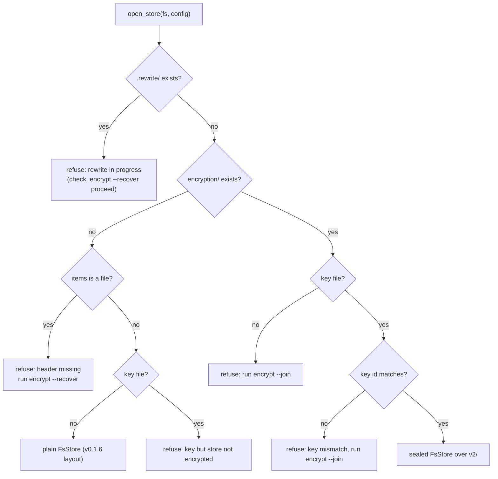

# Delivery Plan 00008: V0 1 7 Encryption At Rest

> [!abstract] Plan status: `approved`
> Deliver `passalong` v0.2.0 (renumbered from v0.1.7; D-20): optional client-side encryption of everything a
> store holds, for both the `ssh` and `local` backends. A random data key,
> wrapped by six generated words through Argon2id, seals item content and
> metadata with AES-256-GCM; ids use a keyed content key. Devices join once
> with the words; the words can be changed without rewriting anything; the
> data key can be rotated to lock out a lost device; an existing store can be
> migrated or started fresh. STEP-01 first proves that v0.1.6 clients cannot
> write plaintext into an encrypted store, the condition the user set for
> accepting IDEA-00001. No blocking decision remains; approved by the user at 2026-09-15T13:52:43Z; Builder-ready.

## 1. Objective and outcome

Today whoever controls the storage (the SSH server's operator, or the cloud
provider behind a synced `local` folder) can read every item, and every id
reveals 12 hex digits of the plaintext SHA-256 (`docs/architecture.md`,
Security model; `crates/passalong-core/src/model.rs`). After this plan:

1. **An encrypted store reveals only** creation times (in ids), the number
   of items, ciphertext sizes, which items share content, and access times.
   Content, file names, kinds, MIME types, sizes, SHA-256, previews,
   origins, and device names are sealed.
2. **Setting up takes one command per device.** `init` or `encrypt` on one
   device shows six words; every other device types them once
   (`init`, or `encrypt --join`). Commands then work as before.
3. **The words can be changed at any time** without rewriting any item,
   and **the data key can be rotated** (`encrypt --rotate`), which forces
   every device to re-join and so locks out a lost one.
4. **Old and keyless clients fail loudly** rather than writing plaintext
   into an encrypted store.
5. **Interrupted rewrites are recoverable** with `encrypt --recover`.

## 2. Source traceability

| Requirement | Source | Source location | Interpretation |
|---|---|---|---|
| PLAN-00008-REQ-01 | Idea; user | `docs/ideas/00001-Encryption_At_Rest-r04.md` §10 IDEA-00001-R04-MAJ-01, §14; user authorisation 2026-09-15 | Old and keyless clients cannot write plaintext; proved first |
| PLAN-00008-REQ-02 | Idea; external | r04 §12, IDEA-00001-R04-MED-01; NIST SP 800-38D; RFC 9106 §4 | Key hierarchy and sealed formats |
| PLAN-00008-REQ-03 | Idea; user | r04 §17 (generated words); IDEA-00001-R04-LOW-01; eff.org/dice, eff.org/copyright | Six generated words; attribution |
| PLAN-00008-REQ-04 | Idea; user | r04 §12 key file; §17 git rule; r01 item 8 | `store.key`, `client.key_file`, permissions, git rule |
| PLAN-00008-REQ-05 | Idea; repository | r04 §12 header and layout; `crates/passalong-core/src/fs/mod.rs` `RemoteFs::rename`; `store/factory.rs` `BackendRegistry` | Store header and encryption-aware opening |
| PLAN-00008-REQ-06 | Idea | r04 §12; IDEA-00001-R04-MED-03, MED-05; `store/fs_store.rs` | Sealed `FsStore` over the `v2/` layout |
| PLAN-00008-REQ-07 | Idea; user | r04 §4, §12 commands; r01 items 4, 5, 7 | `init` and `encrypt` set-up, join, passphrase change |
| PLAN-00008-REQ-08 | Idea; user | r04 IDEA-00001-R04-MED-02; §17 rotation; r01 items 5, 6 | Rewrite engine: migrate, rotate, recover |
| PLAN-00008-REQ-09 | Idea; user | r04 IDEA-00001-R04-MED-04; §17 fresh start | Fresh start and `prune --plain` |
| PLAN-00008-REQ-10 | Idea; repository | r04 MED-02, MED-05, IDEA-00001-R04-INFO-02; `serve/pull.rs`, `serve/upload.rs`, `crates/passalong-cli/src/list_cache.rs` | `serve`, pull mode, uploader, list cache |
| PLAN-00008-REQ-11 | Idea; repository | r04 §12 "Every client"; `crates/passalong-cli/src/commands/check.rs` | `check` reports encryption |
| PLAN-00008-REQ-12 | Repository; idea | Root `AGENTS.md` "Docs to maintain", "Backlog rules", "Release workflow"; r04 IDEA-00001-R04-INFO-01 | Documentation and v0.2.0 release preparation |
| PLAN-00008-REQ-13 | Repository | Root `AGENTS.md` "Non-negotiables", "Commands" | Quality gates |
| PLAN-00008-REQ-14 | User; idea | Road map (2026-09-15: encryption is v0.2.0; Windows and S3 move to v0.2.1); r04 §6 Out of scope | Scope guard |
| PLAN-00008-REQ-15 | User | Decision of 2026-09-15 (D-21) | Forward-compatible public types |

## 3. Repository baseline

| Field | Value |
|---|---|
| Repository | `joelee/passalong` |
| Branch | `feature/00008-v0.2.0` (renamed from `feature/00008-v0.1.7` on 2026-09-15), from `main` at `4e72760` (v0.1.6 merge) plus the idea commit; not pushed |
| HEAD | `43ce465a53a651766e1d3415d39fa9167f654dd0` |
| Working tree at publication | Clean before allocation; the only change is this plan file |
| Release state | v0.1.6 released 2026-09-14 (crates.io ×3, GitHub release with Linux x86_64 and macOS arm64 archives) |
| Applicable instructions | Root `AGENTS.md`; `docs/plans/AGENTS.md`; `docs/ideas/AGENTS.md` |

Findings from the planning research, 2026-09-15:

- **Storage primitives.**
  - `RemoteFs` has seven methods (`fs/mod.rs:177`). `rename` never
    replaces an existing target, on `LocalFs` (`fs/local.rs:72`) and
    `SftpFs` (`passalong-ssh/src/sftp_fs.rs:191`), so a file cannot be
    replaced atomically.
  - There is no exclusive create and no single-file removal.
- **Backends.** `BackendRegistry` maps a kind to a `Store` opener
  (`store/factory.rs`). `local` and `ssh` both build `FsStore::new(fs,
  SystemClock, StdRandom)` (`factory.rs:91`, `passalong-ssh/src/backend.rs:32`).
- **Randomness.** `random.rs` is explicitly non-cryptographic. Keys, salts,
  nonces, and words need a CSPRNG. `getrandom` 0.4.3 is already in
  `Cargo.lock`.
- **Crypto crates.** `aes-gcm` 0.11.1, `argon2` 0.6.0, `hkdf` 0.13.0,
  `hmac` 0.13.0, and `zeroize` 1.9.0 are already in `Cargo.lock`, through
  `russh` and `ssh-key`. All are MIT or Apache-2.0, which `deny.toml`
  allows.
- **Old clients.**
  - A v0.1.6 `put` runs `create_dir_all("items")` (`fs_store.rs:193`).
  - `read_meta` checks no schema version (`fs_store.rs:81`).
  - Listing reads the `items` directory.
- **Content keys.** Outside `FsStore`, only `serve/upload.rs:136,167`
  derives a content key, to skip text and images already stored.
- **Public API.**
  - `StoreError` and `FsError` are not `#[non_exhaustive]`.
  - `ClientConfig` is a public struct, which v0.1.2 and v0.1.6 extended
    before.
- **Prompts and cache.**
  - The CLI reaches crossterm through `ratatui::crossterm`
    (`commands/choose/mod.rs:20`), so no new crate is needed for hidden
    input.
  - `Prompt` has `confirm`, `ask`, and `show` (`prompt.rs`).
  - The list cache identity is `ssh user@host:port path`
    (`cache.rs:63`).
- **`serve`.** It opens its stores at start and fails fast when opening
  fails (`serve/mod.rs:159`); the uploader reopens before each retry.
- **Old-client binaries.** The v0.1.6 release publishes
  `passalong-0.1.6-x86_64-unknown-linux-gnu.tar.gz` and
  `passalong-0.1.6-aarch64-apple-darwin.tar.gz`, each with a `.sha256`.

## 4. Scope

### In scope

- `passalong_core::crypto`:
  - the key hierarchy;
  - Argon2id key wrapping;
  - the keyed content key;
  - sealed metadata;
  - the chunked content format;
  - generated words, from the embedded EFF list.
- `passalong_core::encryption`:
  - the store header;
  - the key file;
  - encryption-aware opening;
  - the rewrite engine;
  - the fresh start.
- A sealed mode of `FsStore` over a `v2/` layout.
- Two new default methods each on `RemoteFs` and `Store`.
- `RemoteFs` filesystem openers in `BackendRegistry`.
- CLI:
  - `init` sets up or joins encryption;
  - `encrypt`, `encrypt --join`, `encrypt --rotate`, and
    `encrypt --recover`;
  - `prune --plain`;
  - an encryption line in `check`;
  - a reminder about plaintext left over;
  - hidden prompts.
- `client.key_file`.
- Pull mode, the uploader, and the list cache made key-aware.
- A compatibility test against the released v0.1.6 binary
  (`just test-compat`).
- `#[non_exhaustive]` on the public error enums and config structs (D-21).
- Documentation, NOTICE, the backlog, the CHANGELOG, v0.2.0 release notes,
  and the version bump.

### Out of scope

- Hiding creation times, item counts, or sizes; padding.
- Decrypting a store back to plaintext.
- Configurable Argon2 settings (fixed; stored in the header for later).
- Typed, user-chosen passphrases (D-07).
- OS keychains, hardware keys, several recipients per store.
- Non-interactive set-up, join, or rotation (they need a terminal).
- S3, Windows, GUI, and Android clients (v0.2.1 and later).
- Testing each cloud-sync provider automatically. The maintainer checks one
  by hand (AC-21).

## 5. Constraints and preserved decisions

- Every decision of PLAN-00001 to PLAN-00007 stays in force.
- **Plaintext stores behave exactly as in v0.1.6.** This covers stores
  without a header and devices without a key file: the same layout, the
  same ids, the same output.
- **Fail closed.** No code path writes plaintext item data into a store
  whose root has `encryption/`, `.rewrite/`, or a regular file named
  `items`.
- **Secrets.**
  - Data keys, derived keys, and words are never logged, printed (except
    the words at set-up), written to the store unwrapped, or kept in
    `Debug` output.
  - They are zeroised on drop.
  - Only key ids are logged.
  - Tests generate every key at run time; no key or word list of a real
    store is committed.
- **Compatibility of the published crates.** v0.2.0 is a breaking release
  (D-20). Its breaking changes are exactly:
  - `ClientConfig.key_file` (a new public field);
  - `StoreError::Encryption` (a new variant of a public enum);
  - `#[non_exhaustive]` on the types in D-21.

  Everything else is additive, and the release notes name each breaking
  change. `WriteProbe`, `ItemMeta` (in memory), and existing `Store`
  methods keep their shapes.
- **Tests** never touch the real clipboard, services, `serve`, the user's
  store, or the user's key file. Compatibility tests use a downloaded
  v0.1.6 binary on temporary stores only.
- **Quality rules:**
  - TDD with mocks (`FaultyFs`, `ScriptedPrompt`, fixed RNG and clock);
  - `just check` green at every step;
  - coverage at least 80 %;
  - rustdoc for public items;
  - no `unsafe`.
- **Builder** works on `feature/00008-v0.2.0`, one commit per step, without
  review pauses unless a stop condition triggers. It never tags, publishes,
  or pushes.

## 6. Assumptions

None. Unresolved matters are recorded as decisions.

## 7. Decisions and blockers

| ID | Decision or blocker | Resolution | Owner | Status |
|---|---|---|---|---|
| D-01 | What is encrypted. | **Confirmed by user (2026-09-15):** everything except the id and schema version, including the device name. | User | Resolved |
| D-02 | How the passphrase changes. | **Confirmed by user (2026-09-15):** key wrapping. A change re-wraps the data key; no item is rewritten. | User | Resolved |
| D-03 | Old clients. | **Confirmed by user (2026-09-15):** clients before v0.2.0 may break against an encrypted store. | User | Resolved |
| D-04 | Backends. | **Confirmed by user (2026-09-15):** `ssh` and `local`, for cloud-synced folders. | User | Resolved |
| D-05 | Rotation. | **Confirmed by user (2026-09-15):** data key rotation is in this release (v0.2.0). | User | Resolved |
| D-06 | Existing plaintext items. | **Confirmed by user (2026-09-15):** `encrypt` offers migrating them or starting fresh, leaving them to `prune`. | User | Resolved |
| D-07 | Passphrases. | **Confirmed by user (2026-09-15):** always six generated words; typing only to join or recover. | User | Resolved |
| D-08 | Key file in a git work tree. | **Confirmed by user (2026-09-15):** refused unless git ignores it (`git check-ignore`). | User | Resolved |
| D-09 | Argon2 strength. | **Confirmed by user (2026-09-15):** Argon2id, 64 MiB, t=3, p=4 (RFC 9106 §4, second option). | User | Resolved |
| D-10 | Planning before acceptance. | **Confirmed by user (2026-09-15):** planning from r04 is authorised; IDEA-00001 is accepted after STEP-01 passes. | User | Resolved |
| D-11 | Store layout. | **Resolved by planner.** An encrypted store's root holds:<br>• `encryption/header.json` — the header; a directory, because `rename` cannot replace a file;<br>• `items` — a regular file whose text says `This store is encrypted. Upgrade to passalong 0.2.0 or later.`;<br>• `v2/items/<id>/{content,meta.json}` and `v2/tmp/` — sealed items and staging;<br>• `plain/items/` — only after a fresh start, until `prune --plain` empties it;<br>• `.rewrite/` — only during a migration or rotation, holding `plan.json`, `header/`, `old-header/`, and `source/`. Creating it with an exclusive `create_dir` is the lock.<br>The header is replaced by writing `tmp/<rand>/header.json` and renaming `encryption` to `tmp/old-header-<rand>`, then `tmp/<rand>` to `encryption`. Until the swap completes, clients find no header beside the `items` file and refuse (D-14). A plaintext store keeps the v0.1.6 layout. | Planner | Resolved |
| D-12 | Keys and formats. | **Resolved by planner:**<br>• **Data key:** 32 random bytes from `getrandom`.<br>• **Key id:** the first 8 bytes of `HKDF-SHA256(data key, info "passalong key id v1")`, shown as 16 hex digits (8 in messages).<br>• **Wrapping key:** Argon2id(words normalised to lowercase, single spaces; 16-byte random salt; m=65536 KiB, t=3, p=4) gives 32 bytes. It seals the data key with AES-256-GCM, a random 12-byte nonce, and associated data `passalong key v1` plus the key id.<br>• **Header JSON:** `{"format":1,"key_id","kdf":{"alg":"argon2id","version":19,"m_kib","t","p","salt"},"wrapped_key":{"nonce","ciphertext"}}`. Hex fields; no device name or time. Unwrapping refuses `m_kib` > 1048576, `t` > 10, or `p` > 16, so a hostile header cannot exhaust memory.<br>• **Subkeys:** `HKDF-SHA256(data key, info "passalong id v1" / "passalong meta v1")`.<br>• **Keyed content key:** `HMAC-SHA256(id key, SHA-256 of the content)`, first 6 bytes as 12 hex digits. Derived from the digest, so callers holding a `ContentDigest` get it without reading the content again.<br>• **Sealed metadata** (`v2/items/<id>/meta.json`): `{"schema":2,"id","nonce","sealed"}`. `sealed` is AES-256-GCM(meta key, random nonce, associated data `passalong meta v1` plus the id) of the `ItemMeta` JSON plus `content_salt`.<br>• **Content** (`v2/items/<id>/content`): magic `PAC1`, then a 32-byte salt, then chunks of at most 64 KiB plaintext, each with a 16-byte tag. The chunk key is `HKDF-SHA256(data key, salt, info "passalong content v1")`. The nonce is 3 zero bytes, the chunk counter as u64 big-endian, and a last-chunk flag byte (1 on the final chunk, which may be empty). Reads reject a missing final chunk, data after it, and any failed tag.<br>• **Integrity:** after decryption the SHA-256 and size are checked against the sealed metadata, as today, and the content salt must match. | Planner | Resolved |
| D-13 | Where the code lives. | **Resolved by planner:**<br>• **`passalong_core::crypto`** (new, public): `DataKey`, `KeyId`, `Words`, `wrap`/`unwrap`, `Sealer`, and streaming seal/open adapters over `AsyncRead`.<br>• **`passalong_core::encryption`** (new, public): `StoreHeader`, `KeyFile`, `open_store`, `Admin` (set-up, join, change words, fresh start, rewrite, recover, plain-item access).<br>• **`FsStore::sealed(fs, clock, rng, sealer)`**, with `FsStore::new` unchanged.<br>• **`RemoteFs`** gains `create_dir` (exclusive; the default is stat then `create_dir_all`, documented as not atomic) and `remove_file` (the default returns `FsError::Other`); `LocalFs` and `SftpFs` override both. `impl RemoteFs for Box<dyn RemoteFs>`.<br>• **`BackendRegistry`** gains `register_fs(kind, FsOpener)` and `open_fs`; `open` routes filesystem kinds through `encryption::open_store`. `register` remains for other kinds (unencrypted, documented). `local` and `ssh` become filesystem kinds; `passalong_ssh::open_ssh_store` keeps its signature.<br>• **`Store`** gains `key_id() -> Option<KeyId>` and `content_key(&ContentDigest) -> ContentKey`, both with defaults.<br>• **`StoreError::Encryption(EncryptionError)`** is one new variant. | Planner | Resolved |
| D-14 | Opening a store. | **Resolved by planner** (`encryption::open_store`; see § 8):<br>• **Plain:** no `encryption/`, no `.rewrite/`, and `items` absent or a directory. Without a key file this gives a plain `FsStore`; with a key file it is refused ("this device has a key but the store is not encrypted; remove `<key_file>` or run `passalong encrypt`").<br>• **Encrypted:** `encryption/` present and no `.rewrite/`. A matching key file gives a sealed `FsStore`. No key file is refused, naming `passalong encrypt --join`; a different key id is refused, naming both ids and `--join`.<br>• **Rewriting:** `.rewrite/` present. Refused, naming the device-independent start time from `plan.json` and `passalong encrypt --recover`; only `check` and `encrypt --recover` proceed.<br>• **Broken:** `items` is a file but there is no `encryption/`. Refused, naming `passalong encrypt --recover`.<br>A sealed store re-checks before every `put`, `delete`, and `list_ids`, using the size and mtime of `encryption/header.json` and the absence of `.rewrite/`. It re-reads the header only when those change, and stops with `StoreError::Encryption` if the key id changed or a rewrite started. | Planner | Resolved |
| D-15 | Commands. | **Resolved by planner.** All encryption commands need a terminal and use hidden input for words.<br>• **`init`:** after the connection test succeeds, it inspects the store:<br>&nbsp;&nbsp;– empty plaintext store: asks `Encrypt this store? [y/N]`;<br>&nbsp;&nbsp;– plaintext store with items: prints `run passalong encrypt to encrypt the N stored items`;<br>&nbsp;&nbsp;– encrypted store: asks for the words and joins.<br>&nbsp;&nbsp;`--yes` and `--no-test` never set up or join and print how to.<br>• **`encrypt`**:<br>&nbsp;&nbsp;– plaintext store: warns, needs `y`, and asks `[m]igrate N items / [f]resh start` (migrate is the default; with no items there is no question);<br>&nbsp;&nbsp;– encrypted store with this device's key: changes the words, asking for the current words first.<br>• **`encrypt --join`:** asks for the words and writes the key file.<br>• **`encrypt --rotate`:** warns that every device must re-join, needs `y`, and rotates.<br>• **`encrypt --recover`:** shows the interrupted operation and its progress, and asks `[f]inish / [u]ndo`.<br>• **Showing new words:** set-up, change, and rotation show the six words on the terminal (standard error), then ask for them back (hidden). After three mismatches they stop with nothing written.<br>• **`prune --plain`:** prunes `plain/items` with the usual `--older-than`, `--keep`, `--dry-run`, and `--force`, and removes `plain/` once empty.<br>• **Leftover reminder:** on an encrypted store with plaintext left, `list` (when it reads the server) logs a warning on standard error: `N unencrypted items remain from before encryption; remove them with passalong prune --plain`. Standard output is unchanged. | Planner | Resolved |
| D-16 | Rewrite engine. | **Resolved by planner.** Migration and rotation share one engine.<br>1. Take the lock with `create_dir(".rewrite")` and write `plan.json` (kind, start time, source and target key ids, item count).<br>2. Write the new header into `.rewrite/header/`; for a rotation, copy the old one into `.rewrite/old-header/`.<br>3. Rename the source (`items` for a migration, `v2/items` for a rotation) to `.rewrite/source` in one step. A migration then writes the `items` file. If a v0.1.6 client recreated `items/` in between, its entries are moved into the source first.<br>4. For each source item, oldest first:<br>&nbsp;&nbsp;– decrypt it or read it plain;<br>&nbsp;&nbsp;– seal it under the new key into `v2/tmp`;<br>&nbsp;&nbsp;– publish it to `v2/items/<new id>`.<br>&nbsp;&nbsp;The new id is the original timestamp plus the new keyed content key, so an item already published is skipped and a resumed run is idempotent.<br>5. Verify every new item by opening it and comparing SHA-256 and size with the source.<br>6. Swap the header in (D-11), then remove `.rewrite/source`, then `.rewrite/` last.<br>• **Recover, finish:** resumes from step 4. It needs the new words; a rotation also needs the old key, from the key file or the old words.<br>• **Recover, undo:**<br>&nbsp;&nbsp;– migration: removes `v2/`, the `items` file, and `.rewrite/header`, then renames the source back to `items`;<br>&nbsp;&nbsp;– rotation: removes the new `v2/items` and renames the source back.<br>• **After success:** the device that ran the command saves its new key file. Other devices must run `encrypt --join`. | Planner | Resolved |
| D-17 | `serve`, pull mode, uploader, list cache. | **Resolved by planner:**<br>• The uploader asks `store.content_key(&digest)` instead of `digest.content_key()`.<br>• `Puller` records `store.key_id()` at start. When the reopened store's key id differs, it resets its seen set to the current ids without applying anything.<br>• `ListCache::store_identity` appends ` key <key id>` or ` plain`, read from the key file, so a cache from before a migration, rotation, or join is never used.<br>• A sealed item whose metadata or content fails authentication is logged at verbose and skipped as `not yet complete` when its id is under 5 minutes old; older ones are corrupt, as today. | Planner | Resolved |
| D-18 | Compatibility test. | **Resolved by planner:** `crates/passalong-cli/tests/compat_v016.rs`, ignored by default. It runs the binary named by `PASSALONG_COMPAT_BIN` against temporary `local` stores. `just test-compat` downloads the v0.1.6 archive for the host from `https://github.com/joelee/passalong/releases/download/v0.1.6/`, checks its `.sha256`, unpacks it under `target/compat/`, and runs the test. `just ci` and the Linux CI job run it. `serve` is not run, because it would read the real clipboard; it stores through the same `FsStore::put` as `clipboard`. | Planner | Resolved |
| D-19 | Dependencies and the word list. | **Resolved by planner:**<br>• **Crates:** add `aes-gcm = "0.11.1"`, `argon2 = "0.6.0"`, `hkdf = "0.13.0"`, `hmac = "0.13.0"`, `zeroize = "1.9.0"`, and `getrandom = "0.4.3"` as workspace dependencies of `passalong-core`. `Cargo.lock` gains no new package name.<br>• **Word list:** EFF's large list, fetched from `https://www.eff.org/files/2016/07/18/eff_large_wordlist.txt`, stored verbatim as `crates/passalong-core/src/crypto/eff_large_wordlist.txt` and embedded with `include_str!`. It must have exactly 7,776 unique entries with dice codes 11111 to 66666; its SHA-256 goes in the work log.<br>• **Attribution** (CC BY 4.0, EFF) goes in `NOTICE` at the repository root and in `crates/passalong-core/NOTICE`, in the module docs, and in the README.<br>• **Word selection:** uniform by rejection sampling from `getrandom`. | Planner | Resolved |
| D-20 | Branch and version. | **Confirmed by user (2026-09-15):** v0.2.0, a breaking release, on `feature/00008-v0.2.0` (renamed from `feature/00008-v0.1.7`). The backlog's v0.1.7 heading becomes this release; its former v0.2.0 items (Windows, S3) move to a v0.2.1 heading, and the README's roadmap line (`README.md:14`) follows. Previously resolved by planner as v0.1.7. | User | Resolved |
| D-21 | Forward-compatible public types. | **Confirmed by user (2026-09-15):** mark `#[non_exhaustive]`:<br>• the error enums `StoreError`, `FsError`, `ConfigError`, and `ModelError`, and the new `CryptoError` and `EncryptionError` from the start;<br>• the config structs `Config`, `ClientConfig`, `ServerConfig`, `SshConfig`, `LocalConfig`, and `ServeConfig`.<br>Code outside `passalong-core` that builds these structs literally (the `passalong-ssh/src/connect.rs` tests and `passalong-ssh/tests/sftp_docker.rs`) switches to `config::parse` of TOML text, as other tests already do. Matches on these enums outside their crate gain a wildcard arm. `InitAnswers`, which callers fill in, stays exhaustive; `WriteProbe` already is non-exhaustive. | User | Resolved |

Blocking decisions: 0.

## 8. Affected architecture and components

| Area | Paths | Change |
|---|---|---|
| Crypto | `crates/passalong-core/src/crypto/` (new: `mod.rs`, `words.rs`, `eff_large_wordlist.txt`, `stream.rs`), `crates/passalong-core/NOTICE` (new), `NOTICE` (new) | D-12, D-19 |
| Encryption | `crates/passalong-core/src/encryption/` (new: header, key file, `open_store`, `Admin`, rewrite engine) | D-11, D-14, D-16 |
| Store | `crates/passalong-core/src/store/{mod,fs_store,factory}.rs`, `crates/passalong-core/src/fs/{mod,local}.rs`, `crates/passalong-core/src/testing.rs` (`FaultyFs` new ops) | Sealed mode, `RemoteFs` and `Store` additions, `StoreError::Encryption`, filesystem openers |
| SSH | `crates/passalong-ssh/src/{backend,sftp_fs}.rs` | `register_fs`, `create_dir`, `remove_file` |
| Config | `crates/passalong-core/src/config.rs`, `docs/configuration.md` | `client.key_file` |
| serve | `crates/passalong-core/src/serve/{pull,upload}.rs`, `crates/passalong-core/src/cache.rs` | D-17 |
| CLI | `crates/passalong-cli/src/{cli,app,prompt,list_cache}.rs`, `commands/{init,check,prune,list}.rs`, `commands/encrypt.rs` (new) | D-15 |
| Tests | `crates/passalong-cli/tests/compat_v016.rs` (new), `cli_local_backend.rs`, `cli_ssh_backend.rs`, `crates/passalong-ssh/tests/sftp_docker.rs` | Compatibility, binary, and SFTP tests |
| Tooling | `justfile` (`test-compat`), `.github/workflows/ci.yml`, `.gitignore` (`*.key`, `target/compat` is already under `target/`), `Cargo.toml` | D-18, D-19 |
| Docs | `README.md`, `docs/{usage,configuration,architecture,developer-guide,backlog}.md`, `CHANGELOG.md`, `docs/release/v0.2.0.md` (new) | REQ-12 |
| Public types | `crates/passalong-core/src/{store/mod,fs/mod,config,model}.rs`, `crates/passalong-ssh/src/connect.rs`, `crates/passalong-ssh/tests/sftp_docker.rs` | D-21 |



```rust
// passalong-core::crypto (new, public) — sketch; Builder may refine names.
pub struct DataKey(/* 32 bytes, zeroised, no Debug */);
pub struct KeyId(/* 8 bytes */);
pub struct Words(/* six words, zeroised */);
impl Words { pub fn generate() -> Self; pub fn parse(text: &str) -> Result<Self, CryptoError>; }
pub fn wrap(key: &DataKey, words: &Words, params: KdfParams) -> Result<WrappedKey, CryptoError>;
pub fn unwrap(wrapped: &WrappedKey, words: &Words) -> Result<DataKey, CryptoError>;
pub struct Sealer { /* id key, meta key, data key */ }
impl Sealer {
    pub fn content_key(&self, digest: &ContentDigest) -> ContentKey;
    pub fn seal_meta(&self, meta: &ItemMeta, content_salt: &[u8; 32]) -> Result<Vec<u8>, CryptoError>;
    pub fn open_meta(&self, id: &ItemId, bytes: &[u8]) -> Result<(ItemMeta, [u8; 32]), CryptoError>;
    pub fn seal_content(&self, plain: BoxRead) -> (BoxRead, [u8; 32]);
    pub fn open_content(&self, sealed: BoxRead) -> Result<BoxRead, CryptoError>;
}

// passalong-core::encryption (new, public)
pub async fn open_store<F: RemoteFs + 'static>(fs: F, config: &Config) -> Result<Box<dyn Store>, StoreError>;
pub enum StoreState { Plain { items: usize }, Encrypted { key_id: KeyId, plain_left: usize }, Rewriting(RewritePlan), Broken }
pub struct Admin<F> { /* over the same fs */ }
```

## 9. Requirement catalogue

### PLAN-00008-REQ-01 — Old and keyless clients cannot write plaintext

- **Requirement:**
  - Against a store in the D-11 layout, the released v0.1.6 binary's item
    commands fail and write no item data.
  - v0.2.0 clients refuse per D-14.
- **Rationale:** The one open Major finding; the user's acceptance
  condition.
- **Source:** IDEA-00001-R04-MAJ-01; D-03, D-10, D-18.
- **Acceptance evidence:** AC-01, AC-02.

### PLAN-00008-REQ-02 — Key hierarchy and sealed formats

- **Requirement:** `passalong_core::crypto` per D-12: wrapping, subkeys,
  the keyed content key, sealed metadata, and chunked content.
- **Rationale:** Confidentiality and integrity of every item.
- **Source:** IDEA-00001-R04-MED-01; D-09, D-12; NIST SP 800-38D;
  RFC 9106.
- **Acceptance evidence:** AC-03, AC-04, AC-05.

### PLAN-00008-REQ-03 — Generated words

- **Requirement:** Six words drawn uniformly from the embedded EFF list, per
  D-07 and D-19, with attribution.
- **Rationale:** About 77.5 bits of entropy without user effort.
- **Source:** D-07; IDEA-00001-R04-LOW-01.
- **Acceptance evidence:** AC-06.

### PLAN-00008-REQ-04 — Key file and configuration

- **Requirement:**
  - `client.key_file` defaults to `store.key` beside the default config
    path.
  - The key file is written 0600 in a 0700 directory, through a temporary
    file and a rename.
  - It is refused when group or others can read it.
  - It is refused inside a git work tree unless `git check-ignore` passes,
    or when a `.git` is found and `git` is missing.
- **Rationale:** The key must stay private and out of version control.
- **Source:** D-08; r04 §12.
- **Acceptance evidence:** AC-07.

### PLAN-00008-REQ-05 — Header and encryption-aware opening

- **Requirement:**
  - The header, the `RemoteFs` and `BackendRegistry` additions, and
    `encryption::open_store`, per D-11, D-13, and D-14.
  - The header is created exclusively and replaced only by a swap after a
    successful unwrap.
- **Rationale:** The store, not each client, decides whether it is
  encrypted.
- **Source:** D-11, D-13, D-14; IDEA-00001-R04-MAJ-01.
- **Acceptance evidence:** AC-02, AC-08.

### PLAN-00008-REQ-06 — Sealed `FsStore`

- **Requirement:**
  - Every `Store` operation works on the `v2/` layout with sealed
    metadata and content.
  - Deduplication and id prefixes behave as for plaintext stores.
  - Writes re-check the key id and lock (D-14).
  - Fresh items that fail authentication count as not yet complete
    (D-17).
- **Rationale:** Commands keep working unchanged on an encrypted store.
- **Source:** D-12, D-14, D-17; IDEA-00001-R04-MED-03, MED-05.
- **Acceptance evidence:** AC-03, AC-13.

### PLAN-00008-REQ-07 — Set-up, join, and changing the words

- **Requirement:** `init` and `encrypt` per D-15, with hidden input and
  typed-back confirmation. Changing the words rewrites no item.
- **Rationale:** One-time set-up per device; cheap passphrase changes.
- **Source:** D-02, D-07, D-15; r01 items 4, 5, 7.
- **Acceptance evidence:** AC-08, AC-12.

### PLAN-00008-REQ-08 — Migration, rotation, and recovery

- **Requirement:** The rewrite engine and `encrypt` (migrate),
  `encrypt --rotate`, and `encrypt --recover` (finish or undo), per D-16.
- **Rationale:** Encrypting existing items and locking out lost devices,
  safely.
- **Source:** D-05, D-16; IDEA-00001-R04-MED-02; r01 items 5, 6.
- **Acceptance evidence:** AC-09, AC-10.

### PLAN-00008-REQ-09 — Fresh start and leftover plaintext

- **Requirement:**
  - A fresh start moves `items/` to `plain/items/`.
  - `list` warns while plaintext items remain.
  - `prune --plain` removes them (D-15).
- **Rationale:** Leftover plaintext stays visible to the user until
  removed.
- **Source:** D-06; IDEA-00001-R04-MED-04.
- **Acceptance evidence:** AC-11.

### PLAN-00008-REQ-10 — `serve`, pull mode, uploader, and list cache

- **Requirement:** Per D-17: keyed deduplication in the uploader, pull reset
  on a key id change, and a key-aware list cache identity.
- **Rationale:** No duplicate uploads, no mass re-download after a rewrite,
  no stale cache across keys.
- **Source:** D-17; IDEA-00001-R04-MED-02, MED-05, INFO-02.
- **Acceptance evidence:** AC-13, AC-14.

### PLAN-00008-REQ-11 — `check` reports encryption

- **Requirement:** `check` prints an `encryption` line:
  - `off`;
  - `on (key <id>)`, adding the number of plaintext items left when there
    are any;
  - or a failure naming the fix.
- **Rationale:** One place to see a device's state.
- **Source:** r04 §12; D-14.
- **Acceptance evidence:** AC-15.

### PLAN-00008-REQ-12 — Documentation and release preparation

- **Requirement:**
  - Update README, usage, configuration, architecture, the developer
    guide, the backlog, and `CHANGELOG.md`.
  - Draft `docs/release/v0.2.0.md`.
  - Add the NOTICE files.
  - Bump the version to 0.2.0.
  - Move the backlog's former v0.2.0 items to v0.2.1 and update the
    README's roadmap line (D-20).
  - The security model lists what stays visible, and that the list cache
    holds decrypted metadata.
- **Rationale:** Root `AGENTS.md` "Docs to maintain" and "Release
  workflow".
- **Source:** Root `AGENTS.md`; IDEA-00001-R04-INFO-01, INFO-02.
- **Acceptance evidence:** AC-17, AC-18.

### PLAN-00008-REQ-13 — Quality gates

- **Requirement:**
  - `just check` green at every step.
  - `just ci` and GitHub CI green at the end, including
    `just test-compat` and `just android-check`.
  - Line coverage at least 80 %.
- **Rationale:** Root `AGENTS.md` "Non-negotiables".
- **Source:** Root `AGENTS.md`.
- **Acceptance evidence:** AC-19.

### PLAN-00008-REQ-14 — Scope guard

- **Requirement:** No S3, Windows, GUI, or Android client code; no
  decrypt-to-plaintext; no configurable Argon2; no typed passphrases; no new
  package names in `Cargo.lock`.
- **Rationale:** Road map (D-20); D-07, D-09, D-19.
- **Source:** User road map; r04 §6.
- **Acceptance evidence:** AC-20.

### PLAN-00008-REQ-15 — Forward-compatible public types

- **Requirement:** The error enums and config structs listed in D-21 are
  `#[non_exhaustive]`. Code outside `passalong-core` uses parsing and
  wildcard arms instead of struct literals and exhaustive matches.
- **Rationale:** v0.2.0 breaks the API anyway. Afterwards, new variants and
  fields, such as S3's configuration in v0.2.1, are additive.
- **Source:** User decision of 2026-09-15; D-21.
- **Acceptance evidence:** AC-22.

## 10. Delivery strategy

The order puts the riskiest assumption first and builds bottom-up, so each
step is testable on its own and leaves plaintext stores untouched:

1. **STEP-01** proves the old-client failure (the Major finding) with only
   the `items` stop file, before any crypto exists. Failing it stops the
   plan.
2. **STEP-02 and STEP-03** add pure, unit-tested building blocks: crypto,
   words, and the key file. Nothing uses them yet.
3. **STEP-04 and STEP-05** add the sealed store and encryption-aware
   opening. From STEP-05 on, a store with a header is served sealed, and
   STEP-01's test is extended to a real encrypted store.
4. **STEP-06 and STEP-07** add the user-facing commands. Set-up, join,
   changing the words, and the fresh start come first; the rewrite engine
   follows, because it is the largest.
5. **STEP-08** makes `serve`, pull mode, and the cache key-aware.
6. **STEP-09** proves the whole feature over SFTP in Docker.
7. **STEP-10 and STEP-11** document, bump the version, and run every gate.

**Testing.**
- Unit tests use `LocalFs` in temporary folders, `FaultyFs` for fault
  injection and call counting, `ScriptedPrompt` for questions, and a fixed
  clock.
- Crypto tests use round trips, tampering, and fixed-key vectors generated
  by the tests.
- Rewrite tests inject a failure at every filesystem call in turn, then
  recover.

Plaintext behaviour is guarded by the existing test suite, which must keep
passing unchanged.

## 11. Detailed implementation steps

### PLAN-00008-STEP-01 — Compatibility gate: v0.1.6 against the stop file

- **Objective:** Prove REQ-01's old-client half before building anything
  else.
- **Requirements:** `PLAN-00008-REQ-01`
- **Depends on:** None
- **Affected components:** `crates/passalong-cli/tests/compat_v016.rs`
  (new), `justfile` (`test-compat`), `.github/workflows/ci.yml` (Linux
  job), `docs/developer-guide.md`
- **Preconditions:** Network access to GitHub releases.
- **Test or evidence first:** The test itself is the evidence. It builds a
  temporary `local` store whose root holds a regular file `items` (D-11),
  plus a config and state folders pointing into temporary directories. With
  the v0.1.6 binary it runs:
  - `clipboard --stdin` with a unique marker text;
  - `file <tmp file>` containing a second marker;
  - `list`, `list --json`;
  - `load abcd`, `delete abcd`;
  - `prune --older-than 1m --force`;
  - `check`.

  It asserts that:
  - every command exits non-zero;
  - no file anywhere under the store root contains either marker;
  - the root holds nothing but `items` and, at most, an empty `tmp/`.
- **Implementation tasks:**
  1. Write the test, ignored by default, reading `PASSALONG_COMPAT_BIN`.
  2. Add `just test-compat` per D-18: download, verify the checksum,
     unpack, and run.
  3. Add it to `just ci` and to the Linux CI job.
- **Documentation/configuration/operations:** Developer guide: the
  compatibility test and how to run it.
- **Verification:** `just test-compat`; `just check`.
- **Completion criteria:** AC-01 for the stop-file layout.
- **Rollback or recovery:** Revert.
- **Builder stop conditions:** Any v0.1.6 command exits zero while
  touching items, or any marker appears under the store root. Stop, record
  the evidence, and escalate: the layout (D-11) must be revised before
  continuing.

### PLAN-00008-STEP-02 — Crypto primitives and the word list

- **Objective:** Implement REQ-02 and REQ-03 as a pure library.
- **Requirements:** `PLAN-00008-REQ-02`, `PLAN-00008-REQ-03`
- **Depends on:** `PLAN-00008-STEP-01`
- **Affected components:** `Cargo.toml`, `crates/passalong-core/Cargo.toml`,
  `crates/passalong-core/src/crypto/`, `crates/passalong-core/src/lib.rs`,
  `NOTICE`, `crates/passalong-core/NOTICE`
- **Preconditions:** None.
- **Test or evidence first:**
  - **Wrapping:** `wrap`/`unwrap` round trips; wrong words fail;
    out-of-bounds KDF parameters are refused before any work.
  - **Keyed content key:** differs from the plain content key and between
    data keys, and is equal for equal content under one key.
  - **Metadata:** seal and open round trip; opening under another id or
    with any bit flipped fails.
  - **Content, round trips:** sizes 0, 1, 64 KiB−1, 64 KiB, 64 KiB+1, and
    3 MiB.
  - **Content, rejections:** truncation at a chunk boundary, truncation
    mid-chunk, reordered chunks, duplicated chunks, data after the final
    chunk, a swapped salt, and a bit flip in each region.
  - **Words:** `generate` yields six entries of the list; `parse`
    normalises case, spaces, and hyphens and rejects unknown words.
  - **The list:** 7,776 unique entries.
  - **Secrets:** `Debug` of every key and word type shows no secret.
  - **Timing:** a timing test (ignored; run once) records the Argon2 unwrap
    time.
- **Implementation tasks:**
  1. Add the workspace dependencies per D-19. Confirm `Cargo.lock` gains no
     new package name.
  2. Fetch and verify the word list; record its SHA-256.
  3. Implement D-12 with `getrandom` for all randomness and `zeroize` on
     every secret.
- **Documentation/configuration/operations:** Module rustdoc with the
  formats; NOTICE files with the EFF CC BY 4.0 attribution.
- **Verification:** `cargo test -p passalong-core crypto`; the timing test;
  `just android-check`; `just audit`; `just check`.
- **Completion criteria:** AC-04, AC-05, AC-06.
- **Rollback or recovery:** Revert.
- **Builder stop conditions:**
  - Argon2 unwrap takes over 3 s on the build machine.
  - A dependency needs a new package or a licence outside `deny.toml`.
  - The word list does not verify.

### PLAN-00008-STEP-03 — Key file, `client.key_file`, and hidden prompts

- **Objective:** Implement REQ-04 and hidden input.
- **Requirements:** `PLAN-00008-REQ-04`
- **Depends on:** `PLAN-00008-STEP-02`
- **Affected components:** `crates/passalong-core/src/encryption/` (key
  file), `crates/passalong-core/src/config.rs`,
  `crates/passalong-cli/src/prompt.rs`, `.gitignore`
- **Preconditions:** None.
- **Test or evidence first:**
  - **Config:** parses `key_file`; the default is beside
    `default_config_path`; a relative path is refused, naming the key.
  - **Key file writing:** saving creates 0600 in a 0700 directory, through
    a temporary file.
  - **Key file loading:** a round trip works; group or other bits are
    refused; a malformed file is refused without echoing its content.
  - **Git rule:** in a temporary git repository, the file is refused, then
    accepted once listed in `.gitignore`. A `.git` with a `PATH` lacking
    `git` is refused. The `git` call goes through an injectable runner.
  - **Prompt:** `ScriptedPrompt::ask_secret` records that a secret was
    asked without recording the answer.
- **Implementation tasks:**
  1. `KeyFile` format: one line `passalong-key 1 <key id hex16> <data key
     hex64>`.
  2. Add `ClientConfig.key_file`.
  3. Add `Prompt::ask_secret`, with `TerminalPrompt` reading through
     `ratatui::crossterm` raw mode without echo.
  4. Add `*.key` to `.gitignore`.
- **Documentation/configuration/operations:** `docs/configuration.md`
  (`key_file`).
- **Verification:** `cargo test -p passalong-core encryption::key_file`;
  `cargo test -p passalong prompt`; `just check`.
- **Completion criteria:** AC-07.
- **Rollback or recovery:** Revert.
- **Builder stop conditions:** Hidden input cannot be implemented without
  `unsafe` or a new crate.

### PLAN-00008-STEP-04 — `RemoteFs` additions and the sealed `FsStore`

- **Objective:** Implement REQ-06, given a `Sealer`.
- **Requirements:** `PLAN-00008-REQ-06`
- **Depends on:** `PLAN-00008-STEP-02`
- **Affected components:** `crates/passalong-core/src/fs/{mod,local}.rs`,
  `crates/passalong-ssh/src/sftp_fs.rs`,
  `crates/passalong-core/src/store/{mod,fs_store}.rs`,
  `crates/passalong-core/src/testing.rs`
- **Preconditions:** None.
- **Test or evidence first:**
  - **`RemoteFs` additions:** `create_dir` fails with `AlreadyExists` when
    the directory exists, and `remove_file` removes a file only, on
    `LocalFs` and through `FaultyFs`.
  - **The existing `FsStore` suite:** the `FsStore` tests run a second time
    over a sealed store, with `v2/` paths: put, list, `list_after`,
    `list_ids`, get, `get_meta`, exists, `find_by_content_key`, resolve,
    delete, `clean_staging`, probe, deduplication, and the atomic-publish
    and failure cases.
  - **Leak scan:** every byte and name under the root contains no marker
    content, name, device, preview, MIME type, or 12-hex prefix of the
    plaintext SHA-256.
  - **Tampering:** content swapped between two items, or `meta.json` moved
    to another id, is rejected.
  - **Not yet complete:** a sealed item under 5 minutes old with a
    truncated `content` is skipped at verbose and `get` reports it as not
    yet complete; an older one is corrupt.
  - **Trait defaults:** `Store::content_key` and `key_id` defaults keep
    plaintext behaviour.
- **Implementation tasks:** Per D-12 and D-13: `FsStore::sealed`, the
  `Store` defaults, and the `RemoteFs` methods (with defaults and
  overrides).
- **Documentation/configuration/operations:** Rustdoc.
- **Verification:** `cargo test -p passalong-core store`;
  `cargo test -p passalong-core fs`; `just check`.
- **Completion criteria:** AC-03, and AC-13 at store level.
- **Rollback or recovery:** Revert; plaintext stores are untouched.
- **Builder stop conditions:** A plaintext-store test needs changing to
  pass.

### PLAN-00008-STEP-05 — Store header and encryption-aware opening

- **Objective:** Implement REQ-05 and the v0.2.0 half of REQ-01.
- **Requirements:** `PLAN-00008-REQ-05`, `PLAN-00008-REQ-01`
- **Depends on:** `PLAN-00008-STEP-03`, `PLAN-00008-STEP-04`
- **Affected components:** `crates/passalong-core/src/encryption/`,
  `crates/passalong-core/src/store/{mod,factory}.rs`,
  `crates/passalong-ssh/src/backend.rs`,
  `crates/passalong-cli/tests/compat_v016.rs`
- **Preconditions:** STEP-01 passed.
- **Test or evidence first:**
  - **Opening:** `open_store` over every row of D-14 gives the expected
    store or error, each message naming its fix.
  - **Exclusive creation:** creating a header refuses when `encryption/`
    exists.
  - **Header swap:** `FaultyFs` fails after each rename; the store is then
    refused as broken, never opened plain.
  - **Stale writers:** a sealed store whose header changed underneath it
    refuses `put` and `delete` with the key-rotated error.
  - **Registry:** `register_fs` kinds route through `open_store`;
    `register` kinds still open directly.
  - **`StoreError::Encryption`** displays each case.
  - **Compatibility test extended:** STEP-01's test also runs against a
    real encrypted store built with the `encryption` API, and asserts that
    no marker and no plaintext of existing items appears.
  - **Tests with this release's binary:** a keyless device lists and sends nothing; a
    device with a key but a plaintext store is refused.
- **Implementation tasks:** Per D-11, D-13, and D-14. Register `local` and
  `ssh` as filesystem kinds.
- **Documentation/configuration/operations:** Rustdoc; architecture notes
  are drafted in STEP-10.
- **Verification:** `cargo test -p passalong-core encryption`;
  `cargo test -p passalong --test cli_local_backend`; `just test-compat`;
  `just check`.
- **Completion criteria:** AC-01 (encrypted store), AC-02.
- **Rollback or recovery:** Revert.
- **Builder stop conditions:** A v0.1.6 command writes into an encrypted
  store.

### PLAN-00008-STEP-06 — `init`, `encrypt`, join, changing the words, fresh start, `check`

- **Objective:** Implement REQ-07, REQ-09, and REQ-11.
- **Requirements:** `PLAN-00008-REQ-07`, `PLAN-00008-REQ-09`,
  `PLAN-00008-REQ-11`
- **Depends on:** `PLAN-00008-STEP-05`
- **Affected components:** `crates/passalong-core/src/encryption/`
  (`Admin`: set-up, join, change words, fresh start, plain items),
  `crates/passalong-cli/src/{cli,app}.rs`,
  `commands/{init,encrypt,check,prune,list}.rs`
- **Preconditions:** None.
- **Test or evidence first:** `ScriptedPrompt` over temporary `local`
  stores covering:
  - **`init`:** set-up on an empty store; join on an encrypted store; the
    hint on a non-empty plaintext store; `--yes` and `--no-test` only
    hint.
  - **`encrypt` on an empty store:** writes the header, the `items` file,
    and the key file.
  - **Fresh start:** moves N items to `plain/items/`.
  - **Changing the words:** asks for the current words, shows new ones, and
    rewrites no item. `FaultyFs` counters show no content write, and ids
    are unchanged. A second device's key file still opens the store.
  - **`encrypt --join`:** writes a key file that opens the store; wrong
    words write nothing.
  - **Typed-back words:** three mismatches write nothing.
  - **No terminal:** it is refused.
  - **`prune --plain`:** honours its flags and removes `plain/` when empty.
  - **Leftover reminder:** `list` on the server path logs it on standard
    error, and standard output is unchanged.
  - **`check`:** each encryption line.
  - **Words:** they never appear in logs, and appear on standard error only
    once.
- **Implementation tasks:** Per D-15.
- **Documentation/configuration/operations:** Usage (drafted fully in
  STEP-10).
- **Verification:** `cargo test -p passalong encrypt init check prune`;
  `cargo test -p passalong --test cli_local_backend`; `just check`.
- **Completion criteria:** AC-08, AC-11, AC-12, AC-15.
- **Rollback or recovery:** Revert.
- **Builder stop conditions:** A flow would need a non-interactive secret
  input.

### PLAN-00008-STEP-07 — Rewrite engine: migrate, rotate, recover

- **Objective:** Implement REQ-08.
- **Requirements:** `PLAN-00008-REQ-08`
- **Depends on:** `PLAN-00008-STEP-06`
- **Affected components:** `crates/passalong-core/src/encryption/`
  (rewrite), `crates/passalong-cli/src/commands/encrypt.rs`
- **Preconditions:** None.
- **Test or evidence first:**
  - **Migration:** 20 plaintext items of mixed kinds become 20 sealed
    items with the same timestamps, contents, names, and devices.
  - **Rotation:** afterwards the old key file is refused; the new words
    open the store; ids change; contents are equal.
  - **The lock:** a second rewrite is refused while `.rewrite/` exists.
  - **A racing v0.1.6 `items/`:** a directory recreated between the rename
    and the `items` file is folded into the source.
  - **Fault injection:** for migration and rotation, `FaultyFs` fails at
    each filesystem call in turn. Recover then either finishes, giving all
    items verified, or undoes, restoring the original state byte for byte.
    Zero items are lost in every case.
  - **Resume:** resuming skips published items; FaultyFs counters show no
    second upload.
  - **CLI:** `encrypt --recover` with `ScriptedPrompt` for both choices.
- **Implementation tasks:** Per D-16.
- **Documentation/configuration/operations:** Usage (in STEP-10).
- **Verification:** `cargo test -p passalong-core encryption::rewrite`;
  `cargo test -p passalong encrypt`; `just check`.
- **Completion criteria:** AC-09, AC-10.
- **Rollback or recovery:** Revert.
- **Builder stop conditions:** Any injected fault loses or corrupts an item
  after recovery.

### PLAN-00008-STEP-08 — `serve`, pull mode, uploader, and list cache

- **Objective:** Implement REQ-10.
- **Requirements:** `PLAN-00008-REQ-10`
- **Depends on:** `PLAN-00008-STEP-07`
- **Affected components:** `crates/passalong-core/src/serve/{pull,upload}.rs`,
  `crates/passalong-core/src/cache.rs`,
  `crates/passalong-cli/src/list_cache.rs`,
  `crates/passalong-core/tests/serve_local.rs`
- **Preconditions:** None.
- **Test or evidence first:**
  - **Uploader:** on a sealed store it recognises text and images already
    stored.
  - **Pull mode:** a `Puller` with a seen set from before a rotation resets
    without applying anything once the reopened store has a new key id.
  - **List cache:** its identity includes the key id or `plain`, and a
    cache written under another key id is not used.
  - **`serve_local`:** runs over a sealed local store with a fake
    clipboard.
- **Implementation tasks:** Per D-17.
- **Documentation/configuration/operations:** Architecture notes (in
  STEP-10).
- **Verification:** `cargo test -p passalong-core serve cache`;
  `cargo test -p passalong-core --test serve_local`; `just check`.
- **Completion criteria:** AC-13, AC-14 (behaviour).
- **Rollback or recovery:** Revert.
- **Builder stop conditions:** Pull mode would re-apply items after a
  rewrite.

### PLAN-00008-STEP-09 — Encryption over SFTP

- **Objective:** Prove REQ-05 to REQ-08 against the Docker sshd.
- **Requirements:** `PLAN-00008-REQ-05`, `PLAN-00008-REQ-06`,
  `PLAN-00008-REQ-08`
- **Depends on:** `PLAN-00008-STEP-08`
- **Affected components:** `crates/passalong-ssh/tests/sftp_docker.rs`,
  `crates/passalong-cli/tests/cli_ssh_backend.rs`
- **Preconditions:** Docker available (`just test-integration`).
- **Test or evidence first:** Over `SftpFs`:
  - `create_dir` exclusivity and `remove_file`;
  - set-up through `Admin`;
  - `put`, `list`, `get`, and `delete` sealed;
  - a header swap;
  - migration and rotation with a fault injected once, then recovery;
  - the binary with an ssh config and a key file sends, lists, and loads;
    a second config without the key is refused.
- **Implementation tasks:** Tests only, plus fixes they expose.
- **Documentation/configuration/operations:** None.
- **Verification:** `just test-integration`; `just check`.
- **Completion criteria:** AC-16.
- **Rollback or recovery:** Revert.
- **Builder stop conditions:** SFTP semantics differ from `LocalFs` in a
  way that breaks D-11 or D-16.

### PLAN-00008-STEP-10 — Documentation, public types, and v0.2.0 release preparation

- **Objective:** Implement REQ-12 and REQ-15.
- **Requirements:** `PLAN-00008-REQ-12`, `PLAN-00008-REQ-15`
- **Depends on:** `PLAN-00008-STEP-09`
- **Affected components:** `README.md`,
  `docs/{usage,configuration,architecture,developer-guide,backlog}.md`,
  `CHANGELOG.md`, `docs/release/v0.2.0.md` (new), `Cargo.toml`,
  `Cargo.lock`, version literals in tests, and the D-21 types with their
  users outside `passalong-core`
- **Preconditions:** None.
- **Test or evidence first:** the `passalong --version` test expects 0.2.0.
  Out-of-crate struct literals and matches (D-21) are rewritten before
  the attributes are added, so the build stays green throughout.
- **Implementation tasks:**
  1. **README:** an Encryption section (set-up, join, words, rotation) and
     the EFF attribution.
  2. **Usage:** `init` (encryption), `encrypt` and its flags,
     `prune --plain`, the `check` line, and the leftover reminder.
  3. **Configuration:** `client.key_file`, and the store files of D-11.
  4. **Architecture:**
     - the storage layout and key hierarchy;
     - the opening table (D-14);
     - the rewrite engine;
     - the security model: what stays visible, that the list cache holds
       decrypted metadata, and that the words are the only recovery.
  5. **Developer guide:** crypto test notes, `just test-compat`, and
     updating the word list.
  6. **Backlog and roadmap:** remove the delivered encryption item and
     its v0.1.7 heading; move the v0.2.0 items (Windows, S3) under a
     v0.2.1 heading; make the README's roadmap line (`README.md:14`)
     say v0.2.1. Add follow-ups under
     "Agent suggested next steps": cloud-sync hardening per provider, key
     import for GUI and Android, several stores per machine, raising Argon2
     settings.
  7. **Changelog and release notes:** `CHANGELOG.md` `Unreleased`, and
     `docs/release/v0.2.0.md` (draft; absolute links; breaking changes per § 5;
     upgrade note for v0.1.6 devices; timings).
  8. **Version:** bump to 0.2.0 across crates, the internal `=`
     requirements, and version literals.
  9. **Public types:** apply D-21, rewriting out-of-crate struct literals
     and matches first.
- **Documentation/configuration/operations:** As above.
- **Verification:** `just links`; `just check`; `cargo publish --dry-run`
  via `just ci` in STEP-11.
- **Completion criteria:** AC-17, AC-18.
- **Rollback or recovery:** Revert.
- **Builder stop conditions:** None beyond gates.

### PLAN-00008-STEP-11 — Final quality gate

- **Objective:** Prove the plan.
- **Requirements:** `PLAN-00008-REQ-13`, `PLAN-00008-REQ-14`
- **Depends on:** `PLAN-00008-STEP-10`
- **Affected components:** None new; release notes' Tests, Coverage, and
  Timings sections.
- **Test or evidence first:** Verification-only step.
- **Implementation tasks:**
  1. Run `just ci`, which includes `test-compat` and `android-check`.
  2. Push the branch; record CI on all four jobs.
  3. Time against the Docker sshd, 10 and 100 items:
     - `list --nocache` on plaintext versus encrypted stores;
     - `list` from the cache;
     - `clipboard --stdin`;
     - Argon2 unwrap.
  4. Review the diff for scope (AC-20), and compare `Cargo.lock` package
     names with the baseline.
- **Documentation/configuration/operations:** Fill the release notes'
  Tests, Coverage, and Timings tables.
- **Verification:** `just ci`; GitHub CI; scope review.
- **Completion criteria:** AC-14 (timings), AC-19, AC-20.
- **Rollback or recovery:** Not applicable.
- **Builder stop conditions:** A gate fails in a way that needs a scope
  change; `list --nocache` on an encrypted store is more than 10 % slower
  than on a plaintext one.

## 12. Cross-cutting concerns

| Area | Applicability | Planned action or reason not applicable | Step or requirement |
|---|---|---|---|
| Compatibility and APIs | Applicable | Breaking release v0.2.0 (D-20); `#[non_exhaustive]` public types (D-21); new `crypto` and `encryption` modules; `RemoteFs` and `Store` default methods; `BackendRegistry::register_fs`/`open_fs`; `ClientConfig.key_file` and `StoreError::Encryption` named in the release notes; plaintext stores unchanged | REQ-05, REQ-06, REQ-12, REQ-15 |
| Data and migration | Applicable | New `v2/` layout for encrypted stores only; one-off migration or fresh start; recoverable rewrites; v0.1.6 clients fail against encrypted stores (D-03) | REQ-01, REQ-08, REQ-09 |
| Security and privacy | Applicable | AES-256-GCM with per-item keys, Argon2id wrapping, keyed ids, fail-closed opening, key id re-checks, 0600 key file, git rule, zeroised secrets, no secrets in logs or tests | REQ-01 to REQ-06 |
| Performance and scale | Applicable | Argon2 only on join, change, rotation; list overhead within 10 %; two extra stats per write; rewrites stream item by item | REQ-06, STEP-11 |
| Reliability and failure handling | Applicable | Exclusive lock, idempotent resume, verification before swap, finish or undo, not-yet-complete handling for synced folders | REQ-06, REQ-08 |
| Observability and operations | Applicable | Key ids (never keys or words) logged; `check` encryption line; leftover warning; rewrite progress shown | REQ-11, REQ-09 |
| Dependencies and supply chain | Applicable | Six workspace dependencies, all already locked, MIT/Apache-2.0; EFF word list under CC BY 4.0 with NOTICE; `cargo deny` in CI | REQ-02, REQ-03 |
| Accessibility and UX | Applicable | Hidden input; words shown once and typed back; every refusal names its fix | REQ-07, REQ-11 |
| Documentation and release | Applicable | All docs, NOTICE, backlog, release notes with the upgrade note | REQ-12 |
| Deployment and rollback | Applicable | Encryption is opt-in; a plaintext store never changes unless `encrypt` runs; an interrupted rewrite can be undone; no decrypt-to-plaintext (out of scope, stated in docs) | REQ-08, REQ-14 |

## 13. Verification strategy

| Level | Evidence or command | When | Required result |
|---|---|---|---|
| Unit | `cargo test -p <crate> <module>` | Every step, red then green | Pass |
| Workspace gate | `just check` | Every step | Exit 0 |
| Compatibility | `just test-compat` (v0.1.6 binary) | STEP-01, 05, 11 | Pass: no plaintext written |
| Fault injection | Rewrite tests failing each filesystem call in turn | STEP-07 | Zero items lost |
| SSH integration | `just test-integration` | STEP-09, 11 | Exit 0 |
| Android build | `just android-check` | STEP-02, 11 | Exit 0 |
| Supply chain | `just audit`; `Cargo.lock` package names unchanged | STEP-02, 11 | Pass |
| Timing | Argon2 unwrap; `list`, `list --nocache`, `clipboard` against the Docker sshd | STEP-02, 11 | Argon2 < 1 s (stop > 3 s); list within 10 % |
| Full | `just ci` and GitHub CI | STEP-11 | Pass on all four jobs |
| Manual | One cloud-synced folder, two devices | After hand-off (user) | Items sync and open; no spurious corruption |

## 14. Acceptance criteria

- [ ] `PLAN-00008-AC-01` `just test-compat` passes. The released v0.1.6 binary's `clipboard --stdin`, `file`, `list`, `list --json`, `load`, `delete`, `prune --force`, and `check` each exit non-zero against a stop-file store and a real encrypted store. No marker text or existing plaintext appears anywhere under either store root.
- [ ] `PLAN-00008-AC-02` This release refuses with a message naming the fix, and writes nothing, in each case: a store with a header but no key file; a store and key file with different key ids; a key file with a plaintext store; a store with `.rewrite/`; a store with an `items` file but no header.
- [ ] `PLAN-00008-AC-03` After storing marker text, a named file, and a clipboard image, no file content or name under the encrypted store root contains the markers, the file name, the device name, a preview, a MIME type, or any 12-hex prefix of a plaintext SHA-256.
- [ ] `PLAN-00008-AC-04` Opening fails in every tampering case: truncated, reordered, duplicated, or extra content chunks; content swapped between items; metadata moved to another id; a flipped bit in the header, metadata, or content. Wrong plaintext is never returned.
- [ ] `PLAN-00008-AC-05` Headers use Argon2id with m=65536 KiB, t=3, p=4 and a 16-byte salt. Unwrapping refuses m > 1048576 KiB, t > 10, or p > 16 before deriving. The measured unwrap time is recorded and is under 1 s on the build machine.
- [ ] `PLAN-00008-AC-06` Generated words are six entries of the embedded list, which has exactly 7,776 unique words and a recorded SHA-256. `NOTICE`, `crates/passalong-core/NOTICE`, and the README attribute it to EFF under CC BY 4.0.
- [ ] `PLAN-00008-AC-07` Key files:
  - are written mode 0600 in a 0700 directory;
  - are refused when group or others can read them;
  - are refused inside a git work tree unless `git check-ignore` passes, and when a `.git` exists without `git`.

  `client.key_file` is parsed and documented, with its default beside the default config.
- [ ] `PLAN-00008-AC-08` Changing the words asks for the current words, writes no item content, keeps every id, and leaves other devices' key files working. The header is created exclusively and is replaced only after a successful unwrap.
- [ ] `PLAN-00008-AC-09` Rotation:
  - generates a new data key and new words;
  - rewrites every item under the new key with its original timestamp and content;
  - makes the old key file fail to list, send, or delete, naming `encrypt --join`.
- [ ] `PLAN-00008-AC-10` For migration and rotation, a failure injected at each filesystem call in turn followed by `encrypt --recover` loses no item. Finishing gives every item verified by SHA-256; undoing restores the original store byte for byte.
- [ ] `PLAN-00008-AC-11` A fresh start moves existing items to `plain/items/`. On the server path, `list` warns on standard error with the count, and standard output is unchanged. `prune --plain` removes them with the usual flags and removes `plain/` once it is empty.
- [ ] `PLAN-00008-AC-12` `init`:
  - offers encryption on an empty store and writes the header, the `items` file, and the key file;
  - joins an encrypted store after the words are entered;
  - only prints a hint for a non-empty plaintext store, `--yes`, or `--no-test`.

  New words are shown once and must be typed back, and three mismatches write nothing.
- [ ] `PLAN-00008-AC-13` On an encrypted store:
  - identical content is stored once;
  - 4-character content-key prefixes resolve;
  - `serve`'s uploader recognises text and images already stored.
- [ ] `PLAN-00008-AC-14` The list cache identity includes the key id or `plain`, and a cache written under another key id is never used. Timing: `list --nocache` on an encrypted store is within 10 % of a plaintext store at 10 and 100 items, and `list` from the cache is unchanged (about 4 ms).
- [ ] `PLAN-00008-AC-15` `check` prints `encryption` as `off`, as `on (key <8 hex>)` (with the leftover count when there is any), or as a failure naming `encrypt --join` or `encrypt --recover`.
- [ ] `PLAN-00008-AC-16` Against the Docker sshd, over SFTP, all of these pass:
  - `create_dir` exclusivity and `remove_file`;
  - set-up;
  - sealed `put`, `list`, `get`, and `delete`;
  - a header swap;
  - migration and rotation with one injected fault and recovery;
  - binary send, list, and load with a key;
  - refusal without one.
- [ ] `PLAN-00008-AC-17` README, usage, configuration, architecture, and the developer guide describe everything in STEP-10, and `just links` passes. The security model lists what stays visible. The backlog drops the delivered encryption item, lists Windows and S3 under v0.2.1, and lists the follow-ups; the README's roadmap line says v0.2.1.
- [ ] `PLAN-00008-AC-18` The crates and their internal `=` requirements are at 0.2.0, and `passalong --version` prints `passalong 0.2.0`. CHANGELOG `Unreleased` lists the changes. `docs/release/v0.2.0.md` exists with only absolute links, lists every breaking change in § 5, and tells users to upgrade every device before encrypting.
- [ ] `PLAN-00008-AC-19` `just ci` passes locally, including `test-compat`, `test-integration`, and `android-check`. GitHub CI passes on Linux, macOS, Xvfb, and Android for the final commit. Line coverage is at least 80 %.
- [ ] `PLAN-00008-AC-20` The diff:
  - adds no S3, Windows, GUI, or Android client code;
  - adds no decrypt-to-plaintext command;
  - adds no configurable Argon2 setting;
  - adds no typed passphrase option;
  - adds no new package name to `Cargo.lock`.
- [ ] `PLAN-00008-AC-21` (user, after hand-off) On one cloud-synced folder shared by two devices, an encrypted store syncs, and items sent on one device list and load on the other. No item is reported corrupt after sync completes.
- [ ] `PLAN-00008-AC-22` The types in D-21 are `#[non_exhaustive]`. Nothing outside `passalong-core` builds them literally or matches them without a wildcard arm, and the workspace builds and passes its tests.

## 15. Risks and mitigations

| Risk | Likelihood | Impact | Mitigation or test | Owner/step |
|---|---|---|---|---|
| A v0.1.6 client writes plaintext into an encrypted store | Low | High | Stop file; compatibility test first; stop condition | STEP-01, 05 |
| A flaw in the sealed format | Medium | High | Standard constructions; tamper suite; per-item keys; no home-made primitives | STEP-02, 04 |
| A rewrite loses items | Low | High | Lock, idempotent resume, verify before swap, fault injection at every call | STEP-07 |
| A device with the old key writes after rotation | Medium | Medium | Key id re-check before writes; pull reset | STEP-05, 08 |
| Users lose the words and every key file | Medium | High | Typed-back confirmation; docs say the words are the only recovery | STEP-06, 10 |
| A hostile header exhausts memory | Low | Medium | KDF parameter bounds before deriving | STEP-02 |
| Cloud sync delivers partial items | Medium | Low | Not-yet-complete handling; manual check (AC-21) | STEP-04 |
| Hidden input misbehaves on some terminals | Low | Low | crossterm raw mode, tested through `ScriptedPrompt`; restore the terminal on every exit path | STEP-03 |
| Header swap leaves a moment without a header | Low | Low | Clients refuse as broken (never plain) because of the `items` file; `--recover` completes it | STEP-05 |
| The EFF list's licence is misread | Low | Low | Attribution per EFF's CC BY 4.0 notice; file kept verbatim | STEP-02 |

## 16. Builder hand-off

- **Start condition:** User approval and a clean repository.
- **First step:** `PLAN-00008-STEP-01`.
- **Required sequence:** STEP-01 → STEP-02 → … → STEP-11, one commit per
  step (`build: complete PLAN-00008-STEP-NN - <title>`). STEP-03 and
  STEP-04 both depend only on STEP-02, but run in order.
- **Parallel-safe work:** None (single Builder).
- **Do not change:** approved scope, requirements, steps, acceptance
  criteria, or content outside Builder's permitted work-log area.
- **Escalate when:**
  - STEP-01 or STEP-05 shows plaintext written by an old client;
  - any stop condition triggers;
  - a § 7 decision proves unworkable.
- **Completion hand-off:** Report:
  - the work log with evidence;
  - STEP-01's compatibility evidence, so the user can accept IDEA-00001 in
    a final revision (D-10);
  - the timings, CI results, and coverage.

  AC-21 completes when the user checks one cloud-synced folder.

<!-- BUILDER_WORK_LOG_START -->
## 17. Builder Work Log

> [!warning] Builder-maintained section
> Delivery Planner creates this section. After approval, Builder may update only
> this delimited section and the Builder-maintained front-matter fields. Builder
> must preserve prior entries and use UTC timestamps.

### Step status

| Step | Status | Started (UTC) | Completed (UTC) | Evidence | Builder notes |
|---|---|---|---|---|---|
| PLAN-00008-STEP-01 | completed | 2026-09-15T13:53:01Z | 2026-09-15T13:56:48Z | Commit `build: complete PLAN-00008-STEP-01 - Compatibility gate: v0.1.6 against the stop file`; just test-compat pass (AC-01, stop-file layout); just check green, 92.51% lines | compat_v016 runs the released v0.1.6 binary against a store whose items is a regular file: all 8 commands exit non-zero, nothing reaches the store. just test-compat downloads and checksums the archive into target/compat; just ci runs it, so the Linux CI job does too (it runs just ci); test-integration and coverage-full skip compat_ tests. STEP-01's success condition for accepting IDEA-00001 (D-10) is met; the encrypted-store half of AC-01 follows in STEP-05. |
| PLAN-00008-STEP-02 | completed | 2026-09-15T13:57:50Z | 2026-09-15T14:08:34Z | Commit `build: complete PLAN-00008-STEP-02 - Crypto primitives and the word list`; crypto tests 25 pass; Argon2 unwrap 106 ms (release); no new Cargo.lock packages; just audit ok; just check green, 92.64% lines | AC-04, AC-05, AC-06. New public module passalong_core::crypto (DataKey, KeyId, KdfParams, WrappedKey, wrap/unwrap, Sealer, SealedMeta, ContentSealer, OpenReader, read_full, Words, CryptoError #[non_exhaustive]). aes-gcm and argon2 without their getrandom default features, so the lock gains nothing; argon2 and blake2 build at opt-level 3 in dev so debug tests stay fast. A cut after a full record reports Truncated (tries the record as non-final), a cut inside one reports Authentication. |
| PLAN-00008-STEP-03 | completed | 2026-09-15T14:09:32Z | 2026-09-15T14:16:20Z | Commit `build: complete PLAN-00008-STEP-03 - Key file, client.key_file, and hidden prompts`; core 230 and CLI 165 tests pass; just check green, 92.45% lines | AC-07. ClientConfig.key_file is Option<PathBuf>: the default beside default_config_path, None only without XDG_CONFIG_HOME and HOME (a config that does not use encryption must still parse; a serve test parses one with an empty environment). Key file in passalong_core::encryption (load_key_file, save_key_file, GitCheck, SystemGit, KeyFileError #[non_exhaustive]); existing folders keep their mode, new ones get 0700. Prompt::ask_secret reads in crossterm raw mode (through ratatui::crossterm) with a guard that always leaves raw mode; it is marked expect(dead_code) outside tests until STEP-06 calls it. *.key added to .gitignore. |
| PLAN-00008-STEP-04 | completed | 2026-09-15T14:17:39Z | 2026-09-15T14:28:02Z | Commit `build: complete PLAN-00008-STEP-04 - RemoteFs additions and the sealed FsStore`; core 246 tests pass; just check green, 93.08% lines | AC-03, AC-13 (store level). FsStore::sealed over v2/items and v2/tmp; sealed meta.json {schema 2, id, nonce, sealed}, sealing the ItemMeta and the content salt; content opened with open_item_content, which refuses another item's salt; NewItem::finish_keyed; get compares the content length with crypto::sealed_len first. Not complete yet (StoreError::Encryption(EncryptionError::Incomplete)) within 5 minutes of the id's time, corrupt after; list skips such items at debug level. Deviation from the step's test note: the sealed behaviours are covered by a dedicated sealed_tests suite that mirrors the plaintext cases, rather than by running the same test functions twice. SftpFs create_dir/remove_file compile here and are exercised over Docker in STEP-09. The CLI's Recording wrapper forwards key_id and content_key. |
| PLAN-00008-STEP-05 | not-started | — | — | — | — |
| PLAN-00008-STEP-06 | not-started | — | — | — | — |
| PLAN-00008-STEP-07 | not-started | — | — | — | — |
| PLAN-00008-STEP-08 | not-started | — | — | — | — |
| PLAN-00008-STEP-09 | not-started | — | — | — | — |
| PLAN-00008-STEP-10 | not-started | — | — | — | — |
| PLAN-00008-STEP-11 | not-started | — | — | — | — |

Allowed status values: `not-started`, `in-progress`, `blocked`, `completed`,
`skipped`. A skipped step requires explicit user approval recorded in Evidence.

### Execution log

| Timestamp (UTC) | Step | Event | Evidence or reference | Next action |
|---|---|---|---|---|
| 2026-09-15T13:53:01Z | PLAN-00008 | Plan approved (commit d13cc2d); Builder starts on feature/00008-v0.2.0 | `docs(plan): approve PLAN-00008 - V0 1 7 Encryption At Rest` | Begin PLAN-00008-STEP-01 |
| 2026-09-15T13:53:01Z | PLAN-00008-STEP-01 | Started | — | Red phase |
| 2026-09-15T13:56:48Z | PLAN-00008-STEP-01 | Verified and committed (continuous execution authorised by the user) | `build: complete PLAN-00008-STEP-01 - Compatibility gate: v0.1.6 against the stop file` | Begin PLAN-00008-STEP-02 |
| 2026-09-15T13:57:50Z | PLAN-00008-STEP-02 | Started | — | Red phase |
| 2026-09-15T14:08:34Z | PLAN-00008-STEP-02 | Verified and committed (continuous execution authorised by the user) | `build: complete PLAN-00008-STEP-02 - Crypto primitives and the word list` | Begin PLAN-00008-STEP-03 |
| 2026-09-15T14:09:32Z | PLAN-00008-STEP-03 | Started | — | Red phase |
| 2026-09-15T14:16:20Z | PLAN-00008-STEP-03 | Verified and committed (continuous execution authorised by the user) | `build: complete PLAN-00008-STEP-03 - Key file, client.key_file, and hidden prompts` | Begin PLAN-00008-STEP-04 |
| 2026-09-15T14:17:39Z | PLAN-00008-STEP-04 | Started | — | Red phase |
| 2026-09-15T14:28:02Z | PLAN-00008-STEP-04 | Verified and committed (continuous execution authorised by the user) | `build: complete PLAN-00008-STEP-04 - RemoteFs additions and the sealed FsStore` | Begin PLAN-00008-STEP-05 |

### Deviations and blockers

| Timestamp (UTC) | Step | Deviation or blocker | Impact | Decision required from |
|---|---|---|---|---|
| 2026-09-15T14:28:02Z | PLAN-00008-STEP-04 | Sealed store behaviours are tested by a dedicated sealed_tests suite mirroring the plaintext cases, not by running every existing FsStore test a second time | None on behaviour: every listed operation and failure case has a sealed test; the plaintext suite is unchanged | None (recorded for review) |

### Verification results

| Timestamp (UTC) | Step | Command or check | Result | Evidence |
|---|---|---|---|---|
| 2026-09-15T13:56:48Z | PLAN-00008-STEP-01 | just test-compat | pass: 1 test; v0.1.6 (sha256 of the x86_64 Linux archive verified) fails clipboard --stdin, file, list, list --json, load, delete, prune, check; no marker under the store root | v0.1.6 errors: 'items: already exists' (sends), 'items: Not a directory (os error 20)' (list), check 'storage read FAIL' |
| 2026-09-15T13:56:48Z | PLAN-00008-STEP-01 | sanity: the same v0.1.6 binary against an ordinary local store | pass: clipboard --stdin stored the item (exit 0), so the harness runs real commands | manual run in a temporary folder |
| 2026-09-15T13:56:48Z | PLAN-00008-STEP-01 | just check | exit 0; line coverage 92.51 % | fmt, clippy, links, tests, coverage, build |
| 2026-09-15T14:08:33Z | PLAN-00008-STEP-02 | cargo test -p passalong-core --all-features --lib crypto | 25 passed, 1 ignored (timing) | wrap/unwrap, bounds, keyed content key, metadata binding, content round trips 0 B to 3 MiB, truncation, reordering, duplication, extension, bit flips, other key/salt, words |
| 2026-09-15T14:08:33Z | PLAN-00008-STEP-02 | cargo test --release -p passalong-core --lib timing_ -- --ignored | Argon2id 64 MiB, t=3, p=4 unwrap: 106 ms (limit 1 s; stop at 3 s) | release build on the Linux build machine |
| 2026-09-15T14:08:33Z | PLAN-00008-STEP-02 | word list | 7,776 lines, dice codes 11111-66666 in order, 7,776 unique lowercase words; SHA-256 addd35536511597a02fa0a9ff1e5284677b8883b83e986e43f15a3db996b903e | fetched from https://www.eff.org/files/2016/07/18/eff_large_wordlist.txt, stored unmodified |
| 2026-09-15T14:08:33Z | PLAN-00008-STEP-02 | Cargo.lock package names vs HEAD; just audit; cargo package --list | no new package names; advisories, bans, licenses, sources ok; NOTICE and the word list are in the passalong-core package | diff of name lines empty |
| 2026-09-15T14:08:33Z | PLAN-00008-STEP-02 | just check | exit 0; line coverage 92.64 % | android-check not run locally (no NDK); the CI Android job runs it (STEP-11) |
| 2026-09-15T14:16:20Z | PLAN-00008-STEP-03 | cargo test -p passalong-core --all-features --lib; cargo test -p passalong --bins | 230 and 165 passed | key file: private save (0600 file, 0700 new folders), load back, replace without temp files, missing = None, readable-by-others refused, damaged refused without quoting, git work tree refused until ignored (real git, isolated config), .git without git refused; client.key_file default, XDG, set, relative refused; ScriptedPrompt::ask_secret |
| 2026-09-15T14:16:20Z | PLAN-00008-STEP-03 | just check | exit 0; line coverage 92.45 % | clippy clean with the ask_secret/read_hidden dead_code expectation until STEP-06 |
| 2026-09-15T14:28:02Z | PLAN-00008-STEP-04 | cargo test -p passalong-core --all-features --lib | 246 passed, 4 ignored | sealed suite: v2 layout and keyed ids, leak scan (markers, file name, device, MIME, previews, SHA-256 and its 12-hex prefix), dedup, lookups, delete/probe/staging in v2/tmp, swapped content, moved and relabelled metadata, another key, not-complete-yet then corrupt, 3-chunk round trip, failed uploads; LocalFs create_dir/remove_file; RemoteFs defaults; salt-checked content |
| 2026-09-15T14:28:02Z | PLAN-00008-STEP-04 | just check | exit 0; line coverage 93.08% | clippy clean workspace-wide |

### Completion summary

- **Implementation status:** `not-started`
- **Completed requirements:** None
- **Incomplete requirements:** All
- **Outstanding blockers:** None
- **Review request:** Not ready
<!-- BUILDER_WORK_LOG_END -->

## 18. Planning change log

| Timestamp (UTC) | Plan status | Change | Reason | Requested/approved by |
|---|---|---|---|---|
| 2026-09-15T08:24:15Z | draft | Plan created from IDEA-00001 r04 | User asked to plan v0.1.7 and authorised planning from r04 | User |
| 2026-09-15T13:39:50Z | draft | Release renumbered to v0.2.0 (D-20): version, release notes, backlog and README roadmap (Windows and S3 to v0.2.1). Added D-21, REQ-15, and AC-22 for `#[non_exhaustive]` public types. Branch renamed to `feature/00008-v0.2.0`; `baseline_branch` updated | Breaking changes in this release; user decisions of 2026-09-15 | User |
| 2026-09-15T13:52:43Z | approved | Plan approved | User approval ("I approve PLAN-00008") | User |

## 19. External references

1. IETF. "RFC 9106: Argon2 Memory-Hard Function for Password Hashing and
   Proof-of-Work Applications." September 2021. Accessed 2026-09-15.
   https://www.rfc-editor.org/rfc/rfc9106.html
2. NIST. "SP 800-38D: Recommendation for Block Cipher Modes of Operation:
   Galois/Counter Mode (GCM) and GMAC." November 2007. Accessed 2026-09-15.
   https://nvlpubs.nist.gov/nistpubs/Legacy/SP/nistspecialpublication800-38d.pdf
3. Electronic Frontier Foundation. "EFF Dice-Generated Passphrases."
   Accessed 2026-09-15. https://www.eff.org/dice
4. Electronic Frontier Foundation. "EFF large word list." July 2016.
   Accessed 2026-09-15.
   https://www.eff.org/files/2016/07/18/eff_large_wordlist.txt
5. Electronic Frontier Foundation. "Copyright." Accessed 2026-09-15.
   https://www.eff.org/copyright

## 20. Confidence

**Medium.** The repository facts the design rests on are verified at the
baseline:
- the storage primitives and their no-replace rename;
- the backend construction;
- the non-cryptographic RNG;
- the locked crates;
- the old client's `create_dir_all`.

The external limits are also verified. The main uncertainties are the old
client's real behaviour, which STEP-01 tests before anything else, the
size of STEP-06 and STEP-07, and sync behaviour on cloud folders, which
only the manual check (AC-21) covers.
