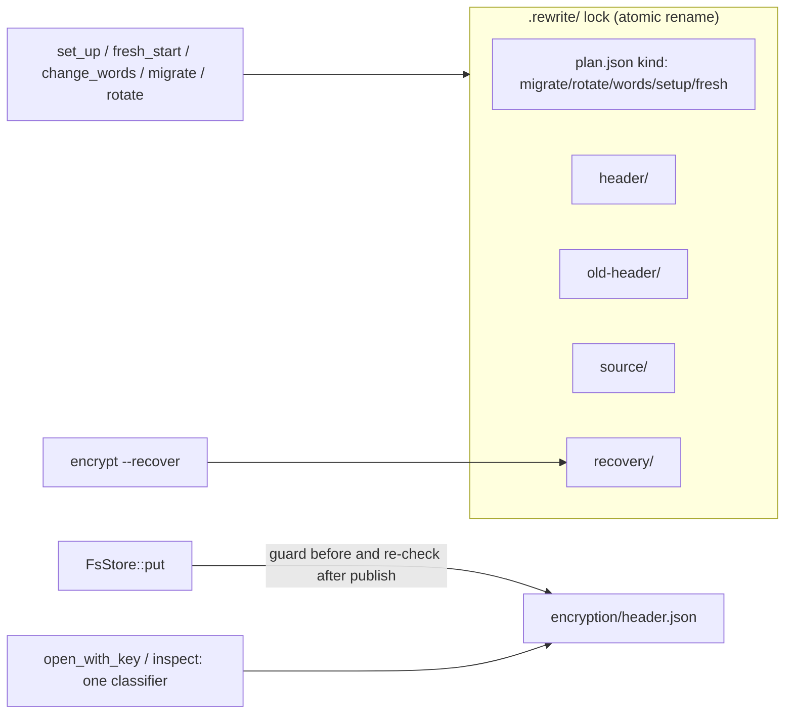

# Delivery Plan 00009: V0 2 1 Windows And Review Fixes

> [!abstract] Plan status: `draft`
> v0.2.1 fixes every finding of Review 00002 (four Major, five Medium, two
> Low, plus the administrative-lock question) without changing the v0.2.0
> store format, and adds Windows x86_64 as a supported platform with
> background `serve`, log-on start, owner-only key files, CI, and a release
> zip. All decisions are resolved; the plan waits for user approval.

## 1. Objective and outcome

v0.2.0 shipped encryption at rest. Review 00002 found that its state
transitions can lose a reported-successful send (rotation racing an upload),
disclose plaintext (an incomplete `encryption/` folder opening as plaintext;
old plaintext staging surviving encryption), and leave a store that the
documented recovery command cannot repair. v0.2.1 closes those gaps first,
because they concern data already entrusted to released software.

v0.2.1 then makes Windows a supported platform: the same CLI, `serve`
(foreground and background), `service-install`, local and SSH backends, and
encryption work from PowerShell on Windows 10/11 x86_64, and each release
publishes a Windows zip.

Observable outcome: every Review 00002 finding has a regression test that
failed before its fix; a v0.2.0 client still reads stores written by v0.2.1;
the Windows CI job builds and tests the workspace; the Release workflow
publishes a Windows zip beside the Linux and macOS archives.

## 2. Source traceability

| Requirement | Source | Source location | Interpretation |
|---|---|---|---|
| PLAN-00009-REQ-01 | User / Repository | `docs/backlog.md` v0.2.1 "Windows support"; user answer 3a (2026-09-15); `.github/workflows/ci.yml` | The workspace builds, lints, and tests on `x86_64-pc-windows-msvc` in CI |
| PLAN-00009-REQ-02 | Repository | `config.rs` `default_config_path`, `locate`, `~` expansion (l. 549); `daemon.rs` `Os`, `StatePaths::resolve` | Config, key, and state locations exist on Windows |
| PLAN-00009-REQ-03 | User | Answers 2a and "icacls" (2026-09-15); `key_file.rs` `load_key_file`, `write_private`; `cache.rs` `write_private` | Key file and list cache are owner-only on Windows; a readable-by-others key file is refused |
| PLAN-00009-REQ-04 | User | Answer 1a; `serve.rs` `start_daemon`, `stop`, `wait_for_stop_signal`; `daemon.rs` `detached_command` | `serve --daemon` and `serve --stop` work on Windows |
| PLAN-00009-REQ-05 | User | Answers 1a and "Run key, or Task Scheduler"; `service_install.rs` `current_platform`, `UNSUPPORTED` | `service-install`/`service-remove` start `serve` at log-on via the per-user Run key, or Task Scheduler with `--scheduler` |
| PLAN-00009-REQ-06 | Repository | `model.rs` `sanitise_file_name` | Pulled and downloaded file names are valid on Windows |
| PLAN-00009-REQ-07 | User | Answer 3a; user note on PowerShell (2026-09-15); `.github/workflows/release.yml` `binaries` | Releases publish an x86_64 Windows zip with checksum; docs show PowerShell usage |
| PLAN-00009-REQ-08 | Review | REV-00002-MAJ-01 | A send that raced a rotation never succeeds under the old key |
| PLAN-00009-REQ-09 | Review | REV-00002-MAJ-02 | Incomplete encryption layouts fail closed for keyless clients |
| PLAN-00009-REQ-10 | Review | REV-00002-MAJ-03 | Encryption leaves no unreported plaintext staging |
| PLAN-00009-REQ-11 | Review / User | REV-00002-MAJ-04; Open question "Concurrent administrative commands"; user answer 4a | Every header transition is journalled, locked, and recoverable |
| PLAN-00009-REQ-12 | Review | REV-00002-MED-01 | The rewrite journal appears atomically; a malformed legacy journal is recoverable |
| PLAN-00009-REQ-13 | Review | REV-00002-MED-02 | The key guard compares key ids, not stat data |
| PLAN-00009-REQ-14 | Review | REV-00002-MED-03 | The background cache identity follows the store's current key |
| PLAN-00009-REQ-15 | Review | REV-00002-MED-04 | Damaged encrypted content cannot starve pull mode |
| PLAN-00009-REQ-16 | Review | REV-00002-MED-05 | The key-file Git rule checks the physical location |
| PLAN-00009-REQ-17 | Review | REV-00002-LOW-01 | The old-client prune compatibility check exercises prune |
| PLAN-00009-REQ-18 | Review | REV-00002-LOW-02 | The v0.2.0 release notes state the synced-folder check was not run |
| PLAN-00009-REQ-19 | User / Repository | Answer 4a ("store format stays the same"); `Cargo.toml` `[workspace.package] version`; root `AGENTS.md` | v0.2.1 is a compatible patch release: store format and public API compatible with 0.2.0 |
| PLAN-00009-REQ-20 | Repository | Root `AGENTS.md` Release workflow; `docs/plans/AGENTS.md` backlog rule; user instruction to keep `docs/developer-guide.md` current | Docs, CHANGELOG, release notes, and backlog record the release |

## 3. Repository baseline

| Field | Value |
|---|---|
| Repository | `joelee/passalong` |
| Branch | `feature/00009-v0.2.1` (renamed from `prep/v0.2.1` at the user's request; local only) |
| HEAD | `255b734caf8a00a43154d9510cd7f95560f33d27` ("Preparing for v0.2.1 planning") |
| Working tree at publication | Clean before allocation; only this plan file added |
| Applicable instructions | Root `AGENTS.md` (Release workflow, contribution rules), `docs/plans/AGENTS.md`, `docs/reviews/AGENTS.md` |
| Workspace version | 0.2.0; toolchain 1.98.1; `unsafe_code = "forbid"` |
| Windows evidence | `cargo check --target x86_64-pc-windows-msvc -p passalong-core --all-targets --all-features` passes locally (one dead-code warning: `SystemGit::isolated` is used only by Unix tests). `passalong-ssh` and `passalong` cannot be checked on this Linux host because ring's C build needs the Windows SDK; the Windows CI job is their first evidence |

## 4. Scope

### In scope

- Fixes and regression tests for REV-00002-MAJ-01..04, MED-01..05,
  LOW-01..02, and exclusive locking of word changes and recovery.
- Recovery of v0.2.0 stores already left broken by an interrupted word
  change (header only in `v2/tmp/old-header-*` or `v2/tmp/header-*`).
- Windows 10/11 x86_64 (`x86_64-pc-windows-msvc`): build, paths, owner-only
  key file and list cache, `serve --daemon`/`--stop`, `service-install`
  (Run key; Task Scheduler with `--scheduler`), Windows-safe download names,
  CI job, release zip, PowerShell documentation.
- A v0.2.0 compatibility test beside the v0.1.6 one.
- Version 0.2.1, CHANGELOG, `docs/release/v0.2.1.md`, docs, backlog.

### Out of scope

- A real Windows service (SCM): services cannot reach the user's clipboard
  (session 0); discussed and declined 2026-09-15.
- `aarch64-pc-windows-msvc` builds, winget/Scoop manifests (answer 3a).
- Amazon S3 and the cloud-synced-folder check (backlog v0.2.2).
- Power-loss durability and lost-acknowledgement modelling (Review 00002
  open question 3): documented as a limit, not solved.
- Multi-replica coordination on synced folders (Review 00002 open question
  2; IDEA-00001-R05-MED-01): the single-admin rule is documented.
- Any store layout change, and GUI/Android work.
- Editing the published GitHub release text of v0.2.0 (the user's action;
  replacement text is supplied at hand-off).

## 5. Constraints and preserved decisions

- The store format of v0.2.0 is unchanged: v0.2.0 clients keep reading and
  writing stores that v0.2.1 wrote. New journal kinds may make a v0.2.0
  client refuse a store while a v0.2.1 admin operation is in progress (it
  sees `.rewrite/`), which is the existing fail-closed behaviour.
- `passalong-core` and `passalong-ssh` public APIs stay semver-compatible
  with 0.2.0: only additions, and only additions of variants to
  `#[non_exhaustive]` enums. `RewriteKind` and `RewritePlan` are exhaustive
  and stay unchanged.
- `unsafe_code = "forbid"` stays (answer "icacls").
- No new crates in `Cargo.lock` except where a step states one; Windows code
  uses `std` and built-in Windows tools (`icacls`, `whoami`, `reg`,
  `schtasks`).
- Encryption decisions D-11..D-21 of PLAN-00008 stay: header layout, key
  wrapping, key file format, the fail-closed table, and the five-minute
  "not complete yet" grace.
- Standing rules: no secrets in code, tests, docs, logs, or VCS; never tag or
  publish; never `git add -A`/`.`, `--amend`, or `--no-verify`; no desktop
  clipboard tests on the user's machine; one commit per step.

## 6. Assumptions

None. Unresolved matters are recorded as decisions and block approval when
material.

## 7. Decisions and blockers

| ID | Decision or blocker | Resolution | Owner | Status |
|---|---|---|---|---|
| D-01 | Which Review 00002 findings v0.2.1 fixes | All 11, plus exclusive locking of word changes and recovery (user answer 4a) | User | Resolved |
| D-02 | Background `serve` on Windows | Full parity: `--daemon` and `--stop` (answer 1a) | User | Resolved |
| D-03 | Log-on start on Windows | `service-install` writes a per-user Run value (`HKCU\Software\Microsoft\Windows\CurrentVersion\Run`, name `passalong-serve`) with `reg add`; no admin needed. `service-install --scheduler` instead registers a Task Scheduler log-on task with restart-on-failure from XML (`schtasks /Create /XML`), which needs an administrator prompt. `service-remove` removes whichever exists. A Run command line over 260 characters is refused with advice to use `--scheduler` or a shorter config path (answer "Run key, or Task Scheduler") | User | Resolved |
| D-04 | Owner-only key file on Windows | `icacls`: after writing, `icacls <file> /inheritance:r /grant:r *<SID>:F`, with the SID from `whoami /user /fo csv /nh`; the key folder gets the same with `(OI)(CI)`. On load, `icacls <file>` must list exactly one entry, for the account `whoami` names, or the key is refused. Tools run behind a trait (like `GitCheck`) so parsing is unit-tested on every platform (answers 2a, "icacls") | User | Resolved |
| D-05 | Windows file locations | Config `%APPDATA%\passalong\config.toml` (in the lookup order where `$XDG_CONFIG_HOME` and `$HOME/.config` are elsewhere), system config `%ProgramData%\passalong\config.toml` (where `/etc` is), key file beside the config, state `%LOCALAPPDATA%\passalong\` (pid, log, list cache), `~` from `USERPROFILE`. On Windows the XDG variables and `HOME` are not consulted, so Git Bash's `HOME` does not move files | Planner | Resolved |
| D-06 | `serve --stop` on Windows (no SIGTERM) | `--stop` creates `serve.stop` in the state folder; a running `serve` checks for it every second, removes it, and stops as on SIGTERM. `serve` removes a stale `serve.stop` at start. Unix keeps SIGTERM | Planner | Resolved |
| D-07 | Console window at log-on | The Run value runs `passalong.exe --config <abs> serve --daemon`: its console window shows until the detached child is ready (normally under 2 s), then closes; the child runs with `CREATE_NO_WINDOW`. Documented; a windowless launcher is added to the backlog | Planner | Resolved |
| D-08 | Release artefacts | `passalong-<v>-x86_64-pc-windows-msvc.zip` (exe, LICENSE, README.md) and `.zip.sha256`, built on `windows-latest` (answer 3a) | User | Resolved |
| D-09 | Shell on Windows | PowerShell is the documented shell (user, 2026-09-15). Docs show PowerShell syntax, and state that piping binary data into `passalong` needs PowerShell 7.4+ (Windows PowerShell 5.1 re-encodes pipes); file arguments work in any shell. `just` recipes stay bash (Git Bash on Windows) | User / Planner | Resolved |
| D-10 | Fencing uploads against rotation (MAJ-01) | No layout change. After the publishing rename, `put` re-checks: `.rewrite/` absent and the header's key id (read, not stat) equals the store's. On failure it moves its just-published item into its staging grave and removes it (a `NotFound` means a rotation already took it into its source), then returns `EncryptionError::KeyChanged` or `Rewriting`. Any rotation whose source move preceded the publish is visible at the re-check, because the lock is taken before the move and removed after the header swap. The uploader treats these errors as retryable and keeps the local file (no move/delete) | Planner | Resolved |
| D-11 | One state classifier (MAJ-02) | `inspect` and `open_with_key` share one classifier: an `encryption/` entry of any kind without a readable header is `Broken`, never `Plain`. A plaintext `FsStore` opened through `open_with_key` gets a plain guard: before `put` and `delete` it refuses when `encryption/` exists or `items` is not a folder | Planner | Resolved |
| D-12 | Legacy plaintext staging (MAJ-03) | Migration, fresh start, and set-up remove the plaintext `tmp/` folder once the stop file is in place (old writers can no longer publish, so its contents are dead). For stores encrypted by v0.2.0, a new `encryption::legacy_plaintext(fs)` counts entries under `tmp/`; `list` and `check` warn with the count, `prune --plain` removes them, and a sealed store's `clean_staging` also removes `tmp/` entries past the staging age. `StoreState` variants keep their fields (adding one would break matching) | Planner | Resolved |
| D-13 | Header journal and admin lock (MAJ-04, open question 1) | Set-up, fresh start, and word change run under the `.rewrite/` lock with a journal: new header in `.rewrite/header/`, current header copied to `.rewrite/old-header/`. Recovery finishes (installs the new header) or undoes (restores the old; for set-up and fresh start also removes the stop file and moves `plain/items` back). A new public `#[non_exhaustive] enum Journal` and `read_journal()` cover all kinds; `read_plan` keeps its signature and returns `EncryptionError::Layout` for a non-rewrite journal. Recovery takes `.rewrite/recovery/` exclusively; a second recovery is refused, and one found older than 10 minutes is offered for take-over after confirmation | Planner | Resolved |
| D-14 | Broken stores without a journal | `encrypt --recover` on a `Broken` store looks for staged headers under `v2/tmp/header-*` and `v2/tmp/old-header-*`, asks for the words, and installs the candidate the words unlock whose key opens the metadata of at least one sealed item (or any, when there are none). With no usable candidate it exits non-zero with guidance; "nothing to recover" (exit 0) is reserved for a healthy store | Planner | Resolved |
| D-15 | Atomic journal publication (MED-01) | The journal is written complete into `.rewrite-<token>/` and renamed to `.rewrite/`; the rename is the lock (both backends refuse an existing target). Leftover `.rewrite-*` folders are removed by recovery and reported by `check`. A malformed legacy (v0.2.0) `plan.json` releases the lock only when `.rewrite/` holds no `source/`, `header/`, or `old-header/`; otherwise recovery stops with guidance and deletes nothing | Planner | Resolved |
| D-16 | Key guard (MED-02) | `check_key` reads the header and compares key ids on every guarded call; the stat cache is removed. Cost: one small read per `put`, `delete`, `list_ids` | Planner | Resolved |
| D-17 | Cache identity (MED-03) | `refresh_loop` derives the identity from each opened store's `key_id()`; a changed identity discards the in-memory cache and rebuilds it before saving | Planner | Resolved |
| D-18 | Pull classification (MED-04) | Decryption failures carry `CryptoError` inside the `io::Error`; pull tells them from transport errors. Within the grace: defer the item (not seen) and continue with later items. Past the grace: warn, mark seen, continue. `get_meta` returning `Incomplete` is deferred the same way. Transport errors stay retryable | Planner | Resolved |
| D-19 | Physical key path (MED-05) | Resolve the deepest existing ancestor with `canonicalize`, append the missing components, and run the work-tree search and `git check-ignore` on that path, for save, load, and `check_key_location` | Planner | Resolved |
| D-20 | Version and API | Version 0.2.1. `cargo-semver-checks` (installed as a tool, not a dependency) must pass for `passalong-core` and `passalong-ssh` against 0.2.0 | Planner | Resolved |
| D-21 | Order | Review fixes (STEP-01..07) before Windows (STEP-08..11): data safety first, and the Windows CI job then tests the fixed code | Planner | Resolved |
| D-22 | v0.2.0 GitHub release text (LOW-02) | The repository file is corrected; the replacement sentence for the published release is handed to the user, who edits it or not | User | Resolved |

None of these block approval.

## 8. Affected architecture and components

**Encryption core** (`crates/passalong-core/src/encryption/`):
- `open.rs`: `open_with_key` uses the shared classifier; plaintext stores get
  the plain guard.
- `admin.rs`: `inspect` becomes the classifier; `set_up`, `fresh_start`,
  `change_words` run under the journal; new `legacy_plaintext`.
- `header.rs`: `replace_header` is no longer used unjournalled; staging
  helpers move into the journal.
- `rewrite.rs`: atomic journal publication, `Journal`/`read_journal`, new
  journal kinds, recovery marker, broken-store candidate recovery, legacy
  plan handling, `tmp/` removal after the stop file.
- `key_file.rs`: physical path resolution; Windows ACL through a new
  `AclTool` trait with an `icacls`/`whoami` implementation.
- `mod.rs`: new `EncryptionError` variants as needed (enum is
  `#[non_exhaustive]`).

**Store** (`crates/passalong-core/src/store/fs_store.rs`): `check_key` reads
the header; post-publish re-check and retraction in `put`; plain guard;
legacy `tmp/` cleanup in sealed `clean_staging`.

**Serve** (`crates/passalong-core/src/serve/{upload,pull}.rs`,
`crates/passalong-core/src/cache.rs`): retryable key errors keep the local
file; pull deferral/skip classification; identity from the opened store.

**Crypto** (`crates/passalong-core/src/crypto/stream.rs`): read errors carry
`CryptoError` as the inner error.

**Model** (`crates/passalong-core/src/model.rs`): `sanitise_file_name` adds
the Windows rules.

**Config and state** (`crates/passalong-core/src/config.rs`,
`crates/passalong-cli/src/daemon.rs`): Windows locations; `Os::Windows`.

**CLI** (`crates/passalong-cli/src/`): `commands/encrypt.rs` recovery flows;
`commands/serve.rs` Windows daemon and stop file; `daemon.rs`
`detached_command` for Windows; `commands/service_install.rs` and
`service.rs` Run key and Task Scheduler; `commands/check.rs` and
`commands/prune.rs` legacy plaintext; `commands/list.rs` warning.

**Tests**: `crates/passalong-core/src/testing.rs` (`FaultyFs` gains
write-level faults: fail after N bytes, fail on shutdown),
`crates/passalong-cli/tests/compat_v016.rs`, new
`crates/passalong-cli/tests/compat_v020.rs`, `tests/sftp_docker.rs`,
`tests/cli_local_backend.rs`, `tests/cli_ssh_backend.rs`.

**CI/release**: `.github/workflows/ci.yml` (Windows job),
`.github/workflows/release.yml` (Windows build and zip), `justfile`
(`test-compat` gains v0.2.0; a `windows-check` recipe).

## 9. Requirement catalogue

### PLAN-00009-REQ-01 — Windows build and CI

- **Requirement:** The workspace builds with `--locked`, passes `cargo clippy --workspace --all-targets --all-features -- -D warnings`, and passes `cargo test --workspace --all-features` (non-ignored tests) on `windows-latest` for `x86_64-pc-windows-msvc`, in a new CI job.
- **Rationale:** Windows support needs continuous evidence; this host cannot build ring for Windows.
- **Source:** `docs/backlog.md` v0.2.1; user answer 3a.
- **Acceptance evidence:** PLAN-00009-AC-15.

### PLAN-00009-REQ-02 — Windows file locations

- **Requirement:** On Windows, config lookup, `init`'s default path, the default key path, the state folder, and `~` expansion use the locations of D-05; Unix behaviour is unchanged.
- **Rationale:** `HOME` and XDG variables are normally unset on Windows; without this `init` and `serve` have no paths.
- **Source:** `config.rs` `default_config_path`, `locate`; `daemon.rs` `StatePaths::resolve`.
- **Acceptance evidence:** PLAN-00009-AC-16.

### PLAN-00009-REQ-03 — Owner-only key file and list cache on Windows

- **Requirement:** On Windows the key file, its folder, and the list cache are restricted to the current user as D-04 describes, and `load_key_file` refuses a key file whose access list has any other entry, with a message naming the `icacls` command that fixes it.
- **Rationale:** The Unix 0600 rule has no effect on Windows; the user chose parity.
- **Source:** User answers 2a and "icacls".
- **Acceptance evidence:** PLAN-00009-AC-17.

### PLAN-00009-REQ-04 — Background serve on Windows

- **Requirement:** `serve --daemon` starts a detached, windowless `serve` and reports its pid and log; `serve --stop` stops it within the existing stop timeout through the stop file of D-06; the pid lock prevents a second `serve`.
- **Rationale:** User answer 1a.
- **Source:** `serve.rs` `start_daemon`, `stop` (`cfg(not(unix))` bails today).
- **Acceptance evidence:** PLAN-00009-AC-19.

### PLAN-00009-REQ-05 — Log-on start on Windows

- **Requirement:** `service-install` and `service-remove` work on Windows per D-03 and D-07, including `--scheduler`, the 260-character refusal, and removal of either form.
- **Rationale:** User answer "Run key, or Task Scheduler".
- **Source:** `service_install.rs` `current_platform`, `UNSUPPORTED`; `service.rs` `ServiceManager`.
- **Acceptance evidence:** PLAN-00009-AC-20, PLAN-00009-AC-22.

### PLAN-00009-REQ-06 — Windows-safe file names

- **Requirement:** `sanitise_file_name` additionally replaces `< > : " | ? *` with `_`, strips trailing dots and spaces, and prefixes `_` to the reserved device names (`CON`, `PRN`, `AUX`, `NUL`, `COM1`..`COM9`, `LPT1`..`LPT9`, with or without an extension), on every platform, so a name that works on Windows is chosen everywhere.
- **Rationale:** Files sent from Linux or macOS must download on Windows.
- **Source:** `model.rs` `sanitise_file_name`.
- **Acceptance evidence:** PLAN-00009-AC-18.

### PLAN-00009-REQ-07 — Windows release and PowerShell docs

- **Requirement:** The Release workflow builds `x86_64-pc-windows-msvc` on `windows-latest` and uploads the zip and checksum of D-08; README and `docs/usage.md` document Windows installation and PowerShell usage per D-09.
- **Rationale:** User answers 3a and the PowerShell note.
- **Source:** `.github/workflows/release.yml` `binaries`.
- **Acceptance evidence:** PLAN-00009-AC-21, PLAN-00009-AC-26.

### PLAN-00009-REQ-08 — Uploads cannot publish under a replaced key

- **Requirement:** A `put` whose key was replaced or whose store entered a rewrite at any point before its re-check returns a retryable error and leaves no item under the old key in `v2/items/`; the serve uploader keeps the local file and retries.
- **Rationale:** REV-00002-MAJ-01: reported success followed by data loss with `after_send = "delete"`.
- **Source:** REV-00002-MAJ-01; D-10.
- **Acceptance evidence:** PLAN-00009-AC-08.

### PLAN-00009-REQ-09 — Fail-closed classification

- **Requirement:** Every layout with an `encryption/` entry but no readable header opens as `Broken` for every client; a plaintext store handle refuses `put` and `delete` once `encryption/` exists or `items` stops being a folder.
- **Rationale:** REV-00002-MAJ-02: out-of-order synced delivery can otherwise disclose plaintext.
- **Source:** REV-00002-MAJ-02; D-11.
- **Acceptance evidence:** PLAN-00009-AC-05, PLAN-00009-AC-06.

### PLAN-00009-REQ-10 — No unreported plaintext staging

- **Requirement:** After migration, fresh start, or set-up, no plaintext `tmp/` remains; in stores encrypted by v0.2.0, `list` and `check` report legacy plaintext staging and `prune --plain` removes it.
- **Rationale:** REV-00002-MAJ-03.
- **Source:** REV-00002-MAJ-03; D-12.
- **Acceptance evidence:** PLAN-00009-AC-07.

### PLAN-00009-REQ-11 — Journalled, exclusive header transitions

- **Requirement:** Set-up, fresh start, and word change are journalled and locked as D-13 describes; recovery completes or undoes an interruption at any filesystem call; concurrent word change, rewrite, and recovery exclude each other; broken v0.2.0 stores are recoverable per D-14.
- **Rationale:** REV-00002-MAJ-04 and open question 1.
- **Source:** REV-00002-MAJ-04; user answer 4a.
- **Acceptance evidence:** PLAN-00009-AC-02, PLAN-00009-AC-03, PLAN-00009-AC-04.

### PLAN-00009-REQ-12 — Atomic journal

- **Requirement:** `.rewrite/` never exists without a complete, parseable journal written by v0.2.1; a malformed v0.2.0 journal is handled per D-15.
- **Rationale:** REV-00002-MED-01.
- **Source:** REV-00002-MED-01.
- **Acceptance evidence:** PLAN-00009-AC-01.

### PLAN-00009-REQ-13 — Key-id guard

- **Requirement:** `check_key` compares the header's key id on every guarded call.
- **Rationale:** REV-00002-MED-02: equal size and whole-second mtime are not a key identity.
- **Source:** REV-00002-MED-02; D-16.
- **Acceptance evidence:** PLAN-00009-AC-09.

### PLAN-00009-REQ-14 — Cache identity follows the key

- **Requirement:** A running `serve`'s list cache is saved under the identity of the key its current store connection uses.
- **Rationale:** REV-00002-MED-03.
- **Source:** REV-00002-MED-03; D-17.
- **Acceptance evidence:** PLAN-00009-AC-10.

### PLAN-00009-REQ-15 — Pull mode survives damaged items

- **Requirement:** Pull mode classifies decryption failures per D-18, never applies damaged content, and keeps delivering later items.
- **Rationale:** REV-00002-MED-04.
- **Source:** REV-00002-MED-04.
- **Acceptance evidence:** PLAN-00009-AC-11.

### PLAN-00009-REQ-16 — Physical key location

- **Requirement:** The Git work-tree rule applies to the physical path of the key file, including through symlinked ancestors and not-yet-existing components.
- **Rationale:** REV-00002-MED-05.
- **Source:** REV-00002-MED-05; D-19.
- **Acceptance evidence:** PLAN-00009-AC-12.

### PLAN-00009-REQ-17 — Honest prune compatibility check

- **Requirement:** `compat_v016.rs` runs v0.1.6 `prune` with its real flags, with a positive control on a plaintext store.
- **Rationale:** REV-00002-LOW-01.
- **Source:** REV-00002-LOW-01.
- **Acceptance evidence:** PLAN-00009-AC-13.

### PLAN-00009-REQ-18 — Correct v0.2.0 notes

- **Requirement:** `docs/release/v0.2.0.md` says no synced-folder provider was tested and points to the backlog check.
- **Rationale:** REV-00002-LOW-02.
- **Source:** REV-00002-LOW-02; D-22.
- **Acceptance evidence:** PLAN-00009-AC-14.

### PLAN-00009-REQ-19 — Compatible patch release

- **Requirement:** Version 0.2.1; a v0.2.0 client lists and loads items of a store v0.2.1 encrypted, re-worded, and rotated; `cargo-semver-checks` passes against 0.2.0.
- **Rationale:** User answer 4a; Cargo treats 0.2.1 as compatible with 0.2.0.
- **Source:** User answer 4a; D-20.
- **Acceptance evidence:** PLAN-00009-AC-23, PLAN-00009-AC-24.

### PLAN-00009-REQ-20 — Release records and docs

- **Requirement:** CHANGELOG Unreleased, `docs/release/v0.2.1.md` (with measured timings and coverage), README, `docs/usage.md`, `docs/configuration.md`, `docs/architecture.md`, `docs/developer-guide.md` (a Windows section), and `docs/backlog.md` are updated; the single-admin rule and crash-durability limit are documented.
- **Rationale:** Root `AGENTS.md` Release workflow; plan-guide backlog rule.
- **Source:** Root `AGENTS.md`; `docs/plans/AGENTS.md`.
- **Acceptance evidence:** PLAN-00009-AC-25, PLAN-00009-AC-26.

## 10. Delivery strategy

Review fixes come first, in dependency order: the journal (STEP-01) is the
foundation for journalled header changes (STEP-02); the classifier
(STEP-03) and plaintext cleanup (STEP-04) then use the journal's kinds; the
store guard and fencing (STEP-05) are independent of those but share the
header-reading code; serve-side fixes (STEP-06) build on the new error
classification; the three small fixes (STEP-07) close the review. Each fix
lands test-first: a regression test reproducing the review's failure
scenario is written and seen failing before the fix.

Windows follows: STEP-08 adds the CI job and platform paths so every later
Windows step is tested on a Windows runner; STEP-09 (ACLs) and STEP-10
(background serve, log-on start) are platform features; STEP-11 packages,
documents, and versions the release; STEP-12 is the final gate.

Test approach: `FaultyFs` gains write-level faults (fail after N bytes, fail
on shutdown) so journal and header tests cover partial writes. Concurrency
cases (MAJ-01) use a test filesystem that pauses a chosen call until
released, so interleavings are deterministic, and run on LocalFs and on the
Docker SFTP server. Windows-only code runs behind traits (`AclTool`,
`ServiceManager`, a stop-signal source) with unit tests everywhere and real
tests on the Windows runner.

Checkpoints: each step ends with its verification commands green and one
commit. `just ci` is run in full at STEP-07 (end of review fixes) and at
STEP-12.

## 11. Detailed implementation steps

### PLAN-00009-STEP-01 — Atomic journal and recovery lock

- **Objective:** `.rewrite/` appears only complete, recovery is exclusive, and a malformed v0.2.0 journal is handled safely.
- **Requirements:** `PLAN-00009-REQ-12`, `PLAN-00009-REQ-11`
- **Depends on:** None
- **Affected components:** `encryption/rewrite.rs` (`lock`, `read_plan`, `undo`, `finish`, new `Journal`, `read_journal`, recovery marker); `testing.rs` (`FaultyFs` write faults); `commands/encrypt.rs` (`recover`).
- **Preconditions:** Clean tree on `feature/00009-v0.2.1`; plan approved.
- **Test or evidence first:** Tests that create `.rewrite/` with an empty and a truncated `plan.json`, with and without `source/`, and assert today's `finish`/`undo` fail (reproducing MED-01); a `FaultyFs` test that fails `write_all` after N bytes of `plan.json`.
- **Implementation tasks:**
  1. Add `FaultyFs` faults: fail a writer after N bytes, fail on `shutdown`.
  2. Write the journal into `.rewrite-<token>/plan.json`, then rename to `.rewrite`; map `AlreadyExists` to `Rewriting`; remove the staging folder on failure.
  3. Add `#[non_exhaustive] pub enum Journal` (rewrite: `RewritePlan`; header change: kind, started time, key ids) and `read_journal`; `read_plan` returns `Layout` for non-rewrite journals.
  4. Recovery marker `.rewrite/recovery/` via `create_dir`; refuse a second recovery; offer take-over of a marker older than 10 minutes after confirmation.
  5. Malformed journal: release the lock only when `.rewrite/` has no `source/`, `header/`, `old-header/`; otherwise stop with guidance and delete nothing. Remove leftover `.rewrite-*` staging during recovery.
- **Documentation/configuration/operations:** Rustdoc on the journal format.
- **Verification:** `cargo test -p passalong-core encryption::` and `cargo test -p passalong --test cli_local_backend encrypt_`; the new tests pass.
- **Completion criteria:** PLAN-00009-AC-01 met; existing rewrite tests pass.
- **Rollback or recovery:** Revert the step commit; no store format change.
- **Builder stop conditions:** SFTP rename onto an existing `.rewrite` succeeds instead of failing (the lock would not be exclusive); stop and report.

### PLAN-00009-STEP-02 — Journalled header transitions and broken-store recovery

- **Objective:** Set-up, fresh start, and word change are journalled, exclusive, and recoverable; v0.2.0 broken stores recover.
- **Requirements:** `PLAN-00009-REQ-11`
- **Depends on:** PLAN-00009-STEP-01
- **Affected components:** `encryption/admin.rs` (`set_up`, `fresh_start`, `change_words`), `encryption/header.rs` (`replace_header`, `stage`), `encryption/rewrite.rs` (finish/undo for new kinds, candidate search), `commands/encrypt.rs` (`recover` output and exit codes).
- **Preconditions:** STEP-01 committed.
- **Test or evidence first:** A test interrupting `change_words` between the two header renames, then running the CLI `encrypt --recover`: today it prints "no re-encryption to recover" and the store stays broken (reproduces MAJ-04).
- **Implementation tasks:**
  1. Run `set_up`, `fresh_start`, `change_words` under the journal of STEP-01, with `header/` and `old-header/` staged inside `.rewrite/`.
  2. Finish: install the new header, remove the journal. Undo: restore the old header (word change); remove the stop file and move `plain/items` back (fresh start); remove the stop file and header (set-up).
  3. `change_words` refuses while `.rewrite/` exists (the lock does this).
  4. D-14 candidate recovery for `Broken` stores; non-zero exit when nothing usable is found.
  5. Fault-inject every filesystem call of each transition (existing matrix pattern) and recover each state through `finish` and `undo`.
- **Documentation/configuration/operations:** `docs/usage.md` recovery section.
- **Verification:** `cargo test -p passalong-core encryption::`; CLI tests `encrypt_recover_*`.
- **Completion criteria:** PLAN-00009-AC-02, AC-03, AC-04 met.
- **Rollback or recovery:** Revert; stores written during development are test fixtures only.
- **Builder stop conditions:** A fault point exists where neither finish nor undo restores a usable store; stop, record the state, and report.

### PLAN-00009-STEP-03 — One fail-closed classifier and the plain guard

- **Objective:** No incomplete encryption layout is treated as plaintext.
- **Requirements:** `PLAN-00009-REQ-09`
- **Depends on:** PLAN-00009-STEP-02
- **Affected components:** `encryption/open.rs` (`open_with_key`), `encryption/admin.rs` (`inspect`), `store/fs_store.rs` (plain guard).
- **Preconditions:** STEP-02 committed.
- **Test or evidence first:** Tests building `encryption/` alone and `encryption/` plus an `items/` folder; opening without a key currently succeeds as plaintext.
- **Implementation tasks:**
  1. Extract the classifier used by both functions; `encryption/` without a readable header, or with a header and `items` a folder, is `Broken`.
  2. Add the plain guard to plaintext stores opened through `open_with_key`: stat `encryption` and `items` before `put` and `delete`.
  3. Staged-arrival tests: every order of stop file, `encryption/`, and header arriving; a send in each state writes no marker bytes (recursive scan).
  4. Repeat the arrival test on SFTP in `sftp_docker.rs`.
- **Documentation/configuration/operations:** Update the decision table in `open.rs` rustdoc and `docs/architecture.md`.
- **Verification:** `cargo test -p passalong-core encryption::open`; `just test-integration` for the SFTP case.
- **Completion criteria:** PLAN-00009-AC-05, AC-06 met.
- **Rollback or recovery:** Revert.
- **Builder stop conditions:** A v0.1.6 or v0.2.0 compatibility test regresses.

### PLAN-00009-STEP-04 — Remove and report legacy plaintext staging

- **Objective:** Encryption leaves no unreported plaintext.
- **Requirements:** `PLAN-00009-REQ-10`
- **Depends on:** PLAN-00009-STEP-03
- **Affected components:** `encryption/rewrite.rs` (`run` after the stop file), `encryption/admin.rs` (`set_up`, `fresh_start`, new `legacy_plaintext`), `store/fs_store.rs` (`clean_staging`, `remind_plain_left`), `commands/{check,prune,list}.rs`.
- **Preconditions:** STEP-03 committed.
- **Test or evidence first:** Seed `tmp/<token>/content` and `tmp/deleted-*` with a marker in a plaintext store, then migrate; the marker survives today (reproduces MAJ-03).
- **Implementation tasks:**
  1. Remove `tmp/` after the stop file is written, in migration, fresh start, and set-up (inside their journals).
  2. `legacy_plaintext(fs)` counts entries under `tmp/` of an encrypted store.
  3. `list` and `check` warn with the count; `prune --plain` removes `tmp/`; sealed `clean_staging` removes aged `tmp/` entries.
  4. Recursive marker scans after migration, fresh start (after `prune --plain`), and empty-store set-up.
- **Documentation/configuration/operations:** `docs/usage.md` (`prune --plain`), security notes in `docs/architecture.md`.
- **Verification:** `cargo test -p passalong-core`; CLI tests for `check` and `prune --plain`.
- **Completion criteria:** PLAN-00009-AC-07 met.
- **Rollback or recovery:** Revert.
- **Builder stop conditions:** A `tmp/` entry is found that a v0.2.0 or later writer could still publish from (would make removal unsafe).

### PLAN-00009-STEP-05 — Key-id guard and post-publish fencing

- **Objective:** No upload succeeds under a replaced key; the guard does not trust stat data.
- **Requirements:** `PLAN-00009-REQ-08`, `PLAN-00009-REQ-13`
- **Depends on:** PLAN-00009-STEP-04
- **Affected components:** `store/fs_store.rs` (`check_key`, `put`, `stage_and_publish`, `guarded`), `encryption/open.rs`, `serve/upload.rs` (`send_file`, text sends), a pausing test filesystem in `testing.rs`.
- **Preconditions:** STEP-04 committed.
- **Test or evidence first:** (a) Replace the header with another key preserving size and mtime; `put` currently succeeds (MED-02). (b) Pause `put` after its first guard, complete a rotation, resume: `put` currently succeeds under K1 (MAJ-01).
- **Implementation tasks:**
  1. `check_key` reads the header each call; drop the `(size, mtime)` cache (`guarded` keeps its signature and ignores the values, or becomes crate-private if unused outside).
  2. After the publishing rename, re-check per D-10; retract and return the key error on failure.
  3. The uploader classifies `KeyChanged`/`Rewriting` as retryable store failures: no move or delete of the local file; the job is retried after reopening.
  4. Interleaving tests on LocalFs and SFTP, including `after_send = "delete"`.
- **Documentation/configuration/operations:** Architecture note on the fencing argument.
- **Verification:** `cargo test -p passalong-core store:: serve::`; `just test-integration`.
- **Completion criteria:** PLAN-00009-AC-08, AC-09 met; the `list --nocache` timing at 100 encrypted items stays within 20 % of v0.2.0's 136 ms.
- **Rollback or recovery:** Revert.
- **Builder stop conditions:** An interleaving is found where the re-check passes but the item is lost; stop and report before choosing another protocol.

### PLAN-00009-STEP-06 — Cache identity and pull classification

- **Objective:** A long-running `serve` stays correct across key changes and damaged items.
- **Requirements:** `PLAN-00009-REQ-14`, `PLAN-00009-REQ-15`
- **Depends on:** PLAN-00009-STEP-05
- **Affected components:** `cache.rs` (`refresh_loop`, `refresh_once`, `store_identity`), `commands/serve.rs`, `crypto/stream.rs` (error kinds), `serve/pull.rs` (`poll`, `download`, `fetch`, `read_failed`).
- **Preconditions:** STEP-05 committed.
- **Test or evidence first:** (a) Keep `refresh_loop` alive across migration and a rotation-plus-rejoin; the saved identity keeps the old key today. (b) Corrupt one byte of an old foreign encrypted file ahead of a valid file and a clipboard item; today later items never arrive.
- **Implementation tasks:**
  1. Identity from the opened store's `key_id()` (base identity from config plus the key suffix); rebuild on change.
  2. Stream read errors wrap `CryptoError`; pull detects it, applies D-18, and continues the poll.
  3. `get_meta` → `Incomplete`: defer and continue.
- **Documentation/configuration/operations:** `docs/usage.md` pull-mode notes.
- **Verification:** `cargo test -p passalong-core cache:: serve::pull`.
- **Completion criteria:** PLAN-00009-AC-10, AC-11 met.
- **Rollback or recovery:** Revert.
- **Builder stop conditions:** None beyond failing tests.

### PLAN-00009-STEP-07 — Physical key path, compatibility checks, v0.2.0 notes

- **Objective:** Close MED-05, LOW-01, LOW-02, and add the v0.2.0 compatibility gate.
- **Requirements:** `PLAN-00009-REQ-16`, `PLAN-00009-REQ-17`, `PLAN-00009-REQ-18`, `PLAN-00009-REQ-19`
- **Depends on:** PLAN-00009-STEP-06
- **Affected components:** `encryption/key_file.rs` (`work_tree`, `check_git`, `save_key_file`, `load_key_file`); `crates/passalong-cli/tests/compat_v016.rs`; new `crates/passalong-cli/tests/compat_v020.rs`; `justfile` `test-compat`; `docs/release/v0.2.0.md`.
- **Preconditions:** STEP-06 committed.
- **Test or evidence first:** A temporary repo reached through a symlinked config folder: `save_key_file` succeeds today (MED-05). Running the v0.1.6 prune invocation against a plaintext store fails today with a usage error (LOW-01).
- **Implementation tasks:**
  1. D-19 physical path resolution for save, load, and `check_key_location`; tests for missing final components and symlinked read paths.
  2. `compat_v016.rs`: `prune --older-than 1m --yes`; positive control prunes an eligible plaintext item; the encrypted case exits non-zero with the store unchanged.
  3. `compat_v020.rs`: download and checksum the v0.2.0 Linux archive like v0.1.6; v0.2.1 encrypts, changes words, rotates, and sends; v0.2.0 lists and loads every item and sends one that v0.2.1 then loads.
  4. Correct `docs/release/v0.2.0.md:152` to: "No synced-folder provider was tested; the two-device check is in the backlog (v0.2.2)."
  5. Run `just ci` in full.
- **Documentation/configuration/operations:** `docs/developer-guide.md` compat section lists both archives.
- **Verification:** `just test-compat`; `just ci`.
- **Completion criteria:** PLAN-00009-AC-12, AC-13, AC-14, AC-23 met; `just ci` green.
- **Rollback or recovery:** Revert.
- **Builder stop conditions:** The v0.2.0 client cannot read a store written by v0.2.1 (format drift): stop, since REQ-19 forbids it.

### PLAN-00009-STEP-08 — Windows CI, paths, and file names

- **Objective:** The workspace builds and tests on Windows with Windows locations.
- **Requirements:** `PLAN-00009-REQ-01`, `PLAN-00009-REQ-02`, `PLAN-00009-REQ-06`
- **Depends on:** PLAN-00009-STEP-07
- **Affected components:** `.github/workflows/ci.yml` (new `windows` job); `justfile` (`windows-check`); `config.rs` (`locate`, `default_config_path`, `SearchRoots::from_system`, `~` expansion); `daemon.rs` (`Os::Windows`, `StatePaths::resolve`); `model.rs` (`sanitise_file_name`); tests with Unix-only assumptions.
- **Preconditions:** STEP-07 committed; branch pushed so CI runs.
- **Test or evidence first:** Path unit tests with `MapEnv` for `Os::Windows` / Windows env, and name-sanitising tests, written first and failing.
- **Implementation tasks:**
  1. `windows` CI job on `windows-latest`: toolchain 1.98.1, rust-cache, `cargo build --locked`, `cargo clippy --workspace --all-targets --all-features -- -D warnings`, `cargo test --workspace --all-features`.
  2. D-05 locations; the location logic takes the platform as a parameter so Windows cases are unit-tested on every OS.
  3. REQ-06 sanitising rules with tests.
  4. Gate Unix-specific tests with `cfg(unix)` and add Windows counterparts where behaviour differs (paths, permissions); fix the `SystemGit::isolated` dead-code warning.
  5. Iterate on CI until the job is green; record each Windows-specific failure and fix in the work log.
- **Documentation/configuration/operations:** `docs/configuration.md` Windows locations; `docs/developer-guide.md` Windows section (toolchain, MSVC build tools, Git Bash for `just`).
- **Verification:** CI `windows` job green; `cargo test --workspace` green on Linux.
- **Completion criteria:** PLAN-00009-AC-15, AC-16, AC-18 met.
- **Rollback or recovery:** Revert; the CI job is additive.
- **Builder stop conditions:** A dependency does not build on MSVC and has no fix within the pinned versions: stop and report before replacing a dependency.

### PLAN-00009-STEP-09 — Owner-only key file and list cache on Windows

- **Objective:** Windows parity for the 0600 rule.
- **Requirements:** `PLAN-00009-REQ-03`
- **Depends on:** PLAN-00009-STEP-08
- **Affected components:** `encryption/key_file.rs` (`AclTool` trait, `IcaclsTool`, `save_key_file`, `load_key_file`, `create_private_dirs`), `cache.rs` (`write_private`), `commands/check.rs` (key-file line).
- **Preconditions:** STEP-08 committed; Windows CI green.
- **Test or evidence first:** Parser tests on captured `icacls` and `whoami` output (single entry; extra `BUILTIN\Users:(R)`; inherited entries; localised names) that run on every platform.
- **Implementation tasks:**
  1. `AclTool` with `restrict(path, dir: bool)` and `only_owner(path) -> Result<bool>`; `IcaclsTool` implements it with `whoami /user /fo csv /nh` and `icacls`.
  2. Windows `save_key_file`: write the temp file, restrict it, rename; restrict the folder when it is created. `load_key_file` refuses unless `only_owner`.
  3. List cache: restrict after writing; a failure to restrict is a warning (cache holds metadata, not keys) and the cache is not written.
  4. Windows CI test: save a key file, grant `*S-1-5-32-545:(R)` (Users) with `icacls`, and assert the load is refused with the fix command in the message.
- **Documentation/configuration/operations:** `docs/configuration.md` key-file security on Windows.
- **Verification:** CI `windows` job; parser tests on Linux.
- **Completion criteria:** PLAN-00009-AC-17 met.
- **Rollback or recovery:** Revert.
- **Builder stop conditions:** `icacls` output on the runner cannot be parsed reliably across the tested cases; stop and report (would reopen D-04).

### PLAN-00009-STEP-10 — Background serve and log-on start on Windows

- **Objective:** `serve --daemon`, `serve --stop`, `service-install [--scheduler]`, `service-remove` on Windows.
- **Requirements:** `PLAN-00009-REQ-04`, `PLAN-00009-REQ-05`
- **Depends on:** PLAN-00009-STEP-09
- **Affected components:** `daemon.rs` (`detached_command` for Windows: `CREATE_NO_WINDOW | CREATE_NEW_PROCESS_GROUP | DETACHED_PROCESS` via `std::os::windows::process::CommandExt::creation_flags`), `commands/serve.rs` (`start_daemon`, `stop`, stop-file watcher), `commands/service_install.rs` (`Platform::RunKey`, `Platform::Scheduler`), `service.rs`, `cli.rs` (`--scheduler`).
- **Preconditions:** STEP-09 committed.
- **Test or evidence first:** Unit tests with the fake `ServiceManager` asserting the exact `reg`/`schtasks` argument lists and the Task Scheduler XML; a stop-file test with a manual clock.
- **Implementation tasks:**
  1. Windows `detached_command`; `start_daemon` shared with Unix where possible.
  2. D-06 stop file: `--stop` writes it and waits for the pid lock to be released; `serve` checks it every second and at start removes a stale one.
  3. Run key install/remove (`reg add HKCU\...\Run /v passalong-serve /t REG_SZ /d "<cmd>" /f`, `reg delete ... /f`), the 260-character check, and status output.
  4. `--scheduler`: XML with a `LogonTrigger` for the current user, `RestartOnFailure` (3 tries, 1 minute), no execution time limit; `schtasks /Create /TN passalong-serve /XML <file> /F`; `schtasks /Delete /TN passalong-serve /F`; a clear message when access is denied (run from an administrator prompt).
  5. Windows CI tests: `serve --daemon` with a local store, status running, `--stop` stops; Run value written, queried, removed; the scheduler task registered and removed (the runner is an administrator).
- **Documentation/configuration/operations:** `docs/service/` Windows page; `docs/usage.md`; backlog item for a windowless launcher (D-07).
- **Verification:** CI `windows` job; unit tests on Linux.
- **Completion criteria:** PLAN-00009-AC-19, AC-20 met.
- **Rollback or recovery:** Revert; `service-remove` removes anything installed by a test run.
- **Builder stop conditions:** A detached child cannot be started without a console window on the runner, or the pid lock does not exclude a second `serve` on Windows.

### PLAN-00009-STEP-11 — Windows release, docs, version 0.2.1

- **Objective:** Release artefacts and records for v0.2.1.
- **Requirements:** `PLAN-00009-REQ-07`, `PLAN-00009-REQ-19`, `PLAN-00009-REQ-20`
- **Depends on:** PLAN-00009-STEP-10
- **Affected components:** `.github/workflows/release.yml` (matrix entry `windows-latest` / `x86_64-pc-windows-msvc`; a PowerShell packaging step producing the zip and `.sha256` via `Get-FileHash`); `Cargo.toml` version 0.2.1 and inter-crate versions; README; `docs/usage.md`; `docs/configuration.md`; `docs/architecture.md`; `docs/developer-guide.md`; CHANGELOG Unreleased; `docs/release/v0.2.1.md`; `docs/backlog.md`.
- **Preconditions:** STEP-10 committed.
- **Test or evidence first:** `just lint-workflows` (actionlint) on the changed workflow.
- **Implementation tasks:**
  1. Release matrix and packaging; the checksum file uses the same `<hash>  <name>` format as `shasum`.
  2. Version bump; `cargo install cargo-semver-checks --locked` (tool only) and `cargo semver-checks -p passalong-core -p passalong-ssh --baseline-version 0.2.0`.
  3. Docs per REQ-07, REQ-20, D-09; single-admin rule and crash-durability limit in `docs/architecture.md` and the release notes.
  4. Backlog: remove "Windows support" and "Evaluate and action Review 00002"; add the windowless launcher; leave Review 00002 itself unchanged (a re-review, requested by the user, decides `addressed`).
- **Documentation/configuration/operations:** As tasks.
- **Verification:** `just lint-workflows`; `just links`; `cargo semver-checks` output.
- **Completion criteria:** PLAN-00009-AC-21 (workflow part), AC-24, AC-26 met.
- **Rollback or recovery:** Revert.
- **Builder stop conditions:** `cargo-semver-checks` reports a breaking change that cannot be made additive: stop and report (would force 0.3.0).

### PLAN-00009-STEP-12 — Final quality gate

- **Objective:** Evidence for approval of v0.2.1.
- **Requirements:** `PLAN-00009-REQ-19`, `PLAN-00009-REQ-20`
- **Depends on:** PLAN-00009-STEP-11
- **Affected components:** `docs/release/v0.2.1.md` (test count, coverage, timings); this plan's work log.
- **Preconditions:** STEP-11 committed and pushed.
- **Test or evidence first:** Not applicable: this step measures.
- **Implementation tasks:**
  1. `just ci` locally; CI green on Linux, macOS, Xvfb, Android, Windows.
  2. Record test count, `coverage` and `coverage-full` line percentages, and the `list --nocache`/`list`/`clipboard --stdin` timings at 10 and 100 items, plain and encrypted, as in v0.2.0.
  3. Hand AC-22 (real Windows machine) to the user with a checklist.
- **Documentation/configuration/operations:** Release notes filled.
- **Verification:** The command outputs recorded in the work log.
- **Completion criteria:** PLAN-00009-AC-25 met; every other AC met or explicitly handed to the user.
- **Rollback or recovery:** Not applicable.
- **Builder stop conditions:** Coverage below the 80 % floor, or any CI job red.

## 12. Cross-cutting concerns

| Area | Applicability | Planned action or reason not applicable | Step or requirement |
|---|---|---|---|
| Compatibility and APIs | Applicable | Store format unchanged; v0.2.0 compat test; semver checks; `RewriteKind`/`RewritePlan` untouched; new types `#[non_exhaustive]` | STEP-07, STEP-11; REQ-19 |
| Data and migration | Applicable | No migration; v0.2.0 broken stores and malformed journals get recovery paths; legacy plaintext cleanup | STEP-01, 02, 04 |
| Security and privacy | Applicable | Fail-closed classifier, plaintext cleanup, fencing, physical Git check, Windows ACLs; no secrets in tests or logs | STEP-03..05, 07, 09 |
| Performance and scale | Applicable | One header read per guarded call and one per put re-check; measured against v0.2.0 timings (≤ 20 % at 100 items) | STEP-05, STEP-12 |
| Reliability and failure handling | Applicable | Write-level fault injection; deterministic interleavings; pull deferral | STEP-01, 02, 05, 06 |
| Observability and operations | Applicable | `check` reports legacy plaintext, broken stores, leftover journals; clear recovery messages; Windows log path | STEP-02, 04, 10 |
| Dependencies and supply chain | Applicable | No new crates; `cargo-semver-checks` is a tool installed with `--locked`; `just audit` stays green | STEP-11 |
| Accessibility and UX | Applicable | PowerShell docs; 260-character and access-denied messages; the brief console window at log-on is documented (D-07) | STEP-10, 11 |
| Documentation and release | Applicable | Docs, CHANGELOG, notes, backlog; v0.2.0 notes corrected; GitHub text handed to the user | STEP-07, 11 |
| Deployment and rollback | Applicable | Release adds a Windows zip; users can go back to v0.2.0 because the format is unchanged (except while a v0.2.1 journal is open) | STEP-11 |

## 13. Verification strategy

| Level | Evidence or command | When | Required result |
|---|---|---|---|
| Unit | `cargo test --workspace` | Every step | Pass |
| Fault injection | `FaultyFs` matrices for journal, header transitions, migration, rotation | STEP-01, 02 | Every state recovers |
| Interleaving | Pausing test filesystem, LocalFs and SFTP | STEP-05 | No old-key success |
| Integration | `just test-integration` (Docker SFTP) | STEP-03, 05, 07, 12 | Pass |
| Compatibility | `just test-compat` (v0.1.6 and v0.2.0 archives) | STEP-07, 12 | Pass |
| Windows | CI `windows` job | STEP-08..12 | Green |
| API | `cargo semver-checks` vs 0.2.0 | STEP-11 | No breaking change |
| Full gate | `just ci`; all CI jobs | STEP-07, 12 | Green; coverage ≥ 80 % |
| Manual | Real Windows machine checklist | After STEP-12 | User-confirmed (AC-22) |

## 14. Acceptance criteria

- [ ] `PLAN-00009-AC-01` Fault injection at every write of journal creation leaves either no `.rewrite/` or a `.rewrite/` with a parseable journal; `encrypt --recover` on a v0.2.0-style empty `plan.json` with no `source/`/`header/` releases the lock, and with `source/` present exits non-zero without deleting anything.
- [ ] `PLAN-00009-AC-02` Interrupting word change, set-up, and fresh start at every filesystem call (fault matrix), then running `passalong encrypt --recover` (finish and undo), yields a store that opens with the expected key and whose every item loads with its original SHA-256.
- [ ] `PLAN-00009-AC-03` A store with its header only under `v2/tmp/old-header-*` (v0.2.0 interruption) is restored by `encrypt --recover` given the words; a broken store with no usable candidate makes `encrypt --recover` exit non-zero with guidance.
- [ ] `PLAN-00009-AC-04` `change_words` while `.rewrite/` exists is refused with `Rewriting`; a second `encrypt --recover` while `.rewrite/recovery/` exists is refused.
- [ ] `PLAN-00009-AC-05` With `encryption/` only, and with `encryption/` plus an `items/` folder, a keyless open fails with `HeaderMissing`, `send` exits non-zero, and a recursive scan of the store root finds no marker bytes; on LocalFs and SFTP.
- [ ] `PLAN-00009-AC-06` A plaintext store handle opened before `encryption/` appears refuses its next `put` and `delete`.
- [ ] `PLAN-00009-AC-07` Seeded plaintext `tmp/` leftovers are gone after migration, fresh start plus `prune --plain`, and set-up (recursive marker scan empty); on a v0.2.0-encrypted store with leftovers, `check` and `list` report the count and `prune --plain` removes them.
- [ ] `PLAN-00009-AC-08` An upload paused after its first guard, with a rotation completed meanwhile, returns a retryable key error on resume; `v2/items/` holds no item unreadable with the new key; with `after_send = "delete"` the local file still exists; the retry stores it under the new key; on LocalFs and SFTP.
- [ ] `PLAN-00009-AC-09` After the header is replaced by one for another key with identical size and mtime, `put`, `delete`, and `list_ids` on the old handle fail with `KeyChanged`.
- [ ] `PLAN-00009-AC-10` A `refresh_loop` kept alive across migration and across rotation plus rejoin saves the cache under the new key's identity, and a following one-shot `list` uses the cache (no store connection in its log).
- [ ] `PLAN-00009-AC-11` In pull mode, an encrypted foreign file with valid metadata and one flipped content byte, older than the grace, is logged and marked seen, never written to disk or clipboard, and a later valid file and clipboard item both arrive in the same or next poll; the same file within the grace is deferred without blocking them; a transport read error is still retried.
- [ ] `PLAN-00009-AC-12` Saving a key through a symlinked folder into a non-ignored Git work tree is refused, and allowed once the physical path is ignored; loading follows the same rule; a key path with missing final components is handled.
- [ ] `PLAN-00009-AC-13` `compat_v016.rs` runs v0.1.6 `prune --older-than 1m --yes`: the positive control prunes an eligible plaintext item; against an encrypted store it exits non-zero and the store's files are byte-identical before and after.
- [ ] `PLAN-00009-AC-14` `docs/release/v0.2.0.md` no longer claims a synced-folder check and names the backlog item.
- [ ] `PLAN-00009-AC-15` The CI `windows` job (build `--locked`, clippy `-D warnings`, `cargo test --workspace --all-features`) is green on the final commit.
- [ ] `PLAN-00009-AC-16` Unit tests show Windows config, system config, key, state, and `~` locations resolving from `APPDATA`, `ProgramData`, `LOCALAPPDATA`, and `USERPROFILE`, ignoring `HOME` and XDG variables; Unix expectations unchanged.
- [ ] `PLAN-00009-AC-17` On the Windows runner, a saved key file's `icacls` listing has exactly one entry, for the current user; after granting Users read access, loading it is refused with a message containing the `icacls` fix; parser unit tests pass on Linux.
- [ ] `PLAN-00009-AC-18` `sanitise_file_name` tests cover each reserved device name (with and without extension), each forbidden character, and trailing dots/spaces, on every platform.
- [ ] `PLAN-00009-AC-19` On the Windows runner, `serve --daemon` reports a pid, `serve --status` reports running, and `serve --stop` stops it within the stop timeout; a second `serve` is refused while one runs.
- [ ] `PLAN-00009-AC-20` Fake-manager tests assert the exact `reg` and `schtasks` arguments and the XML; on the Windows runner the Run value is written, found, and removed, and the `--scheduler` task is registered and removed; a Run command line over 260 characters is refused with the documented advice.
- [ ] `PLAN-00009-AC-21` `release.yml` builds `x86_64-pc-windows-msvc` and uploads `passalong-<v>-x86_64-pc-windows-msvc.zip` and `.zip.sha256` (actionlint green now; the v0.2.1 Release run, started by the user's tag, shows both assets).
- [ ] `PLAN-00009-AC-22` User check on a real Windows 10/11 machine in PowerShell 7.4+: `init` (local and SSH), `send`, `list`, `load`, `choose`, `encrypt` set-up and join, `service-install`, sign out and in, then `serve` is running and a text sent from another device reaches the clipboard. Owner: user.
- [ ] `PLAN-00009-AC-23` `compat_v020.rs`: the v0.2.0 Linux binary lists and loads every item of a store v0.2.1 encrypted, re-worded, and rotated, and v0.2.1 loads an item v0.2.0 sent to it.
- [ ] `PLAN-00009-AC-24` `cargo semver-checks` reports no breaking change for `passalong-core` and `passalong-ssh` against 0.2.0.
- [ ] `PLAN-00009-AC-25` `just ci` exits 0 locally; Linux, macOS, Xvfb, Android, and Windows CI jobs are green on the final commit; `coverage-full` lines ≥ 80 %; the release notes record test count, coverage, and timings, with `list --nocache` at 100 encrypted items within 20 % of 136 ms.
- [ ] `PLAN-00009-AC-26` README, `docs/usage.md` (PowerShell 7.4+ piping note), `docs/configuration.md` (Windows paths and key protection), `docs/architecture.md` (fencing, journal, single-admin rule, durability limit), `docs/developer-guide.md` (Windows section), CHANGELOG, `docs/release/v0.2.1.md`, and `docs/backlog.md` are updated, and `just links` passes.

## 15. Risks and mitigations

| Risk | Likelihood | Impact | Mitigation or test | Owner/step |
|---|---|---|---|---|
| Post-publish re-check has a window not covered by the argument in D-10 | Low | High | Deterministic interleaving tests at each call; stop condition in STEP-05 | STEP-05 |
| SFTP servers differ on rename-onto-existing, weakening the journal lock | Low | High | Docker SFTP test; stop condition in STEP-01 | STEP-01 |
| Removing `tmp/` deletes a v0.2.0+ writer's staging | Low | Medium | Removal only in plaintext `tmp/`, which v0.2.0+ sealed writers never use; stop condition in STEP-04 | STEP-04 |
| Windows rename/delete fails while another process has a file open (sharing violations) | Medium | Medium | Windows CI runs the store tests; errors surface as retryable backend errors, not corruption | STEP-08 |
| `download_into` hard links fail on FAT/exFAT download folders | Medium | Low | Windows test on NTFS; document; fallback considered only if the user reports it | STEP-08, docs |
| `icacls` output format or localisation breaks parsing | Medium | Medium | Compare the single entry to `whoami`'s own output rather than fixed names; parser tests with captured output; stop condition | STEP-09 |
| Run key start is delayed by Windows or shows a console window | High | Low | Documented (D-07); `--scheduler` alternative; backlog launcher | STEP-10 |
| A ring or russh build issue on MSVC | Low | High | CI job early (STEP-08); stop condition | STEP-08 |
| Semver checks flag an existing type change | Medium | Medium | Additive-only design; stop condition forces a user decision on 0.3.0 | STEP-11 |
| Extra header reads slow SFTP operations | Medium | Low | Timing gate ≤ 20 % | STEP-05, STEP-12 |

## 16. Builder hand-off

- **Start condition:** User approval and a clean repository.
- **First step:** PLAN-00009-STEP-01.
- **Required sequence:** STEP-01 → 12 in order; push after STEP-07 and after each Windows step so CI runs.
- **Parallel-safe work:** Documentation drafts for STEP-11 may be written alongside STEP-08..10 but committed with STEP-11.
- **Do not change:** approved scope, requirements, steps, acceptance criteria,
  or content outside Builder's permitted work-log area.
- **Escalate when:** any Builder stop condition triggers; a fix needs a store layout change or a breaking API change; a new crate would be added.
- **Completion hand-off:** Work log completed; AC-22 checklist and the
  v0.2.0 GitHub-release replacement sentence handed to the user; the user
  approves, then the release commit follows the Release workflow.

<!-- BUILDER_WORK_LOG_START -->
## 17. Builder Work Log

> [!warning] Builder-maintained section
> Delivery Planner creates this section. After approval, Builder may update only
> this delimited section and the Builder-maintained front-matter fields. Builder
> must preserve prior entries and use UTC timestamps.

### Step status

| Step | Status | Started (UTC) | Completed (UTC) | Evidence | Builder notes |
|---|---|---|---|---|---|
| PLAN-00009-STEP-01 | completed | 2026-09-15T20:39:50Z | 2026-09-15T20:50:24Z | `cargo test --workspace --all-features` green; SFTP `a_cut_migration_is_finished_and_a_cut_rotation_undone_over_sftp` green | New `encryption/journal.rs`; `FaultyFs::cut_nth_write` |
| PLAN-00009-STEP-02 | completed | 2026-09-15T20:50:24Z | 2026-09-15T21:02:33Z | `cargo test --workspace --all-features` green; SFTP Docker suite 14/14 | New `encryption/header_change.rs`; `restore_header` |
| PLAN-00009-STEP-03 | completed | 2026-09-15T21:02:33Z | 2026-09-15T21:08:39Z | Workspace tests, SFTP Docker suite 15/15, `just test-compat` green | `admin::classify` shared by `inspect` and `open_with_key`; `FsStore::plain_guarded` |
| PLAN-00009-STEP-04 | completed | 2026-09-15T21:08:39Z | 2026-09-15T21:14:29Z | Workspace tests green; `just links` ok | `encryption::{Leftovers, leftovers, remove_leftovers}` |
| PLAN-00009-STEP-05 | completed | 2026-09-15T21:14:29Z | 2026-09-15T21:23:12Z | Workspace tests; SFTP Docker suite 16/16 | `check_key` reads the header each call; post-publish re-check and take-back; `PausingFs`; `RemoteFs for Arc<T>` |
| PLAN-00009-STEP-06 | not-started | — | — | — | — |
| PLAN-00009-STEP-07 | not-started | — | — | — | — |
| PLAN-00009-STEP-08 | not-started | — | — | — | — |
| PLAN-00009-STEP-09 | not-started | — | — | — | — |
| PLAN-00009-STEP-10 | not-started | — | — | — | — |
| PLAN-00009-STEP-11 | not-started | — | — | — | — |
| PLAN-00009-STEP-12 | not-started | — | — | — | — |

Allowed status values: `not-started`, `in-progress`, `blocked`, `completed`,
`skipped`. A skipped step requires explicit user approval recorded in Evidence.

### Execution log

| Timestamp (UTC) | Step | Event | Evidence or reference | Next action |
|---|---|---|---|---|
| 2026-09-15T20:39:50Z | STEP-01 | Started after approval commit 8f63bf7 | — | Journal module |
| 2026-09-15T20:50:24Z | STEP-01 | Completed: journal written whole into `.rewrite-<token>/` and renamed to `.rewrite/`; `Journal`/`read_journal`/`HeaderChange` added; `finish` and `undo` claim `.rewrite/recovery/` and give it up on failure; a lock without a whole journal is released only when it holds nothing else; CLI `recover` refuses a running recovery and offers take-over of one older than 10 minutes; public signatures unchanged | Tests `the_lock_appears_only_with_a_whole_journal`, `a_lock_without_a_whole_journal_is_released_only_when_nothing_moved`, `two_recoveries_never_run_at_once`, `journal::tests::*`, CLI `a_lock_without_a_whole_journal_…`, `a_running_recovery_is_refused`, `a_stopped_recovery_is_taken_over_after_a_yes` | STEP-02 |
| 2026-09-15T21:02:33Z | STEP-02 | Completed: set-up, fresh start, and change of words run under the journal (new kinds `set-up`, `fresh-start`, `words`), with their headers staged inside the journal folder; `finish` and `undo` dispatch on the journal kind; `encrypt --recover` finishes or undoes header changes, and restores a broken store from a header v0.2.0 left in `v2/tmp/` once the words unlock it and its key opens the items; nothing to recover on a broken store is now an error | Tests `a_set_up_cut_anywhere_…`, `a_fresh_start_cut_anywhere_…`, `a_change_of_words_cut_anywhere_…` (every call and every write cut), `a_change_of_words_waits_for_a_rewrite`, `a_header_0_2_0_left_aside_is_restored_…`; CLI `an_interrupted_change_of_words_is_finished_or_undone`, `a_store_without_its_header_is_restored_with_its_words` | STEP-03 |
| 2026-09-15T21:08:39Z | STEP-03 | Completed: one classifier; `encryption/` without a header, a header beside an `items/` folder, and a stop file without a header are all `Broken`; plaintext handles opened through `open_with_key` refuse `put`, `delete`, and `list_ids` once a lock, `encryption/`, or the stop file appears; `restore_header` also repairs a header beside an `items/` folder; architecture table updated | Tests `an_encrypted_layout_arriving_in_any_order_never_opens_as_plaintext` (every arrival order and prefix, marker scan), `an_opened_plaintext_store_stops_writing_once_it_is_being_encrypted`, `parts_of_an_encrypted_layout_are_broken_never_plain`, `a_header_beside_an_items_folder_is_repaired_…`, SFTP `an_encryption_folder_without_its_header_is_never_plaintext_over_sftp` | STEP-04 |
| 2026-09-15T21:14:29Z | STEP-04 | Completed: migration, fresh start, and set-up remove the plaintext `tmp/` once the stop file is in place; `Leftovers` counts `tmp/` entries and staged journals (D-15's `check` report); `check` and `list` report them, `prune --plain` removes them (`--dry-run` only reports), and a sealed store's `clean_staging` also clears aged `tmp/` entries; usage and architecture docs updated | Tests `a_migration_leaves_no_plaintext_staging`, `a_set_up_or_fresh_start_leaves_no_plaintext_staging` (marker scans), `leftovers_are_counted_and_removed_on_an_encrypted_store`, `delete_probe_and_staging_use_v2_tmp`, CLI `leftovers_of_cut_short_uploads_go_with_prune_plain`, check line test, `a_fresh_start_leaves_plaintext_that_list_mentions_and_prune_plain_removes` | STEP-05 |
| 2026-09-15T21:23:12Z | STEP-05 | Completed: the stat cache is gone and the guard reads the header's key id before every `put`, `delete`, and `list_ids`; `put` checks again after its publishing rename and takes its item back on failure (a `NotFound` means a rotation took it along); the uploader already treated these as retryable store failures and keeps the local file; architecture note on the fencing argument | Tests `a_send_held_across_a_rotation_never_succeeds_under_the_old_key` (held while writing, before publishing, after publishing), `a_new_key_is_found_even_when_the_header_keeps_its_size_and_time`, `a_file_sent_across_a_rotation_is_kept_for_the_retry` (`after_send = "delete"`), SFTP `a_send_held_across_a_rotation_fails_instead_of_using_the_old_key_over_sftp` | STEP-06 |

### Deviations and blockers

| Timestamp (UTC) | Step | Deviation or blocker | Impact | Decision required from |
|---|---|---|---|---|
| 2026-09-15T20:50:24Z | STEP-01 | The regression tests were written together with the fix, not run first against the old code. The old failure (`read_plan` returning an error for an empty or truncated `plan.json`, which `finish` and `undo` propagated) is established by reading `rewrite.rs` at 255b734, as REV-00002-MED-01 describes | None on the result; the tests assert the fixed behaviour | None |
| 2026-09-15T20:50:24Z | STEP-01 | Neither backend renames atomically: `LocalFs` and `SftpFs` check for the target first. The lock stays exclusive because the staged journal folder is never empty, and renaming a folder onto a non-empty folder fails on POSIX and OpenSSH's sftp-server. The builder stop condition (a rename replacing an existing `.rewrite`) did not trigger | Documented in `journal.rs` | None |
| 2026-09-15T20:50:24Z | STEP-01 | The lock adds one rename, so the cut points of three existing tests moved by one (CLI `cut_migration` 3→4, SFTP cut migration and rotation 4→5); their intent (cut at the header swap) is unchanged | Test-only | None |
| 2026-09-15T20:50:24Z | STEP-01 | `check` reporting leftover `.rewrite-*` folders (D-15) moves to STEP-04, where `check` changes; recovery and the end of every rewrite already remove them | Scheduling only | None |
| 2026-09-15T21:02:33Z | STEP-02 | As in STEP-01, the regression tests were written with the fix. The old failure (an unjournalled `replace_header`, and `recover` printing "no re-encryption to recover" with exit 0 for the broken store) is established by reading `header.rs` and `encrypt.rs` at 255b734, as REV-00002-MAJ-04 describes | None | None |
| 2026-09-15T21:02:33Z | STEP-02 | Beyond the plan's wording, and within D-13: migration and rotation also stage their headers inside the journal folder instead of writing them after the lock, and a rotation's replaced header moves into `.rewrite/previous/` instead of `v2/tmp/old-header-*`, so every header move stays inside the lock. The legacy states (a v0.2.0 lock without `header/`, a header under `v2/tmp/`) are still handled | Fewer interrupted states; no format change | None |
| 2026-09-15T21:02:33Z | STEP-02 | A set-up whose `items/` gains items after the emptiness check (an old client writing meanwhile) now moves them to `plain/items/` like a fresh start, instead of failing part-way; undoing a set-up does not recreate an empty `items/` folder it removed | Safer outcome; the undo test compares the store tree, which has no empty `items/` in the template | None |
| 2026-09-15T21:08:39Z | STEP-03 | D-11 makes a header beside an `items/` folder `Broken`, but no step repaired that state, so `encrypt --recover` would have had nothing to offer. `restore_header` now handles it: once the words unlock the header, the folder's items move to `plain/items/` (reported and prunable) and the stop file is written | Closes a dead end the plan left open; no API change beyond `restore_header`'s behaviour | None |
| 2026-09-15T21:08:39Z | STEP-03 | A header that is present but cannot be parsed still yields `EncryptionError::Header` rather than `Broken`; it was already refused, never plaintext, and the error names what is wrong | None | None |
| 2026-09-15T21:23:12Z | STEP-05 | No change to `serve/upload.rs` code was needed: every store error except a local read failure was already retried with the local file kept. `RemoteFs for Arc<T>` was added (additive API) so tests can hold calls of a store opened through `open_with_key`. The `list --nocache` timing gate is measured at STEP-12; `list` does not run the guard, so this step does not change it | None | None |
| 2026-09-15T21:23:12Z | STEP-05 | In an empty store a raced send fails before the post-publish check, because the rotation left no `v2/items/` to publish into; still a retryable failure with nothing published under the old key. The uploader test accepts any store failure; the SFTP test stores an item first so it exercises the take-back | Test expectation only | None |
| 2026-09-15T21:14:29Z | STEP-04 | `prune --plain` removes the leftovers without a separate confirmation (they are cut-short staging, not items); `--dry-run` only reports them. `clean_staging` clears aged `tmp/` entries for every sealed store, not only one opened through its header, because no sealed store stages there | Behaviour detail within D-12 | None |

### Verification results

| Timestamp (UTC) | Step | Command or check | Result | Evidence |
|---|---|---|---|---|
| 2026-09-15T20:50:24Z | STEP-01 | `cargo fmt --all`; `cargo clippy --workspace --all-targets --all-features -- -D warnings` | Pass | Exit 0 |
| 2026-09-15T20:50:24Z | STEP-01 | `cargo test --workspace --all-features` | Pass | Core 284 passed, CLI 188 passed, all suites 0 failed |
| 2026-09-15T20:50:24Z | STEP-01 | `just _with-sshd "cargo test -p passalong-ssh --test sftp_docker -- --ignored a_cut_migration"` | Pass | 1 passed |
| 2026-09-15T21:02:33Z | STEP-02 | `cargo fmt --all`; `cargo clippy --workspace --all-targets --all-features -- -D warnings` | Pass | Exit 0 |
| 2026-09-15T21:02:33Z | STEP-02 | `cargo test --workspace --all-features` | Pass | Core 289 passed, CLI 190 passed, all suites 0 failed |
| 2026-09-15T21:02:33Z | STEP-02 | `just _with-sshd "cargo test -p passalong-ssh --test sftp_docker -- --ignored --test-threads=4"` | Pass | 14 passed |
| 2026-09-15T21:08:39Z | STEP-03 | fmt, clippy `-D warnings`, `cargo test --workspace --all-features` | Pass | Core 293 passed, CLI 190 passed |
| 2026-09-15T21:08:39Z | STEP-03 | SFTP Docker suite; `just test-compat` | Pass | 15 passed; compat 2 passed |
| 2026-09-15T21:14:29Z | STEP-04 | fmt, clippy `-D warnings`, `cargo test --workspace --all-features`, `just links` | Pass | Core 296 passed, CLI 191 passed; 40 Markdown files |
| 2026-09-15T21:23:12Z | STEP-05 | fmt, clippy `-D warnings`, `cargo test --workspace --all-features`, `just links` | Pass | Core 299 passed, CLI 191 passed |
| 2026-09-15T21:23:12Z | STEP-05 | SFTP Docker suite | Pass after fixing the new test's expectation (first run: 1 failed, see deviations) | 16 passed |

### Completion summary

- **Implementation status:** `not-started`
- **Completed requirements:** None
- **Incomplete requirements:** All
- **Outstanding blockers:** None
- **Review request:** Not ready
<!-- BUILDER_WORK_LOG_END -->

## 18. Planning change log

| Timestamp (UTC) | Plan status | Change | Reason | Requested/approved by |
|---|---|---|---|---|
| 2026-09-15T20:15:07Z | draft | Plan created from Review 00002 and the v0.2.1 backlog; decisions D-01..D-22 recorded | User request to plan v0.2.1; answers 1a, 2a, 3a, 4a, "Run key, or Task Scheduler", "icacls" | User |
| 2026-09-15T20:39:00Z | approved | Plan approved; draft committed by the user as 89f3fdd | User: "I approve PLAN-00009" | User |

## 19. External references

1. **Run and RunOnce Registry Keys**, Microsoft Learn, updated 2026-02-21, accessed 2026-09-15. Per-user Run key semantics, 260-character command-line limit, possible start delay. <https://learn.microsoft.com/en-us/windows/win32/setupapi/run-and-runonce-registry-keys>
2. **icacls**, Microsoft Learn, updated 2026-02-16, accessed 2026-09-15. `/inheritance:r`, `/grant:r`, numeric SIDs with `*`. <https://learn.microsoft.com/en-us/windows-server/administration/windows-commands/icacls>
3. **schedule tasks ONLOGON fails** (issue #16), bnosac/taskscheduleR, GitHub, accessed 2026-09-15. `schtasks /SC ONLOGON` returns "Access is denied" for a standard user. <https://github.com/bnosac/taskscheduleR/issues/16>
4. **Intune/Powershell script deployment issue**, Microsoft Q&A, accessed 2026-09-15. `Register-ScheduledTask` with an at-log-on trigger fails for standard users and works for administrators. <https://learn.microsoft.com/en-us/answers/questions/421112/intune-powershell-script-deployment-issue>
5. **What's New in PowerShell 7.4**, Microsoft Learn, accessed 2026-09-15. `PSNativeCommandPreserveBytePipe` is mainstream: byte streams to native commands are preserved. <https://learn.microsoft.com/en-us/powershell/scripting/whats-new/what-s-new-in-powershell-74>
6. **windows-acl** crate metadata, crates.io API, accessed 2026-09-15. Latest 0.3.0 released 2021-01-11 (considered and not chosen). <https://crates.io/api/v1/crates/windows-acl>

## 20. Confidence

**Medium.** Every Review 00002 finding was checked against the code at
`255b734` and holds, and the fixes follow the review's recommendations
without a format change. Windows evidence is limited: the core crate passes
`cargo check` for Windows, but the SSH and CLI crates, Task Scheduler rights,
and `icacls` parsing are verified only once the Windows CI job runs (STEP-08
onwards), and real-desktop behaviour depends on the user's AC-22 check.
