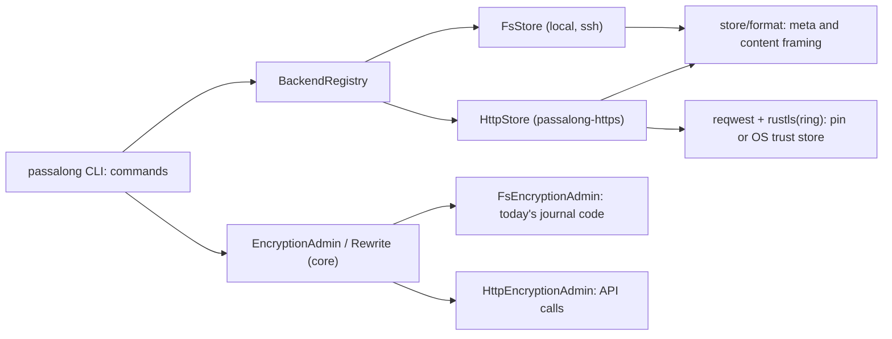

# Delivery Plan 00010: V0 3 0 Passalong Server Backend

> [!abstract] Plan status: `draft`
> passalong v0.3.0 adds an `https` backend that stores items in a
> [passalong-server](https://github.com/joelee/passalong-server) workspace,
> with every command, `serve`, `init`, `check`, and encryption (set-up, join,
> words, fresh start, migrate, rotate, recover) working against it. No user
> decision is open. STEP-10 (re-encryption over HTTPS) has one external
> precondition: the server must first expose the new header of an open
> rewrite (D-05).

## 1. Objective and outcome

A device can use a passalong-server workspace as its store: `kind = "https"`
with a URL, an optional TLS pin, and an API key kept in an owner-only file.
Sending, listing, loading, deleting, pruning, `serve` (uploads and pull
mode), and every `encrypt` operation behave as they do for `ssh` and `local`,
and the items the client writes are byte-identical to what `FsStore` writes,
so the server's planned import and export of file stores stays possible.

The server was built from a close reading of this client's `Store` trait and
encryption code, but no client has ever spoken to it. This plan is that
client. Its second purpose is to find where the contract is wrong, and to
raise those problems in the server repository instead of working around them.

## 2. Source traceability

| Requirement | Source | Source location | Interpretation |
|---|---|---|---|
| PLAN-00010-REQ-01 | User; server handover | User, 2026-09-19: "plan for the `v0.3.0` to include the support for the `passalong-server`"; `docs/backlog.md` v0.3.0; handover notes, "What the v0.3.0 client has to do" via `api/client-encryption-mapping.md` point 1 | An `https` backend implementing `Store` in a new crate |
| PLAN-00010-REQ-02 | Server mapping | `api/client-encryption-mapping.md`, "Verdict" and point 2; handover, "What the server needs", point 3 | Shared, byte-identical item formats |
| PLAN-00010-REQ-03 | Server handover; user | Handover, "TLS, as the client must handle it"; user answer "OS trust store" | TLS: pin or OS trust store; no switch that turns verification off |
| PLAN-00010-REQ-04 | User; repository | User answer "Owner-only key file"; `crates/passalong-core/src/encryption/key_file.rs` | The API key in an owner-only file |
| PLAN-00010-REQ-05 | Server mapping | `api/client-encryption-mapping.md`, "The sketch" and points 3-4 | `EncryptionAdmin` and `Rewrite` traits; commands use them |
| PLAN-00010-REQ-06 | Server mapping; rewrite session; user | `api/client-encryption-mapping.md` tables; `api/rewrite-session.md`; user answer "Fix the server first" | Every encryption operation over HTTPS, including recovery from any device |
| PLAN-00010-REQ-07 | Server handover | Handover, "What the server needs", points 1-2 and 5 | A key file overrides what the server claims; `expectedKeyId` on every write; verify what is read |
| PLAN-00010-REQ-08 | Server API | `api/README.md`, "Error codes" and "Replays"; handover, "Behaviour worth knowing" | Problem codes, retries, and limits |
| PLAN-00010-REQ-09 | Server mapping; handover | Mapping point 6; handover, "`serve` must stop for good…" | `serve` reacts to key and rewrite states |
| PLAN-00010-REQ-10 | Server handover; repository | Handover, "What the server needs", point 1 and "TLS"; `crates/passalong-cli/src/commands/init.rs` | `init` sets up an `https` store |
| PLAN-00010-REQ-11 | Server handover; repository | Handover, "One API key is one workspace… show the expiry"; `crates/passalong-cli/src/commands/check.rs` | `check` reports the server, key, and TLS |
| PLAN-00010-REQ-12 | Repository | `crates/passalong-core/src/cache.rs` `ListCache::store_identity` (ssh only today) | The list cache covers `https` stores |
| PLAN-00010-REQ-13 | Server API | Handover, "Downloads take `Range`… an interrupted download resumes" | Bounded, verified download resumption |
| PLAN-00010-REQ-14 | User; server handover | User answers "Build from a pinned commit in CI" and "Current main, e7b1e33"; handover, "A server to build against" | Integration tests against a real server |
| PLAN-00010-REQ-15 | Server handover | Handover, "The licence boundary: read, do not copy" | No server code or crate in the client |
| PLAN-00010-REQ-16 | Repository | `deny.toml`; `justfile` `android-check`; `.github/workflows/ci.yml` | Dependencies audited; every platform still builds |
| PLAN-00010-REQ-17 | Repository instruction | `AGENTS.md` "Release workflow"; `docs/plans/AGENTS.md` "Relationship to ideas, reviews, and backlog" | Docs, version 0.3.0, release records |

Server documents are read at
[passalong-server `e7b1e33`](https://github.com/joelee/passalong-server/tree/e7b1e33),
under `docs/`: `handover-notes-v0.3.0-client.md`, `api/openapi.json`,
`api/README.md`, `api/client-encryption-mapping.md`,
`api/rewrite-session.md`, and `encryption.md`.

## 3. Repository baseline

| Field | Value |
|---|---|
| Repository | joelee/passalong |
| Branch | feature/v0.3.0-passalong-server |
| HEAD | 5bb7f9a2ad992d1d26458c69e75f8e9cb18ba9f6 ("Updated backlog"; v0.2.1 released from 785a276) |
| Working tree at publication | Clean before allocation; the allocated plan file was the only entry at writing |
| Applicable instructions | `AGENTS.md` (release workflow), `docs/plans/AGENTS.md`, `docs/architecture.md` "Adding a backend" |
| Server baseline | joelee/passalong-server `e7b1e33` on `main` (`v0.1.0` tag at `40fec41` has no GitHub release); contract `openapi.json` version `1.0.0-draft`, 26 operations |

## 4. Scope

### In scope

- A new crate `passalong-https` providing the `https` backend, and the
  `[server.https]` configuration section.
- Moving the item file formats out of `fs_store.rs` into a shared module.
- `EncryptionAdmin` and `Rewrite` traits, with a filesystem implementation
  wrapping today's code unchanged and an HTTPS implementation.
- `init`, `check`, `encrypt` (all modes), `list`, `prune --plain`, and
  `serve` working with `https` stores.
- TLS with an SPKI pin or the operating system's trust store.
- Integration tests against a server built from a pinned commit, locally and
  in CI.
- Documentation, version 0.3.0, CHANGELOG, and draft release notes.

### Out of scope

- Any change inside the passalong-server repository. The one change this
  plan needs there (D-05) is the user's to make or request.
- Server-sent events (`GET /v1/events`); pull mode polls.
- Moving an existing `ssh` or `local` store to a server (the server's
  planned `workspace import` and `export`).
- Amazon S3, which the road map no longer lists.
- `init` for a `local` store and the cloud-synced-folder check, which stay
  in the backlog's "Unscheduled" list.
- A switch that disables TLS verification, and plain `http://` URLs.
- An Android or GUI client; the libraries keep building for Android.

## 5. Constraints and preserved decisions

- **Licence boundary.** The server is AGPL-3.0-or-later and the client
  Apache-2.0. Nothing from the server repository enters this one: no code,
  no tests, no crate dependency. The client is written from the documents;
  the server binary is only *run*, in tests.
- **The key file beats the server.** A device that holds a key file for a
  store never sends plaintext to it, whatever the server says.
- The store formats of `ssh` and `local` do not change, byte for byte, and
  their encryption code (journal, header changes, guards, leftovers,
  recovery) stays as it is, behind the new trait.
- `crypto/` is not changed.
- `unsafe_code = "forbid"` stays.
- One commit per completed step, with intermediate `build:` commits allowed
  where CI must iterate (as in PLAN-00008 and PLAN-00009).
- The Builder never tags, publishes, or creates releases.
- No secrets in code, tests, docs, logs, or version control; test API keys
  are created by each test's own server and never stored.

## 6. Assumptions

None. Unresolved matters are recorded as decisions and block approval when
material.

## 7. Decisions and blockers

| ID | Decision or blocker | Resolution | Owner | Status |
|---|---|---|---|---|
| D-01 | Where the API key lives | An owner-only file named by `server.https.api_key_file`, default `api.key` beside the default config file; the same 0600/`icacls` and git work-tree rules as `store.key` | User (2026-09-19) | Resolved |
| D-02 | Trust without a pin | The operating system's trust store, through `rustls-platform-verifier` | User (2026-09-19) | Resolved |
| D-03 | Test server | Built from a pinned commit in CI and by a `just` recipe, one instance per test on a free port; no mocks for the replay and rewrite behaviour | User (2026-09-19) | Resolved |
| D-04 | Server version | Build and test against `main` at `e7b1e33`; the pin moves to the commit that resolves D-05. The user tags a server release at or after that commit before the client's v0.3.0 is tagged | User (2026-09-19) | Resolved |
| D-05 | A second device cannot resume a rewrite: `RewriteSession` carries `newKeyId` but not the new header, so the new words have nothing to unlock | The server adds `newHeader` (the `Opaque` header sent in `beginRewrite`) to `RewriteSession`, an additive change, first. **Precondition of STEP-10**; STEP-01..09 do not need it | User (2026-09-19) | Resolved; external precondition open |
| D-06 | HTTP and TLS stack | `reqwest` with `rustls` and the `ring` provider, which is already in the tree for SSH; no `aws-lc-rs`, no OpenSSL. Exact features are settled at STEP-05 | Planner | Resolved |
| D-07 | Plain HTTP | Refused: `url` must be `https://`. The API key is a bearer credential. The server's "plain HTTP behind a proxy" means the proxy terminates TLS | Planner, from the handover | Resolved |
| D-08 | Uploading needs the id, metadata, and size before the content (`beginUpload`) | The content is spooled to an owner-only temporary file while it is hashed, then sent from it (sealed on the fly in an encrypted workspace, whose size `sealed_len` gives). The file is removed afterwards, also on failure | Planner | Resolved |
| D-09 | Names | Crate `passalong-https`; `kind = "https"`; `[server.https]` keys `url`, `tls_pin`, `api_key_file` | Planner, from the mapping | Resolved |
| D-10 | List cache for `https` | Yes: identity `https <url> <API key public id>` plus the device's key or `plain` | Planner | Resolved |
| D-11 | A new device and the server's claim | `init` shows what the server says about encryption and asks for confirmation before anything is sent when it says "not encrypted" | Planner, from handover point 1 | Resolved |
| D-12 | Retries | A single command repeats only codes marked retryable, at most three attempts with 1, 2, 4 s back-off; `RATE_LIMITED` waits for `Retry-After` when it is at most 60 s, otherwise fails saying how long; a 401 is never repeated. `serve` keeps its own back-off | Planner | Resolved |
| D-13 | Download resumption | An interrupted content read is resumed with `Range` from the last byte received, at most three times; the SHA-256 check covers the whole | Planner | Resolved |
| D-14 | A contract problem found while building | Stop, report it to the user with a proposed change for the server repository, and wait; no client-side workaround without the user's decision | Planner, from the handover | Resolved |
| D-15 | Version | 0.3.0. `passalong-core`'s public API changes (traits, moved formats); allowed in 0.x and listed in the release notes | Planner | Resolved |
| D-16 | `init` for `local` | Not in v0.3.0 (backlog "Unscheduled"); `init` gains a backend choice of `ssh` or `https`, shaped so `local` can be added later | Planner | Resolved |

The change D-05 asks of the server, for the user to raise there:

> `RewriteSession` (in `getWorkspace`'s `encryption.rewrite` and in
> `getRewrite`) gains `newHeader`: the `Opaque` header its `beginRewrite`
> sent. Without it, a device that takes a session over has the new words but
> not the header they unlock, so it can only abort, and the holder itself
> cannot resume after losing its memory. The header is already wrapped, as
> `encryption.header` is. Additive; old clients ignore it.

## 8. Affected architecture and components

The new crate sits beside `passalong-ssh`, using route 2 of "Adding a
backend" (`docs/architecture.md`): it implements `Store` directly and
registers with `BackendRegistry::register`, not `register_fs`. The
encryption commands currently take `&dyn RemoteFs`; they move to a trait so
one command serves both kinds of store.

| Area | Paths and symbols |
|---|---|
| Item formats | `crates/passalong-core/src/store/fs_store.rs`: `SealedMetaFile`, `SealedMetaBody`, the content framing around `content_sealer`, `FsStore::id_for`, `FsStore::import`; new `crates/passalong-core/src/store/format.rs` |
| Encryption admin | `crates/passalong-core/src/encryption/{admin,rewrite,open,mod}.rs`: `inspect`, `set_up`, `fresh_start`, `join`, `change_words`, `plain_store`, `migrate`, `rotate`, `finish`, `undo`, `read_journal`, `open_with_key`; new `encryption/admin_trait.rs` (`EncryptionAdmin`, `Rewrite`, `FsEncryptionAdmin`) |
| Registry | `crates/passalong-core/src/store/factory.rs` `BackendRegistry` (an `open_admin` beside `open` and `open_fs`) |
| Configuration | `crates/passalong-core/src/config.rs` `ServerConfig` and the raw types: new `HttpsConfig` |
| Secret files | `crates/passalong-core/src/encryption/key_file.rs`, `owner_only.rs`: the owner-only write and check shared with the API key file |
| New crate | `crates/passalong-https/`: client, TLS verifier, errors, `HttpStore`, `HttpEncryptionAdmin`, `register` |
| CLI | `crates/passalong-cli/src/app.rs` (registry built at lines 133, 385, 461), `commands/{encrypt,init,check,prune,list}.rs`, `cli.rs` `InitArgs` |
| serve | `crates/passalong-core/src/serve/{upload,pull}.rs` failure classes |
| List cache | `crates/passalong-core/src/cache.rs` `ListCache::store_identity` |
| Build and CI | `Cargo.toml` workspace members, `deny.toml`, `justfile`, `.github/workflows/ci.yml`, `.github/workflows/release.yml` (publish order) |
| Docs | `README.md`, `docs/{usage,configuration,architecture,developer-guide,backlog}.md`, `CHANGELOG.md`, `docs/release/v0.3.0.md` |

## 9. Requirement catalogue

### PLAN-00010-REQ-01 — `https` backend

- **Requirement:** A crate `passalong-https` implements `Store` against the
  server contract, and `kind = "https"` with `[server.https]` selects it.
  `clipboard`, `file`, `list` (and `--json`, `--nocache`), `load`, `cat`,
  `get`, `choose`, `delete`, `prune`, and `serve` (uploads, drop folder, and
  pull mode) work against a workspace, plaintext and sealed. Every `Store`
  method maps to one API operation, and `list_after`, `list_ids`,
  `newest_id`, `get_meta`, `exists`, `find_by_content_key`, `resolve`,
  `clean_staging`, and `probe_write` use their own routes instead of the
  trait defaults.
- **Rationale:** The v0.3.0 road-map item.
- **Source:** User; `docs/backlog.md` v0.3.0; mapping point 1.
- **Acceptance evidence:** AC-01, AC-02, AC-03.

### PLAN-00010-REQ-02 — Byte-identical item formats

- **Requirement:** The plaintext `meta.json` bytes, the sealed metadata
  (`SealedMetaFile`, `SealedMetaBody`), and the sealed content framing move
  into one module used by both `FsStore` and `HttpStore`. An item written
  through either store has the same `meta` and content bytes for the same
  input, key, and salts. `crypto/` is unchanged.
- **Rationale:** The server stores `meta` and content byte for byte, and its
  planned import and export assume the file layout's bytes.
- **Source:** Mapping "Verdict", point 2; handover point 3.
- **Acceptance evidence:** AC-04.

### PLAN-00010-REQ-03 — TLS

- **Requirement:** `url` must start with `https://`. With
  `tls_pin = "sha256/<base64>"` (the SHA-256 of the certificate's
  SubjectPublicKeyInfo, as `passalong-server tls fingerprint` prints; the
  `sha256//` form of `curl --pinnedpubkey` is accepted too), the client
  trusts that public key alone, with no authority, name, or date check, and
  still verifies the handshake signature. Without a pin it verifies through
  the operating system's trust store. There is no option that disables
  verification.
- **Rationale:** Self-signed servers work through the pin; public ones need
  no configuration.
- **Source:** Handover "TLS"; D-02, D-07.
- **Acceptance evidence:** AC-05, AC-06.

### PLAN-00010-REQ-04 — The API key file

- **Requirement:** The `pal_…` API key is read from `api_key_file`, written
  by `init` owner-only (0600 on Unix, current user alone via `icacls` on
  Windows). A file others may read, or one inside a git work tree that does
  not ignore it, is refused with the command that fixes it. The key is sent
  only in the `Authorization` header, and never appears in logs, errors,
  `Debug` output, or the list-cache identity (which uses its public id).
- **Rationale:** D-01; the key is a live credential for a whole workspace.
- **Source:** User; `key_file.rs`.
- **Acceptance evidence:** AC-07, AC-08.

### PLAN-00010-REQ-05 — Encryption admin traits

- **Requirement:** `EncryptionAdmin` and `Rewrite`, as sketched in the
  mapping, live in `passalong-core`. `FsEncryptionAdmin` wraps today's
  functions without changing their behaviour. The rewrite engine (`run` in
  `rewrite.rs`) becomes generic over `Rewrite`. `encrypt`, `init`, `check`,
  `list` (the plain-items warning), and `prune --plain` use the traits
  instead of `&dyn RemoteFs`. Filesystem-only operations (header repair,
  leftovers, journal recovery) stay reachable for `ssh` and `local`.
- **Rationale:** One command code path for both kinds of store.
- **Source:** Mapping "The sketch", points 3-4.
- **Acceptance evidence:** AC-09.

### PLAN-00010-REQ-06 — Encryption over HTTPS

- **Requirement:** Against a workspace:
  - set-up is `enableEncryption`, a fresh start is `freshStart`, and a
    change of words is `replaceHeader`;
  - `--join` unwraps the header from `getWorkspace`;
  - migrate and rotate open a session with `beginRewrite`, after unwrapping
    the header they are about to send with the new words once;
  - each item is staged by an upload with `inRewrite`, and the lease is kept
    with `heartbeatRewrite` well inside its length;
  - every staged item is read back with `partition=staged` and compared
    (SHA-256 and size) before `commitRewrite`;
  - `REWRITE_ENDED` begins again under a new key;
  - `encrypt --recover` shows the holder and lease, takes the session over
    once the lease has ended, and resumes (with the new words, unwrapping
    `newHeader`) or aborts, from any device;
  - `prune --plain` and the `list` warning use `partition=plain`.
- **Rationale:** Full parity with `ssh` and `local`.
- **Source:** Mapping tables; `rewrite-session.md`; D-05.
- **Acceptance evidence:** AC-10, AC-11, AC-12.

### PLAN-00010-REQ-07 — Key state safety

- **Requirement:**
  - Every write (`beginUpload`, `deleteItem`, and every encryption call)
    carries `expectedKeyId`: the device's key id, or `null` for a plaintext
    workspace.
  - A device with a key file refuses a workspace the server reports as
    plaintext, or under another key id, before sending anything, with the
    same refusals `open_with_key` gives today.
  - Sealed `meta` and content are opened and checked, and plaintext content
    is checked against its SHA-256, exactly as for the other backends.
- **Rationale:** A compromised or wrong server must not be able to make a
  device send plaintext, and nothing read is trusted unverified.
- **Source:** Handover points 1, 2, and 5.
- **Acceptance evidence:** AC-13, AC-14.

### PLAN-00010-REQ-08 — Errors, retries, and limits

- **Requirement:**
  - `application/problem+json` answers map by `code` to messages that name
    the problem, the limit, or the wait: `ITEM_TOO_LARGE` names
    `maxItemBytes`, `QUOTA_EXCEEDED` names the quota, and `LEASE_HELD` and
    `REWRITE_IN_PROGRESS` say until when.
  - Retries follow D-12.
  - An item larger than `maxItemBytes` (from `getViewer`) is refused before
    any content is sent.
  - A lost `commitUpload` answer is settled by repeating it, then with
    `getItem`, never by starting a new upload.
- **Rationale:** The server's replay rules make the simple, safe client the
  correct one, and a client that retries 401s locks out every device behind
  the same address.
- **Source:** `api/README.md` "Error codes", "Replays"; handover.
- **Acceptance evidence:** AC-15, AC-16.

### PLAN-00010-REQ-09 — `serve` against a server

- **Requirement:**
  - `serve` stops for good, with a message, on `KEY_EXPIRED` and
    `KEY_REVOKED`.
  - It keeps waiting, and retrying, on `REWRITE_IN_PROGRESS` and
    `SERVICE_UNAVAILABLE`, saying so once the lease has ended.
  - On `KEY_ID_MISMATCH` it keeps the file and asks for `encrypt --join`, as
    it does when a rotation overtakes a send today.
  - Pull mode polls `listItemIds?after=`.
- **Rationale:** Retrying a revoked key forever helps nobody; giving up on a
  rewrite loses files.
- **Source:** Mapping point 6; handover.
- **Acceptance evidence:** AC-17.

### PLAN-00010-REQ-10 — `init` for a server

- **Requirement:** `init` asks for the backend (`ssh` or `https`). For
  `https` it asks for the URL and the API key, which is read without echo
  and written to the key file. It then shows the presented certificate's SPKI
  pin. If the operating system trusts the certificate it offers to go
  without a pin; otherwise it requires the pin to be confirmed against
  `passalong-server tls fingerprint`. It then calls `getViewer`, showing the
  key's label, role, and expiry, and inspects the workspace. When the server
  says "not encrypted" and no key file is present, it says so and asks for
  confirmation (D-11); an encrypted workspace offers `--join`, and an empty
  one offers encryption, as for SSH. Flags make every answer scriptable:
  `--backend`, `--url`, `--tls-pin`, `--api-key-file`, and `--yes`.
- **Rationale:** Parity with SSH `init`, and the handover's first point.
- **Source:** Handover; `commands/init.rs`.
- **Acceptance evidence:** AC-18.

### PLAN-00010-REQ-11 — `check` for a server

- **Requirement:** For an `https` store, `check` reports:
  - the connection: server version, API version, and TLS mode (pinned or
    trusted by the system);
  - the API key: label, role, and expiry, warning within 14 days of it;
  - the workspace: name, bytes used out of the quota, and item count;
  - a write probe (`probeWrite`), or a read-only key reported as such;
  - the encryption line, as today.
- **Rationale:** Keys expire after 90 days by default; users need warning.
- **Source:** Handover; `commands/check.rs`.
- **Acceptance evidence:** AC-19.

### PLAN-00010-REQ-12 — List cache

- **Requirement:** `ListCache::store_identity` gives `https` stores an
  identity from the URL, the API key's public id, and the device's key or
  `plain` (D-10), and `serve` keeps their cache current as it does for SSH.
- **Rationale:** A slow link to a server benefits as an SSH link does.
- **Source:** `cache.rs`.
- **Acceptance evidence:** AC-20.

### PLAN-00010-REQ-13 — Resumed downloads

- **Requirement:** An interrupted `getItemContent` read resumes with `Range`
  from the last byte received, at most three times (D-13). The item's
  SHA-256 is still checked over the whole content before anything is kept.
- **Rationale:** Large items over mobile links.
- **Source:** Handover.
- **Acceptance evidence:** AC-21.

### PLAN-00010-REQ-14 — Tests against a real server

- **Requirement:** `just test-https` builds passalong-server at the pinned
  commit into a cache folder and runs `passalong-https`'s ignored
  integration tests. Each test starts its own server with a self-signed
  certificate, a workspace, and fresh keys on a free port. A CI job does the
  same on Linux. `just ci` and `coverage-full` include it. The tests cover
  REQ-01, -03, -06, -07, -08, -09, and -13 with the real server, including a
  rewrite interrupted and recovered from a second API key. The pin is kept in
  one place.
- **Rationale:** D-03: the replay and rewrite behaviour is what a mock would
  get wrong.
- **Source:** User; handover.
- **Acceptance evidence:** AC-22, AC-23.

### PLAN-00010-REQ-15 — Licence boundary

- **Requirement:** No file, function, or test is copied from passalong-server,
  and no crate of it is a dependency. The client is implemented from the
  documents listed in section 2.
- **Rationale:** AGPL code cannot enter this Apache-2.0 work.
- **Source:** Handover, "The licence boundary".
- **Acceptance evidence:** AC-24.

### PLAN-00010-REQ-16 — Dependencies and platforms

- **Requirement:** The new dependencies pass `cargo deny` for all five
  targets. They are `reqwest`, `rustls` with `ring`, and
  `rustls-platform-verifier`, together with what they bring. Any new licence
  or duplicate is decided as in `docs/developer-guide.md`, and a new licence
  needs the user's approval. `aws-lc-rs` and `openssl` are not in the tree.
  CI stays green on Linux, macOS, Xvfb, Android (the library crates,
  `passalong-https` included), and Windows.
- **Rationale:** Supply-chain policy and the platforms already supported.
- **Source:** `deny.toml`; CI.
- **Acceptance evidence:** AC-25.

### PLAN-00010-REQ-17 — Documentation and release records

- **Requirement:** The following are updated:
  - `README.md` (a third way to store, with TLS pin guidance);
  - `docs/usage.md` (`init` for servers, `check`, `encrypt --recover` with
    leases);
  - `docs/configuration.md` (`[server.https]`, the API key file);
  - `docs/architecture.md` (the traits and the HTTPS backend);
  - `docs/developer-guide.md` (the server test harness and the pin);
  - `CHANGELOG.md` Unreleased;
  - the draft `docs/release/v0.3.0.md` (library changes listed);
  - `docs/backlog.md`.

  The version is 0.3.0 in `[workspace.package]` and the inter-crate
  requirements. The Release workflow publishes `passalong-https` before
  `passalong`.
- **Rationale:** `AGENTS.md` release workflow.
- **Source:** `AGENTS.md`; `docs/plans/AGENTS.md`.
- **Acceptance evidence:** AC-26.

## 10. Delivery strategy

Refactor first, with no behaviour change, then add the backend in layers,
each tested against a real server.

1. **STEP-01..03** reshape `passalong-core` and the CLI (shared formats, the
   traits, commands on the traits). The existing suite, the SFTP Docker
   tests, the fault-injection matrices, and `just test-compat` prove
   nothing changed for `ssh` and `local`.
2. **STEP-04..06** add the configuration, the API key file, and the new crate
   with its transport, then the store. The server harness arrives in STEP-05,
   so every later step is tested against the real thing.
3. **STEP-07..09** add header-level encryption, `serve`, the list cache,
   `init`, and `check`: everything but re-encryption.
4. **STEP-10** adds re-encryption and recovery, and needs D-05 on the
   server; placing it last gives that change the most time.
5. **STEP-11..12** handle release records and the final gate.

Contract problems stop the Builder (D-14), so they surface early.

## 11. Detailed implementation steps

### PLAN-00010-STEP-01 — Shared item formats

- **Objective:** One module produces and reads every byte of an item.
- **Requirements:** `PLAN-00010-REQ-02`
- **Depends on:** None
- **Affected components:** `store/fs_store.rs` (`SealedMetaFile`,
  `SealedMetaBody`, content framing, plaintext `meta.json` writing), new
  `store/format.rs`
- **Preconditions:** Plan approved; clean tree.
- **Test or evidence first:** Golden tests, written before the move and kept
  after it. They record the exact `meta.json` and content bytes `FsStore`
  writes for fixed input, key, and salts: plaintext and sealed, empty and
  multi-record content.
- **Implementation tasks:**
  1. Capture the golden bytes against the current code.
  2. Move the types and the framing into `format.rs` with public-in-crate or
     public APIs the new crate needs (`encode_meta`, `decode_meta`,
     `seal_meta_file`, `open_meta_file`, a streaming content sealer and
     opener).
  3. Make `FsStore` use them.
- **Documentation/configuration/operations:** Architecture note on the
  shared formats.
- **Verification:** `cargo test --workspace --all-features`;
  `just test-integration`; `just test-compat`.
- **Completion criteria:** Golden tests pass before and after; no other test
  changed.
- **Rollback or recovery:** Revert the commit.
- **Builder stop conditions:** Any golden byte changes.

### PLAN-00010-STEP-02 — Encryption admin traits

- **Objective:** `EncryptionAdmin` and `Rewrite` exist, with a filesystem
  implementation over today's functions.
- **Requirements:** `PLAN-00010-REQ-05`
- **Depends on:** STEP-01
- **Affected components:** `encryption/{admin,rewrite,open,mod}.rs`, new
  `encryption/admin_trait.rs`, `store/factory.rs` (`open_admin`)
- **Preconditions:** STEP-01 committed.
- **Test or evidence first:** Existing encryption tests, including every
  fault matrix, run through `FsEncryptionAdmin` and still pass unchanged.
- **Implementation tasks:**
  1. Define the traits as in the mapping's sketch, adjusted where our types
     differ, with each deviation recorded.
  2. `FsEncryptionAdmin<F: RemoteFs>` delegates to the existing functions;
     `FsRewrite` wraps the journal engine.
  3. Make `run` generic over `Rewrite`.
  4. Factor the refusal table of `open_with_key` into a function of
     (state, key id, device key) that both stores call.
  5. Add `BackendRegistry::open_admin`, with openers for file-like kinds.
- **Documentation/configuration/operations:** None beyond doc comments.
- **Verification:** `cargo test --workspace --all-features`;
  `just test-integration`.
- **Completion criteria:** No behaviour change; all tests green.
- **Rollback or recovery:** Revert.
- **Builder stop conditions:** A trait signature that cannot express an
  existing filesystem flow without changing its behaviour.

### PLAN-00010-STEP-03 — Commands on the traits

- **Objective:** `encrypt`, `init`, `check`, `list`, and `prune --plain` use
  `EncryptionAdmin` instead of `&dyn RemoteFs`.
- **Requirements:** `PLAN-00010-REQ-05`
- **Depends on:** STEP-02
- **Affected components:** `commands/{encrypt,init,check,prune,list}.rs`,
  `app.rs`
- **Preconditions:** STEP-02 committed.
- **Test or evidence first:** The CLI tests (`cli_local_backend.rs`,
  `cli_ssh_backend.rs`, command unit tests) pass unchanged.
- **Implementation tasks:**
  1. Replace the `fs` parameters with `&dyn EncryptionAdmin`. Keep
     filesystem-only paths (header repair, leftovers, journal recovery)
     behind an `as_fs()` accessor or a capability query.
  2. Update the test doubles.
- **Documentation/configuration/operations:** None.
- **Verification:** `just check`; `just test-integration`; `just test-compat`.
- **Completion criteria:** Output and exit codes unchanged for `ssh` and
  `local`.
- **Rollback or recovery:** Revert.
- **Builder stop conditions:** A visible output change for existing backends.

### PLAN-00010-STEP-04 — Configuration and the API key file

- **Objective:** `[server.https]` parses and validates, and the API key file
  is read and written owner-only.
- **Requirements:** `PLAN-00010-REQ-03`, `PLAN-00010-REQ-04`
- **Depends on:** STEP-03
- **Affected components:** `config.rs` (`HttpsConfig`, raw types, defaults on
  every platform), `encryption/key_file.rs` and `owner_only.rs` (a shared
  secret-file module), new `api_key` module in `passalong-core`
- **Preconditions:** STEP-03 committed.
- **Test or evidence first:** Config tests:
  - `url` without `https://` is refused;
  - a bad `tls_pin` is refused, and both the `sha256/` and `sha256//` forms
    are accepted;
  - `api_key_file` defaults beside the config file, on Unix and Windows.

  API key file tests on Unix and on the Windows runner: a readable file is
  refused; a file inside a git work tree is refused unless ignored; the key
  never appears in `Debug` or `Display` output.
- **Implementation tasks:**
  1. Add `HttpsConfig { url, tls_pin, api_key_file }`.
  2. Generalise the owner-only write and check from `key_file.rs` without
     changing `store.key` behaviour.
  3. Add an `ApiKey` type that parses `pal_<id>_<secret>`, exposes the
     public id, and redacts the secret.
- **Documentation/configuration/operations:** `docs/configuration.md`
  section.
- **Verification:** `cargo test --workspace --all-features`; Windows CI.
- **Completion criteria:** Tests pass on every CI job.
- **Rollback or recovery:** Revert.
- **Builder stop conditions:** None beyond failing tests.

### PLAN-00010-STEP-05 — `passalong-https` transport and the server harness

- **Objective:** A client that authenticates, verifies TLS by pin or trust
  store, maps problems, and retries. A harness that runs a real server per
  test.
- **Requirements:** `PLAN-00010-REQ-03`, `PLAN-00010-REQ-08`,
  `PLAN-00010-REQ-14`, `PLAN-00010-REQ-15`, `PLAN-00010-REQ-16`
- **Depends on:** STEP-04
- **Affected components:** new `crates/passalong-https/` (`client.rs`,
  `tls.rs`, `error.rs`, `lib.rs`), workspace `Cargo.toml`, `deny.toml`,
  `justfile` (`test-https`, a server-build recipe, the pin), `ci.yml` (an
  `https` job), `.gitignore` for the server cache
- **Preconditions:** STEP-04 committed.
- **Test or evidence first:**
  - Unit tests: problem+json parsing for every code in `api/README.md`; the
    retry decision table; SPKI pin computation on a fixed certificate; a pin
    verifier that refuses a different key and a bad handshake signature.
  - Integration tests against the harness: `getViewer` succeeds with the
    right pin and with the pin in the `sha256//` form; a wrong pin fails
    before any request is sent; an unknown key gets `UNAUTHENTICATED` without
    a retry.
- **Implementation tasks:**
  1. Create the crate. Its dependencies are `reqwest` (no default features;
     `rustls` without a provider; streaming), `rustls` with `ring`, and
     `rustls-platform-verifier`.
  2. Implement `PinnedVerifier`: SPKI SHA-256 equality plus handshake
     signature verification through the `ring` provider's algorithms.
  3. Set the `Authorization` header and `X-Request-Id` (the operation's
     `op=` id).
  4. Add the problem type and the retry policy of D-12.
  5. Add the harness:
     - build the server at the pinned commit into `target/passalong-server`
       (cloned and cached; reused when the commit matches);
     - per test, a temporary `HOME` and `init`, a self-signed certificate
       for `127.0.0.1`, a workspace, and keys;
     - start `serve` on a free port, wait for `readyz`, and stop it at the
       end.
  6. Update `deny.toml` for new duplicates.
- **Documentation/configuration/operations:** Developer guide: running
  `just test-https`, moving the pin.
- **Verification:** `just test-https`; `just audit`; `just android-check`;
  CI on all jobs.
- **Completion criteria:** Harness green locally and in CI; `cargo tree`
  shows no `aws-lc-rs` or `openssl`.
- **Rollback or recovery:** Revert; the crate is not yet registered.
- **Builder stop conditions:**
  - A dependency needs a licence not in `deny.toml` (ask the user).
  - `aws-lc-rs` or `openssl` cannot be avoided.
  - The server does not build at the pin.
  - The contract disagrees with the server's behaviour (D-14).

### PLAN-00010-STEP-06 — `HttpStore`

- **Objective:** Every `Store` method against a workspace, plaintext and
  sealed.
- **Requirements:** `PLAN-00010-REQ-01`, `PLAN-00010-REQ-02`,
  `PLAN-00010-REQ-07`, `PLAN-00010-REQ-08`, `PLAN-00010-REQ-13`
- **Depends on:** STEP-05
- **Affected components:** `passalong-https` (`store.rs`, `upload.rs`,
  `register`), `crates/passalong-cli/src/app.rs` (register `https`),
  `crates/passalong-cli/Cargo.toml`
- **Preconditions:** STEP-05 committed.
- **Test or evidence first:** Integration tests against the harness,
  plaintext and sealed. Each uses the CLI where the behaviour is the CLI's.
  1. **Items:**
     - put and dedup (`created: false`), list newest first, `list_after`,
       ids, newest;
     - get and `get_meta`, `exists`, `find_by_content_key`, `resolve`
       (ambiguous and not found);
     - delete, and delete of an item already gone;
     - `clean_staging`, `probe_write`.
  2. **Limits and replays:**
     - `maxItemBytes` refused before sending;
     - a `commitUpload` answer dropped and settled;
     - a tampered sealed item fails to open;
     - `CONTENT_MISMATCH` for plaintext content changed after spooling.
  3. **Downloads:** resumed with `Range` after a cut connection.
  4. **Key-state safety:** a device key with a plaintext workspace is refused
     before any write.
  5. **Bytes on the server:** a sealed item's `meta` from the server equals
     `format.rs`'s bytes.
- **Implementation tasks:**
  1. Map every method to its route (section 8 of `api/README.md`).
  2. Upload by spooling (D-08), with `expectedKeyId` on every write.
  3. Open sealed items with `format.rs`.
  4. Resume reads with `Range` (D-13).
  5. Apply the shared refusal table from `getWorkspace` at open.
  6. Register `https` in the three registry builders of `app.rs`.
- **Documentation/configuration/operations:** `docs/usage.md`: using a
  server.
- **Verification:** `just test-https`; `just check`.
- **Completion criteria:** The CLI round trip works against the harness,
  plaintext and sealed.
- **Rollback or recovery:** Revert.
- **Builder stop conditions:** D-14.

### PLAN-00010-STEP-07 — Header-level encryption over HTTPS

- **Objective:** Set-up, join, change of words, fresh start, and the plain
  partition.
- **Requirements:** `PLAN-00010-REQ-05`, `PLAN-00010-REQ-06`,
  `PLAN-00010-REQ-07`
- **Depends on:** STEP-06
- **Affected components:** `passalong-https` `admin.rs`
  (`HttpEncryptionAdmin` without rewrites), the registry's `open_admin` for
  `https`
- **Preconditions:** STEP-06 committed.
- **Test or evidence first:** Integration tests driving `passalong encrypt`
  (words piped as the existing tests do):
  - set-up on an empty workspace;
  - `--join` from a second config;
  - a change of words, after which the old words fail;
  - a fresh start, with `list` warning and `prune --plain` clearing;
  - a replayed `enableEncryption` with the same key id succeeds, and one
    with another key id gives `KEY_ID_MISMATCH`.
- **Implementation tasks:**
  1. `state`, `header`, `enable`, `fresh_start`, and `replace_header` with
     `expectedKeyId`.
  2. `plain_store` over `partition=plain`.
  3. Make `begin_rewrite` and `take_over` report "not yet supported" until
     STEP-10.
- **Documentation/configuration/operations:** Usage: encryption with a
  server.
- **Verification:** `just test-https`.
- **Completion criteria:** Tests green.
- **Rollback or recovery:** Revert.
- **Builder stop conditions:** D-14.

### PLAN-00010-STEP-08 — `serve` and the list cache

- **Objective:** `serve` handles server states, and the list cache covers
  `https`.
- **Requirements:** `PLAN-00010-REQ-09`, `PLAN-00010-REQ-12`
- **Depends on:** STEP-07
- **Affected components:** `serve/{upload,pull}.rs` failure classes (a
  fatal class), `commands/serve.rs`, `cache.rs` `store_identity`
- **Preconditions:** STEP-07 committed.
- **Test or evidence first:**
  - Unit tests of the failure classification.
  - Integration tests:
    - `serve` exits with the message when its key is revoked (`key revoke`
      on the harness);
    - it waits during a rewrite and sends afterwards;
    - it keeps a file on `KEY_ID_MISMATCH`;
    - pull mode applies an item sent by another key;
    - `list` uses a fresh cache without connecting.
- **Implementation tasks:**
  1. Add a `StoreError` or `EncryptionError` variant set for key expiry,
     revocation, and rewrites, mapped from problem codes.
  2. Classify them in `upload.rs` and `pull.rs`.
  3. Add the `https` identity.
- **Documentation/configuration/operations:** Usage: `serve` and servers.
- **Verification:** `just test-https`; `just check`.
- **Completion criteria:** Tests green.
- **Rollback or recovery:** Revert.
- **Builder stop conditions:** None beyond failing tests.

### PLAN-00010-STEP-09 — `init` and `check` for a server

- **Objective:** A server store set up and checked from the CLI.
- **Requirements:** `PLAN-00010-REQ-10`, `PLAN-00010-REQ-11`
- **Depends on:** STEP-08
- **Affected components:** `cli.rs` `InitArgs` (`--backend`, `--url`,
  `--tls-pin`, `--api-key-file`), `commands/init.rs`, `commands/check.rs`
- **Preconditions:** STEP-08 committed.
- **Test or evidence first:**
  - Scripted-prompt unit tests for each `init` path: pinned, trusted, wrong
    pin re-asked, server claims plaintext (confirmed and declined), encrypted
    (join), empty (offer).
  - Integration tests: `init --yes` against the harness writes a working
    config and an owner-only key file; `check` passes, shows the key's
    expiry, and warns for a key made with a 7-day expiry; a read-only key's
    probe is reported as read-only.
- **Implementation tasks:**
  1. Add the backend prompt and flags, keeping every SSH prompt as it is.
  2. Fetch the certificate and compute its pin for display.
  3. Add the `check` lines.
- **Documentation/configuration/operations:** Usage: `init` and `check`
  sections; README quick start for a server.
- **Verification:** `just test-https`; `just check`.
- **Completion criteria:** Tests green; SSH `init` output unchanged.
- **Rollback or recovery:** Revert.
- **Builder stop conditions:** None beyond failing tests.

### PLAN-00010-STEP-10 — Re-encryption and recovery over HTTPS

- **Objective:** Migrate, rotate, and `encrypt --recover` against a
  workspace, from any device.
- **Requirements:** `PLAN-00010-REQ-06`, `PLAN-00010-REQ-07`,
  `PLAN-00010-REQ-14`
- **Depends on:** STEP-09
- **Affected components:** `passalong-https` `admin.rs` (`HttpRewrite`),
  `commands/encrypt.rs` (lease display, take-over prompt), `justfile` and CI
  (the pin moved)
- **Preconditions:**
  - STEP-09 committed.
  - **The server exposes `newHeader` in `RewriteSession` (D-05)** at a commit
    the user names; the pin moves to it.
- **Test or evidence first:** Integration tests:
  - migrate and rotate over a workspace of items, with every item read back;
  - a rewrite stopped after each stage, then resumed by the same device;
  - a rewrite stopped, the lease left to expire (short `rewrite.lease_secs`
    on the harness), then taken over and resumed with the new words by a
    second key, and in another run taken over and aborted;
  - a replayed `beginRewrite` after an abort gives `REWRITE_ENDED` and a new
    attempt succeeds;
  - a wrong new header is refused before `beginRewrite`;
  - the heartbeat keeps the lease on a slow run.
- **Implementation tasks:**
  1. `begin_rewrite` (unwrap check, then `beginRewrite`), and `import` as an
     upload with `inRewrite`.
  2. `read_back` over `partition=staged`, then `heartbeat`, `commit`,
     `abort`, and `take_over`.
  3. Handle `REWRITE_ENDED`.
  4. `encrypt --recover` for servers: holder, lease, take-over, resume or
     abort.
- **Documentation/configuration/operations:** Usage and architecture:
  rewrites and leases on a server.
- **Verification:** `just test-https`; the fault tests.
- **Completion criteria:** Tests green; no item lost or duplicated in any
  interrupted run.
- **Rollback or recovery:** Revert; STEP-07's "not yet supported" returns.
- **Builder stop conditions:**
  - The D-05 precondition is not met: mark the step blocked and report.
  - D-14.

### PLAN-00010-STEP-11 — Documentation, version 0.3.0, release records

- **Objective:** Records ready for the release commit.
- **Requirements:** `PLAN-00010-REQ-17`, `PLAN-00010-REQ-15`
- **Depends on:** STEP-10
- **Affected components:** docs listed in REQ-17; `Cargo.toml` and
  `Cargo.lock` (0.3.0); the version-pinned tests; `release.yml` if the
  publish order needs it (`cargo publish --workspace` orders by
  dependency); `NOTICE` if a new dependency requires it
- **Preconditions:** STEP-10 committed.
- **Test or evidence first:** `just links`; `just lint-workflows`;
  `cargo publish --workspace --dry-run` including `passalong-https`.
- **Implementation tasks:**
  1. Write the docs.
  2. Bump the version and update the version-pinned tests.
  3. Write the CHANGELOG and draft release notes, with library changes
     listed.
  4. Update the backlog: remove the v0.3.0 item, and add the server's
     `/v1/events` if polling proved costly.
  5. Record the licence-boundary check (REQ-15): a `cargo tree` with no
     server crate, and a statement that nothing was copied.
- **Documentation/configuration/operations:** As tasks.
- **Verification:** `just links`; `just publish-dry-run`.
- **Completion criteria:** Checks pass.
- **Rollback or recovery:** Revert.
- **Builder stop conditions:** None.

### PLAN-00010-STEP-12 — Final quality gate

- **Objective:** Evidence for approval.
- **Requirements:** All
- **Depends on:** STEP-11
- **Affected components:** Release notes (tests, coverage, timings); this
  plan's work log.
- **Preconditions:** STEP-11 committed and pushed.
- **Test or evidence first:** Not applicable: this step measures.
- **Implementation tasks:**
  1. Run `just ci` locally, and get CI green on every job, the `https` job
     included.
  2. Record test counts and `coverage` and `coverage-full` line percentages.
  3. Record timings from a release build against the harness on one
     machine: `list --nocache`, `list` from the cache, and
     `clipboard --stdin` at 10 and 100 items, plaintext and sealed, with SSH
     measured in the same session for comparison.
  4. Hand off to the user: the server release to tag, and the pin to move
     to it if it differs.
- **Documentation/configuration/operations:** Release notes filled.
- **Verification:** Outputs recorded in the work log.
- **Completion criteria:** AC-22, AC-23, and AC-25 met; every AC met or
  handed to the user.
- **Rollback or recovery:** Not applicable.
- **Builder stop conditions:** Coverage below 80 %, or any CI job red.

## 12. Cross-cutting concerns

| Area | Applicability | Planned action or reason not applicable | Step or requirement |
|---|---|---|---|
| Compatibility and APIs | Applicable | `ssh` and `local` bytes and behaviour unchanged (golden tests, existing suites, `test-compat`); `passalong-core` API changes listed in the release notes (0.x minor) | STEP-01..03, REQ-02, REQ-05 |
| Data and migration | Applicable | No store format change; importing file stores into a server is the server's future work | Out of scope |
| Security and privacy | Applicable | TLS pin or trust store, no disable switch, https only; owner-only API key file; key id checks on every write; a key file overrides the server; nothing read is trusted unverified; spooled content in an owner-only temporary file removed after use | REQ-03, -04, -07, D-08 |
| Performance and scale | Applicable | Timings recorded against SSH; `listItemIds` for polling; the list cache for `https` | STEP-12, REQ-12 |
| Reliability and failure handling | Applicable | The server's replay rules followed; bounded retries; rewrite recovery from any device; interrupted-rewrite tests | REQ-06, -08, -13 |
| Observability and operations | Applicable | `X-Request-Id` carries the operation id; `check` shows key expiry; `serve` states why it stopped or waits | REQ-09, -11 |
| Dependencies and supply chain | Applicable | `reqwest`, `rustls` (`ring`), `rustls-platform-verifier`; `cargo deny` on five targets; no `aws-lc-rs` or `openssl`; new licences need the user | REQ-16 |
| Accessibility and UX | Applicable | `init` explains pins and the server's encryption claim; messages name limits and waits | REQ-08, -10 |
| Documentation and release | Applicable | README, usage, configuration, architecture, developer guide, CHANGELOG, release notes, backlog | REQ-17 |
| Deployment and rollback | Applicable | New crate published before `passalong`; rollback is not upgrading; stores are untouched by the client version | STEP-11 |

## 13. Verification strategy

| Level | Evidence or command | When | Required result |
|---|---|---|---|
| Unit | `cargo test --workspace --all-features` | Every step | Pass |
| Golden formats | Format tests from STEP-01 | Every step | Bytes unchanged |
| Existing backends | `just test-integration`, `just test-compat` | STEP-01..03 and at the gate | Pass |
| Server integration | `just test-https` | STEP-05 onward | Pass |
| Lint and format | `just check` (fmt, clippy `-D warnings`, links, coverage) | Every step | Pass |
| Supply chain | `just audit` | STEP-05, STEP-12 | Pass |
| Platforms | CI: Linux, macOS, Xvfb, Android, Windows, https | Every push | Green |
| Coverage | `just coverage`, `just coverage-full` | STEP-12 | ≥ 80 % lines |
| Release readiness | `just publish-dry-run`, `just links`, `just lint-workflows` | STEP-11, STEP-12 | Pass |

## 14. Acceptance criteria

- [ ] `PLAN-00010-AC-01` Against the harness, `clipboard --stdin`, `file`, `list`, `list --json`, `load`, `cat`, `get`, `delete`, and `prune` work on a plaintext and a sealed workspace, and sending identical content twice stores one item.
- [ ] `PLAN-00010-AC-02` `serve` against the harness sends a dropped file and clipboard text, and in pull mode applies an item sent with another API key.
- [ ] `PLAN-00010-AC-03` `list_after`, `list_ids`, `newest_id`, `get_meta`, `exists`, `find_by_content_key`, `resolve`, `clean_staging`, and `probe_write` of `HttpStore` each make one request to their own route (shown by a request-counting test or the server's log), not the trait default.
- [ ] `PLAN-00010-AC-04` Golden tests show `FsStore` writes the same `meta.json` and content bytes before and after STEP-01, and an item uploaded by `HttpStore` has `meta` bytes equal to those `FsStore` writes for the same input.
- [ ] `PLAN-00010-AC-05` A connection with the right pin (both `sha256/` and `sha256//` forms) succeeds; with a wrong pin it fails before any HTTP request, naming the pin; `url = "http://…"` is refused at configuration.
- [ ] `PLAN-00010-AC-06` A unit test shows `PinnedVerifier` refuses a certificate with the pinned key but an invalid handshake signature, and no configuration or flag disables verification (checked by search for `danger`/`dangerous` APIs in the crate).
- [ ] `PLAN-00010-AC-07` An API key file readable by others (Unix mode, and on the Windows runner an `icacls` grant to Users) is refused with the fix command; one inside a non-ignored git work tree is refused.
- [ ] `PLAN-00010-AC-08` A test captures all log output at `debug` level of a full CLI session against the harness and finds no API key secret, and `Debug` of the config and store shows no secret.
- [ ] `PLAN-00010-AC-09` After STEP-03 every pre-existing test passes unchanged, including the fault-injection matrices, `just test-integration`, and `just test-compat`.
- [ ] `PLAN-00010-AC-10` Against the harness: set-up, `--join` from a second config, a change of words (old words then fail), and a fresh start with `prune --plain` succeed.
- [ ] `PLAN-00010-AC-11` Migrate and rotate against the harness re-encrypt every item, each read back with `partition=staged` before `commitRewrite`; after a rotation a device with the old key gets the join message.
- [ ] `PLAN-00010-AC-12` A rewrite stopped part-way and left past its lease is taken over and completed with the new words by a second API key, and in another run taken over and aborted; in both, every item loads with its original SHA-256 and none is duplicated.
- [ ] `PLAN-00010-AC-13` With a key file present, a workspace the server reports as plaintext, or under another key id, is refused before any `beginUpload` or `deleteItem` is sent (server log shows none).
- [ ] `PLAN-00010-AC-14` Every write request the client sends carries `expectedKeyId` (a test inspects outgoing requests or the server's log), and a sealed item whose content is altered on the server's disk fails to open with a corruption error.
- [ ] `PLAN-00010-AC-15` A file larger than a workspace's `maxItemBytes` is refused before `beginUpload` with a message naming the limit; a full workspace gives a message naming the quota.
- [ ] `PLAN-00010-AC-16` An unknown API key makes exactly one request and fails with `UNAUTHENTICATED`; a retryable failure is retried at most three times.
- [ ] `PLAN-00010-AC-17` `serve` exits non-zero with a message within one retry after its key is revoked; it keeps a dropped file on `KEY_ID_MISMATCH`; it waits during a rewrite and sends the file after the commit.
- [ ] `PLAN-00010-AC-18` `passalong init --backend https --url … --tls-pin … --api-key-file … --yes` against the harness writes a config and an owner-only key file after which `passalong check` passes; the scripted-prompt tests cover the pinned, trusted, wrong-pin, plaintext-claim, encrypted, and empty paths.
- [ ] `PLAN-00010-AC-19` `check` against the harness prints the server version, TLS mode, key label, role and expiry, workspace usage, a probe result, and the encryption line, and warns for a key expiring within 14 days.
- [ ] `PLAN-00010-AC-20` After `list --nocache` against the harness, `list` prints the same items without a request to the server, and the cache identity contains the API key's public id and not its secret.
- [ ] `PLAN-00010-AC-21` A download cut part-way resumes with `Range` and the file is written only after the whole content's SHA-256 matches.
- [ ] `PLAN-00010-AC-22` `just test-https` passes locally and the CI `https` job is green on the final commit, building the server at the pinned commit.
- [ ] `PLAN-00010-AC-23` `just ci` exits 0 locally, CI is green on Linux, macOS, Xvfb, Android, Windows, and `https` on the final commit, and `coverage-full` is at least 80 % of lines.
- [ ] `PLAN-00010-AC-24` `cargo tree` shows no crate from passalong-server, and the work log records that no server code was copied.
- [ ] `PLAN-00010-AC-25` `just audit` passes with the new dependencies; `cargo tree -i aws-lc-rs` and `cargo tree -i openssl-sys` find nothing; `just android-check` builds `passalong-https`.
- [ ] `PLAN-00010-AC-26` README, usage, configuration, architecture, developer guide, CHANGELOG Unreleased, draft `docs/release/v0.3.0.md`, and backlog are updated for v0.3.0, the version is 0.3.0, `just links` and `just publish-dry-run` pass.

## 15. Risks and mitigations

| Risk | Likelihood | Impact | Mitigation or test | Owner/step |
|---|---|---|---|---|
| The contract is wrong for a real client in more places than D-05 | Medium | Medium | D-14: stop, report, change the server first while no client is released | Builder, all steps |
| The server change of D-05 is not made in time | Medium | Medium | STEP-10 last; STEP-01..09 are independent of it | User |
| New dependencies bring licences or duplicates `deny` refuses | Medium | Low | Stop condition in STEP-05; the user decides licences | STEP-05 |
| `rustls-platform-verifier` behaves differently on Windows or macOS | Low | Medium | Pinned mode is tested everywhere; trust-store mode unit-tested per platform in CI | STEP-05 |
| The trait refactor changes filesystem behaviour | Low | High | Golden bytes, fault matrices, SFTP and compat suites unchanged | STEP-01..03 |
| Building the server makes CI slow | Medium | Low | Cache the built server by commit; a separate CI job | STEP-05 |
| Spooled plaintext on local disk | Low | Low | Owner-only temp file in the OS temp folder, removed on every path; the content was already on the device | STEP-06 |

## 16. Builder hand-off

- **Start condition:** User approval and a clean repository.
- **First step:** PLAN-00010-STEP-01.
- **Required sequence:** STEP-01 → 12 in order; push after each step so CI
  runs, the `https` job from STEP-05.
- **Parallel-safe work:** Documentation drafts for STEP-11 may be written
  alongside earlier steps but committed with STEP-11.
- **Do not change:** approved scope, requirements, steps, acceptance criteria,
  or content outside Builder's permitted work-log area; anything in the
  passalong-server repository.
- **Escalate when:**
  - any Builder stop condition triggers;
  - the contract disagrees with the server or cannot express a client need
    (D-14);
  - a new licence is needed;
  - the D-05 server change is not available at STEP-10.
- **Completion hand-off:**
  - The work log is complete.
  - The user tags a server release at or after the pinned commit before
    tagging v0.3.0.
  - The user approves the work; the release commit follows the Release
    workflow.

<!-- BUILDER_WORK_LOG_START -->
## 17. Builder Work Log

> [!warning] Builder-maintained section
> Delivery Planner creates this section. After approval, Builder may update only
> this delimited section and the Builder-maintained front-matter fields. Builder
> must preserve prior entries and use UTC timestamps.

### Step status

| Step | Status | Started (UTC) | Completed (UTC) | Evidence | Builder notes |
|---|---|---|---|---|---|
| PLAN-00010-STEP-01 | completed | 2026-09-19T14:48:11Z | 2026-09-19T14:53:29Z | Golden tests green before and after the move; workspace 613 passed, 0 failed; `just test-integration` 24 passed; `just test-compat` 3 + 1 passed | New `store/format.rs`: `encode_meta`, `decode_meta`, `write_content`, `SealedMetaFile` |
| PLAN-00010-STEP-02 | completed | 2026-09-19T14:53:29Z | 2026-09-19T14:59:03Z | CI run 35450123585 green for STEP-01; workspace 618 passed, 0 failed, fault matrices included; `just test-integration` 24 passed; `just test-compat` 3 + 1 passed | `EncryptionAdmin`, `Rewrite`, `run_rewrite`, `FsEncryptionAdmin`, `Claim`, `opening`, `BackendRegistry::open_admin` |
| PLAN-00010-STEP-03 | completed | 2026-09-19T14:59:03Z | 2026-09-19T15:02:14Z | Workspace 618 passed, 0 failed (unchanged count); `just test-integration` 24 passed; `just test-compat` passed | No `open_fs` left in the CLI |
| PLAN-00010-STEP-04 | completed | 2026-09-19T15:02:14Z | 2026-09-19T15:07:36Z | Workspace 627 passed, 0 failed; core clippy for Windows clean (the Windows API key test compiles; it runs in CI) | `HttpsConfig`, `TlsPin`, `passalong_core::api_key` |
| PLAN-00010-STEP-05 | completed | 2026-09-19T15:07:36Z | 2026-09-19T15:21:25Z | `just test-https` 5 passed against the server built at `e7b1e33`; rogue-server handshake refused; workspace 641 passed; `just audit` ok; `just android-check` ok with `passalong-https`; package dry-run ok | New crate `passalong-https`; `just server-build`, `just test-https`; commit cc47fd6, log in the next commit |
| PLAN-00010-STEP-06 | completed | 2026-09-19T15:21:25Z | 2026-09-19T15:34:27Z | CI run 35451605513 green for STEP-05; `just test-https` 5 + 7 + 1 (CLI) passed, six runs in a row clean; workspace 641 passed; `just test-integration` 24 passed; audit, Android, package dry-run ok | `HttpStore`, `open_https_store`, `register`; a pin-parsing bug found by the real server and fixed |
| PLAN-00010-STEP-07 | completed | 2026-09-19T15:34:27Z | 2026-09-19T15:44:24Z | `just test-https` 4 (admin) + 5 + 7 + 2 (CLI) passed; workspace 641 passed; `just test-integration` passed; `just check` (coverage 90.4 %), audit, Android ok | `HttpEncryptionAdmin`, `register_admin`; CI's cached server clone repaired in `server-build` |
| PLAN-00010-STEP-08 | completed | 2026-09-19T15:44:24Z | 2026-09-19T15:55:16Z | `just test-https` 4 + 5 + 7 + 8 (CLI) passed, the CLI suite five runs in a row; workspace 645 passed; `just check` (coverage 90.4 %), integration, audit, Android, Windows clippy, package dry-run ok | `StoreError::Denied`; `serve` stops on it; `https` list cache identity; server source moved out of `target/` |
| PLAN-00010-STEP-09 | completed | 2026-09-19T15:55:16Z | 2026-09-19T16:09:07Z | CI run 35453316659 on STEP-08: Linux green (the moved clone works), Windows clippy failed on a Unix-only helper, fixed here; `just test-https` 4 + 6 + 7 + 11 (CLI) passed, the CLI suite three runs in a row; workspace 660 passed; `just check` (coverage 90.2 %), integration, audit, Android, core Windows clippy, package dry-run ok | `init --backend https`, `tls::presented`, `check`'s server lines |
| PLAN-00010-STEP-10 | completed | 2026-09-19T16:09:07Z | 2026-09-19T16:27:49Z | CI run 35454042886 green on all five jobs for STEP-09; server pin moved to `d565a28`; `just test-https` 4 + 7 + 6 + 7 + 7 (rewrite) + 11 (CLI) passed, the rewrite suite three runs in a row; workspace 667 passed; `just check` (coverage 89.3 %), integration, compat, audit, Android, core Windows clippy, package dry-run ok | `HttpRewrite`, lease kept by a background task, `encrypt --recover` for servers |
| PLAN-00010-STEP-11 | completed | 2026-09-19T16:27:49Z | 2026-09-19T16:34:56Z | `just links` (44 files), `just lint-workflows`, `just publish-dry-run` (four crates, `passalong-https` before `passalong`), `just check` (coverage 89.3 %), `just test-https` all pass at 0.3.0; `cargo tree` has no passalong-server crate | Version 0.3.0; CHANGELOG; draft `docs/release/v0.3.0.md`; README, developer guide, backlog |
| PLAN-00010-STEP-12 | not-started | — | — | — | — |

Allowed status values: `not-started`, `in-progress`, `blocked`, `completed`,
`skipped`. A skipped step requires explicit user approval recorded in Evidence.

### Execution log

| Timestamp (UTC) | Step | Event | Evidence or reference | Next action |
|---|---|---|---|---|
| 2026-09-19T14:48:11Z | STEP-01 | Started after approval commit 5f07466 | — | Golden tests |
| 2026-09-19T14:53:29Z | STEP-01 | Completed: golden tests written and passing against the unchanged code first (plaintext `meta.json` of a text and a file item pinned byte for byte; a sealed `meta.json` pinned by its layout and by the exact body it opens to; sealed content pinned by length, magic, and what it opens to, at 0, 5, one record, and two records plus one byte); then `SealedMetaFile`, `SealedMetaBody`, the `meta.json` encoding and decoding, and the content copy moved to `store::format`, which `FsStore` now calls; architecture note | `store::fs_store::golden_tests::*`, `store::format::tests::*` | STEP-02 |
| 2026-09-19T14:59:03Z | STEP-02 | Completed: `encryption/admin_trait.rs` defines `EncryptionAdmin` (inspect, set up, fresh start, join, change words, migrate, rotate, the plain store, removing it when empty, and `fs()` for what only a filesystem has) and `Rewrite` (source, target id, staged, import, read back, heartbeat, commit). `run_rewrite` is the engine: copy what is not staged, read every copy back, send a heartbeat each minute, commit. `rewrite.rs`'s `run` now prepares the filesystem as before and hands an `FsRewrite` to it. `FsEncryptionAdmin<F>` delegates to the unchanged functions. `open_with_key`'s refusal table became `opening(Claim, key)`, which both stores will call. `BackendRegistry::open_admin` opens file-like kinds | `encryption::admin_trait::tests::*`, `encryption::open::tests::the_opening_table_holds_for_any_claim`, `store::factory::tests::a_file_like_backend_changes_encryption_through_its_filesystem` | STEP-03 |
| 2026-09-19T15:02:14Z | STEP-03 | Completed: `encrypt` (`run`, `set_up`, `join`, `rotate`, `change_words`), `init` (`ConnectionCheck::open` returns an `EncryptionAdmin`), `check` (`Opener::open_admin`; the leftovers line only where `fs()` is `Some`), and `prune --plain` (`run_plain` on the admin: its plain store and `remove_plain_if_empty`) use `&dyn EncryptionAdmin`. `encrypt --recover` reaches the journal through `fs()` and says it is not supported for other stores until STEP-10. `app.rs` opens with `BackendRegistry::open_admin`. Test doubles wrap their `LocalFs` in `FsEncryptionAdmin`; output and exit codes are unchanged | CLI unit tests, `cli_local_backend.rs`, `cli_ssh_backend.rs` (Docker) | STEP-04 |
| 2026-09-19T15:07:36Z | STEP-04 | Completed: `[server.https]` (`url`, which must be `https://` with a host, no user, no query or fragment, and is kept without a trailing `/`; `tls_pin`, `sha256/` or `sha256//` plus 32 bytes of base64; `api_key_file`, which defaults to `api.key` beside the default config file and must be absolute); `ServerConfig.https`; `passalong_core::api_key` (`ApiKey`, with a public `id()`, the whole key only through `expose()`, and a `Debug` that shows the id alone; `load_api_key`, `save_api_key`, `check_api_key_location`). These use the key file's owner-only writing, permission check, and git rule, now shared as `load_secret`, `save_secret`, and `check_git`, which name the setting in their messages. `docs/configuration.md` has the section | `config::tests::an_https_server_needs_a_url_and_defaults_its_key_file`, `only_https_urls_…`, `a_tls_pin_is_…`, `base64_round_trips_every_length`, `api_key::tests::*` (Unix and Windows) | STEP-05 |
| 2026-09-19T15:21:25Z | STEP-05 | Completed (cc47fd6): crate `passalong-https`. • `tls`: `client_config` gives the pinned key alone or the system trust store; `PinnedVerifier` compares the certificate's SubjectPublicKeyInfo SHA-256 and still verifies handshake signatures; `spki_pin` is a small DER walk, checked against the pin the server printed. • `error`: the problem document, every documented code, and D-12's retry decision. • `api`: `Viewer` and `Workspace`, with byte counts as strings and the header kept as raw JSON. • `client`: bearer key, `X-Request-Id`, retries, timeouts, `https_only`; a refused certificate is never retried. Around it: `just server-build` clones and builds passalong-server at the pinned commit into `target/passalong-server/`, and `just test-https` runs the ignored tests, each test starting its own server (`tests/support/mod.rs`). `test-integration` excludes the crate; `ci` and `coverage-full` include it. Also `deny.toml`'s `base64@0.22.1` skip, `android-check` building the crate, and a developer-guide section. This log entry followed in its own commit, because the script that writes it stopped on an ambiguous anchor before cc47fd6 | `tests/server.rs` (5), `tests/rogue_server.rs`, `tls`, `error`, `api` unit tests | STEP-06 |
| 2026-09-19T15:34:27Z | STEP-06 | Completed: `HttpStore` maps every `Store` method to its route. • `put`: spools the content owner-only while hashing it (D-08), builds the metadata as `FsStore` does, seals a sealed workspace's content once into a second temporary file with a sealer made beforehand (`format::seal_content`, so the salt is in `meta` before any byte is sent), checks `maxItemBytes`, then `beginUpload` (200 means stored already), `putUploadContent` (the file reopened for each attempt), and `commitUpload`. A lost commit is settled with `getItem`, and a failed upload aborts its ticket. • `get`: checks a sealed item's stored length and streams the content through a task that resumes with `Range` up to three times (D-13). • Every write names `expectedKeyId`, and `KEY_ID_MISMATCH` and `REWRITE_IN_PROGRESS` become the encryption errors every backend gives. • `open_https_store`: reads the API key file, asks `getWorkspace`, and applies the shared `opening` table, so a device with a key refuses a plaintext workspace. • `register` adds `https` to the CLI's registries. `store::format` gains `seal_content` and `preview`. `docs/usage.md` has a section on servers | `tests/store.rs` (7), `crates/passalong-cli/tests/cli_https_backend.rs` (clipboard, dedup, file, list, `--json`, cat, get, load, delete, prune) | STEP-07 |
| 2026-09-19T15:44:24Z | STEP-07 | Completed: `HttpEncryptionAdmin` in `passalong-https/src/admin.rs`. • `inspect` reads `getWorkspace`, counting the plain partition's ids when sealed. • `set_up` (an empty workspace only; one with items is told to fresh-start or migrate) is `enableEncryption`, `fresh_start` is `freshStart`, and `change_words` is `replaceHeader` with `expectedKeyId`; the data key is made and wrapped on the device. • `join` unwraps the header `getWorkspace` returns, after checking it names the workspace's key id. • `plain_store` is an `HttpStore` over `partition=plain`, whose writes name the workspace's key id (read once from `getWorkspace`); `remove_plain_if_empty` has nothing to remove. • `migrate` and `rotate` say "not supported by this build yet" until STEP-10. `BackendRegistry` gains `register_admin` and `AdminFuture`; `open_admin` asks a kind's admin opener first, so `encrypt`, `init`, `check`, and `prune --plain` reach the server. `HttpStore::list` gives the plain-items reminder `FsStore` gives. `just server-build` re-clones a source tree CI's cache left broken (the STEP-06 run's failure). Usage has "Encryption with a server" | `tests/encryption.rs` (4), `cli_https_backend.rs` `https_a_fresh_start_warns_in_list_until_prune_plain_clears_it` | STEP-08 |
| 2026-09-19T15:55:16Z | STEP-08 | Completed: • **`StoreError::Denied`**: the server refuses the device's credentials for good. `store_error` maps `UNAUTHENTICATED`, `KEY_EXPIRED`, and `KEY_REVOKED` to it, adding that a new API key comes from the server's operator. • **`serve`**: the uploader returns `JobOutcome::Denied` at once, from a send or a reconnect, and the pull loop reports it on a channel; `serve` then stops with `ServeError::Denied` ("serve stopped: …", exit 1), and an unsent file stays in the drop folder. `REWRITE_IN_PROGRESS` is waited out with the usual back-off, logged once when the wait starts and once when it ends. `KEY_ID_MISMATCH` keeps the file and retries, as for a rotation, and the log names `encrypt --join`. • **List cache**: `store_identity` names an `https` store `https <url> <API key id>` plus the device's key or `plain`, and is `None` until the API key is in place, so `serve` keeps it current and `list` reads it. • **Harness**: `just server-build` keeps its clone in `.passalong-server/` (git-ignored), outside `target/`. Docs: usage (`serve` with a server), configuration and architecture (the cache covers `https`), developer guide (the clone's place) | `serve::upload::tests::{a_refused_device_gives_up_at_once, a_reconnect_the_store_refuses_gives_up_too, a_rewrite_is_waited_out_and_the_job_sent_after_it}`, `cache::tests::an_https_store_is_named_by_its_url_and_api_key`, `cli_https_backend.rs` `https_serve_*` (4), `https_pull_mode_applies_an_item_another_key_sent`, `https_list_uses_a_fresh_cache_without_connecting` | STEP-09 |
| 2026-09-19T16:09:07Z | STEP-09 | Completed: • **`init`** asks the kind of server first (`ssh` by default; skipped when a flag settles it) and takes `--backend`, `--url`, `--tls-pin`, and `--api-key-file`; SSH and `https` flags do not mix. For `https` it asks the URL and the device name, validates both and the key file's place by rendering and parsing the config, and reads the certificate with `tls::presented`. That handshake records the pin and asks the system's verifier, then always refuses, so no request is sent. A pinned server needs the pin pasted back (three tries) or `--tls-pin`; a trusted one is offered no pin. The API key is used from its file, or typed without echo. Before anything is written it calls `getViewer` and `getWorkspace`, shows the key, and, when the server claims "not encrypted" and the device has no store key, asks for confirmation (D-11); declining writes nothing. Then it saves a typed key owner-only, writes the config (`config::render_https`), and offers encryption or `--join` through the shared `offer_encryption`. • **`check`** for `https` has `server` (version, API version, TLS mode), `api key` (label, role, expiry, `warn` within 14 days), and `workspace` (name, usage, items) lines from `Opener::server_facts`; a read-only key's `storage write` is `n/a` without a probe. Docs: usage (`init` for a passalong-server, `check`), README quick start and server set-up | `init::tests::*` (10 new, SSH scripts with the added first answer), `check::tests::{a_server_adds_its_key_and_workspace_lines, a_read_only_key_is_not_probed, a_refused_key_fails_the_server_line, the_key_line_warns_two_weeks_before_expiry}`, `config::tests::a_rendered_https_config_parses_back_to_the_answers`, `tests/server.rs` `the_presented_certificate_is_read_without_a_request`, `cli_https_backend.rs` `https_init_*` (2), `https_check_reports_a_read_only_key_without_probing` | STEP-10 |
| 2026-09-19T16:27:49Z | STEP-10 | Completed: • **Pin**: `server_commit` moves to passalong-server `d565a28`, `origin/main`, which holds the D-05 change (`9be3329`, "a rewrite session carries newHeader"). Every earlier server test passes there unchanged. • **`HttpEncryptionAdmin::migrate` and `rotate`** make a new key and header, check that the header opens with the words to that key, and send `beginRewrite` (`expectedKeyId` null or the old key). They then run the shared `run_rewrite` over `HttpRewrite`: the source is the current generation, and copies are `HttpStore::import` into `partition=staged` with `inRewrite`, under `id_for` (creation time plus the new content key). Copies are read back from `staged`, and `commitRewrite` names the new key. `REWRITE_ENDED` begins again once under another key. • **The lease** is renewed by a background task every third of its length, at most a minute apart (`keep_lease`), not only between items. One upload can outlast a lease on a slow link, which the heartbeat test showed before this change. • **Recovery**: `EncryptionAdmin` gains `open_rewrite` (`OpenRewrite`: kind, holder, lease end, keys, progress), `resume_rewrite`, and `abort_rewrite`. The holder renews and resumes; another device takes over once the lease has ended. Resuming unwraps the session's `newHeader` with the new words and checks its key id; a rotation reads its items with the device's key, if it is the old one, or the old words. `encrypt --recover` without a filesystem shows the session, refuses a live lease held elsewhere, asks before taking over, and then finishes or undoes it. • `HttpStore`: `put` and `import` share `upload`; partitions go only on the item routes; `format::decode_array` is public. `Rewrite::heartbeat_every` lets a store set the engine's pace. Docs: usage (re-encryption and `--recover` with a server), architecture (the crate, the diagram, a section on workspaces, rewrites, and leases) | `tests/rewrite.rs` (7: migrate and rotate; stopped after 0 to 3 copies and finished by the holder, wrong words refused; taken over after the lease and finished, and in another run undone, the former holder refused; a live lease keeps others out; `REWRITE_ENDED` after an abort, then a new migration; a slow rewrite behind a delaying proxy keeps its lease against a rival; a stopped rotation finished with the old words), `admin::tests` (a wrong new header refused before `beginRewrite`; the heartbeat pace), `encrypt::tests` (4 for server recovery), `admin_trait::tests::a_slow_rewrite_sends_heartbeats_as_often_as_its_store_asks` | STEP-11 |
| 2026-09-19T16:34:56Z | STEP-11 | Completed: • **Version 0.3.0** in `[workspace.package]` and the three inter-crate requirements, and in the five version-pinned tests. `release.yml` and `just publish-dry-run` also clean `passalong-https` before verifying; `cargo publish --workspace` already orders it before `passalong`. • **CHANGELOG** Unreleased: Added, and Changed with the library breaks. **Draft release notes** `docs/release/v0.3.0.md`: summary, changes, security, configuration, library changes, upgrade notes, and the licence boundary. Test counts come at the release commit. • **`cargo semver-checks`** against 0.2.1, run as for a patch to list every break: in `passalong-core` the `KeyFileError` fields (`setting`, `what`) and `ServeError::Denied` and `JobOutcome::Denied`; nothing in `passalong-ssh`. • **README**: a passalong-server as the third store, how it works, the `init` row, and a server set-up section with TLS pin guidance. **Developer guide**: the clone's place and the pin. **Backlog**: the v0.3.0 item removed. Added: `serve` naming an abandoned rewrite, and `init` reading the API key from standard input. `/v1/events` is not added: polling was not measured as costly. • **Licence boundary (REQ-15)**: `cargo tree --workspace --all-features -e normal,build,dev` lists `passalong`, `passalong-core`, `passalong-ssh`, and `passalong-https` and no passalong-server crate. The client was written from the server's `docs/api/` and hand-over notes; no server code was copied. The tests run a server binary only. `NOTICE` needs nothing: the one new dependency, `chrono` in `passalong-https`, was in the workspace already | `docs/release/v0.3.0.md`, `CHANGELOG.md` | STEP-12 |

### Deviations and blockers

| Timestamp (UTC) | Step | Deviation or blocker | Impact | Decision required from |
|---|---|---|---|---|
| 2026-09-19T16:27:49Z | STEP-10 | Five points: • **The pin moved to `d565a28` without the user naming it.** D-04 says the pin moves to the commit that resolves D-05. `9be3329` is that change, and `d565a28` is `origin/main` holding it with four dependabot merges. D-04 also has the user tag a server release at or after it before v0.3.0 is tagged. The passalong-server repository was only read. • **Stopped runs are made by hand.** The tests open a session with `beginRewrite` and copy 0 to all items, the states a client can die in before its commit (the session document's rows 0 to 7). They then finish or undo it. A lost `commitRewrite` answer is the server's replay (the state it produced) and is not staged here. • **`LEASE_HELD` is retried** under D-12 while the lease ends soon, so a take-over tried just before the lease ends succeeds after a short wait. A rival in the heartbeat test is refused only a few times over a 7-second run for that reason. • **The server keeps lease times in whole seconds**, so the heartbeat test uses a 2-second lease; with 1 second a lease could end at once. • **Not done**: `serve` saying that a rewrite's lease has ended while it waits (the session document's suggestion). It keeps waiting, logging the wait once; `check`'s `encryption` line and `encrypt --recover` tell the rest. Noted for the backlog at STEP-11 | The user: confirm the pin, and tag a server release at or after it (D-04) | User |
| 2026-09-19T16:09:07Z | STEP-09 | Four points: • **SSH `init` asks one more question**: "Server kind: ssh, or https for a passalong-server [ssh]", first, when no flag settles it. Pressing Enter keeps SSH, and the SSH output is unchanged. The eight interactive SSH tests gained that first answer. • **With `--yes`, the API key must already be in its file**: `init` writes a key only when it is typed, so no key passes through arguments or the environment. AC-18's harness test places the key first (as an operator's hand-over would), and the unit test of the typed path checks the owner-only file. • **"Wrong pin re-asked"** is a pasted pin compared with the presented one, three tries, not a yes/no question: a paste cannot be confirmed without looking. • **Windows clippy** runs in CI only: `ring` does not cross-compile here, so the local Windows check covers `passalong-core` alone | Evidence shapes for AC-18; a changed SSH prompt sequence | None |
| 2026-09-19T15:55:16Z | STEP-08 | Four points: • **CI failed again on STEP-07** (run 35452756837) at `server-build`, `unable to read tree`. STEP-07's check (`git status`) evidently passed on the cached clone although the pinned commit's trees were gone; passalong-server's `main` had also moved past `e7b1e33`, so the checkout path ran in CI for the first time (a fresh clone checks it out fine locally). The clone now lives in `.passalong-server/` (git-ignored), which CI does not cache: one clone per run, with the build output still cached in `target/`. • **`UNAUTHENTICATED` counts as refused for good**, with `KEY_EXPIRED` and `KEY_REVOKED`: under D-12 a 401 is never repeated, so a `serve` that kept retrying would get nowhere. • **`SERVICE_UNAVAILABLE`** needed no change: the client's retries (D-12) and then `serve`'s back-off already cover it. • **passalong-server `main` now has the D-05 change** (`9be3329`, "a rewrite session carries newHeader", merged as `d565a28`). STEP-10 moves `server_commit` there. The rewrite test here uses `beginRewrite` and `abortRewrite` at `e7b1e33`, which already take `newHeader` in the request | CI fix; STEP-10's precondition looks met | None |
| 2026-09-19T15:44:24Z | STEP-07 | Three points: • **The tests do not drive `passalong encrypt`.** It refuses to run without a terminal (words are shown and typed there), so no test can pipe words to the binary; the existing encryption tests use a scripted prompt in unit tests. The planned cases run against `HttpEncryptionAdmin`, which `encrypt` calls through the unchanged `&dyn EncryptionAdmin` (STEP-03), and a CLI test covers what needs no terminal: `list`'s reminder and `prune --plain`, through the `https` admin opener. • **CI run 35452268070 failed on STEP-06** in `server-build` (`fatal: unable to read tree`): rust-cache restores `target/`, where the server's clone lives, with files pruned. The recipe now re-clones a clone `git status` cannot read, and resets to the pinned commit; tried locally by deleting the clone's pack files. • **`begin_rewrite` and `take_over`** are not methods: rewrites start inside `migrate` and `rotate`, which refuse until STEP-10 | Evidence shape for STEP-07; a CI fix | None |
| 2026-09-19T15:34:27Z | STEP-06 | Five points: • **A client bug the real server exposed.** `TlsPin::parse` read a pin whose base64 starts with `/` (`sha256//…`) as curl's form and refused it. Such pins are ordinary, so about one server key in 64 hashes that way, and this was an intermittent test failure. It now tries the `sha256/` reading first; the two lengths differ, so at most one fits. A regression test uses the pin that failed, and the harness reads pins with `tls fingerprint`. • **`Store::newest_id` is deprecated in core**, so `HttpStore` keeps the default instead of overriding it (AC-03 lists it). • **The server's copy of `meta.json` lacks the final newline**, which a JSON value cannot hold; otherwise it is byte for byte (AC-04), as a test shows. • **Untested paths.** No test drops a `commitUpload` answer: the settle path is written to the server's replay table and is covered by reading. `CONTENT_MISMATCH` for plaintext changed after spooling cannot arise, because the content sent is the content hashed. • **`list`'s plain-items warning** for servers comes with the plain partition in STEP-07 | Evidence notes for AC-03, AC-04; one client fix | None |
| 2026-09-19T15:21:25Z | STEP-05 | Six points: • **No separate CI job.** `just ci`, which the Linux job runs, now includes `test-https`, and `coverage-full` runs the server tests too, so a separate job would build the server twice. • **The bad-signature evidence (AC-06) is a real handshake.** rustls keeps `DigitallySignedStruct::new` private, so instead a server that presents the pinned certificate but signs with a key of its own is refused with `BadSignature` and is not retried (`tests/rogue_server.rs`). That is stronger than the unit test planned. • **`dangerous()` in the builder.** rustls installs any custom verifier, the platform verifier included, through its `dangerous()` builder, so AC-06's search finds that one call. What matters holds: no setting or flag turns verification off. • **`X-Request-Id` is random per request**, logged at `debug` inside the command's `op=` span, rather than the op id itself, which tracing does not expose. • **The server's guidance disagrees with D-01.** `key create` and the server's `usage.md` tell operators to put the key in the device's `.env` as `PASSALONG_API_KEY`, but the client keeps it in an owner-only file. That text is for the server repository, and the user was told. • **Local set-up.** The Android target was added to the local toolchain to run `android-check`. `ring` and `tokio-rustls` are dev-dependencies already in the tree | Evidence shapes for AC-06; a note for the server's docs | User: the server's key-placement text |
| 2026-09-19T15:07:36Z | STEP-04 | The pin's base64 is a short standard-alphabet codec in `config.rs`, tested at every length, instead of a new dependency of `passalong-core`. `KeyFileError::InGitWorkTree` and `GitUnavailable` gain a `setting` field and `Damaged` a `what` field, so each message names the right setting and file. That is a public API change, allowed in 0.3.0 and to be listed in the release notes; nothing in the workspace matched on those fields. The server's documents do not say which characters a key id holds, so the id is read as the text between `pal_` and the next `_`. STEP-05 checks this against `getViewer` on a real server | Release notes; a check in STEP-05 | None |
| 2026-09-19T15:02:14Z | STEP-03 | The plan listed `list` among the commands to move. Its warning about unencrypted items left from a fresh start is not in a command: `FsStore` gives it (`remind_plain_left`), so nothing in `list` used the filesystem. A server store will give the same warning itself (STEP-06/07) | None | None |
| 2026-09-19T14:59:03Z | STEP-02 | The traits differ from the mapping's sketch, as its step allows: • `EncryptionAdmin` works with words (`set_up(words)`, `change_words(current, new)`), not headers, because the commands work at that level and the filesystem functions stay unchanged. A server implementation makes its header calls inside. • Recovery (`finish`, `undo`, journals, header repair, leftovers) is not on the trait yet. The commands reach it through `fs()`, and STEP-10 adds recovery for servers. • `Rewrite` has `target_id` and `staged` instead of the sketch's skip-inside-import, because the engine needs the new id to read each copy back. • `commit` takes `&self`, and there is no `abort`: undoing stays in the journal until STEP-10. The filesystem's log line after a rewrite now comes after the header swap. `rewrite.rs`'s test module gained `use` lines it had taken through `use super::*` | Design within the step; no behaviour change | None |
| 2026-09-19T14:53:29Z | STEP-01 | Sealing draws fresh salts and nonces from `getrandom` inside `crypto/`, which this plan must not change, so sealed bytes cannot be pinned exactly. The golden tests pin a sealed `meta.json`'s layout and the exact body it opens to, and sealed content's length, header, and plaintext, which fixes every byte `store::format` chooses. Two existing test modules gained explicit `use` lines for `CHUNK_LEN` and `SealedMetaFile`, which they had taken through `use super::*`; no test's logic changed | AC-04 evidence is structural for sealed items; exact for plaintext | None |

### Verification results

| Timestamp (UTC) | Step | Command or check | Result | Evidence |
|---|---|---|---|---|
| 2026-09-19T14:53:29Z | STEP-01 | Golden tests against the code before the move | Pass | 3 passed (after capturing the two plaintext literals from the current output) |
| 2026-09-19T14:53:29Z | STEP-01 | `cargo fmt --all`; `cargo clippy -p passalong-core --all-targets --all-features -D warnings`; the same for `x86_64-pc-windows-msvc` | Pass | Exit 0 |
| 2026-09-19T14:53:29Z | STEP-01 | `cargo test --workspace --all-features --no-fail-fast` | Pass | 613 passed, 0 failed, 33 ignored |
| 2026-09-19T14:53:29Z | STEP-01 | `just test-integration`; `just test-compat`; `just links` | Pass | 24 passed; v0.1.6 3 passed, v0.2.0 1 passed; 42 Markdown files |
| 2026-09-19T14:59:03Z | STEP-01 | CI run 35450123585 on ee6de27 | Pass: Linux (`just ci`), macOS, Xvfb, Android, Windows | — |
| 2026-09-19T14:59:03Z | STEP-02 | fmt check; workspace clippy `-D warnings`; core clippy for Windows; `cargo test --workspace --all-features --no-fail-fast` | Pass | 618 passed, 0 failed, 33 ignored |
| 2026-09-19T14:59:03Z | STEP-02 | `just test-integration`; `just test-compat` | Pass | 24 passed; 3 + 1 passed |
| 2026-09-19T15:07:36Z | STEP-03 | CI runs 35450395806 (STEP-02) and 35450566014 (STEP-03) | Pass: all five jobs each | — |
| 2026-09-19T15:07:36Z | STEP-04 | fmt; workspace clippy `-D warnings`; core clippy for Windows; `cargo test --workspace --all-features --no-fail-fast`; `just links` | Pass after two fixes (clippy's `is_multiple_of`; a test that looked for the word "secret" in a message that shows the key's format) | 627 passed, 0 failed, 33 ignored |
| 2026-09-19T15:21:25Z | STEP-04 | CI run 35450852167 on d1a1fc8 | Pass: all five jobs, the Windows API key test included | — |
| 2026-09-19T15:21:25Z | STEP-05 | `just test-https` against passalong-server built at `e7b1e33` (42 s from a clone) | Pass | 5 passed, 0.14 s |
| 2026-09-19T15:21:25Z | STEP-05 | fmt; workspace clippy `-D warnings`; `cargo test --workspace --all-features --no-fail-fast`; `just audit`; `just android-check`; `just publish-dry-run --allow-dirty`; `just links` | Pass after two fixes (a refused certificate was retried because hyper-rustls wraps the TLS error in nested `io::Error`s; one `deny` duplicate skip) | 641 passed, 0 failed, 38 ignored; no `aws-lc-rs` or `openssl-sys` in the tree |
| 2026-09-19T15:34:27Z | STEP-05 | CI run 35451605513 on 70869a2 (the first with `test-https` in the Linux job) | Pass: all five jobs | — |
| 2026-09-19T15:34:27Z | STEP-06 | `just test-https`, six runs of the library suites after the pin fix, then the CLI suite | Pass | 5 + 7 + 1 passed each run |
| 2026-09-19T15:34:27Z | STEP-06 | fmt check; workspace clippy `-D warnings`; `cargo test --workspace --all-features --no-fail-fast`; `just test-integration`; `just audit`; `just android-check`; `just publish-dry-run --allow-dirty`; `just links` | Pass | 641 passed, 0 failed, 46 ignored; integration 24 passed; audit ok |
| 2026-09-19T15:44:24Z | STEP-06 | CI run 35452268070 on a877c5f | Fail: Linux job, `server-build` on a clone the cache left broken; the other four jobs passed | Fixed in STEP-07 |
| 2026-09-19T15:44:24Z | STEP-07 | `just test-https` | Pass | 4 + 5 + 7 passed; CLI 2 passed |
| 2026-09-19T15:44:24Z | STEP-07 | `just check` (fmt, clippy `-D warnings`, tests, coverage); `cargo test --workspace --all-features --no-fail-fast`; `just test-integration`; `just audit`; `just android-check`; `just links` | Pass | 641 passed, 0 failed, 51 ignored; coverage 90.4 % lines; 43 Markdown files |
| 2026-09-19T15:55:16Z | STEP-07 | CI run 35452756837 on 0792f60 | Fail: Linux job, `server-build` (`unable to read tree`); the other four jobs passed | Fixed in STEP-08 by moving the clone out of `target/` |
| 2026-09-19T15:55:16Z | STEP-08 | `just test-https`; the CLI suite repeated four more times | Pass | 4 + 5 + 7 passed; CLI 8 passed each run |
| 2026-09-19T15:55:16Z | STEP-08 | `just check`; `cargo test --workspace --all-features --no-fail-fast`; `just test-integration`; `just audit`; `just android-check`; core clippy for Windows; `just publish-dry-run --allow-dirty`; `just links` | Pass | 645 passed, 0 failed, 57 ignored; coverage 90.4 % lines |
| 2026-09-19T16:09:07Z | STEP-08 | CI run 35453316659 on e77d5dd | Linux, macOS, Xvfb, Android pass; Windows fails clippy (`quick_serve` unused off Unix) | Fixed in STEP-09 with `#[cfg(unix)]` |
| 2026-09-19T16:09:07Z | STEP-09 | `just test-https`; the CLI suite repeated twice more | Pass | 4 + 6 + 7 passed; CLI 11 passed each run |
| 2026-09-19T16:09:07Z | STEP-09 | `just check`; `cargo test --workspace --all-features --no-fail-fast`; `just test-integration`; `just audit`; `just android-check`; core clippy for Windows; `just publish-dry-run --allow-dirty`; `just links` | Pass | 660 passed, 0 failed, 61 ignored; coverage 90.2 % lines |
| 2026-09-19T16:27:49Z | STEP-09 | CI run 35454042886 on d6ccca5 | Pass: all five jobs | — |
| 2026-09-19T16:27:49Z | STEP-10 | `just test-https` at `d565a28`; the rewrite suite three more runs | Pass | 4 + 7 + 6 + 7 + 7 + CLI 11 |
| 2026-09-19T16:27:49Z | STEP-10 | `just check`; `cargo test --workspace --all-features --no-fail-fast`; `just test-integration`; `just test-compat`; `just audit`; `just android-check`; core clippy for Windows; `just publish-dry-run --allow-dirty`; `just links` | Pass | 667 passed, 0 failed, 68 ignored; coverage 89.3 % lines |
| 2026-09-19T16:34:56Z | STEP-11 | `just links`; `just lint-workflows`; `just publish-dry-run --allow-dirty`; `just check`; `just test-https`; `cargo semver-checks` for `passalong-core` and `passalong-ssh` against 0.2.1 | Pass | 44 Markdown files; four crates packaged and verified; coverage 89.3 %; the breaks listed above |
| 2026-09-19T15:02:14Z | STEP-03 | fmt; workspace clippy `-D warnings`; `cargo test --workspace --all-features --no-fail-fast`; `just test-integration`; `just test-compat`; `just links` | Pass | 618 passed, 0 failed, 33 ignored; 24 passed; compat passed; 42 files |

### Completion summary

- **Implementation status:** `not-started`
- **Completed requirements:** None
- **Incomplete requirements:** All
- **Outstanding blockers:** None
- **Review request:** Not ready
<!-- BUILDER_WORK_LOG_END -->

## 18. Planning change log

| Timestamp (UTC) | Plan status | Change | Reason | Requested/approved by |
|---|---|---|---|---|
| 2026-09-19T14:33:35Z | draft | Created | User request to plan v0.3.0 with passalong-server support; decisions D-01..D-05 answered by the user the same day | User |
| 2026-09-19T14:48:11Z | approved | Approved as drafted | "I approve PLAN-00010" | User |

## 19. External references

1. **Hand-over notes: the `https` backend of passalong v0.3.0**, passalong-server
   repository, written 2026-09-19, read 2026-09-19 at `e7b1e33`.
   <https://github.com/joelee/passalong-server/blob/e7b1e33/docs/handover-notes-v0.3.0-client.md>
2. **passalong-server API** (`openapi.json`, version `1.0.0-draft`) and
   **API (draft)** (`api/README.md`), read 2026-09-19 at `e7b1e33`.
   <https://github.com/joelee/passalong-server/tree/e7b1e33/docs/api>
3. **The client's encryption code, mapped onto the API**
   (`api/client-encryption-mapping.md`), read 2026-09-19 at `e7b1e33`.
   <https://github.com/joelee/passalong-server/blob/e7b1e33/docs/api/client-encryption-mapping.md>
4. **The rewrite session** (`api/rewrite-session.md`), read 2026-09-19 at
   `e7b1e33`.
   <https://github.com/joelee/passalong-server/blob/e7b1e33/docs/api/rewrite-session.md>
5. **Encryption** (`encryption.md`, "If the server is compromised"), read
   2026-09-19 at `e7b1e33`.
   <https://github.com/joelee/passalong-server/blob/e7b1e33/docs/encryption.md>

## 20. Confidence

**Medium.** The repository side is well covered: the seams (`Store`,
`BackendRegistry::register`, the `&dyn RemoteFs` parameters of the encryption
commands, `ListCache::store_identity`) were read at the baseline, and the
server's mapping document was written against this client at v0.2.1. The
principal uncertainty is the contract itself, which no client has used yet:
D-05 is one gap already found, and D-14 routes any further one back to the
user rather than into a workaround.
